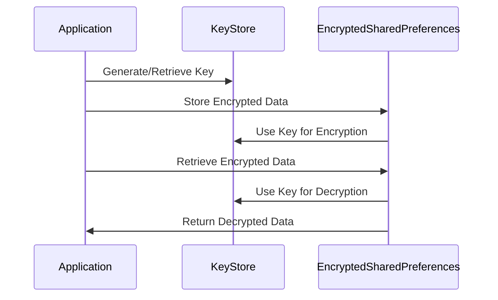

## 15.9 Secure Storage

In today's digital age, safeguarding sensitive data is paramount. As software engineers and architects, understanding how to securely store data in applications is crucial. This section delves into secure storage techniques in Kotlin, focusing on the use of KeyStore and EncryptedSharedPreferences. These tools are essential for protecting sensitive information, such as user credentials and personal data, from unauthorized access.

### Introduction to Secure Storage

Secure storage refers to the practice of storing sensitive data in a manner that prevents unauthorized access. In mobile and web applications, this often involves encrypting data before storage and ensuring that decryption keys are securely managed. Kotlin, with its robust support for Android development, provides several tools and libraries to facilitate secure storage.

#### Why Secure Storage Matters

Data breaches and unauthorized access can lead to significant financial and reputational damage. Secure storage helps mitigate these risks by ensuring that sensitive data is not easily accessible to attackers. By encrypting data and managing keys securely, developers can protect user information and comply with data protection regulations.

### Key Concepts in Secure Storage

Before diving into specific tools, it's important to understand some key concepts related to secure storage:

- **Encryption**: The process of converting data into a format that cannot be easily understood by unauthorized users. It requires a key to decrypt the data back to its original form.
- **Decryption**: The process of converting encrypted data back to its original form using a key.
- **Key Management**: The practice of securely handling encryption keys, including their generation, storage, and distribution.
- **Data Integrity**: Ensuring that data has not been altered or tampered with.

### Using KeyStore for Secure Key Management

The Android KeyStore system allows you to store cryptographic keys in a container, making it more difficult to extract them from the device. Once keys are in the KeyStore, they can be used for cryptographic operations such as encryption and decryption.

#### Setting Up KeyStore

To use the KeyStore, you need to initialize it and generate or retrieve keys. Here's a basic example of how to set up and use the KeyStore in Kotlin:

```kotlin
import android.security.keystore.KeyGenParameterSpec
import android.security.keystore.KeyProperties
import java.security.KeyStore
import javax.crypto.KeyGenerator
import javax.crypto.SecretKey

fun createKey(alias: String) {
    val keyStore = KeyStore.getInstance("AndroidKeyStore")
    keyStore.load(null)

    if (!keyStore.containsAlias(alias)) {
        val keyGenerator = KeyGenerator.getInstance(
            KeyProperties.KEY_ALGORITHM_AES, "AndroidKeyStore"
        )
        val keyGenParameterSpec = KeyGenParameterSpec.Builder(
            alias,
            KeyProperties.PURPOSE_ENCRYPT or KeyProperties.PURPOSE_DECRYPT
        )
            .setBlockModes(KeyProperties.BLOCK_MODE_GCM)
            .setEncryptionPaddings(KeyProperties.ENCRYPTION_PADDING_NONE)
            .build()
        keyGenerator.init(keyGenParameterSpec)
        keyGenerator.generateKey()
    }
}

fun getKey(alias: String): SecretKey? {
    val keyStore = KeyStore.getInstance("AndroidKeyStore")
    keyStore.load(null)
    return keyStore.getKey(alias, null) as? SecretKey
}
```

In this code snippet, we define two functions: `createKey` and `getKey`. `createKey` initializes the KeyStore, checks if a key with the given alias exists, and generates a new key if it doesn't. `getKey` retrieves the key from the KeyStore.

#### KeyStore Operations

Once you have your keys stored securely, you can use them for encryption and decryption. Here's how you can encrypt and decrypt data using a key from the KeyStore:

```kotlin
import javax.crypto.Cipher
import javax.crypto.spec.GCMParameterSpec

fun encryptData(alias: String, data: ByteArray): ByteArray {
    val secretKey = getKey(alias) ?: throw Exception("Key not found")
    val cipher = Cipher.getInstance("AES/GCM/NoPadding")
    cipher.init(Cipher.ENCRYPT_MODE, secretKey)
    val iv = cipher.iv
    val encryptedData = cipher.doFinal(data)
    return iv + encryptedData // Prepend IV for decryption
}

fun decryptData(alias: String, encryptedData: ByteArray): ByteArray {
    val secretKey = getKey(alias) ?: throw Exception("Key not found")
    val cipher = Cipher.getInstance("AES/GCM/NoPadding")
    val iv = encryptedData.sliceArray(0 until 12) // Extract IV
    val data = encryptedData.sliceArray(12 until encryptedData.size)
    val spec = GCMParameterSpec(128, iv)
    cipher.init(Cipher.DECRYPT_MODE, secretKey, spec)
    return cipher.doFinal(data)
}
```

In this example, `encryptData` encrypts the input data using AES/GCM/NoPadding and returns the encrypted data prefixed with the initialization vector (IV). `decryptData` extracts the IV from the encrypted data, initializes the cipher for decryption, and returns the original data.

### Using EncryptedSharedPreferences for Secure Data Storage

EncryptedSharedPreferences is a part of the AndroidX Security library, providing a simple way to store key-value pairs securely. It uses the KeyStore to manage encryption keys, ensuring that data is encrypted at rest.

#### Setting Up EncryptedSharedPreferences

To use EncryptedSharedPreferences, you need to add the AndroidX Security library to your project:

```gradle
dependencies {
    implementation "androidx.security:security-crypto:1.1.0-alpha03"
}
```

Here's how you can set up and use EncryptedSharedPreferences in Kotlin:

```kotlin
import android.content.Context
import androidx.security.crypto.EncryptedSharedPreferences
import androidx.security.crypto.MasterKeys

fun getEncryptedSharedPreferences(context: Context): SharedPreferences {
    val masterKeyAlias = MasterKeys.getOrCreate(MasterKeys.AES256_GCM_SPEC)
    return EncryptedSharedPreferences.create(
        "secure_prefs",
        masterKeyAlias,
        context,
        EncryptedSharedPreferences.PrefKeyEncryptionScheme.AES256_SIV,
        EncryptedSharedPreferences.PrefValueEncryptionScheme.AES256_GCM
    )
}
```

In this code snippet, we create an instance of `EncryptedSharedPreferences` using a master key generated by the `MasterKeys` utility. The preferences are stored in a file named "secure_prefs" and use AES256 encryption schemes for both keys and values.

#### Storing and Retrieving Data

Once you have an instance of `EncryptedSharedPreferences`, you can store and retrieve data just like regular SharedPreferences:

```kotlin
fun storeSecureData(context: Context, key: String, value: String) {
    val sharedPreferences = getEncryptedSharedPreferences(context)
    sharedPreferences.edit().putString(key, value).apply()
}

fun retrieveSecureData(context: Context, key: String): String? {
    val sharedPreferences = getEncryptedSharedPreferences(context)
    return sharedPreferences.getString(key, null)
}
```

In this example, `storeSecureData` saves a key-value pair securely, while `retrieveSecureData` retrieves the value associated with a given key.

### Design Considerations

When implementing secure storage, consider the following:

- **Performance**: Encryption and decryption operations can be computationally intensive. Ensure that your application remains responsive by performing these operations asynchronously if possible.
- **Key Management**: Properly manage encryption keys, especially if you are not using the KeyStore. Avoid hardcoding keys in your source code.
- **Data Integrity**: Use cryptographic hashes or message authentication codes (MACs) to ensure data integrity.
- **User Experience**: Inform users about the security measures in place and provide options for additional security, such as biometric authentication.

### Differences and Similarities

KeyStore and EncryptedSharedPreferences serve different purposes but can be used together for comprehensive security:

- **KeyStore**: Ideal for managing cryptographic keys and performing cryptographic operations. It provides a secure environment for key storage.
- **EncryptedSharedPreferences**: Suitable for securely storing small amounts of data, such as user preferences or tokens. It leverages the KeyStore for key management.

### Try It Yourself

Experiment with the provided code examples by modifying the encryption algorithms or storage methods. For instance, try using different block modes or padding schemes in the KeyStore example. Observe how these changes affect the encryption and decryption processes.

### Visualizing Secure Storage

Below is a diagram illustrating the flow of data encryption and decryption using KeyStore and EncryptedSharedPreferences:



This diagram shows how an application interacts with KeyStore and EncryptedSharedPreferences to securely store and retrieve data.

### References and Links

For further reading on secure storage in Android, consider the following resources:

- [Android Developers: Security with EncryptedSharedPreferences](https://developer.android.com/topic/security/data)
- [Android Developers: KeyStore System](https://developer.android.com/training/articles/keystore)
- [OWASP Mobile Security Testing Guide](https://owasp.org/www-project-mobile-security-testing-guide/)

### Knowledge Check

To reinforce your understanding of secure storage, consider the following questions:

- What are the key differences between KeyStore and EncryptedSharedPreferences?
- How does the KeyStore enhance the security of encryption keys?
- Why is it important to use asynchronous operations for encryption and decryption?

### Embrace the Journey

Remember, mastering secure storage is a continuous journey. As you progress, you'll encounter new challenges and opportunities to enhance your application's security. Keep experimenting, stay curious, and enjoy the journey!

## Quiz Time!



### What is the primary purpose of the Android KeyStore?

- [x] To securely store cryptographic keys
- [ ] To encrypt large files
- [ ] To manage user sessions
- [ ] To store user preferences

> **Explanation:** The Android KeyStore is designed to securely store cryptographic keys, making it difficult to extract them from the device.

### Which encryption scheme is used by EncryptedSharedPreferences for key encryption?

- [ ] AES256_GCM
- [x] AES256_SIV
- [ ] RSA
- [ ] HMAC

> **Explanation:** EncryptedSharedPreferences uses AES256_SIV for key encryption and AES256_GCM for value encryption.

### What is a key consideration when using encryption in mobile applications?

- [x] Performance impact
- [ ] User interface design
- [ ] Network latency
- [ ] Battery usage

> **Explanation:** Encryption and decryption operations can be computationally intensive, so it's important to consider their impact on application performance.

### How does the KeyStore enhance key security?

- [x] By storing keys in a secure container
- [ ] By encrypting keys with a password
- [ ] By using a cloud-based storage solution
- [ ] By generating keys dynamically

> **Explanation:** The KeyStore enhances key security by storing them in a secure container, making it difficult to extract them from the device.

### Which of the following is a benefit of using EncryptedSharedPreferences?

- [x] Simplified secure storage of key-value pairs
- [ ] Improved network performance
- [ ] Enhanced user interface design
- [ ] Reduced battery consumption

> **Explanation:** EncryptedSharedPreferences simplifies the secure storage of key-value pairs by handling encryption and decryption automatically.

### What is the role of the initialization vector (IV) in encryption?

- [x] To ensure unique encryption results
- [ ] To store user credentials
- [ ] To manage key distribution
- [ ] To enhance user experience

> **Explanation:** The initialization vector (IV) ensures that encryption results are unique even when the same data is encrypted multiple times.

### Why is it important to manage encryption keys securely?

- [x] To prevent unauthorized access to encrypted data
- [ ] To improve application performance
- [ ] To enhance user interface design
- [ ] To reduce network latency

> **Explanation:** Managing encryption keys securely is crucial to prevent unauthorized access to encrypted data.

### What is a potential drawback of performing encryption operations synchronously?

- [x] Application responsiveness may be affected
- [ ] Data integrity may be compromised
- [ ] Key security may be reduced
- [ ] User interface design may be impacted

> **Explanation:** Performing encryption operations synchronously can affect application responsiveness, especially if the operations are computationally intensive.

### Which tool is used to generate a master key for EncryptedSharedPreferences?

- [x] MasterKeys
- [ ] KeyGenerator
- [ ] Cipher
- [ ] KeyStore

> **Explanation:** The MasterKeys utility is used to generate a master key for EncryptedSharedPreferences.

### True or False: EncryptedSharedPreferences can be used to store large files securely.

- [ ] True
- [x] False

> **Explanation:** EncryptedSharedPreferences is designed for securely storing small key-value pairs, not large files.


