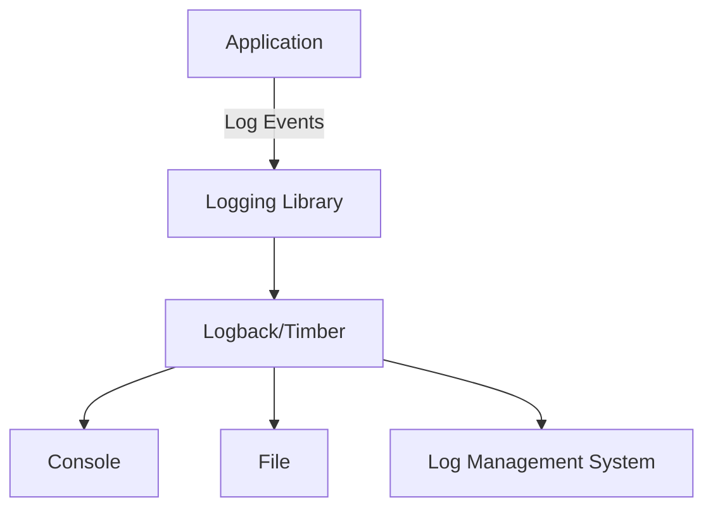

## 16.1 Logging Best Practices

Logging is an essential aspect of software development, providing insights into application behavior, aiding in debugging, and facilitating monitoring and observability. In this section, we will delve into logging best practices specifically tailored for Kotlin applications. We will explore structured logging, utilizing popular libraries like Logback and Timber, and provide practical examples to enhance your logging strategy.

### Introduction to Logging

Logging serves as the eyes and ears of an application, offering a window into its internal workings. It is crucial for:

- **Debugging**: Identifying and resolving issues during development and production.
- **Monitoring**: Keeping track of application performance and health.
- **Auditing**: Maintaining a record of application activities for compliance and security.

### Structured Logging

Structured logging involves recording log entries in a structured format, such as JSON, which allows for easier parsing and analysis. Unlike traditional logging, which outputs plain text, structured logging provides a more organized and machine-readable format.

#### Benefits of Structured Logging

- **Enhanced Searchability**: Structured logs can be easily queried and filtered.
- **Improved Analysis**: Tools can process structured logs for insights and metrics.
- **Consistency**: Ensures uniformity across log entries, aiding in automated processing.

### Logging Libraries in Kotlin

Kotlin, being a JVM language, benefits from the rich ecosystem of Java logging libraries. Two popular choices are Logback and Timber.

#### Logback

Logback is a flexible and powerful logging framework for Java applications. It is the successor to the popular Log4j and offers several advantages:

- **Performance**: Logback is optimized for speed and efficiency.
- **Configuration**: Uses XML or Groovy for configuration, allowing for dynamic changes.
- **Integration**: Seamlessly integrates with SLF4J (Simple Logging Facade for Java).

#### Timber

Timber is a lightweight logging library specifically designed for Android development. It simplifies logging by providing a clean API and automatic tag generation.

### Setting Up Logback in Kotlin

To use Logback in a Kotlin project, you need to include the necessary dependencies and configure it properly.

#### Step 1: Add Dependencies

Add the following dependencies to your `build.gradle.kts` file:

```kotlin
dependencies {
    implementation("ch.qos.logback:logback-classic:1.2.11")
    implementation("org.slf4j:slf4j-api:1.7.32")
}
```

#### Step 2: Configure Logback

Create a `logback.xml` file in the `resources` directory to configure Logback:

```xml
<configuration>
    <appender name="STDOUT" class="ch.qos.logback.core.ConsoleAppender">
        <encoder>
            <pattern>%d{yyyy-MM-dd HH:mm:ss} %-5level %logger{36} - %msg%n</pattern>
        </encoder>
    </appender>

    <root level="debug">
        <appender-ref ref="STDOUT" />
    </root>
</configuration>
```

### Using Logback in Kotlin

With Logback configured, you can start logging in your Kotlin application.

#### Example: Logging with Logback

```kotlin
import org.slf4j.LoggerFactory

fun main() {
    val logger = LoggerFactory.getLogger("MyAppLogger")

    logger.info("Application started")
    logger.debug("Debugging application")
    logger.error("An error occurred")
}
```

### Structured Logging with Logback

To enable structured logging, you can use a JSON encoder in your `logback.xml` configuration.

#### JSON Encoder Configuration

```xml
<configuration>
    <appender name="STDOUT" class="ch.qos.logback.core.ConsoleAppender">
        <encoder class="net.logstash.logback.encoder.LogstashEncoder" />
    </appender>

    <root level="debug">
        <appender-ref ref="STDOUT" />
    </root>
</configuration>
```

This configuration uses the `LogstashEncoder` to output logs in JSON format, making them suitable for ingestion by log management systems like ELK Stack.

### Setting Up Timber in Android

Timber is ideal for Android applications due to its simplicity and efficiency.

#### Step 1: Add Dependencies

Include Timber in your `build.gradle` file:

```kotlin
dependencies {
    implementation("com.jakewharton.timber:timber:5.0.1")
}
```

#### Step 2: Initialize Timber

Initialize Timber in your application's `onCreate` method:

```kotlin
class MyApplication : Application() {
    override fun onCreate() {
        super.onCreate()
        if (BuildConfig.DEBUG) {
            Timber.plant(Timber.DebugTree())
        }
    }
}
```

### Using Timber in Android

Timber simplifies logging with automatic tag generation and a concise API.

#### Example: Logging with Timber

```kotlin
fun logExample() {
    Timber.i("Information log")
    Timber.d("Debug log")
    Timber.e("Error log")
}
```

### Best Practices for Logging

#### 1. Log Levels

Use appropriate log levels to categorize log messages:

- **TRACE**: Fine-grained information for debugging.
- **DEBUG**: General debugging information.
- **INFO**: Informational messages about application progress.
- **WARN**: Potentially harmful situations.
- **ERROR**: Error events that might still allow the application to continue.
- **FATAL**: Severe errors causing premature termination.

#### 2. Avoid Logging Sensitive Information

Ensure that sensitive data, such as passwords and personal information, is not logged. Use masking or redaction techniques if necessary.

#### 3. Use Contextual Information

Include contextual information, such as user IDs or transaction IDs, to make logs more informative and traceable.

#### 4. Log Exceptions Properly

Always log exceptions with stack traces to aid in debugging. Use the logging library's built-in methods to log exceptions.

#### 5. Avoid Excessive Logging

Excessive logging can lead to performance issues and bloated log files. Log only what is necessary and consider using rate limiting.

### Visualizing Logging Architecture

To better understand how logging fits into the overall architecture, let's visualize a typical logging setup in a Kotlin application.



**Diagram Description:** This flowchart illustrates the flow of log events from the application through the logging library (Logback or Timber), and then to various outputs such as the console, files, or a log management system.

### Try It Yourself

Experiment with the following code snippets to enhance your understanding of logging in Kotlin:

1. **Modify Logback Configuration**: Change the log pattern in `logback.xml` to include thread names.
2. **Implement Custom Timber Tree**: Create a custom Timber tree that logs to a file.
3. **Structured Logging with Additional Fields**: Add custom fields to your JSON logs using Logback.

### References and Further Reading

- [Logback Documentation](https://logback.qos.ch/documentation.html)
- [Timber GitHub Repository](https://github.com/JakeWharton/timber)
- [SLF4J Documentation](http://www.slf4j.org/manual.html)

### Knowledge Check

- What are the benefits of structured logging?
- How do you configure Logback to output JSON logs?
- Why is it important to avoid logging sensitive information?

### Embrace the Journey

Remember, logging is not just about capturing errors but understanding your application's behavior. As you implement these best practices, you'll gain deeper insights and improve your application's reliability and performance. Keep experimenting, stay curious, and enjoy the journey!

## Quiz Time!



### What is structured logging?

- [x] Logging in a structured format like JSON for easy parsing and analysis.
- [ ] Logging with plain text messages.
- [ ] Logging only error messages.
- [ ] Logging with random formats.

> **Explanation:** Structured logging involves recording log entries in a structured format, such as JSON, which allows for easier parsing and analysis.

### Which library is specifically designed for Android logging?

- [ ] Logback
- [x] Timber
- [ ] SLF4J
- [ ] Log4j

> **Explanation:** Timber is a lightweight logging library specifically designed for Android development.

### What is the purpose of using different log levels?

- [x] To categorize log messages based on severity and importance.
- [ ] To make logs more colorful.
- [ ] To increase log file size.
- [ ] To confuse developers.

> **Explanation:** Log levels help categorize log messages based on their severity and importance, aiding in filtering and analysis.

### How can you prevent logging sensitive information?

- [x] By using masking or redaction techniques.
- [ ] By logging everything.
- [ ] By using plain text logs.
- [ ] By ignoring security concerns.

> **Explanation:** Masking or redaction techniques ensure that sensitive data, such as passwords, is not logged.

### What should you include in logs to make them more informative?

- [x] Contextual information like user IDs or transaction IDs.
- [ ] Only error messages.
- [ ] Random numbers.
- [ ] Unrelated data.

> **Explanation:** Including contextual information, such as user IDs or transaction IDs, makes logs more informative and traceable.

### What is the main advantage of using JSON for logs?

- [x] Easy parsing and analysis.
- [ ] It looks better.
- [ ] It uses less space.
- [ ] It is faster to write.

> **Explanation:** JSON format allows for easy parsing and analysis by log management systems.

### What is the role of Logback in logging?

- [x] It is a logging framework for Java applications, providing configuration and output options.
- [ ] It is a database management system.
- [ ] It is a network protocol.
- [ ] It is a web server.

> **Explanation:** Logback is a flexible and powerful logging framework for Java applications.

### Why should you avoid excessive logging?

- [x] It can lead to performance issues and bloated log files.
- [ ] It makes logs more interesting.
- [ ] It helps in debugging faster.
- [ ] It is a good practice.

> **Explanation:** Excessive logging can lead to performance issues and bloated log files, making it harder to find relevant information.

### What is the benefit of using Logback's `LogstashEncoder`?

- [x] It outputs logs in JSON format suitable for log management systems.
- [ ] It makes logs colorful.
- [ ] It encrypts logs.
- [ ] It compresses logs.

> **Explanation:** `LogstashEncoder` outputs logs in JSON format, making them suitable for ingestion by log management systems like ELK Stack.

### True or False: Timber automatically generates tags for logs.

- [x] True
- [ ] False

> **Explanation:** Timber simplifies logging by providing automatic tag generation, making it easier to identify log sources.


