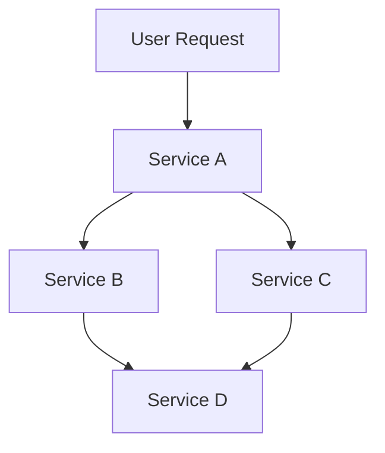

## 16.3 Tracing and Diagnostics

In the realm of modern software development, especially when dealing with distributed systems and microservices, tracing and diagnostics play a pivotal role in ensuring system reliability and performance. This section delves into the concepts of tracing and diagnostics, focusing on implementing OpenTracing and OpenTelemetry in Kotlin applications. We will explore how these tools can be leveraged to gain insights into the behavior of distributed systems, diagnose issues, and optimize performance.

### Understanding Tracing and Diagnostics

Tracing and diagnostics are essential for monitoring and understanding the flow of requests through a distributed system. They help in identifying bottlenecks, understanding dependencies, and ensuring that services communicate effectively.

#### Key Concepts

- **Tracing**: The process of recording the execution path of a request as it traverses through various services in a distributed system. Tracing provides visibility into the system's behavior, helping to pinpoint where delays or errors occur.

- **Diagnostics**: The practice of collecting, analyzing, and interpreting data to understand the health and performance of a system. Diagnostics often involve logging, monitoring, and tracing to provide a comprehensive view of system operations.

### The Role of OpenTracing and OpenTelemetry

OpenTracing and OpenTelemetry are two prominent frameworks that facilitate tracing and diagnostics in distributed systems.

- **OpenTracing**: A vendor-neutral API for distributed tracing. It provides a standard way to instrument applications for tracing, allowing developers to switch between tracing implementations without changing application code.

- **OpenTelemetry**: A more comprehensive framework that combines tracing, metrics, and logging. It aims to provide a unified standard for observability, making it easier to collect and analyze telemetry data.

### Implementing OpenTracing in Kotlin

OpenTracing provides a set of APIs that can be used to instrument applications for tracing. Let's explore how to implement OpenTracing in a Kotlin application.

#### Setting Up OpenTracing

To get started with OpenTracing in Kotlin, you need to include the necessary dependencies in your project. For example, if you're using Jaeger as your tracing backend, you can add the following dependencies to your `build.gradle.kts` file:

```kotlin
dependencies {
    implementation("io.opentracing:opentracing-api:0.33.0")
    implementation("io.opentracing:opentracing-util:0.33.0")
    implementation("io.jaegertracing:jaeger-client:1.6.0")
}
```

#### Instrumenting Your Application

Once the dependencies are set up, you can start instrumenting your application. The first step is to create a tracer instance, which will be used to create and manage spans.

```kotlin
import io.jaegertracing.Configuration
import io.opentracing.Tracer

fun initTracer(serviceName: String): Tracer {
    return Configuration(serviceName)
        .withSampler(Configuration.SamplerConfiguration.fromEnv().withType("const").withParam(1))
        .withReporter(Configuration.ReporterConfiguration.fromEnv().withLogSpans(true))
        .tracer
}
```

With the tracer initialized, you can start a new span to trace a specific operation.

```kotlin
val tracer = initTracer("my-kotlin-service")

fun performOperation() {
    val span = tracer.buildSpan("performOperation").start()
    try {
        // Your operation logic here
    } finally {
        span.finish()
    }
}
```

#### Propagating Context

In a distributed system, it's crucial to propagate the tracing context across service boundaries. This ensures that traces can be correlated across different services.

```kotlin
import io.opentracing.propagation.Format
import io.opentracing.propagation.TextMapAdapter

fun injectContext(span: Span, headers: MutableMap<String, String>) {
    tracer.inject(span.context(), Format.Builtin.HTTP_HEADERS, TextMapAdapter(headers))
}

fun extractContext(headers: Map<String, String>): SpanContext? {
    return tracer.extract(Format.Builtin.HTTP_HEADERS, TextMapAdapter(headers))
}
```

### Implementing OpenTelemetry in Kotlin

OpenTelemetry provides a more comprehensive approach to observability, combining tracing, metrics, and logging. Let's explore how to implement OpenTelemetry in a Kotlin application.

#### Setting Up OpenTelemetry

To use OpenTelemetry in your Kotlin project, you need to include the necessary dependencies. For example, to use the OpenTelemetry SDK and an exporter like Jaeger, add the following to your `build.gradle.kts` file:

```kotlin
dependencies {
    implementation("io.opentelemetry:opentelemetry-api:1.9.0")
    implementation("io.opentelemetry:opentelemetry-sdk:1.9.0")
    implementation("io.opentelemetry:opentelemetry-exporter-jaeger:1.9.0")
}
```

#### Configuring OpenTelemetry

Initialize the OpenTelemetry SDK and configure the exporter.

```kotlin
import io.opentelemetry.api.GlobalOpenTelemetry
import io.opentelemetry.sdk.OpenTelemetrySdk
import io.opentelemetry.sdk.trace.SdkTracerProvider
import io.opentelemetry.sdk.trace.export.BatchSpanProcessor
import io.opentelemetry.exporter.jaeger.JaegerGrpcSpanExporter

fun setupOpenTelemetry() {
    val jaegerExporter = JaegerGrpcSpanExporter.builder()
        .setEndpoint("http://localhost:14250")
        .build()

    val tracerProvider = SdkTracerProvider.builder()
        .addSpanProcessor(BatchSpanProcessor.builder(jaegerExporter).build())
        .build()

    OpenTelemetrySdk.builder()
        .setTracerProvider(tracerProvider)
        .buildAndRegisterGlobal()
}
```

#### Creating Spans

With OpenTelemetry configured, you can create spans to trace operations.

```kotlin
import io.opentelemetry.api.trace.Span
import io.opentelemetry.api.trace.Tracer

val tracer: Tracer = GlobalOpenTelemetry.getTracer("my-kotlin-service")

fun performOperation() {
    val span = tracer.spanBuilder("performOperation").startSpan()
    try {
        // Your operation logic here
    } finally {
        span.end()
    }
}
```

#### Context Propagation

OpenTelemetry also supports context propagation, allowing you to correlate traces across services.

```kotlin
import io.opentelemetry.context.propagation.TextMapGetter
import io.opentelemetry.context.propagation.TextMapSetter
import io.opentelemetry.context.Context

fun injectContext(span: Span, headers: MutableMap<String, String>) {
    val setter = TextMapSetter<MutableMap<String, String>> { carrier, key, value ->
        carrier[key] = value
    }
    val context = Context.current().with(span)
    GlobalOpenTelemetry.getPropagators().textMapPropagator.inject(context, headers, setter)
}

fun extractContext(headers: Map<String, String>): Context {
    val getter = TextMapGetter<Map<String, String>> { carrier, key ->
        carrier[key]
    }
    return GlobalOpenTelemetry.getPropagators().textMapPropagator.extract(Context.current(), headers, getter)
}
```

### Distributed Tracing in Microservices

In a microservices architecture, distributed tracing is crucial for understanding the flow of requests across services. It helps in identifying performance bottlenecks, detecting failures, and optimizing service interactions.

#### Visualizing Traces

A key benefit of distributed tracing is the ability to visualize traces. Tools like Jaeger and Zipkin provide dashboards to view traces, analyze latencies, and understand service dependencies.



*Diagram: Visualizing the flow of a user request through multiple services in a microservices architecture.*

#### Analyzing Latency

Distributed tracing allows you to analyze the latency of requests at each service hop. This helps in identifying slow services and optimizing them for better performance.

#### Error Detection

Tracing can also help in detecting errors and failures in the system. By analyzing traces, you can identify where errors occur and take corrective actions.

### Best Practices for Tracing and Diagnostics

- **Instrument Early**: Start instrumenting your application for tracing early in the development process. This helps in identifying issues before they become critical.

- **Use Standard Tags**: Use standard tags and annotations to provide context to your traces. This makes it easier to analyze and understand traces.

- **Correlate Logs and Traces**: Correlate logs with traces to get a comprehensive view of system behavior. This helps in diagnosing issues more effectively.

- **Monitor Performance**: Use tracing data to monitor the performance of your services. Identify bottlenecks and optimize them for better performance.

- **Ensure Security**: Be mindful of sensitive information when instrumenting applications. Ensure that traces do not expose sensitive data.

### Challenges and Considerations

- **Overhead**: Tracing can introduce overhead to your application. It's important to balance the level of tracing with performance considerations.

- **Data Volume**: Tracing generates a large volume of data. Ensure that your storage and analysis tools can handle the data effectively.

- **Complexity**: Implementing tracing in a distributed system can be complex. It's important to have a clear understanding of your architecture and dependencies.

### Conclusion

Tracing and diagnostics are essential components of modern software development, especially in distributed systems and microservices. By implementing OpenTracing and OpenTelemetry in your Kotlin applications, you can gain valuable insights into system behavior, diagnose issues, and optimize performance. Remember, this is just the beginning. As you progress, you'll build more complex and interactive systems. Keep experimenting, stay curious, and enjoy the journey!

## Quiz Time!



### What is the primary purpose of tracing in distributed systems?

- [x] To record the execution path of a request
- [ ] To log all system events
- [ ] To monitor CPU usage
- [ ] To store user data

> **Explanation:** Tracing is used to record the execution path of a request as it traverses through various services in a distributed system.

### Which framework provides a vendor-neutral API for distributed tracing?

- [x] OpenTracing
- [ ] OpenTelemetry
- [ ] Prometheus
- [ ] Grafana

> **Explanation:** OpenTracing provides a vendor-neutral API for distributed tracing, allowing developers to switch between tracing implementations without changing application code.

### What is the main advantage of using OpenTelemetry over OpenTracing?

- [x] It combines tracing, metrics, and logging
- [ ] It is easier to implement
- [ ] It is faster
- [ ] It requires less configuration

> **Explanation:** OpenTelemetry provides a more comprehensive approach to observability by combining tracing, metrics, and logging.

### How can you propagate tracing context across service boundaries in OpenTracing?

- [x] By using inject and extract methods
- [ ] By logging the context
- [ ] By storing the context in a database
- [ ] By sending the context in a separate request

> **Explanation:** In OpenTracing, you can propagate tracing context across service boundaries using the inject and extract methods.

### What is a common tool used for visualizing traces in distributed systems?

- [x] Jaeger
- [ ] Jenkins
- [ ] Docker
- [ ] Kubernetes

> **Explanation:** Jaeger is a common tool used for visualizing traces, analyzing latencies, and understanding service dependencies in distributed systems.

### Which of the following is a best practice for tracing and diagnostics?

- [x] Instrument early in the development process
- [ ] Avoid using standard tags
- [ ] Only trace critical services
- [ ] Store traces indefinitely

> **Explanation:** Instrumenting early in the development process helps in identifying issues before they become critical.

### What is a potential challenge when implementing tracing in a distributed system?

- [x] Overhead
- [ ] Increased security
- [ ] Reduced complexity
- [ ] Decreased data volume

> **Explanation:** Tracing can introduce overhead to your application, and it's important to balance the level of tracing with performance considerations.

### How can tracing help in error detection?

- [x] By analyzing traces to identify where errors occur
- [ ] By logging all errors
- [ ] By monitoring CPU usage
- [ ] By storing error data in a database

> **Explanation:** Tracing can help in detecting errors by analyzing traces to identify where errors occur and taking corrective actions.

### What should you be mindful of when instrumenting applications for tracing?

- [x] Sensitive information
- [ ] CPU usage
- [ ] Memory allocation
- [ ] Network bandwidth

> **Explanation:** Be mindful of sensitive information when instrumenting applications to ensure that traces do not expose sensitive data.

### True or False: OpenTelemetry is only used for tracing.

- [ ] True
- [x] False

> **Explanation:** OpenTelemetry is not only used for tracing; it also combines metrics and logging for a comprehensive approach to observability.


