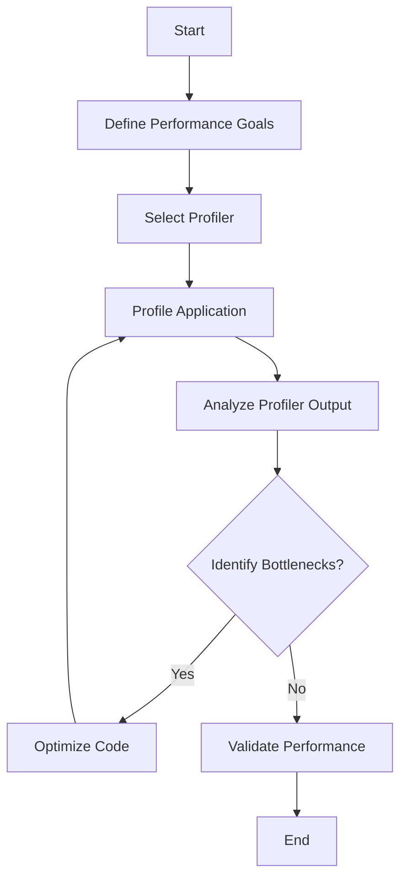

## 16.4 Analyzing Performance

In the world of software engineering, performance analysis is a critical aspect of ensuring that applications run efficiently and effectively. This section delves into the intricacies of analyzing performance in Kotlin applications, focusing on using profilers and analyzers to identify and resolve bottlenecks. By the end of this guide, you'll have a comprehensive understanding of how to optimize your Kotlin code for maximum efficiency.

### Introduction to Performance Analysis

Performance analysis involves examining various aspects of an application to ensure it operates within acceptable parameters. This process is crucial for identifying inefficiencies, optimizing resource usage, and enhancing the overall user experience. In Kotlin, performance analysis can be particularly nuanced due to its interoperability with Java and its unique language features.

#### Key Concepts in Performance Analysis

- **Profiling**: The process of measuring the space (memory) and time complexity of a program. Profilers help identify which parts of the code consume the most resources.
- **Bottlenecks**: Sections of code that significantly slow down the application. Identifying and optimizing these areas can lead to substantial performance gains.
- **Analyzers**: Tools that provide insights into code performance, often by examining execution paths and resource usage.

### Profiling Tools for Kotlin

Profiling is an essential step in performance analysis. Various tools are available for Kotlin developers, each with its strengths and weaknesses. Let's explore some of the most popular profiling tools:

#### 1. Android Profiler

For Android applications, the Android Profiler is an invaluable tool. It provides real-time data on CPU, memory, network, and energy usage.

- **CPU Profiler**: Helps identify methods that consume excessive CPU time.
- **Memory Profiler**: Tracks memory allocation and identifies leaks.
- **Network Profiler**: Monitors network requests and data transfer.
- **Energy Profiler**: Analyzes battery consumption.

#### 2. VisualVM

VisualVM is a versatile tool for profiling Java applications, and by extension, Kotlin applications. It offers features such as:

- **Heap Dump Analysis**: Examine memory usage and identify leaks.
- **Thread Analysis**: Monitor thread activity and identify deadlocks.
- **CPU Profiling**: Analyze method execution times.

#### 3. YourKit

YourKit is a commercial profiler that provides in-depth analysis for Java and Kotlin applications. It offers:

- **Memory Profiling**: Detailed insights into memory allocation and garbage collection.
- **CPU Profiling**: Identify slow methods and optimize execution paths.
- **Thread Profiling**: Analyze thread states and synchronization issues.

#### 4. IntelliJ IDEA Profiler

IntelliJ IDEA, the IDE of choice for many Kotlin developers, includes a built-in profiler that integrates seamlessly with your development workflow. It provides:

- **Real-time Profiling**: Monitor CPU and memory usage during development.
- **Snapshot Analysis**: Capture and analyze performance snapshots.

### Analyzing Performance with Profilers

Using profilers effectively requires a systematic approach. Here’s a step-by-step guide to analyzing performance with profilers:

#### Step 1: Define Performance Goals

Before you begin profiling, define what performance means for your application. Is it faster load times, reduced memory usage, or improved responsiveness? Clear goals will guide your analysis.

#### Step 2: Select the Right Profiler

Choose a profiler that best suits your application's platform and performance goals. For Android apps, the Android Profiler is ideal, while VisualVM or YourKit may be better for server-side applications.

#### Step 3: Profile Under Realistic Conditions

Run your application under conditions that mimic real-world usage. This approach ensures that the profiling data is relevant and actionable.

#### Step 4: Identify Bottlenecks

Analyze the profiler's output to identify bottlenecks. Look for methods with high CPU usage, excessive memory allocation, or frequent garbage collection.

#### Step 5: Optimize and Validate

Once bottlenecks are identified, refactor the code to address these issues. After optimization, re-profile the application to ensure that performance has improved.

### Identifying Bottlenecks

Identifying bottlenecks is a critical aspect of performance analysis. Bottlenecks can occur in various forms, including CPU, memory, and I/O bottlenecks.

#### CPU Bottlenecks

CPU bottlenecks occur when a particular method or operation consumes excessive CPU time, slowing down the entire application.

**Example:**

```kotlin
fun computeIntensiveTask() {
    for (i in 1..1000000) {
        // Simulate a compute-intensive task
        Math.sqrt(i.toDouble())
    }
}
```

**Optimization Tips:**

- **Algorithm Optimization**: Use more efficient algorithms or data structures.
- **Parallel Processing**: Utilize Kotlin coroutines or Java's `ForkJoinPool` for parallel processing.

#### Memory Bottlenecks

Memory bottlenecks occur when an application consumes more memory than necessary, leading to frequent garbage collection and potential out-of-memory errors.

**Example:**

```kotlin
fun createLargeList(): List<Int> {
    return List(1000000) { it }
}
```

**Optimization Tips:**

- **Use Lazy Collections**: Utilize Kotlin's `Sequence` for lazy evaluation.
- **Avoid Unnecessary Object Creation**: Reuse objects where possible.

#### I/O Bottlenecks

I/O bottlenecks occur when reading from or writing to disk or network is slower than expected.

**Example:**

```kotlin
fun readLargeFile(filePath: String) {
    File(filePath).forEachLine { line ->
        // Process each line
    }
}
```

**Optimization Tips:**

- **Buffered I/O**: Use buffered streams to reduce the number of I/O operations.
- **Asynchronous I/O**: Use Kotlin coroutines for non-blocking I/O operations.

### Code Examples and Optimization Techniques

Let's explore some code examples and optimization techniques for common bottlenecks.

#### Example 1: Optimizing CPU-Intensive Tasks

**Original Code:**

```kotlin
fun calculatePrimes(limit: Int): List<Int> {
    val primes = mutableListOf<Int>()
    for (i in 2..limit) {
        if ((2 until i).none { i % it == 0 }) {
            primes.add(i)
        }
    }
    return primes
}
```

**Optimized Code:**

```kotlin
fun calculatePrimes(limit: Int): List<Int> {
    val primes = mutableListOf<Int>()
    for (i in 2..limit) {
        if (primes.none { i % it == 0 }) {
            primes.add(i)
        }
    }
    return primes
}
```

**Explanation:**

- The optimized code uses previously found primes to check divisibility, reducing the number of iterations and improving performance.

#### Example 2: Reducing Memory Usage

**Original Code:**

```kotlin
fun generateSequence(): List<Int> {
    return List(1000000) { it }
}
```

**Optimized Code:**

```kotlin
fun generateSequence(): Sequence<Int> {
    return generateSequence(0) { it + 1 }.take(1000000)
}
```

**Explanation:**

- The optimized code uses a `Sequence` for lazy evaluation, reducing memory usage by generating elements on demand.

### Visualizing Performance Bottlenecks

Visualizing performance bottlenecks can help you understand the flow of your application and identify areas for improvement. Let's use Mermaid.js to create a flowchart of a typical performance analysis process.



**Diagram Description:**

- This flowchart illustrates the performance analysis process, starting from defining goals to validating performance improvements.

### References and Further Reading

For more information on performance analysis and optimization, consider exploring the following resources:

- [Android Developers: Profiling Tools](https://developer.android.com/studio/profile)
- [VisualVM Documentation](https://visualvm.github.io/)
- [YourKit Java Profiler](https://www.yourkit.com/java/profiler/)
- [Kotlin Coroutines Guide](https://kotlinlang.org/docs/coroutines-guide.html)

### Knowledge Check

Before we conclude, let's reinforce what we've learned with a few questions:

- What is the primary purpose of a profiler?
- How can you identify CPU bottlenecks in your application?
- What are some common optimization techniques for memory bottlenecks?

### Embrace the Journey

Remember, performance analysis is an ongoing process. As you continue to develop and optimize your Kotlin applications, keep experimenting with different tools and techniques. Stay curious, and enjoy the journey of making your applications faster and more efficient!

## Quiz Time!



### What is the primary purpose of a profiler?

- [x] To measure the space and time complexity of a program
- [ ] To compile the code
- [ ] To debug the code
- [ ] To refactor the code

> **Explanation:** A profiler is used to measure the space (memory) and time complexity of a program, helping identify resource-intensive areas.

### Which tool is best suited for profiling Android applications?

- [x] Android Profiler
- [ ] VisualVM
- [ ] YourKit
- [ ] IntelliJ IDEA Profiler

> **Explanation:** The Android Profiler is specifically designed for profiling Android applications, providing insights into CPU, memory, network, and energy usage.

### How can you identify CPU bottlenecks in your application?

- [x] By analyzing methods with high CPU usage
- [ ] By checking network requests
- [ ] By monitoring memory allocation
- [ ] By examining thread states

> **Explanation:** CPU bottlenecks are identified by analyzing methods that consume excessive CPU time.

### What is a common optimization technique for memory bottlenecks?

- [x] Use lazy collections
- [ ] Increase CPU usage
- [ ] Use more threads
- [ ] Optimize network requests

> **Explanation:** Using lazy collections, such as Kotlin's `Sequence`, can reduce memory usage by generating elements on demand.

### Which of the following is NOT a feature of VisualVM?

- [ ] Heap Dump Analysis
- [ ] Thread Analysis
- [ ] CPU Profiling
- [x] Energy Profiler

> **Explanation:** VisualVM does not include an energy profiler; it focuses on heap dump analysis, thread analysis, and CPU profiling.

### What is the benefit of using buffered I/O?

- [x] Reduces the number of I/O operations
- [ ] Increases memory usage
- [ ] Slows down file reading
- [ ] Decreases CPU usage

> **Explanation:** Buffered I/O reduces the number of I/O operations, improving performance by minimizing disk access.

### What is the purpose of the `Sequence` class in Kotlin?

- [x] To provide lazy evaluation of collections
- [ ] To increase memory usage
- [ ] To perform network operations
- [ ] To manage threads

> **Explanation:** The `Sequence` class in Kotlin provides lazy evaluation, generating elements on demand and reducing memory usage.

### What is the first step in performance analysis?

- [x] Define performance goals
- [ ] Profile the application
- [ ] Optimize the code
- [ ] Validate performance

> **Explanation:** The first step in performance analysis is to define performance goals, guiding the analysis process.

### What is a bottleneck?

- [x] A section of code that significantly slows down the application
- [ ] A tool for measuring performance
- [ ] A method for optimizing code
- [ ] A type of memory leak

> **Explanation:** A bottleneck is a section of code that significantly slows down the application, requiring optimization.

### True or False: Profiling should be done under unrealistic conditions to get the best results.

- [ ] True
- [x] False

> **Explanation:** Profiling should be done under realistic conditions to ensure that the data is relevant and actionable.


