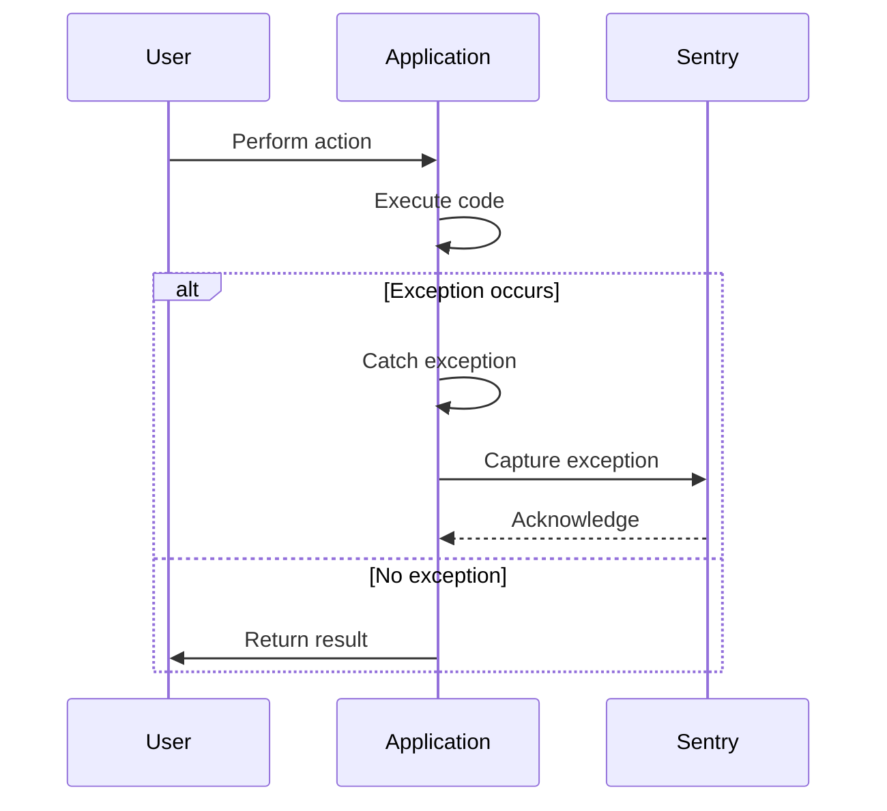

## 16.6 Exception and Crash Handling

In the world of software development, handling exceptions and crashes effectively is crucial for creating robust and resilient applications. This section delves into the intricacies of exception and crash handling in Kotlin, providing expert insights and practical guidance for software engineers and architects. We will explore various strategies, best practices, and tools like Sentry to ensure your Kotlin applications can gracefully handle unexpected situations and provide meaningful feedback to developers.

### Understanding Exceptions and Crashes

Before diving into handling strategies, let's clarify what exceptions and crashes are:

- **Exception**: An exception is an event that disrupts the normal flow of a program. It is typically caused by errors in the code, such as attempting to divide by zero or accessing a null reference.
- **Crash**: A crash occurs when an application terminates unexpectedly due to unhandled exceptions or severe errors. Crashes can lead to data loss and a poor user experience.

### The Importance of Exception and Crash Handling

Effective exception and crash handling are vital for several reasons:

- **User Experience**: Proper handling prevents abrupt application terminations, enhancing the user experience.
- **Debugging**: Detailed error reports help developers identify and fix issues quickly.
- **Stability**: Handling exceptions gracefully ensures that applications continue to run smoothly, even when unexpected situations arise.

### Exception Handling in Kotlin

Kotlin provides a robust mechanism for handling exceptions, leveraging its expressive syntax and language features. Let's explore the key concepts and techniques for exception handling in Kotlin.

#### Try-Catch Blocks

The primary mechanism for handling exceptions in Kotlin is the `try-catch` block. Here's a basic example:

```kotlin
fun divide(a: Int, b: Int): Int {
    return try {
        a / b
    } catch (e: ArithmeticException) {
        println("Division by zero is not allowed.")
        0
    }
}
```

In this example, we attempt to divide two integers. If a division by zero occurs, the `catch` block handles the `ArithmeticException`, preventing a crash and providing a default value.

#### Finally Block

The `finally` block is used to execute code regardless of whether an exception is thrown. It's typically used for resource cleanup:

```kotlin
fun readFile(filePath: String): String {
    val file = File(filePath)
    return try {
        file.readText()
    } catch (e: IOException) {
        println("Error reading file: ${e.message}")
        ""
    } finally {
        println("Closing file resources.")
    }
}
```

In this example, the `finally` block ensures that resources are closed, even if an exception occurs during file reading.

#### Custom Exceptions

Kotlin allows you to define custom exceptions by extending the `Exception` class. This is useful for creating domain-specific error types:

```kotlin
class InvalidInputException(message: String) : Exception(message)

fun processInput(input: String) {
    if (input.isBlank()) {
        throw InvalidInputException("Input cannot be blank.")
    }
    // Process input
}
```

By defining custom exceptions, you can provide more meaningful error messages and handle specific error scenarios.

### Best Practices for Exception Handling

To effectively manage exceptions in Kotlin, consider the following best practices:

1. **Catch Specific Exceptions**: Catch specific exceptions rather than using a generic `Exception` catch block. This ensures that you handle only the errors you expect and understand.

2. **Avoid Silent Failures**: Avoid catching exceptions without taking any action. Always log or handle the error appropriately to aid debugging.

3. **Use Custom Exceptions**: Define custom exceptions for domain-specific errors to provide more context and clarity.

4. **Leverage Kotlin's Null Safety**: Utilize Kotlin's null safety features to prevent `NullPointerException` and reduce the need for exception handling.

5. **Document Error Handling**: Clearly document your error handling strategy and the exceptions your functions may throw.

### Crash Reporting and Analysis

While exception handling can prevent many crashes, it's essential to have a robust crash reporting and analysis system in place to capture and analyze unhandled exceptions. Tools like Sentry provide powerful capabilities for monitoring and diagnosing crashes in Kotlin applications.

#### Integrating Sentry for Crash Reporting

Sentry is a popular error tracking tool that helps developers monitor and fix crashes in real-time. Let's explore how to integrate Sentry into a Kotlin application.

##### Step 1: Add Sentry Dependency

First, add the Sentry dependency to your `build.gradle.kts` file:

```kotlin
dependencies {
    implementation("io.sentry:sentry-android:5.0.0")
}
```

##### Step 2: Initialize Sentry

Initialize Sentry in your application's `onCreate` method:

```kotlin
import io.sentry.Sentry

class MyApplication : Application() {
    override fun onCreate() {
        super.onCreate()
        Sentry.init { options ->
            options.dsn = "YOUR_SENTRY_DSN"
            options.debug = true // Enable debug mode for development
        }
    }
}
```

Replace `"YOUR_SENTRY_DSN"` with your actual Sentry DSN (Data Source Name).

##### Step 3: Capture Exceptions

Sentry automatically captures unhandled exceptions, but you can also manually capture exceptions:

```kotlin
try {
    // Code that may throw an exception
} catch (e: Exception) {
    Sentry.captureException(e)
}
```

##### Step 4: Analyze Crash Reports

Once integrated, Sentry provides a dashboard to view and analyze crash reports. You can track error frequency, affected users, and stack traces to identify and resolve issues quickly.

### Visualizing Exception Handling Flow

To better understand the flow of exception handling and crash reporting, let's visualize the process using a sequence diagram.



This diagram illustrates how an exception is caught and reported to Sentry, allowing developers to analyze and address the issue.

### Advanced Exception Handling Techniques

For expert developers, advanced techniques can further enhance exception handling in Kotlin applications.

#### Coroutines and Exception Handling

Kotlin coroutines offer a powerful way to handle asynchronous operations. However, they introduce new challenges for exception handling. Let's explore how to manage exceptions in coroutines.

##### Structured Concurrency

Structured concurrency ensures that exceptions in coroutines are propagated correctly. Use `supervisorScope` to handle exceptions without canceling sibling coroutines:

```kotlin
import kotlinx.coroutines.*

fun main() = runBlocking {
    supervisorScope {
        launch {
            try {
                // Code that may throw an exception
            } catch (e: Exception) {
                println("Handled exception: ${e.message}")
            }
        }
        launch {
            // Another coroutine
        }
    }
}
```

In this example, exceptions in one coroutine do not affect other coroutines within the same `supervisorScope`.

##### Exception Handling in Flows

Kotlin Flows provide a reactive programming model for handling data streams. Use operators like `catch` to handle exceptions in flows:

```kotlin
import kotlinx.coroutines.flow.*

fun main() = runBlocking {
    flowOf(1, 2, 3)
        .map { value ->
            if (value == 2) throw IllegalArgumentException("Invalid value")
            value
        }
        .catch { e -> println("Caught exception: ${e.message}") }
        .collect { println(it) }
}
```

The `catch` operator intercepts exceptions and allows you to handle them gracefully.

### Tools and Libraries for Exception Handling

In addition to Sentry, several tools and libraries can aid in exception handling and crash reporting for Kotlin applications.

#### Firebase Crashlytics

Firebase Crashlytics is another popular tool for crash reporting. It provides real-time crash reports and insights into app stability. To integrate Crashlytics, follow these steps:

1. **Add Firebase SDK**: Add the Firebase Crashlytics SDK to your project.
2. **Initialize Crashlytics**: Initialize Crashlytics in your application's `onCreate` method.
3. **Capture Exceptions**: Use Crashlytics to log exceptions and custom events.

#### Timber

Timber is a logging library that simplifies logging in Android applications. It provides a flexible API for logging exceptions and other messages:

```kotlin
import timber.log.Timber

fun logException(e: Exception) {
    Timber.e(e, "An error occurred")
}
```

Timber can be integrated with crash reporting tools to enhance log visibility.

### Knowledge Check

Let's reinforce your understanding with a few questions:

1. **What is the primary purpose of exception handling in Kotlin?**
   - To prevent crashes and provide meaningful feedback to developers.

2. **How does the `finally` block differ from `catch` in Kotlin?**
   - The `finally` block executes regardless of whether an exception is thrown, typically for resource cleanup.

3. **What is the benefit of using custom exceptions in Kotlin?**
   - Custom exceptions provide more context and clarity for domain-specific errors.

4. **How can Sentry be used in a Kotlin application?**
   - By integrating Sentry, developers can capture and analyze unhandled exceptions in real-time.

5. **What is structured concurrency in Kotlin coroutines?**
   - Structured concurrency ensures that exceptions in coroutines are propagated correctly, preventing sibling coroutine cancellation.

### Conclusion

Exception and crash handling are critical components of robust software development. By leveraging Kotlin's language features, best practices, and tools like Sentry, developers can create resilient applications that gracefully handle unexpected situations. Remember, effective exception handling not only improves user experience but also aids in debugging and maintaining application stability. Keep experimenting, stay curious, and enjoy the journey of mastering exception handling in Kotlin!

## Quiz Time!



### What is the primary purpose of exception handling in Kotlin?

- [x] To prevent crashes and provide meaningful feedback to developers.
- [ ] To increase application performance.
- [ ] To enhance user interface design.
- [ ] To manage memory usage.

> **Explanation:** Exception handling is primarily used to prevent application crashes and provide developers with meaningful feedback to diagnose and fix issues.

### How does the `finally` block differ from `catch` in Kotlin?

- [x] The `finally` block executes regardless of whether an exception is thrown.
- [ ] The `finally` block only executes if an exception is thrown.
- [ ] The `finally` block is used to catch specific exceptions.
- [ ] The `finally` block is used to define custom exceptions.

> **Explanation:** The `finally` block is used for code that must execute regardless of whether an exception occurs, such as resource cleanup.

### What is the benefit of using custom exceptions in Kotlin?

- [x] Custom exceptions provide more context and clarity for domain-specific errors.
- [ ] Custom exceptions increase application speed.
- [ ] Custom exceptions reduce code complexity.
- [ ] Custom exceptions enhance user interface design.

> **Explanation:** Custom exceptions allow developers to define error types specific to their application's domain, providing more meaningful error messages.

### How can Sentry be used in a Kotlin application?

- [x] By integrating Sentry, developers can capture and analyze unhandled exceptions in real-time.
- [ ] By integrating Sentry, developers can improve application performance.
- [ ] By integrating Sentry, developers can enhance user interface design.
- [ ] By integrating Sentry, developers can manage memory usage.

> **Explanation:** Sentry is a tool for capturing and analyzing unhandled exceptions, providing real-time insights into application errors.

### What is structured concurrency in Kotlin coroutines?

- [x] Structured concurrency ensures that exceptions in coroutines are propagated correctly.
- [ ] Structured concurrency increases coroutine execution speed.
- [ ] Structured concurrency enhances user interface design.
- [ ] Structured concurrency manages memory usage.

> **Explanation:** Structured concurrency in Kotlin coroutines ensures that exceptions are handled correctly without affecting sibling coroutines.

### Which tool is commonly used for logging in Android applications?

- [x] Timber
- [ ] Sentry
- [ ] Firebase Crashlytics
- [ ] Gradle

> **Explanation:** Timber is a popular logging library for Android applications, providing a flexible API for logging messages and exceptions.

### What is the role of the `catch` block in Kotlin exception handling?

- [x] To handle specific exceptions that occur within a `try` block.
- [ ] To execute code regardless of whether an exception is thrown.
- [ ] To define custom exceptions.
- [ ] To improve application performance.

> **Explanation:** The `catch` block is used to handle specific exceptions that occur within a `try` block, preventing application crashes.

### How can Firebase Crashlytics be used in a Kotlin application?

- [x] By integrating Crashlytics, developers can receive real-time crash reports and insights into app stability.
- [ ] By integrating Crashlytics, developers can enhance user interface design.
- [ ] By integrating Crashlytics, developers can manage memory usage.
- [ ] By integrating Crashlytics, developers can increase application speed.

> **Explanation:** Firebase Crashlytics provides real-time crash reports and insights, helping developers monitor and improve app stability.

### What is the purpose of the `supervisorScope` in Kotlin coroutines?

- [x] To handle exceptions in one coroutine without canceling sibling coroutines.
- [ ] To increase coroutine execution speed.
- [ ] To enhance user interface design.
- [ ] To manage memory usage.

> **Explanation:** `supervisorScope` allows exceptions in one coroutine to be handled without affecting other coroutines within the same scope.

### True or False: Kotlin's null safety features can help reduce the need for exception handling.

- [x] True
- [ ] False

> **Explanation:** Kotlin's null safety features, such as nullable types and safe calls, help prevent `NullPointerException`, reducing the need for exception handling.


