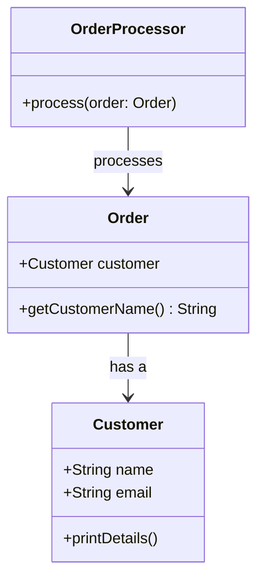

## 17.1 Recognizing Code Smells

In the realm of software development, code smells are indicators of potential problems in your codebase. They are not bugs, but rather signs that something might be wrong, leading to increased maintenance costs and reduced code quality. Recognizing these smells is crucial for expert software engineers and architects, especially when working with Kotlin, to ensure that the code remains clean, efficient, and maintainable.

### Understanding Code Smells

Code smells are symptoms of deeper issues within the code. They often indicate that the code may need refactoring to improve its structure, readability, or performance. While code smells do not necessarily prevent the software from functioning, they can lead to more significant problems if left unaddressed.

#### Common Characteristics of Code Smells

- **Complexity**: Code that is unnecessarily complicated or difficult to understand.
- **Duplication**: Repeated code blocks that could be consolidated.
- **Rigidity**: Code that is hard to change due to tight coupling or dependencies.
- **Fragility**: Code that breaks easily when modified.
- **Opacity**: Code that is not self-explanatory or lacks clarity.

### Recognizing Code Smells in Kotlin

Kotlin, with its modern features and expressive syntax, offers tools to help mitigate code smells. However, developers must still be vigilant in recognizing and addressing these issues.

#### 1. Long Method

A method that is too long can be challenging to understand and maintain. In Kotlin, this can often be addressed by breaking the method into smaller, more focused functions.

**Example of a Long Method:**

```kotlin
fun processOrder(order: Order) {
    // Validate order
    if (order.items.isEmpty()) {
        println("Order has no items")
        return
    }
    // Calculate total
    var total = 0.0
    for (item in order.items) {
        total += item.price * item.quantity
    }
    // Apply discounts
    if (order.customer.isPremium) {
        total *= 0.9
    }
    // Print receipt
    println("Receipt for order #${order.id}")
    for (item in order.items) {
        println("${item.name}: ${item.quantity} x ${item.price}")
    }
    println("Total: $total")
}
```

**Refactored Version:**

```kotlin
fun processOrder(order: Order) {
    if (!validateOrder(order)) return
    val total = calculateTotal(order)
    printReceipt(order, total)
}

fun validateOrder(order: Order): Boolean {
    return if (order.items.isEmpty()) {
        println("Order has no items")
        false
    } else {
        true
    }
}

fun calculateTotal(order: Order): Double {
    var total = order.items.sumOf { it.price * it.quantity }
    if (order.customer.isPremium) {
        total *= 0.9
    }
    return total
}

fun printReceipt(order: Order, total: Double) {
    println("Receipt for order #${order.id}")
    order.items.forEach { item ->
        println("${item.name}: ${item.quantity} x ${item.price}")
    }
    println("Total: $total")
}
```

#### 2. Duplicated Code

Duplicated code is a common smell that can lead to inconsistencies and increased maintenance efforts. In Kotlin, you can use functions, extension functions, or higher-order functions to eliminate duplication.

**Example of Duplicated Code:**

```kotlin
fun calculateDiscountedPrice(price: Double, discount: Double): Double {
    return price - (price * discount)
}

fun calculateFinalPrice(price: Double, tax: Double): Double {
    return price + (price * tax)
}
```

**Refactored Version Using a Higher-Order Function:**

```kotlin
fun calculatePrice(price: Double, rate: Double, operation: (Double, Double) -> Double): Double {
    return operation(price, rate)
}

val discountedPrice = calculatePrice(100.0, 0.1) { price, discount -> price - (price * discount) }
val finalPrice = calculatePrice(100.0, 0.2) { price, tax -> price + (price * tax) }
```

#### 3. Large Class

A class that has too many responsibilities can become difficult to manage. This violates the Single Responsibility Principle (SRP). In Kotlin, you can use data classes, interfaces, and delegation to break down large classes.

**Example of a Large Class:**

```kotlin
class OrderProcessor {
    fun validateOrder(order: Order) { /*...*/ }
    fun calculateTotal(order: Order) { /*...*/ }
    fun applyDiscount(order: Order) { /*...*/ }
    fun printReceipt(order: Order) { /*...*/ }
    fun sendConfirmationEmail(order: Order) { /*...*/ }
}
```

**Refactored Version Using Interfaces and Delegation:**

```kotlin
interface OrderValidator {
    fun validate(order: Order)
}

interface OrderCalculator {
    fun calculate(order: Order): Double
}

interface OrderPrinter {
    fun print(order: Order, total: Double)
}

interface EmailSender {
    fun sendEmail(order: Order)
}

class OrderProcessor(
    private val validator: OrderValidator,
    private val calculator: OrderCalculator,
    private val printer: OrderPrinter,
    private val emailSender: EmailSender
) {
    fun process(order: Order) {
        validator.validate(order)
        val total = calculator.calculate(order)
        printer.print(order, total)
        emailSender.sendEmail(order)
    }
}
```

#### 4. Primitive Obsession

Using primitive data types instead of small objects for simple tasks can lead to code that is hard to understand and maintain. Kotlin's data classes and type aliases can help address this smell.

**Example of Primitive Obsession:**

```kotlin
fun createUser(name: String, age: Int, email: String) {
    //...
}
```

**Refactored Version Using a Data Class:**

```kotlin
data class User(val name: String, val age: Int, val email: String)

fun createUser(user: User) {
    //...
}
```

#### 5. Long Parameter List

Methods with too many parameters can be difficult to understand and use. In Kotlin, you can use data classes or builder patterns to simplify parameter management.

**Example of a Long Parameter List:**

```kotlin
fun createOrder(id: String, customerName: String, customerEmail: String, items: List<Item>, total: Double) {
    //...
}
```

**Refactored Version Using a Data Class:**

```kotlin
data class Order(val id: String, val customer: Customer, val items: List<Item>, val total: Double)

data class Customer(val name: String, val email: String)

fun createOrder(order: Order) {
    //...
}
```

#### 6. Feature Envy

Feature envy occurs when a method in one class is more interested in the details of another class than its own. This can often be resolved by moving the method to the class it is most interested in.

**Example of Feature Envy:**

```kotlin
class OrderProcessor {
    fun printCustomerDetails(order: Order) {
        println("Customer: ${order.customer.name}, Email: ${order.customer.email}")
    }
}
```

**Refactored Version:**

```kotlin
class Customer(val name: String, val email: String) {
    fun printDetails() {
        println("Customer: $name, Email: $email")
    }
}

class Order(val customer: Customer)

fun main() {
    val customer = Customer("John Doe", "john@example.com")
    val order = Order(customer)
    order.customer.printDetails()
}
```

#### 7. Inappropriate Intimacy

Inappropriate intimacy occurs when one class is too familiar with another class's internal details. This can often be resolved by using interfaces or encapsulating the intimate details.

**Example of Inappropriate Intimacy:**

```kotlin
class OrderProcessor {
    fun process(order: Order) {
        println("Processing order for ${order.customer.name}")
    }
}

class Order(val customer: Customer)
```

**Refactored Version Using Encapsulation:**

```kotlin
class OrderProcessor {
    fun process(order: Order) {
        println("Processing order for ${order.getCustomerName()}")
    }
}

class Order(private val customer: Customer) {
    fun getCustomerName() = customer.name
}
```

### Visualizing Code Smells

To better understand the relationships and interactions that can lead to code smells, let's visualize the concept using a class diagram. This diagram illustrates how classes can become tightly coupled, leading to inappropriate intimacy and feature envy.



### Refactoring Techniques

Refactoring is the process of restructuring existing code without changing its external behavior. It is a critical skill for addressing code smells and improving code quality.

#### 1. Extract Method

Extracting methods can help reduce the size of large methods and improve readability. This involves moving a code block into a new method and replacing the original code with a call to the new method.

#### 2. Move Method

Moving methods to the class they are most interested in can help resolve feature envy and inappropriate intimacy. This involves identifying methods that are more related to another class and relocating them.

#### 3. Introduce Parameter Object

When a method has a long parameter list, consider introducing a parameter object. This involves creating a new class to encapsulate the parameters and passing an instance of this class instead.

#### 4. Replace Primitive with Object

Replacing primitive data types with small objects can help address primitive obsession. This involves creating a new class to represent the primitive data and using instances of this class instead.

#### 5. Use Interfaces

Using interfaces can help reduce inappropriate intimacy by encapsulating the details of a class. This involves defining an interface for the class and using the interface type instead of the concrete class type.

### Try It Yourself

To solidify your understanding of code smells and refactoring, try modifying the provided examples:

- **Experiment with Extract Method**: Take a long method from your codebase and break it into smaller, more focused methods.
- **Move Method**: Identify a method that exhibits feature envy and move it to the appropriate class.
- **Introduce Parameter Object**: Refactor a method with a long parameter list by introducing a parameter object.
- **Replace Primitive with Object**: Find instances of primitive obsession in your code and replace them with small objects.

### Knowledge Check

Before we conclude, let's reinforce what we've learned with a few questions:

1. What is a code smell, and why is it important to recognize them?
2. How can Kotlin's data classes help address the primitive obsession code smell?
3. What is the Single Responsibility Principle, and how does it relate to large classes?
4. Describe a scenario where feature envy might occur and how to resolve it.
5. How can refactoring improve code quality without altering its external behavior?

### Embrace the Journey

Recognizing and addressing code smells is an ongoing journey. As expert developers, we must continuously refine our skills and strive for clean, maintainable code. Remember, this is just the beginning. As you progress, you'll build more robust and efficient applications. Keep experimenting, stay curious, and enjoy the journey!

## Quiz Time!



### What is a code smell?

- [x] A symptom of deeper issues within the code
- [ ] A syntax error in the code
- [ ] A type of bug that prevents code from running
- [ ] A design pattern used in software development

> **Explanation:** A code smell is a symptom of deeper issues within the code, indicating potential problems that may need refactoring.

### How can Kotlin's data classes help address the primitive obsession code smell?

- [x] By encapsulating primitive data types into meaningful objects
- [ ] By reducing the number of methods in a class
- [ ] By improving the performance of the application
- [ ] By simplifying the syntax of the code

> **Explanation:** Kotlin's data classes can encapsulate primitive data types into meaningful objects, addressing the primitive obsession code smell.

### What principle does a large class violate?

- [x] Single Responsibility Principle
- [ ] Open/Closed Principle
- [ ] Liskov Substitution Principle
- [ ] Interface Segregation Principle

> **Explanation:** A large class often violates the Single Responsibility Principle by having too many responsibilities.

### How can feature envy be resolved?

- [x] By moving the method to the class it is most interested in
- [ ] By adding more parameters to the method
- [ ] By increasing the visibility of the method
- [ ] By using inheritance to share behavior

> **Explanation:** Feature envy can be resolved by moving the method to the class it is most interested in, reducing its dependency on another class.

### What is the purpose of refactoring?

- [x] To improve code quality without changing its external behavior
- [ ] To add new features to the application
- [ ] To fix syntax errors in the code
- [ ] To increase the performance of the application

> **Explanation:** Refactoring aims to improve code quality without changing its external behavior, making it more maintainable and readable.

### Which refactoring technique involves breaking a long method into smaller methods?

- [x] Extract Method
- [ ] Move Method
- [ ] Introduce Parameter Object
- [ ] Replace Primitive with Object

> **Explanation:** The Extract Method technique involves breaking a long method into smaller, more focused methods.

### What is inappropriate intimacy in code?

- [x] When one class is too familiar with another class's internal details
- [ ] When a method has too many parameters
- [ ] When a class has too many responsibilities
- [ ] When code is duplicated across multiple classes

> **Explanation:** Inappropriate intimacy occurs when one class is too familiar with another class's internal details, leading to tight coupling.

### How can interfaces help reduce inappropriate intimacy?

- [x] By encapsulating the details of a class
- [ ] By increasing the number of methods in a class
- [ ] By reducing the number of parameters in a method
- [ ] By simplifying the syntax of the code

> **Explanation:** Interfaces can encapsulate the details of a class, reducing inappropriate intimacy by decoupling classes.

### What is the benefit of using a parameter object?

- [x] It simplifies parameter management for methods with long parameter lists
- [ ] It increases the performance of the application
- [ ] It reduces the number of classes in the codebase
- [ ] It improves the readability of the code

> **Explanation:** A parameter object simplifies parameter management for methods with long parameter lists, making the code easier to understand and maintain.

### True or False: Code smells are always bugs that prevent the software from functioning.

- [ ] True
- [x] False

> **Explanation:** False. Code smells are not bugs but indicators of potential problems in the code that may need refactoring.


