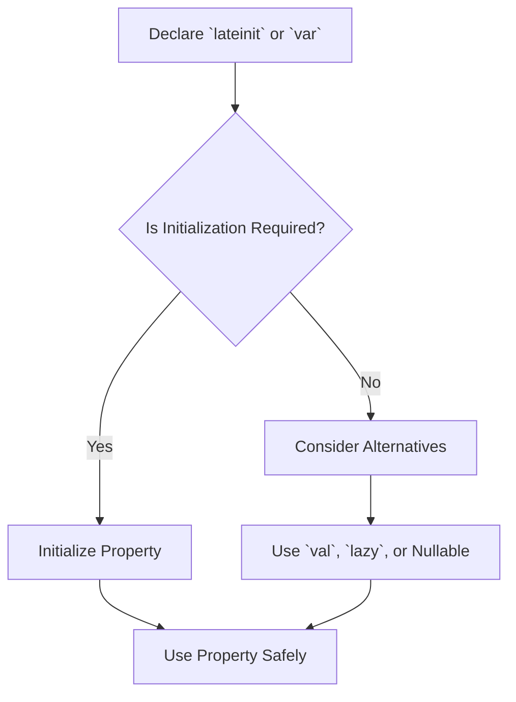

## 17.10 Misusing `lateinit` and `var`

In the world of Kotlin programming, understanding the nuances of `lateinit` and `var` is crucial for writing efficient, safe, and maintainable code. While these features offer flexibility, misuse can lead to subtle bugs and design flaws. This section delves into the common pitfalls associated with `lateinit` and `var`, providing expert insights and best practices to avoid these traps.

### Understanding `lateinit` and `var`

Before we explore the pitfalls, let's clarify what `lateinit` and `var` are and why they exist in Kotlin.

#### `lateinit` Modifier

The `lateinit` modifier allows you to declare a non-nullable property that is initialized later. This is particularly useful when dealing with dependency injection or Android views, where initialization cannot occur at the point of declaration.

```kotlin
lateinit var user: User

fun initializeUser() {
    user = User("John Doe")
}
```

#### `var` Keyword

The `var` keyword is used to declare mutable variables. Unlike `val`, which makes a variable read-only after initialization, `var` allows reassignment.

```kotlin
var counter = 0
counter += 1
```

### The Pitfalls of Misusing `lateinit`

While `lateinit` can be convenient, it comes with risks if not used carefully.

#### Uninitialized Property Access

One of the most common issues with `lateinit` is accessing a property before it has been initialized, leading to a `UninitializedPropertyAccessException`.

```kotlin
fun printUserName() {
    println(user.name) // Throws UninitializedPropertyAccessException if `user` is not initialized
}
```

**Best Practice:** Always ensure that `lateinit` properties are initialized before use. Consider using nullable types or `lazy` initialization if initialization timing is uncertain.

#### Overuse of `lateinit`

Overusing `lateinit` can lead to code that is difficult to reason about, as the initialization order becomes unclear.

**Best Practice:** Limit the use of `lateinit` to scenarios where it is truly necessary, such as dependency injection or Android view binding.

### The Pitfalls of Misusing `var`

The `var` keyword, while offering mutability, can lead to issues if used excessively or inappropriately.

#### Unnecessary Mutability

Excessive use of `var` can lead to code that is harder to maintain and reason about, as it introduces mutable state.

```kotlin
var total = 0
fun addToTotal(value: Int) {
    total += value
}
```

**Best Practice:** Prefer `val` over `var` whenever possible. Immutability leads to safer and more predictable code.

#### Thread Safety Concerns

Mutable variables declared with `var` can lead to concurrency issues in multi-threaded environments.

```kotlin
var sharedCounter = 0

fun incrementCounter() {
    sharedCounter += 1 // Not thread-safe
}
```

**Best Practice:** Use synchronization mechanisms or atomic variables when dealing with mutable state in concurrent applications.

### Alternatives and Best Practices

To avoid the pitfalls of `lateinit` and `var`, consider the following alternatives and best practices.

#### Use `val` for Immutability

Whenever possible, declare variables with `val` to ensure they remain immutable after initialization.

```kotlin
val user = User("John Doe")
```

#### Consider `lazy` Initialization

For properties that require deferred initialization, consider using `lazy` instead of `lateinit`.

```kotlin
val user: User by lazy {
    User("John Doe")
}
```

#### Use Nullable Types

If a property might not be initialized immediately, consider using a nullable type instead of `lateinit`.

```kotlin
var user: User? = null
```

#### Employ Dependency Injection

For scenarios where `lateinit` is used for dependency injection, consider using a DI framework like Dagger or Koin to manage dependencies more effectively.

### Visualizing `lateinit` and `var` Usage

To better understand the implications of `lateinit` and `var`, let's visualize their usage in a typical application flow.



**Diagram Explanation:** This flowchart illustrates the decision-making process when using `lateinit` or `var`. It emphasizes the importance of initialization and considering alternatives to ensure safe and maintainable code.

### Common Misconceptions and Clarifications

#### Misconception: `lateinit` is Always Safe

**Clarification:** While `lateinit` can simplify code, it introduces risks if properties are accessed before initialization. Always ensure proper initialization.

#### Misconception: `var` is Necessary for Flexibility

**Clarification:** While `var` allows reassignment, it should not be overused. Immutability with `val` often leads to more robust and maintainable code.

### Try It Yourself

Experiment with the following code snippets to better understand the implications of `lateinit` and `var`.

#### Example 1: `lateinit` Initialization

```kotlin
lateinit var user: User

fun main() {
    // Uncommenting the next line will cause an exception
    // println(user.name)

    user = User("Jane Doe")
    println(user.name) // Safe to access after initialization
}
```

**Challenge:** Try accessing `user.name` before initialization and observe the exception. Then, initialize `user` and access it safely.

#### Example 2: `var` vs. `val`

```kotlin
var mutableCounter = 0
val immutableCounter = 0

fun incrementCounters() {
    mutableCounter += 1
    // immutableCounter += 1 // Uncommenting this line will cause a compilation error
}

fun main() {
    incrementCounters()
    println("Mutable Counter: $mutableCounter")
    println("Immutable Counter: $immutableCounter")
}
```

**Challenge:** Attempt to modify `immutableCounter` and observe the compiler error. Reflect on the benefits of immutability.

### Knowledge Check

- Why is it important to initialize `lateinit` properties before use?
- What are the risks of using `var` in multi-threaded environments?
- How can `lazy` initialization help avoid `lateinit` pitfalls?

### Conclusion

Misusing `lateinit` and `var` can lead to subtle bugs and design flaws in Kotlin applications. By understanding their pitfalls and following best practices, you can write safer, more maintainable code. Remember, prefer `val` over `var` to embrace immutability, and use `lateinit` judiciously, ensuring proper initialization.

### References and Further Reading

- [Kotlin Language Documentation](https://kotlinlang.org/docs/reference/)
- [Effective Kotlin: Best Practices](https://www.effectivekotlin.com/)
- [Kotlin Coroutines Guide](https://kotlinlang.org/docs/coroutines-guide.html)

## Quiz Time!



### What is the primary risk of using `lateinit` improperly?

- [x] Accessing a property before it is initialized
- [ ] Increased memory usage
- [ ] Compilation errors
- [ ] Slower runtime performance

> **Explanation:** The primary risk of using `lateinit` improperly is accessing a property before it is initialized, leading to a `UninitializedPropertyAccessException`.

### What is a common alternative to `lateinit` for deferred initialization?

- [x] `lazy` initialization
- [ ] `var` keyword
- [ ] `val` keyword
- [ ] `fun` keyword

> **Explanation:** `lazy` initialization is a common alternative to `lateinit` for deferred initialization, providing a safer way to initialize properties when needed.

### Why should `val` be preferred over `var`?

- [x] Immutability leads to safer and more predictable code
- [ ] `val` is faster than `var`
- [ ] `var` is deprecated in Kotlin
- [ ] `val` uses less memory

> **Explanation:** `val` should be preferred over `var` because immutability leads to safer and more predictable code, reducing the risk of unintended side effects.

### What exception is thrown when accessing an uninitialized `lateinit` property?

- [x] `UninitializedPropertyAccessException`
- [ ] `NullPointerException`
- [ ] `IllegalStateException`
- [ ] `IndexOutOfBoundsException`

> **Explanation:** Accessing an uninitialized `lateinit` property throws a `UninitializedPropertyAccessException`.

### In which scenarios is `lateinit` most appropriately used?

- [x] Dependency injection and Android view binding
- [ ] Simple variable declarations
- [ ] Constant values
- [ ] Loop counters

> **Explanation:** `lateinit` is most appropriately used in scenarios like dependency injection and Android view binding, where initialization cannot occur at the point of declaration.

### What is a potential issue with using `var` in concurrent applications?

- [x] Thread safety concerns
- [ ] Increased memory usage
- [ ] Compilation errors
- [ ] Slower runtime performance

> **Explanation:** A potential issue with using `var` in concurrent applications is thread safety concerns, as mutable state can lead to race conditions.

### How can you ensure thread safety when using `var` in concurrent applications?

- [x] Use synchronization mechanisms or atomic variables
- [ ] Use `lateinit` instead
- [ ] Use `val` instead
- [ ] Avoid using variables altogether

> **Explanation:** To ensure thread safety when using `var` in concurrent applications, use synchronization mechanisms or atomic variables to manage mutable state safely.

### What is the benefit of using nullable types instead of `lateinit`?

- [x] Avoids `UninitializedPropertyAccessException`
- [ ] Reduces memory usage
- [ ] Increases performance
- [ ] Simplifies code structure

> **Explanation:** Using nullable types instead of `lateinit` avoids `UninitializedPropertyAccessException` by allowing properties to be null until initialized.

### What is the purpose of the `lazy` keyword in Kotlin?

- [x] To initialize properties only when they are accessed
- [ ] To declare mutable variables
- [ ] To create constant values
- [ ] To optimize memory usage

> **Explanation:** The `lazy` keyword in Kotlin is used to initialize properties only when they are accessed, providing a safe way to defer initialization.

### True or False: `lateinit` can be used with primitive types in Kotlin.

- [ ] True
- [x] False

> **Explanation:** False. `lateinit` cannot be used with primitive types in Kotlin; it is only applicable to non-nullable properties of reference types.


