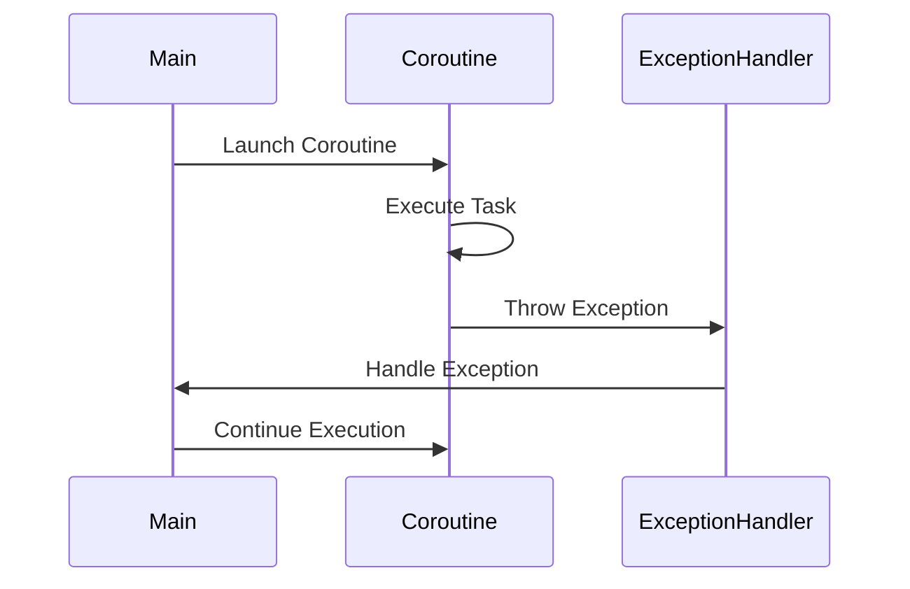

## 17.11 Handling Exceptions in Kotlin Coroutines: Avoiding Anti-Patterns

In the world of Kotlin programming, coroutines have emerged as a powerful tool for managing asynchronous tasks. However, with great power comes great responsibility, and one of the most critical responsibilities is handling exceptions effectively. Ignoring exception propagation and missing cancellation handling in coroutines can lead to subtle bugs, resource leaks, and unpredictable application behavior. In this section, we will delve deep into the intricacies of exception handling in Kotlin coroutines, exploring best practices, common pitfalls, and advanced techniques to ensure your applications are robust and resilient.

### Understanding Coroutines and Exception Handling

Before we dive into the specifics of exception handling, let's briefly revisit what coroutines are and why they are so significant in Kotlin.

#### What Are Coroutines?

Coroutines are a concurrency design pattern that you can use on Android to simplify code that executes asynchronously. They allow you to write asynchronous code in a sequential manner, making it easier to read and maintain. Coroutines are lightweight threads that can be suspended and resumed, allowing for non-blocking operations.

#### Why Is Exception Handling Important in Coroutines?

Exception handling is crucial in any programming paradigm, but it becomes even more critical in asynchronous programming. In coroutines, exceptions can be thrown at any point during the execution of a coroutine, and if not handled properly, they can propagate and cause the entire application to crash. Moreover, unhandled exceptions can lead to resource leaks and inconsistent application states.

### Common Anti-Patterns in Coroutine Exception Handling

Let's explore some of the common anti-patterns developers encounter when dealing with exceptions in coroutines.

#### Ignoring Exception Propagation

One of the most prevalent anti-patterns is ignoring exception propagation. In Kotlin coroutines, exceptions are propagated up the coroutine hierarchy. If an exception is not handled, it can terminate the entire coroutine scope, leading to unexpected application behavior.

**Example of Ignoring Exception Propagation:**

```kotlin
import kotlinx.coroutines.*

fun main() = runBlocking {
    launch {
        println("Coroutine started")
        throw RuntimeException("Something went wrong!")
    }
    println("Coroutine ended")
}
```

In this example, the exception is thrown but not caught, causing the coroutine to terminate abruptly.

#### Missing Cancellation Handling

Another common anti-pattern is missing cancellation handling. Coroutines can be cancelled at any time, and if cancellation is not handled properly, it can lead to resource leaks and incomplete operations.

**Example of Missing Cancellation Handling:**

```kotlin
import kotlinx.coroutines.*

fun main() = runBlocking {
    val job = launch {
        repeat(1000) { i ->
            println("Job: I'm sleeping $i ...")
            delay(500L)
        }
    }
    delay(1300L)
    println("main: I'm tired of waiting!")
    job.cancel() // cancels the job
    job.join() // waits for job's completion
    println("main: Now I can quit.")
}
```

In this example, the coroutine is cancelled, but the cancellation is not handled, leading to potential resource leaks.

### Best Practices for Handling Exceptions in Coroutines

Now that we've identified some common anti-patterns, let's explore best practices for handling exceptions in coroutines.

#### Use `try-catch` Blocks

The most straightforward way to handle exceptions in coroutines is to use `try-catch` blocks. This allows you to catch exceptions and handle them appropriately within the coroutine.

**Example of Using `try-catch` Blocks:**

```kotlin
import kotlinx.coroutines.*

fun main() = runBlocking {
    launch {
        try {
            println("Coroutine started")
            throw RuntimeException("Something went wrong!")
        } catch (e: Exception) {
            println("Caught exception: ${e.message}")
        }
    }
    println("Coroutine ended")
}
```

In this example, the exception is caught and handled within the coroutine, preventing it from propagating and terminating the coroutine scope.

#### Use Coroutine Exception Handlers

Kotlin provides a mechanism for handling exceptions globally using `CoroutineExceptionHandler`. This allows you to define a handler that will be invoked whenever an unhandled exception occurs in a coroutine.

**Example of Using Coroutine Exception Handlers:**

```kotlin
import kotlinx.coroutines.*

fun main() = runBlocking {
    val handler = CoroutineExceptionHandler { _, exception ->
        println("Caught $exception")
    }

    val job = GlobalScope.launch(handler) {
        throw AssertionError("My Custom Assertion Error!")
    }
    job.join()
}
```

In this example, the `CoroutineExceptionHandler` is used to catch and handle exceptions globally, providing a centralized mechanism for exception handling.

#### Handle Cancellation Properly

To handle cancellation properly, you should ensure that your coroutines are responsive to cancellation requests. This can be achieved by checking the cancellation status and cleaning up resources when a coroutine is cancelled.

**Example of Handling Cancellation:**

```kotlin
import kotlinx.coroutines.*

fun main() = runBlocking {
    val job = launch {
        try {
            repeat(1000) { i ->
                println("Job: I'm sleeping $i ...")
                delay(500L)
            }
        } finally {
            println("Job: I'm running finally")
        }
    }
    delay(1300L)
    println("main: I'm tired of waiting!")
    job.cancelAndJoin() // cancels the job and waits for its completion
    println("main: Now I can quit.")
}
```

In this example, the `finally` block is used to ensure that resources are cleaned up when the coroutine is cancelled.

### Advanced Techniques for Exception Handling in Coroutines

For expert developers, there are advanced techniques that can be employed to handle exceptions in coroutines more effectively.

#### Use Supervisor Jobs

A `SupervisorJob` is a special type of job that allows you to manage exceptions in a hierarchical manner. In a `SupervisorJob`, the failure of a child coroutine does not affect its siblings or the parent coroutine.

**Example of Using Supervisor Jobs:**

```kotlin
import kotlinx.coroutines.*

fun main() = runBlocking {
    val supervisor = SupervisorJob()

    with(CoroutineScope(coroutineContext + supervisor)) {
        val child = launch(CoroutineExceptionHandler { _, _ ->  }) {
            println("Child throws an exception")
            throw AssertionError()
        }
        val secondChild = launch {
            child.join()
            // Cancellation of the first child is not propagated to the second child
            println("Second child is not cancelled")
        }
        child.join()
        secondChild.join()
    }
}
```

In this example, the failure of the first child coroutine does not affect the second child, demonstrating the isolation provided by `SupervisorJob`.

#### Use `withContext` for Context-Specific Exception Handling

The `withContext` function allows you to switch the context of a coroutine, providing a mechanism for context-specific exception handling.

**Example of Using `withContext`:**

```kotlin
import kotlinx.coroutines.*

fun main() = runBlocking {
    val result = withContext(Dispatchers.IO) {
        try {
            // Simulate a long-running task
            delay(1000)
            "Success"
        } catch (e: Exception) {
            "Failure"
        }
    }
    println("Result: $result")
}
```

In this example, the `withContext` function is used to handle exceptions in a context-specific manner, allowing for more granular control over exception handling.

### Visualizing Exception Handling in Coroutines

To better understand the flow of exception handling in coroutines, let's visualize the process using a sequence diagram.



This diagram illustrates the flow of exception handling in coroutines, highlighting the role of the exception handler in managing exceptions.

### Key Takeaways

- **Exception Propagation:** Always handle exceptions in coroutines to prevent unexpected application behavior.
- **Cancellation Handling:** Ensure that coroutines are responsive to cancellation requests to avoid resource leaks.
- **Advanced Techniques:** Use `SupervisorJob` and `withContext` for more granular control over exception handling.

### Try It Yourself

Experiment with the code examples provided in this section. Try modifying the examples to see how different exception handling techniques affect the behavior of coroutines. For instance, try removing the `try-catch` block and observe how the application behaves.

### References and Further Reading

- [Kotlin Coroutines Guide](https://kotlinlang.org/docs/coroutines-overview.html)
- [Exception Handling in Coroutines](https://kotlinlang.org/docs/exception-handling.html)
- [Structured Concurrency](https://kotlinlang.org/docs/structured-concurrency.html)

### Embrace the Journey

Remember, mastering exception handling in coroutines is a journey. As you continue to explore and experiment, you'll gain a deeper understanding of how to build robust and resilient applications. Keep experimenting, stay curious, and enjoy the journey!

## Quiz Time!



### What is a common anti-pattern when handling exceptions in coroutines?

- [x] Ignoring exception propagation
- [ ] Using `try-catch` blocks
- [ ] Using `CoroutineExceptionHandler`
- [ ] Handling cancellation properly

> **Explanation:** Ignoring exception propagation is a common anti-pattern that can lead to unexpected application behavior.

### How can you handle exceptions globally in coroutines?

- [x] Using `CoroutineExceptionHandler`
- [ ] Using `try-catch` blocks
- [ ] Using `SupervisorJob`
- [ ] Using `withContext`

> **Explanation:** `CoroutineExceptionHandler` allows you to define a handler that will be invoked whenever an unhandled exception occurs in a coroutine.

### What is the purpose of `SupervisorJob` in coroutines?

- [x] To manage exceptions in a hierarchical manner
- [ ] To handle cancellation requests
- [ ] To switch coroutine contexts
- [ ] To execute tasks asynchronously

> **Explanation:** `SupervisorJob` allows you to manage exceptions in a hierarchical manner, isolating failures to individual coroutines.

### How can you ensure that resources are cleaned up when a coroutine is cancelled?

- [x] Using a `finally` block
- [ ] Using `try-catch` blocks
- [ ] Using `CoroutineExceptionHandler`
- [ ] Using `SupervisorJob`

> **Explanation:** A `finally` block can be used to ensure that resources are cleaned up when a coroutine is cancelled.

### What function allows you to switch the context of a coroutine?

- [x] `withContext`
- [ ] `launch`
- [ ] `async`
- [ ] `runBlocking`

> **Explanation:** `withContext` allows you to switch the context of a coroutine, providing a mechanism for context-specific exception handling.

### Which of the following is a benefit of handling exceptions in coroutines?

- [x] Preventing unexpected application behavior
- [ ] Increasing application performance
- [ ] Reducing code complexity
- [ ] Enhancing user interface design

> **Explanation:** Handling exceptions in coroutines prevents unexpected application behavior and ensures the application remains stable.

### What is the role of `CoroutineExceptionHandler`?

- [x] To handle unhandled exceptions in coroutines
- [ ] To manage coroutine cancellation
- [ ] To switch coroutine contexts
- [ ] To execute tasks asynchronously

> **Explanation:** `CoroutineExceptionHandler` is used to handle unhandled exceptions in coroutines, providing a centralized mechanism for exception handling.

### How can you handle cancellation requests in coroutines?

- [x] By checking the cancellation status and cleaning up resources
- [ ] By using `try-catch` blocks
- [ ] By using `CoroutineExceptionHandler`
- [ ] By using `SupervisorJob`

> **Explanation:** Handling cancellation requests involves checking the cancellation status and cleaning up resources to avoid resource leaks.

### What is the effect of ignoring exception propagation in coroutines?

- [x] It can lead to unexpected application behavior
- [ ] It improves application performance
- [ ] It simplifies code complexity
- [ ] It enhances user interface design

> **Explanation:** Ignoring exception propagation can lead to unexpected application behavior and potential application crashes.

### True or False: `SupervisorJob` allows the failure of one child coroutine to affect its siblings.

- [ ] True
- [x] False

> **Explanation:** `SupervisorJob` isolates failures to individual coroutines, preventing the failure of one child from affecting its siblings.


