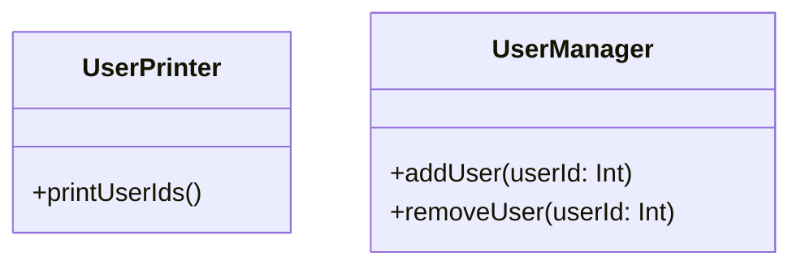

## 17.12 Ignoring Naming Conventions

In the realm of software development, naming conventions play a pivotal role in ensuring code readability, maintainability, and clarity. Ignoring naming conventions is a common anti-pattern that can lead to confusing code, making it difficult for developers to understand, maintain, and extend. In this section, we will explore the significance of naming conventions in Kotlin, the consequences of neglecting them, and best practices to adopt for writing clear and consistent code.

### The Importance of Naming Conventions

Naming conventions are standardized guidelines for naming variables, functions, classes, and other entities in code. They serve several purposes:

1. **Readability**: Well-named code is easier to read and understand, reducing cognitive load on developers.
2. **Maintainability**: Consistent naming helps in maintaining and updating code, as developers can quickly grasp the purpose of various code components.
3. **Collaboration**: In team environments, naming conventions ensure that all team members can understand and work with the codebase efficiently.
4. **Scalability**: As projects grow, consistent naming conventions help in managing complexity and avoiding naming conflicts.

### Consequences of Ignoring Naming Conventions

Ignoring naming conventions can lead to several issues:

- **Confusion**: Inconsistent or unclear names can confuse developers, leading to misunderstandings about the code's functionality.
- **Errors**: Poor naming can result in logical errors, as developers may misinterpret the purpose of variables or functions.
- **Increased Development Time**: Developers may spend more time deciphering poorly named code, leading to delays in development.
- **Reduced Code Quality**: Lack of naming conventions can contribute to a decline in overall code quality, making it harder to maintain and extend.

### Common Naming Conventions in Kotlin

Kotlin, as a modern programming language, has its own set of naming conventions that align with its syntax and features. Here are some common conventions:

- **Variables and Properties**: Use camelCase for naming variables and properties. For example, `userName`, `isAvailable`.
- **Functions**: Use camelCase for function names, starting with a lowercase letter. For example, `calculateTotal()`, `fetchData()`.
- **Classes and Interfaces**: Use PascalCase for class and interface names. For example, `UserProfile`, `DataManager`.
- **Constants**: Use uppercase letters with underscores for constants. For example, `MAX_RETRIES`, `DEFAULT_TIMEOUT`.
- **Packages**: Use lowercase letters, with words separated by dots. For example, `com.example.project`.
- **Type Parameters**: Use single uppercase letters, such as `T`, `E`, `K`, `V`.

### Best Practices for Naming in Kotlin

To avoid the anti-pattern of ignoring naming conventions, consider the following best practices:

1. **Be Descriptive**: Choose names that clearly describe the purpose or functionality of the code element. Avoid abbreviations unless they are widely understood.
   
   ```kotlin
   // Bad
   val n: Int = 10
   
   // Good
   val numberOfItems: Int = 10
   ```

2. **Consistency**: Stick to a consistent naming style throughout the codebase. This includes following the established conventions for variables, functions, classes, etc.

3. **Avoid Ambiguity**: Ensure that names are unambiguous and convey the intended meaning. Avoid using generic names like `data`, `item`, or `object`.

   ```kotlin
   // Bad
   fun process(data: List<String>) { ... }
   
   // Good
   fun processUserInput(userInputs: List<String>) { ... }
   ```

4. **Use Context**: Provide context in names to make them self-explanatory. This is especially important for variables and functions that are used in multiple places.

   ```kotlin
   // Bad
   val list: List<String> = ...
   
   // Good
   val userNames: List<String> = ...
   ```

5. **Follow Language Conventions**: Adhere to Kotlin's specific naming conventions to ensure consistency with the language's idiomatic style.

6. **Review and Refactor**: Regularly review code for naming consistency and refactor as needed. Encourage code reviews to catch naming issues early.

### Code Examples

Let's explore some code examples to illustrate the impact of naming conventions.

#### Example 1: Poor Naming

```kotlin
class U {
    fun c() {
        val l = listOf(1, 2, 3)
        for (i in l) {
            println(i)
        }
    }
}
```

In this example, the class `U` and function `c` have non-descriptive names, and the variable `l` is ambiguous.

#### Example 2: Improved Naming

```kotlin
class UserPrinter {
    fun printUserIds() {
        val userIds = listOf(1, 2, 3)
        for (userId in userIds) {
            println(userId)
        }
    }
}
```

Here, the class `UserPrinter`, function `printUserIds`, and variable `userIds` have descriptive names that convey their purpose clearly.

### Visualizing Naming Conventions

To better understand the impact of naming conventions, let's visualize the structure of a well-named Kotlin class using a class diagram.



In this diagram, `UserPrinter` and `UserManager` are classes with clear, descriptive names, and their methods are named to reflect their functionality.

### Try It Yourself

To reinforce your understanding, try modifying the following code snippet to improve naming conventions:

```kotlin
class A {
    fun b(x: Int) {
        val y = x * 2
        println(y)
    }
}
```

Consider renaming the class, function, and variables to make the code more descriptive and self-explanatory.

### Knowledge Check

- Why are naming conventions important in software development?
- What are some common naming conventions in Kotlin for variables and functions?
- How can poor naming conventions lead to increased development time?
- What is the impact of ignoring naming conventions on code quality?

### Conclusion

Ignoring naming conventions is a prevalent anti-pattern that can significantly hinder code readability and maintainability. By adhering to established naming conventions and best practices, developers can write clear, consistent, and high-quality Kotlin code. Remember, naming is not just a formality; it's a crucial aspect of effective software development. As you continue your journey in Kotlin programming, keep experimenting with naming conventions, stay curious, and enjoy the process of crafting clean and understandable code.

## Quiz Time!



### Which of the following is a common naming convention for classes in Kotlin?

- [x] PascalCase
- [ ] camelCase
- [ ] snake_case
- [ ] kebab-case

> **Explanation:** In Kotlin, classes are typically named using PascalCase, where each word starts with an uppercase letter.

### What is the recommended naming convention for constants in Kotlin?

- [x] UPPERCASE_WITH_UNDERSCORES
- [ ] camelCase
- [ ] PascalCase
- [ ] lowercase

> **Explanation:** Constants in Kotlin are usually named using uppercase letters with underscores separating words.

### Why is it important to use descriptive names in code?

- [x] To improve code readability and understanding
- [ ] To make the code look complex
- [ ] To increase the number of lines in the code
- [ ] To confuse other developers

> **Explanation:** Descriptive names help improve code readability and understanding, making it easier for developers to work with the code.

### What is the consequence of using ambiguous names in code?

- [x] It can lead to confusion and misunderstandings
- [ ] It makes the code run faster
- [ ] It reduces the file size
- [ ] It improves code security

> **Explanation:** Ambiguous names can lead to confusion and misunderstandings about the code's functionality.

### Which of the following is a benefit of consistent naming conventions?

- [x] Easier collaboration among team members
- [ ] Increased code complexity
- [ ] Faster execution time
- [ ] Reduced memory usage

> **Explanation:** Consistent naming conventions facilitate easier collaboration among team members by ensuring everyone can understand the code.

### What is a common mistake when naming variables?

- [x] Using single-letter names
- [ ] Using descriptive names
- [ ] Following language conventions
- [ ] Using context in names

> **Explanation:** Using single-letter names is a common mistake as it makes the code less descriptive and harder to understand.

### How can poor naming conventions affect code quality?

- [x] They can lead to logical errors and misunderstandings
- [ ] They make the code run faster
- [ ] They improve code security
- [ ] They reduce the number of lines in the code

> **Explanation:** Poor naming conventions can lead to logical errors and misunderstandings, affecting overall code quality.

### What is a key aspect of good naming conventions?

- [x] Consistency throughout the codebase
- [ ] Using random names
- [ ] Following no specific pattern
- [ ] Changing names frequently

> **Explanation:** Consistency in naming conventions is crucial for maintaining clarity and understanding throughout the codebase.

### Which of the following is NOT a recommended practice for naming in Kotlin?

- [x] Using generic names like `data` or `item`
- [ ] Being descriptive
- [ ] Avoiding ambiguity
- [ ] Providing context

> **Explanation:** Using generic names like `data` or `item` is not recommended as they do not provide enough context or clarity.

### True or False: Naming conventions are only important for large projects.

- [ ] True
- [x] False

> **Explanation:** Naming conventions are important for projects of all sizes as they contribute to code readability, maintainability, and collaboration.


