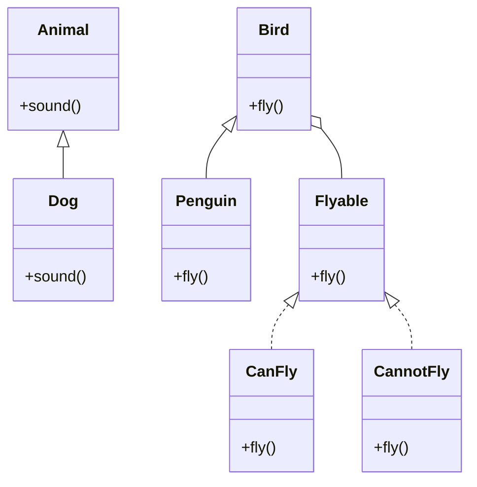

## 17.2 Overusing Inheritance

Inheritance is a powerful tool in object-oriented programming (OOP) that allows developers to create a new class based on an existing class. However, overusing inheritance can lead to rigid and fragile code structures. In this section, we will explore the pitfalls of overusing inheritance in Kotlin, understand when to favor composition over inheritance, and learn how to effectively apply these principles in your software architecture.

### Understanding Inheritance in Kotlin

Inheritance in Kotlin allows a class to inherit properties and methods from another class. This is achieved using the `open` keyword, which marks a class as inheritable. Kotlin's inheritance model is similar to other OOP languages, but with some unique features that enhance safety and clarity.

#### Example of Inheritance in Kotlin

```kotlin
open class Animal {
    open fun sound() {
        println("Animal sound")
    }
}

class Dog : Animal() {
    override fun sound() {
        println("Bark")
    }
}

fun main() {
    val dog = Dog()
    dog.sound() // Output: Bark
}
```

In this example, the `Dog` class inherits from the `Animal` class and overrides the `sound` method to provide its specific implementation.

### The Pitfalls of Overusing Inheritance

While inheritance can be useful, overusing it can lead to several issues:

1. **Tight Coupling**: Inheritance creates a strong coupling between the parent and child classes. Changes in the parent class can inadvertently affect child classes, leading to unexpected behavior.

2. **Fragile Base Class Problem**: Modifications to a base class can break subclasses, especially if the base class was not designed with extension in mind.

3. **Inflexibility**: Inheritance is a static relationship. Once a class hierarchy is established, it is difficult to change without affecting the entire structure.

4. **Code Reusability**: Inheritance can sometimes lead to code duplication if multiple subclasses require similar functionality but do not share a common ancestor.

5. **Violation of the Liskov Substitution Principle (LSP)**: Overusing inheritance can lead to situations where a subclass cannot be used interchangeably with its superclass, violating the LSP.

#### Example of Inheritance Pitfalls

Consider a scenario where we have a `Bird` class and a `Penguin` class that inherits from `Bird`.

```kotlin
open class Bird {
    open fun fly() {
        println("Flying high")
    }
}

class Penguin : Bird() {
    override fun fly() {
        throw UnsupportedOperationException("Penguins can't fly")
    }
}
```

In this case, the `Penguin` class violates the Liskov Substitution Principle because it cannot perform the `fly` operation defined in the `Bird` class.

### Favoring Composition Over Inheritance

Composition is an alternative to inheritance that involves building classes using other classes as components. This approach promotes flexibility and reusability by allowing objects to be composed of various behaviors at runtime.

#### Benefits of Composition

1. **Loose Coupling**: Composition allows for more flexible and loosely coupled designs. Components can be easily replaced or modified without affecting the entire system.

2. **Reusability**: Behavior can be reused across different classes without the need for a common ancestor.

3. **Flexibility**: Composition allows for dynamic behavior changes at runtime, unlike inheritance which is static.

4. **Adherence to SOLID Principles**: Composition often leads to designs that adhere to SOLID principles, particularly the Single Responsibility Principle (SRP) and the Open/Closed Principle (OCP).

#### Example of Composition in Kotlin

Let's refactor the previous example using composition:

```kotlin
interface Flyable {
    fun fly()
}

class Bird(private val flyingBehavior: Flyable) {
    fun performFly() {
        flyingBehavior.fly()
    }
}

class CanFly : Flyable {
    override fun fly() {
        println("Flying high")
    }
}

class CannotFly : Flyable {
    override fun fly() {
        println("Cannot fly")
    }
}

fun main() {
    val sparrow = Bird(CanFly())
    val penguin = Bird(CannotFly())

    sparrow.performFly() // Output: Flying high
    penguin.performFly() // Output: Cannot fly
}
```

In this example, we use the `Flyable` interface to define flying behavior and inject different implementations into the `Bird` class. This approach allows us to change the flying behavior without modifying the `Bird` class itself.

### Misusing Abstract Classes

Abstract classes in Kotlin are used to define common behavior that can be shared among subclasses. However, misuse of abstract classes can lead to the same pitfalls as overusing inheritance.

#### When to Use Abstract Classes

- When you have a clear hierarchy and shared behavior that cannot be easily encapsulated in a separate component.
- When you need to provide a default implementation for some methods while leaving others abstract.

#### Example of Abstract Class Misuse

```kotlin
abstract class Vehicle {
    abstract fun drive()
    open fun stop() {
        println("Vehicle stopped")
    }
}

class Car : Vehicle() {
    override fun drive() {
        println("Car driving")
    }
}

class Bicycle : Vehicle() {
    override fun drive() {
        println("Bicycle riding")
    }
}
```

In this example, the `Vehicle` class serves as a base for `Car` and `Bicycle`. However, if the `stop` method implementation is not suitable for all subclasses, it can lead to issues.

### Design Considerations

When designing software, consider the following:

- **Favor Composition**: Use composition to build flexible and reusable components.
- **Use Inheritance Sparingly**: Reserve inheritance for situations where there is a clear "is-a" relationship.
- **Leverage Interfaces**: Use interfaces to define contracts and separate behavior from implementation.
- **Apply SOLID Principles**: Adhere to SOLID principles to create maintainable and scalable software.

### Differences and Similarities

Inheritance and composition are both mechanisms for code reuse, but they differ in their approach:

- **Inheritance**: Establishes a static relationship between classes. It is best used when there is a clear hierarchical relationship.
- **Composition**: Builds classes using other classes as components. It offers more flexibility and is often preferred for dynamic behavior.

### Visualizing Inheritance vs. Composition



In this diagram, we see the inheritance relationship between `Animal` and `Dog`, and `Bird` and `Penguin`. The composition relationship is represented between `Bird` and `Flyable`.

### Try It Yourself

Experiment with the code examples provided. Try modifying the `Flyable` interface to include additional behaviors, or create new classes that implement the interface. Observe how easily you can change the behavior of the `Bird` class without altering its structure.

### Knowledge Check

- What are the main drawbacks of overusing inheritance?
- How does composition promote flexibility in software design?
- When should you use abstract classes in Kotlin?
- What are the key differences between inheritance and composition?

### Embrace the Journey

Remember, this is just the beginning. As you progress, you'll build more complex and flexible software systems. Keep experimenting, stay curious, and enjoy the journey!

## Quiz Time!



### What is a major drawback of overusing inheritance?

- [x] Tight coupling between classes
- [ ] Increased code reusability
- [ ] Enhanced flexibility
- [ ] Simplified code structure

> **Explanation:** Overusing inheritance can lead to tight coupling between classes, making it difficult to modify one class without affecting others.

### Which principle does composition often adhere to?

- [x] SOLID principles
- [ ] DRY principle
- [ ] YAGNI principle
- [ ] KISS principle

> **Explanation:** Composition often adheres to SOLID principles, promoting loose coupling and reusability.

### What is a key benefit of using composition over inheritance?

- [x] Flexibility in behavior changes
- [ ] Static class relationships
- [ ] Strong coupling
- [ ] Code duplication

> **Explanation:** Composition allows for flexibility in behavior changes by enabling dynamic composition of objects.

### When should you use abstract classes in Kotlin?

- [x] When there is shared behavior that cannot be easily encapsulated
- [ ] When you want to avoid code duplication
- [ ] When you need dynamic behavior changes
- [ ] When there is no clear hierarchy

> **Explanation:** Abstract classes are useful when there is shared behavior that cannot be easily encapsulated in a separate component.

### What is a similarity between inheritance and composition?

- [x] Both are mechanisms for code reuse
- [ ] Both create static relationships
- [ ] Both lead to tight coupling
- [ ] Both are preferred for dynamic behavior

> **Explanation:** Inheritance and composition are both mechanisms for code reuse, but they differ in their approach.

### What is the Liskov Substitution Principle?

- [x] Subtypes must be substitutable for their base types
- [ ] Classes should be open for extension, closed for modification
- [ ] A class should have only one reason to change
- [ ] Dependencies should be on abstractions, not concretions

> **Explanation:** The Liskov Substitution Principle states that subtypes must be substitutable for their base types without altering the correctness of the program.

### How can you achieve loose coupling in software design?

- [x] By using composition
- [ ] By overusing inheritance
- [ ] By creating deep class hierarchies
- [ ] By avoiding interfaces

> **Explanation:** Loose coupling can be achieved by using composition, which allows for flexible and interchangeable components.

### What is a common misuse of abstract classes?

- [x] Providing unsuitable default implementations
- [ ] Defining clear hierarchies
- [ ] Encouraging code reuse
- [ ] Implementing interfaces

> **Explanation:** A common misuse of abstract classes is providing unsuitable default implementations that may not fit all subclasses.

### Which keyword is used in Kotlin to mark a class as inheritable?

- [x] open
- [ ] abstract
- [ ] final
- [ ] sealed

> **Explanation:** The `open` keyword is used in Kotlin to mark a class as inheritable, allowing other classes to extend it.

### True or False: Composition allows for dynamic behavior changes at runtime.

- [x] True
- [ ] False

> **Explanation:** True. Composition allows for dynamic behavior changes at runtime by composing objects with different behaviors.




