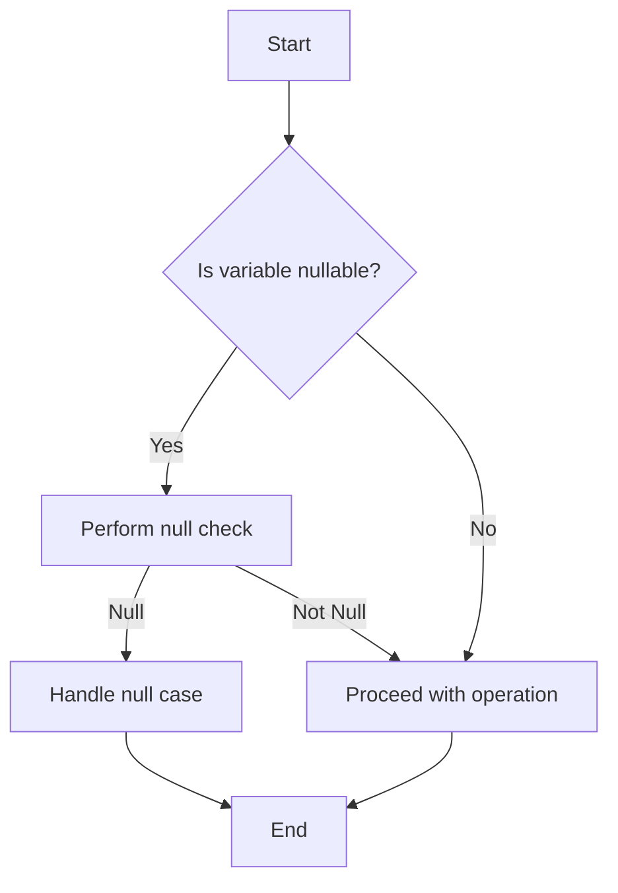

## 17.3 Ignoring Null Safety

Kotlin is renowned for its null safety features, which aim to eliminate the notorious `NullPointerException` (NPE) from your code. However, ignoring these features or misusing them can lead to code that is not only error-prone but also difficult to maintain. In this section, we will delve into the common pitfalls associated with ignoring null safety in Kotlin, explore best practices, and provide you with the tools to write robust, null-safe Kotlin code.

### Understanding Null Safety in Kotlin

Kotlin's type system is designed to distinguish between nullable and non-nullable types. This is a fundamental aspect of the language that helps prevent null-related errors at compile time.

- **Non-nullable types**: By default, all types in Kotlin are non-nullable. For example, a variable of type `String` cannot hold a `null` value.
  
  ```kotlin
  var name: String = "Kotlin"
  name = null // Compilation error
  ```

- **Nullable types**: To allow a variable to hold a null value, you must explicitly declare it as nullable by appending a `?` to the type.

  ```kotlin
  var name: String? = "Kotlin"
  name = null // Allowed
  ```

### Misusing Nullable Types

One of the most common anti-patterns in Kotlin is the misuse of nullable types. This often manifests in two main ways:

1. **Overusing Nullable Types**: Declaring variables as nullable when they don't need to be can lead to unnecessary null checks and complicate your code.

   ```kotlin
   var age: Int? = 25
   if (age != null) {
       println("Age is $age")
   }
   ```

   In this example, if `age` is always expected to have a value, it should be declared as a non-nullable `Int`.

2. **Overusing the `!!` Operator**: The `!!` operator is used to assert that a nullable type is not null. However, overusing it can lead to `NullPointerException` if the value is indeed null.

   ```kotlin
   var name: String? = null
   println(name!!.length) // Throws NullPointerException
   ```

   Instead, use safe calls (`?.`) or the Elvis operator (`?:`) to handle nullability more gracefully.

### Best Practices for Handling Nullability

To avoid the pitfalls of ignoring null safety, consider the following best practices:

#### 1. Use Safe Calls

The safe call operator (`?.`) allows you to perform operations on a nullable object without risking a `NullPointerException`. If the object is null, the operation returns null.

```kotlin
var name: String? = null
println(name?.length) // Prints null
```

#### 2. Use the Elvis Operator

The Elvis operator (`?:`) provides a default value when a nullable expression evaluates to null.

```kotlin
var name: String? = null
val length = name?.length ?: 0
println(length) // Prints 0
```

#### 3. Leverage Smart Casts

Kotlin's smart cast feature automatically casts a variable to a non-nullable type after a null check.

```kotlin
fun printName(name: String?) {
    if (name != null) {
        println(name.length) // Smart cast to non-nullable String
    }
}
```

#### 4. Use `let` for Scoped Null Checks

The `let` function is useful for executing a block of code only when a nullable variable is not null.

```kotlin
var name: String? = "Kotlin"
name?.let {
    println(it.length) // Executes only if name is not null
}
```

#### 5. Avoid the `!!` Operator

As a rule of thumb, avoid using the `!!` operator unless you are absolutely certain that a variable cannot be null. Instead, use safe calls or the Elvis operator to handle nullability.

### Common Scenarios and Solutions

Let's explore some common scenarios where ignoring null safety can lead to issues, and how to address them effectively.

#### Scenario 1: Accessing Properties of Nullable Types

When accessing properties or methods of a nullable type, it's crucial to handle the null case to prevent runtime exceptions.

**Anti-pattern:**

```kotlin
var user: User? = null
println(user!!.name) // Risky, can throw NullPointerException
```

**Solution:**

```kotlin
var user: User? = null
println(user?.name ?: "Unknown") // Safe, provides a default value
```

#### Scenario 2: Function Parameters

When designing functions, consider whether parameters should be nullable. If a parameter is not expected to be null, declare it as non-nullable.

**Anti-pattern:**

```kotlin
fun greetUser(name: String?) {
    println("Hello, ${name!!.toUpperCase()}") // Risky, can throw NullPointerException
}
```

**Solution:**

```kotlin
fun greetUser(name: String) {
    println("Hello, ${name.toUpperCase()}") // Safe, name is non-nullable
}
```

#### Scenario 3: Collections of Nullable Types

When working with collections, decide whether the collection itself or its elements should be nullable.

**Anti-pattern:**

```kotlin
val names: List<String?> = listOf("Alice", null, "Bob")
names.forEach { println(it!!.toUpperCase()) } // Risky, can throw NullPointerException
```

**Solution:**

```kotlin
val names: List<String?> = listOf("Alice", null, "Bob")
names.forEach { println(it?.toUpperCase() ?: "Unknown") } // Safe, handles null elements
```

### Visualizing Null Safety

To better understand how null safety works in Kotlin, let's visualize the flow of null checks using a flowchart.



**Caption:** This flowchart illustrates the decision-making process when dealing with nullable variables in Kotlin. It emphasizes the importance of performing null checks and handling null cases appropriately.

### Try It Yourself

Experiment with the following code snippet to reinforce your understanding of null safety in Kotlin. Try modifying the code to see how different null safety features work.

```kotlin
fun main() {
    var name: String? = "Kotlin"
    println(name?.toUpperCase() ?: "Name is null")

    name = null
    println(name?.toUpperCase() ?: "Name is null")

    // Try using !! operator and observe the behavior
    // println(name!!.toUpperCase()) // Uncomment to see the exception
}
```

### Knowledge Check

- What is the purpose of the safe call operator (`?.`) in Kotlin?
- How does the Elvis operator (`?:`) help in handling nullability?
- Why should you avoid overusing the `!!` operator?
- What is smart casting, and how does it work in Kotlin?
- How can the `let` function be used to handle nullable variables?

### Embrace the Journey

Remember, mastering null safety in Kotlin is a journey. As you continue to write Kotlin code, keep experimenting with different null safety features, stay curious, and enjoy the process of writing robust, error-free code. By following best practices and avoiding common pitfalls, you'll be well on your way to becoming an expert in Kotlin's null safety.

## Quiz Time!



### What is the purpose of the safe call operator (`?.`) in Kotlin?

- [x] To safely access properties or methods of a nullable object without risking a NullPointerException.
- [ ] To forcefully cast a nullable object to a non-nullable type.
- [ ] To provide a default value when a nullable expression evaluates to null.
- [ ] To perform a null check and throw an exception if the object is null.

> **Explanation:** The safe call operator (`?.`) allows you to safely access properties or methods of a nullable object. If the object is null, the operation returns null instead of throwing a NullPointerException.

### How does the Elvis operator (`?:`) help in handling nullability?

- [x] It provides a default value when a nullable expression evaluates to null.
- [ ] It forces a nullable object to be non-nullable.
- [ ] It allows you to perform operations on a nullable object without null checks.
- [ ] It automatically casts a nullable type to a non-nullable type.

> **Explanation:** The Elvis operator (`?:`) is used to provide a default value when a nullable expression evaluates to null, ensuring that your code can handle null cases gracefully.

### Why should you avoid overusing the `!!` operator?

- [x] It can lead to NullPointerException if the value is null.
- [ ] It makes the code more readable.
- [ ] It simplifies null checks.
- [ ] It automatically provides a default value for null cases.

> **Explanation:** Overusing the `!!` operator can lead to NullPointerException if the value is null. It's better to use safe calls or the Elvis operator to handle nullability more gracefully.

### What is smart casting, and how does it work in Kotlin?

- [x] Smart casting automatically casts a variable to a non-nullable type after a null check.
- [ ] Smart casting allows you to cast any type to another type without checks.
- [ ] Smart casting is a feature that forces a nullable type to be non-nullable.
- [ ] Smart casting provides a default value for nullable types.

> **Explanation:** Smart casting in Kotlin automatically casts a variable to a non-nullable type after a null check, allowing you to safely access its properties or methods without additional checks.

### How can the `let` function be used to handle nullable variables?

- [x] The `let` function executes a block of code only when a nullable variable is not null.
- [ ] The `let` function forces a nullable variable to be non-nullable.
- [ ] The `let` function provides a default value for nullable variables.
- [ ] The `let` function automatically casts a nullable variable to a non-nullable type.

> **Explanation:** The `let` function is used to execute a block of code only when a nullable variable is not null, allowing you to safely perform operations on the variable within the block.

### What is the default behavior of a nullable type in Kotlin?

- [x] A nullable type can hold either a non-null value or null.
- [ ] A nullable type can only hold non-null values.
- [ ] A nullable type automatically provides a default value for null cases.
- [ ] A nullable type forces a null check before any operation.

> **Explanation:** In Kotlin, a nullable type can hold either a non-null value or null, allowing you to explicitly handle null cases in your code.

### Which operator is used to assert that a nullable type is not null?

- [x] The `!!` operator.
- [ ] The `?.` operator.
- [ ] The `?:` operator.
- [ ] The `let` function.

> **Explanation:** The `!!` operator is used to assert that a nullable type is not null, but it should be used cautiously as it can lead to NullPointerException if the value is null.

### What is the purpose of the Elvis operator (`?:`) in Kotlin?

- [x] To provide a default value when a nullable expression evaluates to null.
- [ ] To forcefully cast a nullable object to a non-nullable type.
- [ ] To safely access properties or methods of a nullable object.
- [ ] To perform a null check and throw an exception if the object is null.

> **Explanation:** The Elvis operator (`?:`) is used to provide a default value when a nullable expression evaluates to null, ensuring that your code can handle null cases gracefully.

### How does Kotlin's type system help prevent null-related errors?

- [x] By distinguishing between nullable and non-nullable types at compile time.
- [ ] By automatically providing default values for null cases.
- [ ] By forcing all types to be non-nullable.
- [ ] By allowing null values in all types by default.

> **Explanation:** Kotlin's type system helps prevent null-related errors by distinguishing between nullable and non-nullable types at compile time, allowing you to handle null cases explicitly.

### True or False: The `!!` operator should be used frequently to handle nullable types in Kotlin.

- [ ] True
- [x] False

> **Explanation:** False. The `!!` operator should be used sparingly, as it can lead to NullPointerException if the value is null. It's better to use safe calls or the Elvis operator to handle nullability more gracefully.


