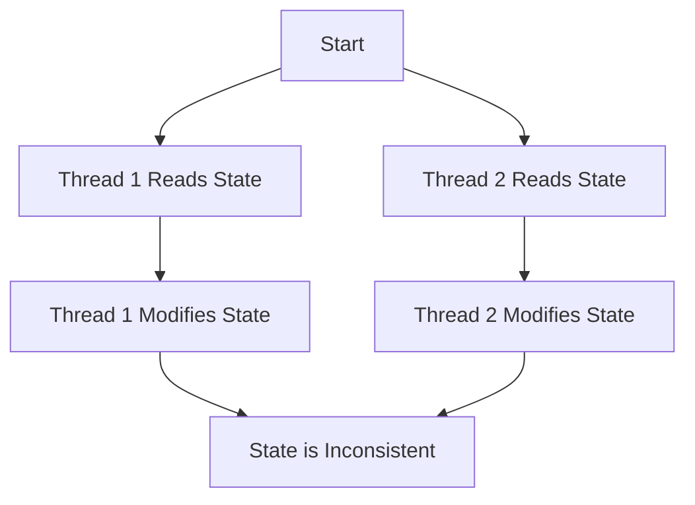

## 17.4 Mutable Shared State

In the world of concurrent programming, mutable shared state is often a source of complexity and bugs. In Kotlin, as in many other languages, managing mutable shared state requires careful consideration to avoid concurrency issues such as race conditions, deadlocks, and data inconsistency. In this section, we will delve into the intricacies of mutable shared state, explore the problems it can cause, and discuss strategies to mitigate these issues using Kotlin's features and best practices.

### Understanding Mutable Shared State

Mutable shared state refers to a situation where multiple threads or coroutines have access to a variable or object that can be modified. This can lead to unpredictable behavior if not managed correctly. Let's break down the key concepts:

- **Mutability**: The ability of an object or variable to be changed after it has been created. In Kotlin, variables declared with `var` are mutable, while those declared with `val` are immutable.
- **Shared State**: A piece of data that is accessible by multiple threads or coroutines. This can be a global variable, a static field, or any object passed between threads.

### The Risks of Mutable Shared State

Mutable shared state can lead to several concurrency issues:

1. **Race Conditions**: Occur when multiple threads or coroutines access and modify the same variable concurrently, leading to unpredictable results.

2. **Deadlocks**: Happen when two or more threads are waiting for each other to release resources, causing the program to hang indefinitely.

3. **Data Inconsistency**: Arises when the state of an object is modified by one thread while another thread is reading it, leading to inconsistent or incorrect data.

### Avoiding Concurrency Issues

To avoid these issues, we can employ several strategies:

#### Using Immutability

Immutability is one of the most effective ways to avoid concurrency issues. By ensuring that objects cannot be modified after they are created, we eliminate the possibility of race conditions and data inconsistency.

**Example: Using Immutable Data Classes**

```kotlin
data class User(val id: Int, val name: String)

fun main() {
    val user = User(1, "Alice")
    // user.name = "Bob" // Compilation error: Val cannot be reassigned
}
```

In the above example, the `User` data class is immutable because its properties are declared with `val`. Once an instance of `User` is created, its properties cannot be changed.

#### Leveraging Kotlin's Coroutines

Kotlin's coroutines provide a powerful way to handle concurrency without the pitfalls of traditional threading. By using structured concurrency and coroutine scopes, we can manage shared state more effectively.

**Example: Using Coroutines to Manage Shared State**

```kotlin
import kotlinx.coroutines.*

fun main() = runBlocking {
    val counter = Counter()
    val jobs = List(1000) {
        launch {
            repeat(1000) {
                counter.increment()
            }
        }
    }
    jobs.forEach { it.join() }
    println("Counter: ${counter.value}")
}

class Counter {
    private var _value = 0
    val value: Int
        get() = _value

    @Synchronized
    fun increment() {
        _value++
    }
}
```

In this example, we use a coroutine to increment a counter concurrently. The `@Synchronized` annotation ensures that only one coroutine can access the `increment` function at a time, preventing race conditions.

#### Using Atomic Variables

Kotlin provides atomic variables, which are thread-safe and can be used to manage shared state without locks.

**Example: Using Atomic Variables**

```kotlin
import java.util.concurrent.atomic.AtomicInteger

fun main() {
    val atomicCounter = AtomicInteger(0)
    val threads = List(1000) {
        Thread {
            repeat(1000) {
                atomicCounter.incrementAndGet()
            }
        }
    }
    threads.forEach { it.start() }
    threads.forEach { it.join() }
    println("Atomic Counter: ${atomicCounter.get()}")
}
```

In this example, we use an `AtomicInteger` to increment a counter concurrently. The `incrementAndGet` method is atomic, ensuring that the operation is thread-safe.

### Design Considerations

When dealing with mutable shared state, consider the following:

- **Minimize Shared State**: Reduce the amount of shared state in your application. The less shared state there is, the fewer opportunities for concurrency issues.
- **Prefer Immutability**: Use immutable data structures whenever possible. This eliminates the risk of data being modified by multiple threads.
- **Use Synchronization Primitives**: When mutable shared state is unavoidable, use synchronization primitives like locks, semaphores, or atomic variables to manage access.
- **Leverage Kotlin's Features**: Use Kotlin's coroutines and atomic variables to handle concurrency in a more controlled manner.

### Differences and Similarities with Other Patterns

Mutable shared state is often confused with other concurrency patterns, such as:

- **Observer Pattern**: While the observer pattern deals with notifying observers of state changes, mutable shared state focuses on managing the state itself.
- **Singleton Pattern**: The singleton pattern ensures a single instance of a class, which can lead to shared state if not managed carefully.

### Visualizing Mutable Shared State

To better understand how mutable shared state can lead to concurrency issues, let's visualize a simple scenario using a flowchart.



**Figure 1: Visualizing Mutable Shared State Concurrency Issues**

In this flowchart, both Thread 1 and Thread 2 read the same state and modify it concurrently, leading to an inconsistent state.

### Try It Yourself

Experiment with the code examples provided in this section. Try modifying the `Counter` class to use different synchronization techniques, such as locks or semaphores. Observe how these changes affect the program's behavior and performance.

### Knowledge Check

- What is mutable shared state, and why is it problematic in concurrent programming?
- How can immutability help prevent concurrency issues?
- What are some Kotlin features that can help manage mutable shared state?

### Embrace the Journey

Remember, managing mutable shared state is just one aspect of concurrent programming. As you continue to explore Kotlin's concurrency features, you'll discover more tools and techniques to build robust, efficient applications. Keep experimenting, stay curious, and enjoy the journey!

## Quiz Time!



### What is mutable shared state?

- [x] A variable or object accessible by multiple threads that can be modified.
- [ ] A variable that is only accessible by a single thread.
- [ ] An immutable object that cannot be changed after creation.
- [ ] A design pattern for managing state.

> **Explanation:** Mutable shared state refers to variables or objects that multiple threads can access and modify, leading to concurrency issues.

### How does immutability help prevent concurrency issues?

- [x] By ensuring objects cannot be modified after creation.
- [ ] By allowing multiple threads to modify the same object.
- [ ] By making all variables global.
- [ ] By using locks to synchronize access.

> **Explanation:** Immutability prevents concurrency issues by ensuring objects cannot be changed, eliminating race conditions and data inconsistency.

### Which Kotlin feature can help manage shared state without locks?

- [x] Atomic variables
- [ ] Global variables
- [ ] Static fields
- [ ] Singleton pattern

> **Explanation:** Atomic variables in Kotlin are thread-safe and can manage shared state without the need for locks.

### What is a race condition?

- [x] A situation where multiple threads access and modify the same variable concurrently.
- [ ] A condition where a program runs faster than expected.
- [ ] A state where only one thread can access a variable.
- [ ] A design pattern for managing concurrency.

> **Explanation:** A race condition occurs when multiple threads access and modify the same variable concurrently, leading to unpredictable results.

### What is the purpose of the `@Synchronized` annotation in Kotlin?

- [x] To ensure only one coroutine can access a function at a time.
- [ ] To make a variable immutable.
- [ ] To create a new thread.
- [ ] To declare a variable as global.

> **Explanation:** The `@Synchronized` annotation ensures that only one coroutine or thread can access a function at a time, preventing race conditions.

### What is the primary benefit of using coroutines in Kotlin?

- [x] Managing concurrency without traditional threading pitfalls.
- [ ] Making all variables mutable.
- [ ] Increasing the number of threads.
- [ ] Decreasing the program's performance.

> **Explanation:** Coroutines in Kotlin allow for managing concurrency without the pitfalls of traditional threading, such as race conditions and deadlocks.

### Which of the following is a synchronization primitive?

- [x] Semaphore
- [ ] Global variable
- [ ] Immutable object
- [ ] Static field

> **Explanation:** A semaphore is a synchronization primitive used to manage access to shared resources in concurrent programming.

### What is a deadlock?

- [x] A situation where two or more threads wait for each other to release resources, causing a hang.
- [ ] A condition where a program runs faster than expected.
- [ ] A state where only one thread can access a variable.
- [ ] A design pattern for managing concurrency.

> **Explanation:** A deadlock occurs when two or more threads wait for each other to release resources, causing the program to hang indefinitely.

### How can you minimize shared state in your application?

- [x] By reducing the amount of global or static variables.
- [ ] By making all variables mutable.
- [ ] By using more threads.
- [ ] By ignoring synchronization.

> **Explanation:** Minimizing shared state involves reducing the amount of global or static variables, which decreases opportunities for concurrency issues.

### True or False: The Singleton pattern always leads to shared state.

- [ ] True
- [x] False

> **Explanation:** While the Singleton pattern can lead to shared state if not managed carefully, it does not inherently cause shared state issues.


