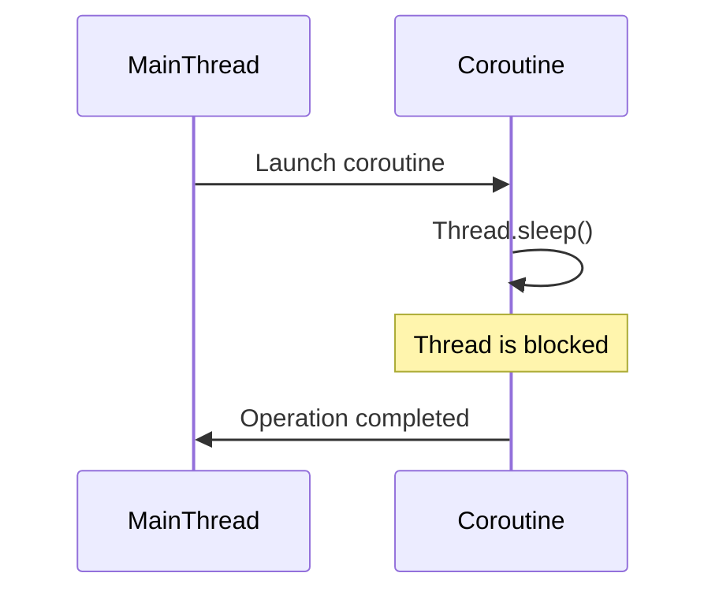
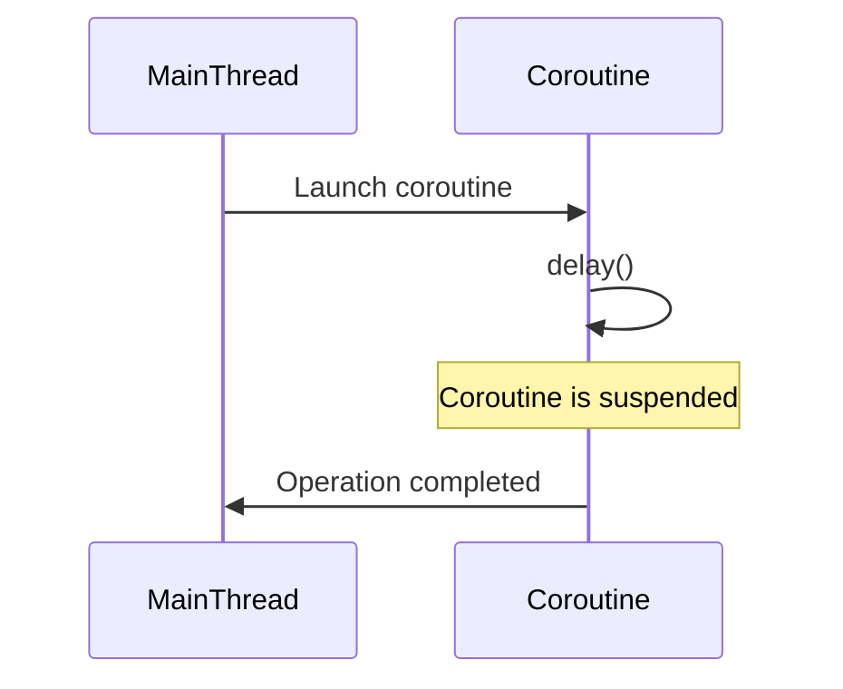

## 17.5 Poor Use of Coroutines

Kotlin coroutines provide a powerful way to handle asynchronous programming, offering a more readable and maintainable alternative to traditional threading models. However, improper use of coroutines can lead to performance issues, resource leaks, and unexpected behavior. In this section, we will explore common pitfalls in coroutine usage, focusing on improper thread blocking and the overuse of `GlobalScope`. We will provide insights into best practices, backed by code examples, diagrams, and practical advice to help you avoid these anti-patterns.

### Understanding Coroutines

Before diving into the pitfalls, let's briefly revisit what coroutines are. Coroutines are a concurrency design pattern that you can use on the JVM to simplify code that executes asynchronously. They are lightweight, meaning you can run thousands of them without significant overhead, unlike traditional threads.

#### Key Features of Coroutines

- **Lightweight**: Coroutines are not bound to any particular thread. They can be suspended and resumed, allowing efficient use of resources.
- **Structured Concurrency**: Coroutines provide a structured way to manage concurrency, ensuring that tasks are completed and resources are released properly.
- **Suspend Functions**: Functions that can be paused and resumed later, allowing non-blocking code execution.

### Common Pitfalls in Coroutine Usage

#### 1. Blocking Threads Improperly

One of the primary benefits of coroutines is their ability to perform asynchronous operations without blocking threads. However, improper use can lead to blocking, negating the advantages of coroutines.

##### Example of Blocking a Thread

Consider the following example, where a coroutine is used to perform a long-running operation:

```kotlin
import kotlinx.coroutines.*

fun main() = runBlocking {
    launch {
        performLongRunningOperation()
    }
}

suspend fun performLongRunningOperation() {
    // Simulate a long-running operation
    Thread.sleep(5000) // This blocks the thread!
    println("Operation completed")
}
```

In this example, `Thread.sleep(5000)` is used within a coroutine, which blocks the thread for 5 seconds. This defeats the purpose of using coroutines, as it prevents other coroutines from running on the same thread.

##### Solution: Use Delay Instead of Sleep

To avoid blocking, use `delay()` instead of `Thread.sleep()`:

```kotlin
import kotlinx.coroutines.*

fun main() = runBlocking {
    launch {
        performLongRunningOperation()
    }
}

suspend fun performLongRunningOperation() {
    // Simulate a long-running operation
    delay(5000) // This does not block the thread
    println("Operation completed")
}
```

By using `delay()`, the coroutine is suspended, allowing other coroutines to run on the same thread.

#### 2. Overusing GlobalScope

`GlobalScope` is a coroutine scope that is not tied to any lifecycle. While it might seem convenient, overusing it can lead to resource leaks and uncontrolled coroutine execution.

##### Example of Overusing GlobalScope

```kotlin
import kotlinx.coroutines.*

fun main() {
    GlobalScope.launch {
        // Perform some work
        println("Running in GlobalScope")
    }
    // Main thread continues without waiting for the coroutine
    println("Main thread continues")
    Thread.sleep(1000) // Wait for the coroutine to finish
}
```

In this example, the coroutine runs in `GlobalScope`, which means it is not bound to the lifecycle of the application. If the main thread finishes before the coroutine, it can lead to unexpected behavior.

##### Solution: Use Structured Concurrency

Instead of `GlobalScope`, use structured concurrency with `runBlocking`, `coroutineScope`, or `supervisorScope`:

```kotlin
import kotlinx.coroutines.*

fun main() = runBlocking {
    launch {
        // Perform some work
        println("Running in structured concurrency")
    }
    println("Main thread continues")
}
```

By using `runBlocking`, the coroutine is tied to the lifecycle of the main function, ensuring proper execution and resource management.

### Visualizing Coroutine Pitfalls

To better understand the flow of coroutine execution and the impact of improper usage, let's visualize the process using Mermaid.js diagrams.

#### Diagram: Blocking Threads with Coroutines



In this diagram, we see how `Thread.sleep()` blocks the coroutine, preventing other tasks from executing.

#### Diagram: Proper Use of Delay



Here, `delay()` suspends the coroutine, allowing other tasks to run, demonstrating proper coroutine usage.

### Best Practices for Coroutine Usage

To avoid common pitfalls, follow these best practices:

#### 1. Prefer Structured Concurrency

Always prefer structured concurrency over `GlobalScope`. Use `coroutineScope`, `runBlocking`, or `supervisorScope` to manage coroutines within a defined lifecycle.

#### 2. Avoid Blocking Calls

Replace blocking calls like `Thread.sleep()` with suspending functions like `delay()`. This ensures that coroutines remain non-blocking and efficient.

#### 3. Handle Exceptions Properly

Coroutines can fail, and it's crucial to handle exceptions properly. Use `try-catch` blocks or `CoroutineExceptionHandler` to manage errors gracefully.

```kotlin
import kotlinx.coroutines.*

fun main() = runBlocking {
    val handler = CoroutineExceptionHandler { _, exception ->
        println("Caught $exception")
    }

    launch(handler) {
        throw RuntimeException("Test exception")
    }
}
```

#### 4. Use Coroutine Contexts Wisely

Understand and use coroutine contexts to control execution, such as `Dispatchers.IO` for I/O operations and `Dispatchers.Default` for CPU-intensive tasks.

```kotlin
import kotlinx.coroutines.*

fun main() = runBlocking {
    launch(Dispatchers.IO) {
        // Perform I/O operations
    }
    launch(Dispatchers.Default) {
        // Perform CPU-intensive operations
    }
}
```

### Try It Yourself

Experiment with the provided code examples by modifying them:

- Replace `delay()` with `Thread.sleep()` and observe the impact on execution.
- Use `GlobalScope` in a coroutine and see how it affects the lifecycle.
- Implement error handling in coroutines and test with different exceptions.

### Knowledge Check

To reinforce your understanding, consider these questions:

- What is the impact of using `Thread.sleep()` in a coroutine?
- Why is `GlobalScope` considered an anti-pattern in coroutine usage?
- How can structured concurrency improve coroutine management?

### Conclusion

Avoiding common pitfalls in coroutine usage is crucial for building efficient and maintainable Kotlin applications. By understanding the impact of blocking calls and the overuse of `GlobalScope`, you can leverage coroutines effectively, ensuring optimal performance and resource management. Remember, this is just the beginning. As you progress, you'll build more complex and interactive applications. Keep experimenting, stay curious, and enjoy the journey!

## Quiz Time!



### What is the primary benefit of using coroutines in Kotlin?

- [x] They provide a more readable and maintainable way to handle asynchronous programming.
- [ ] They are faster than traditional threads.
- [ ] They are easier to debug.
- [ ] They automatically handle all exceptions.

> **Explanation:** Coroutines offer a more readable and maintainable approach to asynchronous programming by allowing code to be written sequentially while being executed asynchronously.

### What is a common pitfall when using coroutines?

- [x] Blocking threads improperly.
- [ ] Using too many coroutines.
- [ ] Not using enough coroutines.
- [ ] Avoiding structured concurrency.

> **Explanation:** Blocking threads improperly is a common pitfall that negates the benefits of using coroutines, as it prevents other coroutines from executing.

### Why is `GlobalScope` considered an anti-pattern?

- [x] It is not tied to any lifecycle, leading to potential resource leaks.
- [ ] It is too slow for most applications.
- [ ] It requires too much memory.
- [ ] It is difficult to implement.

> **Explanation:** `GlobalScope` is not tied to any lifecycle, which can lead to resource leaks and uncontrolled coroutine execution.

### What should you use instead of `Thread.sleep()` in a coroutine?

- [x] `delay()`
- [ ] `wait()`
- [ ] `pause()`
- [ ] `suspend()`

> **Explanation:** `delay()` is a suspending function that does not block the thread, allowing other coroutines to run.

### What is the purpose of structured concurrency?

- [x] To manage coroutines within a defined lifecycle.
- [ ] To increase the speed of coroutines.
- [ ] To reduce memory usage.
- [ ] To simplify error handling.

> **Explanation:** Structured concurrency helps manage coroutines within a defined lifecycle, ensuring proper execution and resource management.

### How can you handle exceptions in coroutines?

- [x] Use `try-catch` blocks or `CoroutineExceptionHandler`.
- [ ] Ignore them.
- [ ] Use `throw` statements.
- [ ] Use `catch` statements only.

> **Explanation:** Exceptions in coroutines can be handled using `try-catch` blocks or `CoroutineExceptionHandler` to manage errors gracefully.

### Which dispatcher should you use for I/O operations?

- [x] `Dispatchers.IO`
- [ ] `Dispatchers.Default`
- [ ] `Dispatchers.Main`
- [ ] `Dispatchers.Unconfined`

> **Explanation:** `Dispatchers.IO` is optimized for I/O operations, providing a pool of threads for blocking I/O tasks.

### What is a benefit of using `runBlocking`?

- [x] It ties the coroutine to the lifecycle of the main function.
- [ ] It makes the coroutine run faster.
- [ ] It reduces memory usage.
- [ ] It simplifies the code.

> **Explanation:** `runBlocking` ties the coroutine to the lifecycle of the main function, ensuring proper execution and resource management.

### What is the impact of using `delay()` in a coroutine?

- [x] It suspends the coroutine, allowing other tasks to run.
- [ ] It blocks the thread.
- [ ] It speeds up the coroutine.
- [ ] It stops the coroutine.

> **Explanation:** `delay()` suspends the coroutine, allowing other tasks to run on the same thread, demonstrating proper coroutine usage.

### True or False: Coroutines are bound to a specific thread.

- [ ] True
- [x] False

> **Explanation:** Coroutines are not bound to any particular thread. They can be suspended and resumed, allowing efficient use of resources.


