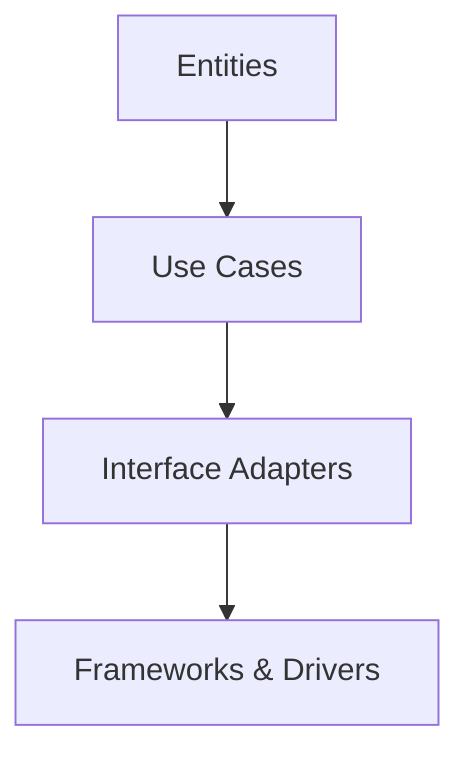

## 17.6 Neglecting Clean Architecture

In the realm of software development, architecture plays a pivotal role in determining the maintainability, scalability, and overall quality of an application. Clean Architecture, a concept popularized by Robert C. Martin (Uncle Bob), is a design philosophy that emphasizes the separation of concerns and the independence of business logic from external factors such as databases, frameworks, and user interfaces. In this section, we will delve into the consequences of neglecting clean architecture in Kotlin development, explore common pitfalls such as mixing concerns and tight coupling, and provide strategies to implement clean architecture principles effectively.

### Understanding Clean Architecture

Before we discuss the pitfalls of neglecting clean architecture, it's essential to understand its core principles. Clean Architecture is characterized by the following key concepts:

1. **Separation of Concerns**: Different aspects of the application should be isolated from each other. This means that business logic, user interface, and data access should not be intertwined.

2. **Independence of Frameworks**: The architecture should not be dependent on any specific framework. Frameworks are tools that can be replaced without affecting the core business logic.

3. **Testability**: The architecture should facilitate easy testing of business rules without the need for external dependencies.

4. **Independence of UI**: The user interface should be a detail that can change without affecting the business logic.

5. **Independence of Database**: The database should be a detail that can change without affecting the business logic.

6. **Independence of External Agencies**: External systems, such as web services, should be replaceable without affecting the core business logic.

### The Consequences of Neglecting Clean Architecture

Neglecting clean architecture can lead to several issues that affect the long-term health of a software project:

- **Tight Coupling**: When components of an application are tightly coupled, changes in one part of the system can have a ripple effect, requiring changes in other parts. This makes the system fragile and difficult to maintain.

- **Mixing Concerns**: When concerns are not separated, the code becomes difficult to understand and modify. Business logic gets entangled with UI and data access code, leading to a monolithic structure that is hard to test and extend.

- **Difficult Testing**: Without clear separation, testing becomes challenging. Tests may require setting up complex environments, and changes in one area can break tests in another.

- **Reduced Flexibility**: A tightly coupled system is less flexible. It becomes challenging to replace or upgrade components, such as switching databases or frameworks, without significant rewrites.

- **Increased Technical Debt**: Neglecting clean architecture often leads to increased technical debt, where shortcuts taken today lead to more significant problems in the future.

### Key Concepts of Clean Architecture

To effectively implement clean architecture in Kotlin, it's crucial to understand its key components and how they interact. The architecture is typically represented as a series of concentric circles, with each circle representing a different layer of the application.

#### 1. Entities

Entities encapsulate the core business logic of the application. They are the most stable components and should be independent of any external factors. Entities represent the business rules and can be reused across different applications.

#### 2. Use Cases (Interactors)

Use cases define the application-specific business rules. They orchestrate the flow of data to and from the entities and direct the application to use the entities to achieve a specific goal. Use cases are where the business logic is implemented.

#### 3. Interface Adapters

Interface adapters convert data from the format most convenient for the use cases and entities to the format most convenient for external agencies such as databases and the web. This layer is responsible for transforming data and ensuring that the core application logic remains unaffected by changes in the external world.

#### 4. Frameworks and Drivers

This is the outermost layer, which includes frameworks and tools such as databases, web frameworks, and user interfaces. This layer is where the details reside, and it is the most volatile part of the application. Changes in this layer should not affect the core business logic.

### Implementing Clean Architecture in Kotlin

Implementing clean architecture in Kotlin involves adhering to the principles outlined above and leveraging Kotlin's language features to facilitate clean design. Let's explore some strategies and code examples to achieve this.

#### Separation of Concerns

To achieve separation of concerns, we can organize our Kotlin project into distinct modules or packages, each responsible for a specific aspect of the application. For example, we can have separate modules for entities, use cases, interface adapters, and frameworks.

```kotlin
// Entity
data class User(val id: Int, val name: String)

// Use Case
class GetUserUseCase(private val userRepository: UserRepository) {
    fun execute(userId: Int): User? {
        return userRepository.getUserById(userId)
    }
}

// Interface Adapter
class UserController(private val getUserUseCase: GetUserUseCase) {
    fun getUser(userId: Int): User? {
        return getUserUseCase.execute(userId)
    }
}

// Framework (e.g., Database)
class UserRepositoryImpl : UserRepository {
    override fun getUserById(userId: Int): User? {
        // Database access logic
    }
}
```

In this example, we have a clear separation between the entity (`User`), the use case (`GetUserUseCase`), the interface adapter (`UserController`), and the framework (`UserRepositoryImpl`). Each component has a distinct responsibility, making the code easier to understand, test, and maintain.

#### Independence of Frameworks

To ensure independence from frameworks, we can use dependency inversion and interfaces to decouple our application logic from specific implementations. In Kotlin, we can leverage interfaces and dependency injection to achieve this.

```kotlin
// Interface for UserRepository
interface UserRepository {
    fun getUserById(userId: Int): User?
}

// Dependency Injection
class UserModule {
    private val userRepository: UserRepository = UserRepositoryImpl()

    fun provideGetUserUseCase(): GetUserUseCase {
        return GetUserUseCase(userRepository)
    }
}
```

By defining an interface (`UserRepository`) and using dependency injection (`UserModule`), we can easily swap out the implementation of the repository without affecting the rest of the application. This allows us to replace the database or framework with minimal impact on the core business logic.

#### Testability

Clean architecture promotes testability by isolating business logic from external dependencies. In Kotlin, we can use mock objects and dependency injection to test our use cases independently.

```kotlin
// Mock UserRepository
class MockUserRepository : UserRepository {
    private val users = listOf(User(1, "Alice"), User(2, "Bob"))

    override fun getUserById(userId: Int): User? {
        return users.find { it.id == userId }
    }
}

// Unit Test
class GetUserUseCaseTest {
    private val userRepository = MockUserRepository()
    private val getUserUseCase = GetUserUseCase(userRepository)

    @Test
    fun `should return user when user exists`() {
        val user = getUserUseCase.execute(1)
        assertNotNull(user)
        assertEquals("Alice", user?.name)
    }

    @Test
    fun `should return null when user does not exist`() {
        val user = getUserUseCase.execute(3)
        assertNull(user)
    }
}
```

In this example, we use a mock implementation of `UserRepository` to test the `GetUserUseCase`. This allows us to test the business logic in isolation, without relying on external systems such as databases.

### Visualizing Clean Architecture

To better understand the structure of clean architecture, let's visualize it using a Mermaid.js diagram. This diagram illustrates the concentric circles representing the different layers of the architecture.



**Diagram Description**: This diagram represents the layers of clean architecture. The `Entities` layer is at the core, followed by `Use Cases`, `Interface Adapters`, and `Frameworks & Drivers`. Each layer depends on the inner layers, ensuring that the core business logic remains independent of external factors.

### Common Pitfalls in Neglecting Clean Architecture

Despite the benefits of clean architecture, it's not uncommon for developers to neglect its principles, leading to several pitfalls:

#### 1. Mixing Concerns

Mixing concerns occurs when different aspects of the application, such as business logic, UI, and data access, are intertwined. This results in code that is difficult to understand and maintain.

**Example of Mixing Concerns**:

```kotlin
class UserActivity : AppCompatActivity() {
    private val userRepository = UserRepositoryImpl()

    override fun onCreate(savedInstanceState: Bundle?) {
        super.onCreate(savedInstanceState)
        setContentView(R.layout.activity_user)

        val userId = intent.getIntExtra("USER_ID", -1)
        val user = userRepository.getUserById(userId)

        if (user != null) {
            // Update UI with user data
        } else {
            // Show error message
        }
    }
}
```

In this example, the `UserActivity` class is responsible for both UI logic and data access, violating the separation of concerns principle. This makes the code harder to test and maintain.

**Solution**: Separate the concerns by moving the data access logic to a use case or repository and keeping the UI logic in the activity.

#### 2. Tight Coupling

Tight coupling occurs when components of the system are heavily dependent on each other. This makes it difficult to change one component without affecting others.

**Example of Tight Coupling**:

```kotlin
class UserService(private val userRepository: UserRepositoryImpl) {
    fun getUser(userId: Int): User? {
        return userRepository.getUserById(userId)
    }
}
```

In this example, the `UserService` class is tightly coupled to the `UserRepositoryImpl` class, making it difficult to replace the repository implementation.

**Solution**: Use interfaces and dependency injection to decouple components.

```kotlin
class UserService(private val userRepository: UserRepository) {
    fun getUser(userId: Int): User? {
        return userRepository.getUserById(userId)
    }
}
```

By using an interface (`UserRepository`), we can easily swap out the implementation without affecting the `UserService` class.

### Strategies for Implementing Clean Architecture

To effectively implement clean architecture in Kotlin, consider the following strategies:

#### 1. Modularize Your Code

Organize your code into distinct modules or packages, each responsible for a specific aspect of the application. This promotes separation of concerns and makes the codebase easier to navigate and maintain.

#### 2. Use Interfaces for Abstraction

Use interfaces to abstract dependencies and decouple components. This allows for easy replacement of implementations and promotes testability.

#### 3. Leverage Dependency Injection

Use dependency injection frameworks, such as Koin or Dagger, to manage dependencies and promote loose coupling. This makes it easier to swap out implementations and test components in isolation.

#### 4. Write Tests for Business Logic

Focus on writing tests for the core business logic, independent of external dependencies. This ensures that the business rules are correct and makes it easier to refactor the code.

#### 5. Keep Frameworks at the Periphery

Keep frameworks and external dependencies at the outer layers of the architecture. This ensures that changes in these components do not affect the core business logic.

### Try It Yourself

To better understand the principles of clean architecture, try refactoring an existing Kotlin project to adhere to clean architecture principles. Start by identifying areas where concerns are mixed or components are tightly coupled. Then, apply the strategies discussed in this section to separate concerns, decouple components, and improve testability.

### Conclusion

Neglecting clean architecture can lead to several issues, including tight coupling, mixing concerns, and increased technical debt. By understanding and implementing clean architecture principles, we can create maintainable, scalable, and testable applications. Remember, the journey to clean architecture is an ongoing process, and continuous refactoring and improvement are key to achieving a clean and robust codebase.

## Quiz Time!



### What is a key principle of clean architecture?

- [x] Separation of concerns
- [ ] Tight coupling
- [ ] Mixing concerns
- [ ] Framework dependency

> **Explanation:** Clean architecture emphasizes the separation of concerns to ensure that different aspects of the application are isolated from each other.

### What is the role of entities in clean architecture?

- [x] Encapsulate core business logic
- [ ] Define application-specific business rules
- [ ] Convert data formats
- [ ] Manage external frameworks

> **Explanation:** Entities represent the core business logic and are independent of external factors.

### How does clean architecture promote testability?

- [x] By isolating business logic from external dependencies
- [ ] By tightly coupling components
- [ ] By mixing concerns
- [ ] By depending on frameworks

> **Explanation:** Clean architecture isolates business logic, making it easier to test without relying on external systems.

### What is a common pitfall of neglecting clean architecture?

- [x] Tight coupling
- [ ] Independence of frameworks
- [ ] Testability
- [ ] Separation of concerns

> **Explanation:** Tight coupling is a common issue when clean architecture principles are neglected, making the system fragile and difficult to maintain.

### How can we achieve independence from frameworks in clean architecture?

- [x] Use interfaces and dependency injection
- [ ] Mix concerns
- [ ] Use tight coupling
- [ ] Depend on specific implementations

> **Explanation:** Interfaces and dependency injection help decouple components from specific frameworks, promoting independence.

### What is the purpose of interface adapters in clean architecture?

- [x] Convert data formats for use cases and entities
- [ ] Encapsulate core business logic
- [ ] Define application-specific business rules
- [ ] Manage external frameworks

> **Explanation:** Interface adapters transform data between formats convenient for use cases/entities and external systems.

### How can we decouple components in a Kotlin application?

- [x] Use interfaces and dependency injection
- [ ] Mix concerns
- [ ] Use tight coupling
- [ ] Depend on specific implementations

> **Explanation:** Interfaces and dependency injection promote loose coupling, allowing components to be easily replaced.

### What is a benefit of modularizing code in clean architecture?

- [x] Promotes separation of concerns
- [ ] Increases tight coupling
- [ ] Mixes concerns
- [ ] Depends on frameworks

> **Explanation:** Modularizing code helps separate concerns, making the codebase easier to navigate and maintain.

### What is the outermost layer in clean architecture?

- [x] Frameworks & Drivers
- [ ] Entities
- [ ] Use Cases
- [ ] Interface Adapters

> **Explanation:** Frameworks & Drivers are the outermost layer, containing external dependencies and tools.

### True or False: Clean architecture allows for easy replacement of components.

- [x] True
- [ ] False

> **Explanation:** Clean architecture promotes loose coupling and separation of concerns, allowing components to be easily replaced.


