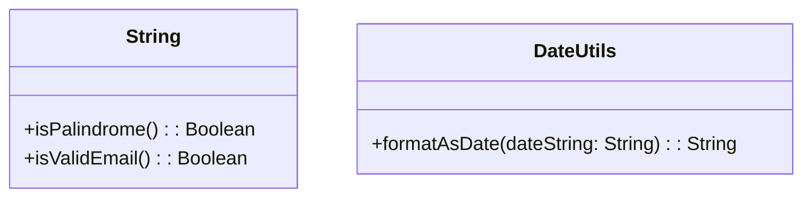

## 17.7 Avoiding Extension Function Abuse

Extension functions are one of Kotlin's most powerful features, allowing developers to add new functionality to existing classes without modifying their source code. However, with great power comes great responsibility. Misusing extension functions can lead to code that is difficult to maintain, understand, and debug. In this section, we will explore best practices for using extension functions effectively, understand when to use them versus utility classes, and identify common pitfalls to avoid.

### Understanding Extension Functions

Before diving into the potential pitfalls of extension functions, let's ensure we have a solid understanding of what they are and how they work.

**Definition**: An extension function allows you to add new functions to existing classes without altering their code. This is particularly useful when you want to add utility functions to classes that you do not own or cannot modify.

**Syntax**: The syntax for defining an extension function is straightforward. You prefix the function name with the type you want to extend.

```kotlin
fun String.isPalindrome(): Boolean {
    return this == this.reversed()
}
```

In this example, we have added a `isPalindrome` function to the `String` class, allowing us to call it on any string instance.

### Benefits of Extension Functions

Extension functions provide several benefits that make them a popular choice among Kotlin developers:

- **Improved Readability**: They allow you to write more readable and expressive code by extending existing classes with new functionality.
- **Encapsulation**: You can encapsulate utility functions related to a specific class within that class's context, improving code organization.
- **Interoperability**: They enable you to extend classes from third-party libraries or Java classes without modifying their source code.

### When to Use Extension Functions

While extension functions are powerful, they are not always the best solution. Here are some guidelines on when to use them:

- **Utility Functions**: Use extension functions for utility functions that logically belong to a specific class but are not part of its core functionality.
- **Domain-Specific Enhancements**: When you need to add domain-specific behavior to a class, extension functions can be a clean way to do so.
- **Readability and Expressiveness**: If an extension function makes your code more readable and expressive, it is likely a good candidate.

### Avoiding Common Pitfalls

While extension functions are a valuable tool, they can be misused in ways that lead to maintenance challenges. Let's explore some common pitfalls and how to avoid them.

#### 1. Overusing Extension Functions

**Problem**: Overusing extension functions can lead to a cluttered codebase where functionality is scattered across numerous extensions, making it difficult to find and maintain.

**Solution**: Use extension functions judiciously. Reserve them for cases where they genuinely improve readability or encapsulate utility functions that logically belong to a class.

#### 2. Violating Encapsulation

**Problem**: Extension functions can access public members of a class, but they do not have access to private or protected members. This can lead to violations of encapsulation if not used carefully.

**Solution**: Ensure that extension functions do not rely on internal state or private members of the class they extend. They should operate only on the public API of the class.

#### 3. Name Conflicts

**Problem**: Extension functions can lead to name conflicts, especially when multiple extensions with the same name are imported into a file.

**Solution**: Use unique and descriptive names for your extension functions to minimize the risk of conflicts. Consider using namespaces or packages to organize them.

#### 4. Misleading Behavior

**Problem**: Extension functions can sometimes lead to misleading behavior if they are not intuitive or if they change the expected behavior of a class.

**Solution**: Ensure that extension functions are intuitive and do not alter the expected behavior of the class. They should enhance the class's functionality without introducing surprises.

### Extension Functions vs. Utility Classes

A common question is when to use extension functions versus utility classes. Let's explore the differences and when each is appropriate.

#### Extension Functions

- **Pros**:
  - Improve readability by allowing you to call functions directly on instances of the class.
  - Encapsulate utility functions within the context of the class they extend.

- **Cons**:
  - Can lead to clutter if overused.
  - Limited to public API of the class.

#### Utility Classes

- **Pros**:
  - Centralize utility functions in one place, making them easier to find and maintain.
  - Can access private and protected members if they are part of the same package.

- **Cons**:
  - Can lead to less readable code if overused, as they require static method calls.

### Code Examples and Best Practices

Let's explore some code examples to illustrate best practices for using extension functions.

#### Example 1: Utility Function as an Extension

Consider a utility function that checks if a string is a valid email address. This function logically belongs to the `String` class, making it a good candidate for an extension function.

```kotlin
fun String.isValidEmail(): Boolean {
    return this.contains("@") && this.contains(".")
}

// Usage
val email = "example@example.com"
println(email.isValidEmail()) // Output: true
```

#### Example 2: Avoiding Overuse

Avoid overusing extension functions for functionality that does not logically belong to the class. For example, a function that formats a date string should not be an extension of the `String` class.

```kotlin
// Instead of this:
fun String.formatAsDate(): String {
    // Date formatting logic
}

// Use a utility class:
object DateUtils {
    fun formatAsDate(dateString: String): String {
        // Date formatting logic
    }
}

// Usage
val dateString = "2024-11-17"
println(DateUtils.formatAsDate(dateString))
```

#### Example 3: Avoiding Name Conflicts

To avoid name conflicts, use unique names for your extension functions and organize them using packages.

```kotlin
// In file StringExtensions.kt
package com.example.extensions

fun String.isPalindrome(): Boolean {
    return this == this.reversed()
}

// In another file
import com.example.extensions.isPalindrome

val word = "racecar"
println(word.isPalindrome()) // Output: true
```

### Visualizing Extension Function Usage

To better understand when and how to use extension functions, let's visualize their usage in a class diagram.



This diagram shows how extension functions can be used to enhance the `String` class with additional functionality, while utility functions that do not logically belong to the class are placed in a separate utility class.

### Try It Yourself

To reinforce your understanding, try modifying the code examples above. For instance, create an extension function for the `List` class that calculates the average of a list of numbers. Experiment with different names and see how they affect readability and maintainability.

### References and Further Reading

For more information on extension functions and best practices, consider exploring the following resources:

- [Kotlin Documentation on Extension Functions](https://kotlinlang.org/docs/extensions.html)
- [Effective Kotlin: Best Practices](https://www.amazon.com/Effective-Kotlin-Best-practices-ebook/dp/B08K3J8T1F)
- [Kotlin in Action](https://www.manning.com/books/kotlin-in-action)

### Knowledge Check

To test your understanding, consider the following questions:

- What are the benefits of using extension functions in Kotlin?
- When should you avoid using extension functions?
- How can you prevent name conflicts with extension functions?
- What are the differences between extension functions and utility classes?

### Embrace the Journey

Remember, mastering extension functions is just one step in your Kotlin journey. As you continue to explore Kotlin's features, you'll find new ways to write clean, maintainable, and expressive code. Keep experimenting, stay curious, and enjoy the journey!

### Quiz Time!



### What is a primary benefit of using extension functions in Kotlin?

- [x] They allow adding functionality to existing classes without modifying their source code.
- [ ] They provide access to private members of a class.
- [ ] They automatically improve performance.
- [ ] They replace the need for utility classes.

> **Explanation:** Extension functions allow you to add new functionality to existing classes without altering their source code, which is particularly useful for classes you do not own or cannot modify.

### When should you avoid using extension functions?

- [x] When the functionality does not logically belong to the class.
- [ ] When you want to improve code readability.
- [ ] When you need to encapsulate utility functions.
- [ ] When you want to extend a third-party library.

> **Explanation:** Avoid using extension functions for functionality that does not logically belong to the class, as this can lead to clutter and maintenance challenges.

### How can you prevent name conflicts with extension functions?

- [x] Use unique and descriptive names for your extension functions.
- [ ] Avoid using extension functions altogether.
- [ ] Use the same name for all extension functions.
- [ ] Only use extension functions in private classes.

> **Explanation:** Using unique and descriptive names for your extension functions helps minimize the risk of name conflicts, especially when multiple extensions are imported into a file.

### What is a disadvantage of using utility classes over extension functions?

- [x] They require static method calls, which can lead to less readable code.
- [ ] They cannot access private members of a class.
- [ ] They are not organized.
- [ ] They improve code readability.

> **Explanation:** Utility classes require static method calls, which can make the code less readable compared to calling functions directly on instances of a class using extension functions.

### What is a common pitfall of overusing extension functions?

- [x] It can lead to a cluttered codebase with scattered functionality.
- [ ] It automatically improves performance.
- [ ] It simplifies code organization.
- [ ] It ensures encapsulation.

> **Explanation:** Overusing extension functions can lead to a cluttered codebase where functionality is scattered across numerous extensions, making it difficult to find and maintain.

### Which of the following is a best practice for using extension functions?

- [x] Ensure they do not rely on internal state or private members of the class.
- [ ] Use them to access private members of a class.
- [ ] Use them for all utility functions.
- [ ] Avoid using them for domain-specific enhancements.

> **Explanation:** Extension functions should not rely on internal state or private members of the class they extend. They should operate only on the public API of the class.

### What is a key difference between extension functions and utility classes?

- [x] Extension functions improve readability by allowing you to call functions directly on instances of the class.
- [ ] Utility classes can access private members of a class.
- [ ] Extension functions are always faster than utility classes.
- [ ] Utility classes are specific to Kotlin.

> **Explanation:** Extension functions improve readability by allowing you to call functions directly on instances of the class, whereas utility classes require static method calls.

### How can you organize extension functions to avoid clutter?

- [x] Use namespaces or packages to organize them.
- [ ] Place all extension functions in a single file.
- [ ] Avoid using extension functions.
- [ ] Use the same name for all extension functions.

> **Explanation:** Organizing extension functions using namespaces or packages helps avoid clutter and makes them easier to manage.

### What should you consider when naming extension functions?

- [x] Use unique and descriptive names to minimize conflicts.
- [ ] Use the same name for all extension functions.
- [ ] Avoid using descriptive names.
- [ ] Only use single-letter names.

> **Explanation:** Using unique and descriptive names for your extension functions helps minimize the risk of name conflicts and improves code readability.

### True or False: Extension functions can access private members of the class they extend.

- [x] False
- [ ] True

> **Explanation:** Extension functions cannot access private members of the class they extend. They can only access the public API of the class.


