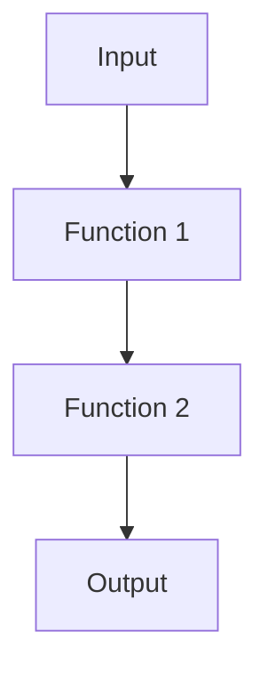
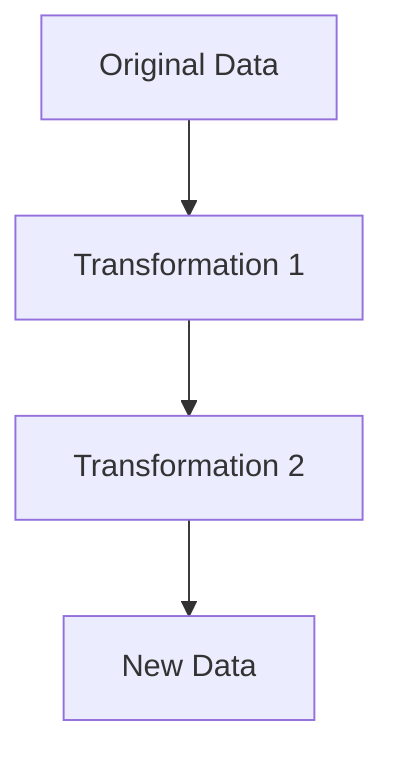

## 17.8 Functional Coding Pitfalls

Functional programming (FP) is a powerful paradigm that emphasizes immutability, first-class functions, and declarative code. However, when applied incorrectly, it can lead to code that is difficult to understand, maintain, and optimize. In this section, we will explore common pitfalls in functional programming with Kotlin, focusing on misunderstandings of functional concepts and the tendency to overcomplicate simple tasks.

### Understanding Functional Programming in Kotlin

Before diving into the pitfalls, let's briefly revisit what functional programming entails in the context of Kotlin. Kotlin is a statically typed language that supports both object-oriented and functional programming paradigms. It provides features like higher-order functions, lambdas, immutability, and more, making it a suitable choice for functional programming.

#### Key Concepts in Functional Programming

1. **Immutability**: Data should not be modified after it is created. Instead, new data structures are created with the desired changes.
2. **First-Class Functions**: Functions are treated as first-class citizens, meaning they can be passed as arguments, returned from other functions, and assigned to variables.
3. **Pure Functions**: Functions that always produce the same output for the same input and have no side effects.
4. **Higher-Order Functions**: Functions that take other functions as parameters or return them as results.
5. **Function Composition**: Combining simple functions to build more complex ones.

### Common Pitfalls in Functional Programming

Despite its advantages, functional programming can lead to pitfalls if not properly understood or applied. Let's explore some of these pitfalls in detail.

#### Misunderstanding Functional Concepts

Functional programming introduces several concepts that may be unfamiliar to developers accustomed to imperative or object-oriented paradigms. Misunderstanding these concepts can lead to inefficient or incorrect implementations.

##### Immutability Misconceptions

One common misconception is that immutability means never changing data. While immutability encourages creating new data structures rather than modifying existing ones, it does not mean avoiding state changes altogether. Instead, it promotes managing state changes in a controlled and predictable manner.

**Example: Inefficient Use of Immutability**

```kotlin
// Inefficient: Creating a new list for each element
val numbers = listOf(1, 2, 3, 4, 5)
val doubledNumbers = numbers.map { it * 2 }
```

In the example above, the `map` function creates a new list, which is fine for small datasets but can become inefficient for large collections. Consider using more efficient data structures or lazy evaluation when dealing with large data.

##### Overusing Pure Functions

Pure functions are a cornerstone of functional programming, but overusing them can lead to unnecessary complexity. Not every function needs to be pure, especially when dealing with I/O operations or interacting with external systems.

**Example: Overcomplicating with Pure Functions**

```kotlin
// Overcomplicated: Pure function for logging
fun logMessage(message: String): String {
    println(message)
    return message
}
```

In this example, attempting to make a logging function pure by returning the message is unnecessary and complicates the code. Logging inherently involves side effects, and it's acceptable to use impure functions for such tasks.

##### Misapplying Higher-Order Functions

Higher-order functions are powerful tools, but they can be misapplied, leading to convoluted code. It's important to use them judiciously and ensure they add value to your code.

**Example: Misusing Higher-Order Functions**

```kotlin
// Misuse: Unnecessary higher-order function
fun processNumbers(numbers: List<Int>, operation: (Int) -> Int): List<Int> {
    return numbers.map(operation)
}

val result = processNumbers(listOf(1, 2, 3)) { it * 2 }
```

In this example, the `processNumbers` function adds unnecessary complexity without providing significant benefits over using `map` directly.

#### Overcomplicating Simple Tasks

Functional programming encourages breaking down problems into smaller, reusable functions. However, this can lead to overcomplicating simple tasks if not done carefully.

##### Excessive Function Composition

Function composition is a powerful technique, but excessive composition can make code difficult to read and understand. It's important to strike a balance between composability and readability.

**Example: Excessive Function Composition**

```kotlin
// Overcomplicated: Excessive function composition
fun add(a: Int, b: Int) = a + b
fun multiply(a: Int, b: Int) = a * b

val result = add(multiply(2, 3), multiply(4, 5))
```

In this example, the use of composition makes a simple arithmetic operation harder to follow. Consider simplifying the code for clarity.

##### Unnecessary Abstraction

Abstraction is a key principle in functional programming, but unnecessary abstraction can obscure the intent of the code and make it harder to maintain.

**Example: Unnecessary Abstraction**

```kotlin
// Overcomplicated: Unnecessary abstraction
fun <T> identity(x: T): T = x

val value = identity(42)
```

In this example, the `identity` function adds no value and only serves to complicate the code. Avoid creating abstractions that do not contribute to the overall design.

### Code Examples and Best Practices

Let's explore some code examples that demonstrate best practices for avoiding functional coding pitfalls in Kotlin.

#### Using Immutability Effectively

When using immutability, consider the performance implications and choose appropriate data structures.

**Example: Efficient Use of Immutability**

```kotlin
// Efficient: Using sequences for lazy evaluation
val numbers = listOf(1, 2, 3, 4, 5)
val doubledNumbers = numbers.asSequence().map { it * 2 }.toList()
```

In this example, using a sequence allows for lazy evaluation, which can improve performance for large datasets.

#### Balancing Pure and Impure Functions

Recognize when to use pure functions and when to allow side effects for practical purposes.

**Example: Balancing Pure and Impure Functions**

```kotlin
// Balanced: Using impure functions for I/O
fun logMessage(message: String) {
    println(message)
}

fun processMessages(messages: List<String>) {
    messages.forEach { logMessage(it) }
}
```

In this example, the `logMessage` function is impure, but it serves a practical purpose and keeps the code simple and readable.

#### Appropriate Use of Higher-Order Functions

Use higher-order functions when they provide clear benefits, such as reducing duplication or enhancing flexibility.

**Example: Appropriate Use of Higher-Order Functions**

```kotlin
// Appropriate: Using higher-order functions for flexibility
fun applyOperation(numbers: List<Int>, operation: (Int) -> Int): List<Int> {
    return numbers.map(operation)
}

val doubled = applyOperation(listOf(1, 2, 3)) { it * 2 }
val squared = applyOperation(listOf(1, 2, 3)) { it * it }
```

In this example, the higher-order function `applyOperation` provides flexibility and reduces duplication by allowing different operations to be applied to the list.

### Visualizing Functional Concepts

To better understand the flow of functional programming, let's visualize some of the concepts using Mermaid.js diagrams.

#### Function Composition Flow



**Caption**: This diagram illustrates the flow of data through a series of composed functions, highlighting the transformation at each step.

#### Immutability and Data Flow



**Caption**: This diagram shows how data is transformed through a series of immutable transformations, resulting in a new data structure.

### References and Further Reading

For more information on functional programming and Kotlin, consider exploring the following resources:

- [Kotlin Official Documentation](https://kotlinlang.org/docs/reference/)
- [Functional Programming in Kotlin](https://www.manning.com/books/functional-programming-in-kotlin)
- [Effective Kotlin: Best Practices](https://leanpub.com/effectivekotlin)

### Knowledge Check

Let's reinforce our understanding with a few questions and exercises.

1. **What is a pure function, and why is it important in functional programming?**
2. **How can excessive function composition lead to overcomplicated code?**
3. **Experiment with the code examples provided. Can you simplify any of them further?**

### Embrace the Journey

Remember, mastering functional programming is a journey. As you continue to explore and experiment, you'll develop a deeper understanding of how to write clean, efficient, and idiomatic Kotlin code. Keep learning, stay curious, and enjoy the process!

## Quiz Time!



### What is a pure function?

- [x] A function that always produces the same output for the same input and has no side effects.
- [ ] A function that modifies global state.
- [ ] A function that performs I/O operations.
- [ ] A function that uses mutable data structures.

> **Explanation:** A pure function is one that always produces the same output for the same input and has no side effects, making it predictable and easy to test.

### Why is immutability important in functional programming?

- [x] It helps manage state changes in a controlled manner.
- [ ] It prevents any changes to data.
- [ ] It allows for direct modification of data structures.
- [ ] It requires using mutable variables.

> **Explanation:** Immutability helps manage state changes in a controlled manner by creating new data structures instead of modifying existing ones, leading to more predictable and reliable code.

### What is a higher-order function?

- [x] A function that takes other functions as parameters or returns them as results.
- [ ] A function that only performs arithmetic operations.
- [ ] A function that cannot be passed as an argument.
- [ ] A function that modifies global state.

> **Explanation:** A higher-order function is one that takes other functions as parameters or returns them as results, allowing for more flexible and reusable code.

### How can excessive function composition lead to overcomplicated code?

- [x] It can make code difficult to read and understand.
- [ ] It simplifies the code by reducing the number of functions.
- [ ] It always improves performance.
- [ ] It eliminates the need for documentation.

> **Explanation:** Excessive function composition can make code difficult to read and understand, as it may obscure the intent of the code and make it harder to follow.

### What is the benefit of using sequences in Kotlin?

- [x] They allow for lazy evaluation, improving performance for large datasets.
- [ ] They always increase memory usage.
- [ ] They require more lines of code.
- [ ] They are only used for small datasets.

> **Explanation:** Sequences allow for lazy evaluation, which can improve performance for large datasets by processing elements only as needed.

### When should you use impure functions?

- [x] When dealing with I/O operations or interacting with external systems.
- [ ] When performing arithmetic operations.
- [ ] When modifying local variables.
- [ ] When creating new data structures.

> **Explanation:** Impure functions are appropriate when dealing with I/O operations or interacting with external systems, as these tasks inherently involve side effects.

### What is the purpose of the `identity` function in functional programming?

- [x] It returns its input unchanged, often used in testing or as a placeholder.
- [ ] It modifies its input.
- [ ] It performs complex calculations.
- [ ] It always returns `null`.

> **Explanation:** The `identity` function returns its input unchanged and is often used in testing or as a placeholder in functional programming.

### How can you balance pure and impure functions in your code?

- [x] Use pure functions for logic and impure functions for I/O operations.
- [ ] Use only pure functions for all tasks.
- [ ] Use impure functions for logic and pure functions for I/O operations.
- [ ] Avoid using functions altogether.

> **Explanation:** Balancing pure and impure functions involves using pure functions for logic and impure functions for I/O operations, maintaining clarity and simplicity in the code.

### What is the main advantage of using higher-order functions?

- [x] They provide flexibility and reduce duplication by allowing different operations to be applied.
- [ ] They always increase the complexity of the code.
- [ ] They require more memory.
- [ ] They are only used for mathematical operations.

> **Explanation:** Higher-order functions provide flexibility and reduce duplication by allowing different operations to be applied, enhancing code reusability and maintainability.

### True or False: Functional programming in Kotlin requires avoiding all side effects.

- [ ] True
- [x] False

> **Explanation:** False. While functional programming encourages minimizing side effects, it is not always practical or necessary to avoid them entirely, especially in tasks like I/O operations.


