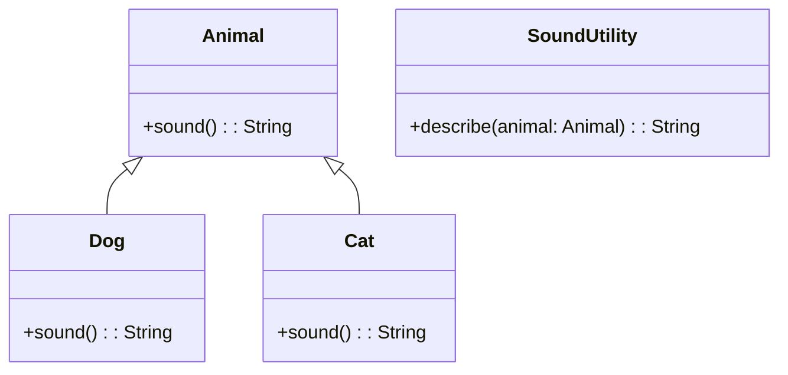

## 18.1 Combining Object-Oriented and Functional Paradigms in Kotlin

In the realm of software development, the paradigms of Object-Oriented Programming (OOP) and Functional Programming (FP) have long been viewed as distinct approaches with their own sets of principles and techniques. However, modern programming languages like Kotlin offer the flexibility to blend these paradigms, allowing developers to leverage the strengths of both to create robust, scalable, and maintainable software systems. This section explores how to effectively combine object-oriented and functional paradigms in Kotlin, providing insights into hybrid approaches that balance these paradigms effectively.

### Understanding Object-Oriented and Functional Paradigms

Before delving into the combination of these paradigms, it's essential to understand the core principles of each.

#### Object-Oriented Programming (OOP)

OOP is centered around the concept of "objects," which are instances of classes. These objects encapsulate data and behavior, promoting modularity and reuse. Key principles of OOP include:

- **Encapsulation**: Bundling data and methods that operate on the data within a single unit or class.
- **Inheritance**: Creating new classes based on existing ones to promote code reuse.
- **Polymorphism**: Allowing objects to be treated as instances of their parent class, enabling flexibility and integration.
- **Abstraction**: Hiding complex implementation details and exposing only the necessary parts of an object.

#### Functional Programming (FP)

FP focuses on the use of functions as the primary building blocks of programs. It emphasizes immutability and side-effect-free functions, promoting predictability and ease of reasoning. Key principles of FP include:

- **First-Class Functions**: Treating functions as first-class citizens, allowing them to be passed as arguments, returned from other functions, and assigned to variables.
- **Immutability**: Avoiding mutable state to ensure that data does not change unexpectedly.
- **Pure Functions**: Functions that always produce the same output given the same input and have no side effects.
- **Higher-Order Functions**: Functions that take other functions as parameters or return them as results.

### The Case for Combining Paradigms

Combining OOP and FP can lead to more expressive and flexible code. OOP's encapsulation and modularity complement FP's immutability and function composition, resulting in systems that are easier to maintain and extend. Kotlin, with its support for both paradigms, provides a unique opportunity to harness the best of both worlds.

#### Benefits of a Hybrid Approach

- **Enhanced Modularity**: Use classes to encapsulate related data and behavior while employing functions for specific operations.
- **Improved Testability**: FP's emphasis on pure functions makes testing easier, as functions can be tested in isolation.
- **Greater Flexibility**: Leverage polymorphism and higher-order functions to create flexible and adaptable systems.
- **Code Reusability**: Combine inheritance with function composition to maximize code reuse.

### Implementing Hybrid Approaches in Kotlin

Kotlin's language features make it an ideal candidate for combining OOP and FP. Let's explore some techniques and patterns to achieve this.

#### Using Data Classes for Immutability

Kotlin's data classes provide a concise way to create immutable objects, which are a staple of FP. Data classes automatically generate useful methods like `equals()`, `hashCode()`, and `copy()`, making them ideal for representing data in a functional style.

```kotlin
data class User(val name: String, val age: Int)

// Creating an immutable user
val user = User("Alice", 30)

// Copying with modification
val updatedUser = user.copy(age = 31)
```

#### Leveraging Extension Functions

Extension functions allow you to add new functionality to existing classes without modifying their source code. This feature aligns with FP's emphasis on function composition and can be used to enhance OOP classes.

```kotlin
fun String.isPalindrome(): Boolean {
    return this == this.reversed()
}

// Usage
val word = "radar"
println(word.isPalindrome()) // Output: true
```

#### Combining Inheritance with Function Composition

While inheritance is a core concept in OOP, function composition is a powerful tool in FP. Kotlin allows you to combine these concepts to create flexible and reusable code.

```kotlin
open class Animal {
    open fun sound() = "Some sound"
}

class Dog : Animal() {
    override fun sound() = "Bark"
}

fun Animal.describe() = "This animal makes a '${this.sound()}' sound."

// Usage
val dog = Dog()
println(dog.describe()) // Output: This animal makes a 'Bark' sound.
```

#### Utilizing Higher-Order Functions

Higher-order functions are a hallmark of FP, enabling you to pass functions as parameters and return them as results. This capability can be used to create flexible and reusable OOP methods.

```kotlin
fun <T> List<T>.filterAndTransform(
    predicate: (T) -> Boolean,
    transform: (T) -> T
): List<T> {
    return this.filter(predicate).map(transform)
}

// Usage
val numbers = listOf(1, 2, 3, 4, 5)
val result = numbers.filterAndTransform({ it % 2 == 0 }, { it * 2 })
println(result) // Output: [4, 8]
```

### Visualizing the Hybrid Approach

To better understand how OOP and FP can be combined in Kotlin, let's visualize the interaction between these paradigms using a class diagram.



In this diagram, `Animal` is a base class with a `sound()` method. `Dog` and `Cat` inherit from `Animal` and override the `sound()` method. The `SoundUtility` class uses function composition to describe the sound an animal makes, demonstrating the hybrid approach.

### Try It Yourself

Experiment with the code examples provided by modifying them to suit different scenarios. For instance, try creating a new animal class and see how it integrates with the existing `SoundUtility` class. Explore adding more extension functions to the `String` class or creating new higher-order functions for list transformations.

### Design Considerations

When combining OOP and FP, consider the following:

- **Balance**: Strive for a balance between the paradigms, using each where it is most effective.
- **Complexity**: Avoid overcomplicating the design by introducing unnecessary abstractions.
- **Performance**: Be mindful of performance implications, especially with function composition and higher-order functions.

### Differences and Similarities

While OOP and FP have distinct principles, they share common goals such as code reuse and abstraction. Understanding their differences and similarities can help you decide when to use each paradigm.

- **State Management**: OOP often involves mutable state, while FP emphasizes immutability.
- **Abstraction**: Both paradigms use abstraction but in different ways. OOP uses classes and interfaces, while FP uses functions and higher-order abstractions.

### Conclusion

Combining object-oriented and functional paradigms in Kotlin allows you to harness the strengths of both approaches, leading to more robust and maintainable software. By understanding the principles of each paradigm and leveraging Kotlin's features, you can create systems that are both flexible and efficient.

Remember, this is just the beginning. As you progress, you'll build more complex and interactive applications. Keep experimenting, stay curious, and enjoy the journey!

## Quiz Time!



### Which of the following is a key principle of Object-Oriented Programming (OOP)?

- [x] Encapsulation
- [ ] Immutability
- [ ] Pure Functions
- [ ] Higher-Order Functions

> **Explanation:** Encapsulation is a core principle of OOP, focusing on bundling data and methods within a single unit.

### What is a characteristic of Functional Programming (FP)?

- [ ] Mutable State
- [x] First-Class Functions
- [ ] Inheritance
- [ ] Polymorphism

> **Explanation:** First-class functions are a characteristic of FP, allowing functions to be passed as arguments, returned from other functions, and assigned to variables.

### How can you add new functionality to existing classes in Kotlin without modifying their source code?

- [ ] Inheritance
- [x] Extension Functions
- [ ] Polymorphism
- [ ] Abstract Classes

> **Explanation:** Extension functions allow you to add new functionality to existing classes without altering their source code.

### What is a benefit of combining OOP and FP?

- [x] Enhanced Modularity
- [ ] Increased Complexity
- [ ] Reduced Flexibility
- [ ] Decreased Testability

> **Explanation:** Combining OOP and FP enhances modularity by using classes for encapsulation and functions for specific operations.

### Which Kotlin feature aligns with FP's emphasis on immutability?

- [ ] Companion Objects
- [ ] Mutable Lists
- [x] Data Classes
- [ ] Inheritance

> **Explanation:** Data classes in Kotlin provide a concise way to create immutable objects, aligning with FP's emphasis on immutability.

### What is a higher-order function?

- [x] A function that takes other functions as parameters or returns them as results
- [ ] A function that is always pure
- [ ] A function that modifies global state
- [ ] A function that is defined within a class

> **Explanation:** A higher-order function is one that takes other functions as parameters or returns them as results, a key concept in FP.

### In Kotlin, how can you create a copy of an object with some properties modified?

- [ ] Using `clone()`
- [x] Using `copy()`
- [ ] Using `new()`
- [ ] Using `duplicate()`

> **Explanation:** The `copy()` function in Kotlin allows you to create a copy of an object with some properties modified, commonly used with data classes.

### What is the primary focus of FP?

- [ ] Mutable State
- [ ] Class Inheritance
- [x] Pure Functions
- [ ] Object Encapsulation

> **Explanation:** The primary focus of FP is on pure functions, which always produce the same output given the same input and have no side effects.

### Which of the following is a common goal shared by OOP and FP?

- [x] Code Reuse
- [ ] Mutable State
- [ ] Global Variables
- [ ] Side Effects

> **Explanation:** Both OOP and FP aim for code reuse, although they achieve it through different means.

### True or False: In Kotlin, you can only use either OOP or FP, but not both simultaneously.

- [ ] True
- [x] False

> **Explanation:** False. Kotlin supports both OOP and FP, allowing developers to combine these paradigms in their applications.




