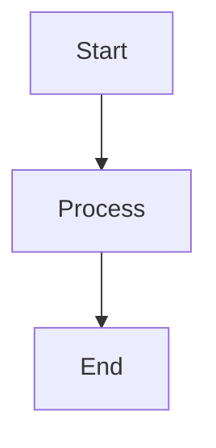

## 18.2 Case Study: Building a DSL with Multiple Patterns

In the world of software engineering, Domain-Specific Languages (DSLs) offer a powerful way to express complex logic in a concise and readable manner. Kotlin, with its expressive syntax and advanced language features, is particularly well-suited for building DSLs. In this case study, we will explore how to construct a DSL in Kotlin by integrating multiple design patterns. This comprehensive guide will provide you with practical examples, detailed explanations, and insights into the design considerations involved in building a DSL.

### Introduction to DSLs

A Domain-Specific Language (DSL) is a specialized language tailored to a specific application domain. Unlike general-purpose programming languages, DSLs are designed to solve specific problems more efficiently and expressively. They can be categorized into two types:

- **Internal DSLs**: Embedded within a host language, leveraging its syntax and semantics.
- **External DSLs**: Standalone languages with their own syntax and parsing logic.

Kotlin's support for internal DSLs is exceptional due to its flexible syntax, extension functions, and lambda expressions. Let's dive into the process of building a DSL in Kotlin by integrating various design patterns.

### Design Patterns in DSL Construction

When building a DSL, several design patterns can be employed to enhance its structure, maintainability, and usability. Here are some key patterns we'll explore in this case study:

- **Builder Pattern**: Facilitates the construction of complex objects.
- **Fluent Interface**: Enables method chaining for more readable code.
- **Interpreter Pattern**: Provides a way to evaluate sentences in the language.
- **Visitor Pattern**: Separates operations from the object structure.
- **Composite Pattern**: Allows individual objects and compositions to be treated uniformly.

### Case Study: Building a DSL for Workflow Automation

Let's consider a scenario where we want to build a DSL for defining and executing workflows in a business automation system. The DSL should allow users to define tasks, conditions, and transitions in a clear and concise manner.

#### Step 1: Define the Domain Model

The first step in building a DSL is to define the domain model. In our case, the domain model consists of tasks, conditions, and transitions. We'll use Kotlin's data classes to represent these entities.

```kotlin
data class Task(val name: String, val action: () -> Unit)

data class Condition(val name: String, val predicate: () -> Boolean)

data class Transition(val from: Task, val to: Task, val condition: Condition)
```

#### Step 2: Implement the Builder Pattern

The Builder Pattern is instrumental in constructing complex objects step by step. We'll use it to define workflows by chaining method calls.

```kotlin
class WorkflowBuilder {
    private val tasks = mutableListOf<Task>()
    private val transitions = mutableListOf<Transition>()

    fun task(name: String, action: () -> Unit): WorkflowBuilder {
        tasks.add(Task(name, action))
        return this
    }

    fun transition(from: String, to: String, condition: () -> Boolean): WorkflowBuilder {
        val fromTask = tasks.find { it.name == from } ?: throw IllegalArgumentException("Task not found: $from")
        val toTask = tasks.find { it.name == to } ?: throw IllegalArgumentException("Task not found: $to")
        transitions.add(Transition(fromTask, toTask, Condition("$from -> $to", condition)))
        return this
    }

    fun build(): Workflow = Workflow(tasks, transitions)
}
```

#### Step 3: Create a Fluent Interface

To make the DSL more readable, we'll implement a Fluent Interface, allowing method chaining and reducing boilerplate code.

```kotlin
class Workflow {
    private val tasks: List<Task>
    private val transitions: List<Transition>

    constructor(tasks: List<Task>, transitions: List<Transition>) {
        this.tasks = tasks
        this.transitions = transitions
    }

    fun execute() {
        var currentTask = tasks.firstOrNull() ?: return
        while (true) {
            println("Executing task: ${currentTask.name}")
            currentTask.action()

            val nextTransition = transitions.find { it.from == currentTask && it.condition.predicate() }
            if (nextTransition == null) break

            currentTask = nextTransition.to
        }
    }
}
```

#### Step 4: Integrate the Interpreter Pattern

The Interpreter Pattern allows us to evaluate expressions in our DSL. We'll use it to interpret conditions and transitions.

```kotlin
class ConditionInterpreter {
    fun interpret(condition: Condition): Boolean {
        println("Evaluating condition: ${condition.name}")
        return condition.predicate()
    }
}
```

#### Step 5: Apply the Visitor Pattern

The Visitor Pattern separates operations from the object structure. We'll use it to perform actions on tasks and transitions.

```kotlin
interface WorkflowVisitor {
    fun visit(task: Task)
    fun visit(transition: Transition)
}

class ExecutionVisitor : WorkflowVisitor {
    override fun visit(task: Task) {
        println("Visiting task: ${task.name}")
        task.action()
    }

    override fun visit(transition: Transition) {
        println("Visiting transition: ${transition.from.name} -> ${transition.to.name}")
    }
}
```

#### Step 6: Use the Composite Pattern

The Composite Pattern allows us to treat individual tasks and compositions uniformly. We'll use it to manage workflows.

```kotlin
class CompositeWorkflow(private val workflows: List<Workflow>) {
    fun executeAll() {
        workflows.forEach { it.execute() }
    }
}
```

### Putting It All Together

Now that we've implemented the necessary patterns, let's see how our DSL can be used to define and execute a workflow.

```kotlin
fun main() {
    val workflow = WorkflowBuilder()
        .task("Start") { println("Starting workflow") }
        .task("Process") { println("Processing data") }
        .task("End") { println("Ending workflow") }
        .transition("Start", "Process") { true }
        .transition("Process", "End") { true }
        .build()

    workflow.execute()
}
```

### Visualizing the Workflow DSL

To better understand the workflow DSL, let's visualize the process using a flowchart.



This flowchart represents the sequence of tasks and transitions in our workflow DSL.

### Design Considerations

When building a DSL, it's important to consider the following design aspects:

- **Readability**: Ensure the DSL is intuitive and easy to read.
- **Flexibility**: Allow for easy extension and modification of the DSL.
- **Performance**: Optimize for efficient execution of the DSL.
- **Error Handling**: Provide clear error messages and validation.

### Differences and Similarities with Other Patterns

While the patterns used in this case study are distinct, they share some similarities:

- **Builder and Fluent Interface**: Both patterns enhance the readability and usability of the DSL.
- **Interpreter and Visitor**: Both patterns separate logic from structure, enabling flexible evaluation and execution.

### Try It Yourself

To gain a deeper understanding of the DSL, try modifying the code examples:

- Add new tasks and transitions to the workflow.
- Implement additional conditions and actions.
- Experiment with different execution orders and conditions.

### Conclusion

Building a DSL in Kotlin involves integrating multiple design patterns to create a powerful and expressive language. By leveraging the Builder, Fluent Interface, Interpreter, Visitor, and Composite patterns, we can construct a DSL that is both flexible and maintainable. As you continue to explore DSLs, remember to focus on readability, flexibility, and performance.

## Quiz Time!



### What is a Domain-Specific Language (DSL)?

- [x] A specialized language tailored to a specific application domain.
- [ ] A general-purpose programming language.
- [ ] A language used for database queries.
- [ ] A language for web development.

> **Explanation:** A DSL is designed to solve specific problems within a particular domain, unlike general-purpose languages.

### Which pattern is used to construct complex objects step by step?

- [x] Builder Pattern
- [ ] Singleton Pattern
- [ ] Factory Pattern
- [ ] Observer Pattern

> **Explanation:** The Builder Pattern facilitates the construction of complex objects through method chaining.

### What is the purpose of the Fluent Interface pattern?

- [x] To enable method chaining for more readable code.
- [ ] To separate operations from the object structure.
- [ ] To provide a way to evaluate sentences in a language.
- [ ] To allow individual objects and compositions to be treated uniformly.

> **Explanation:** The Fluent Interface pattern enhances readability by allowing method chaining.

### Which pattern separates operations from the object structure?

- [x] Visitor Pattern
- [ ] Composite Pattern
- [ ] Interpreter Pattern
- [ ] Builder Pattern

> **Explanation:** The Visitor Pattern allows operations to be performed on objects without modifying their structure.

### What does the Composite Pattern allow?

- [x] Treating individual objects and compositions uniformly.
- [ ] Evaluating expressions in a language.
- [ ] Constructing complex objects step by step.
- [ ] Enabling method chaining for more readable code.

> **Explanation:** The Composite Pattern allows for uniform treatment of individual objects and compositions.

### In the workflow DSL, what does the Condition class represent?

- [x] A predicate that determines whether a transition should occur.
- [ ] An action to be performed by a task.
- [ ] A sequence of tasks to be executed.
- [ ] A visitor that performs operations on tasks.

> **Explanation:** The Condition class represents a predicate that evaluates whether a transition should occur.

### How does the Interpreter Pattern contribute to the DSL?

- [x] It provides a way to evaluate expressions in the language.
- [ ] It enables method chaining for more readable code.
- [ ] It separates operations from the object structure.
- [ ] It allows for uniform treatment of individual objects and compositions.

> **Explanation:** The Interpreter Pattern evaluates expressions, such as conditions, in the DSL.

### What is the role of the ExecutionVisitor class?

- [x] To perform actions on tasks and transitions.
- [ ] To construct complex objects step by step.
- [ ] To evaluate expressions in the language.
- [ ] To enable method chaining for more readable code.

> **Explanation:** The ExecutionVisitor class visits tasks and transitions to perform actions.

### What is the main benefit of using the Composite Pattern in the DSL?

- [x] It allows for uniform treatment of workflows and tasks.
- [ ] It enables method chaining for more readable code.
- [ ] It provides a way to evaluate expressions in the language.
- [ ] It separates operations from the object structure.

> **Explanation:** The Composite Pattern allows workflows and tasks to be managed uniformly.

### True or False: The Builder and Fluent Interface patterns both enhance the readability of the DSL.

- [x] True
- [ ] False

> **Explanation:** Both patterns improve the DSL's readability by facilitating method chaining and reducing boilerplate code.



Remember, this is just the beginning. As you progress, you'll build more complex and interactive DSLs. Keep experimenting, stay curious, and enjoy the journey!
