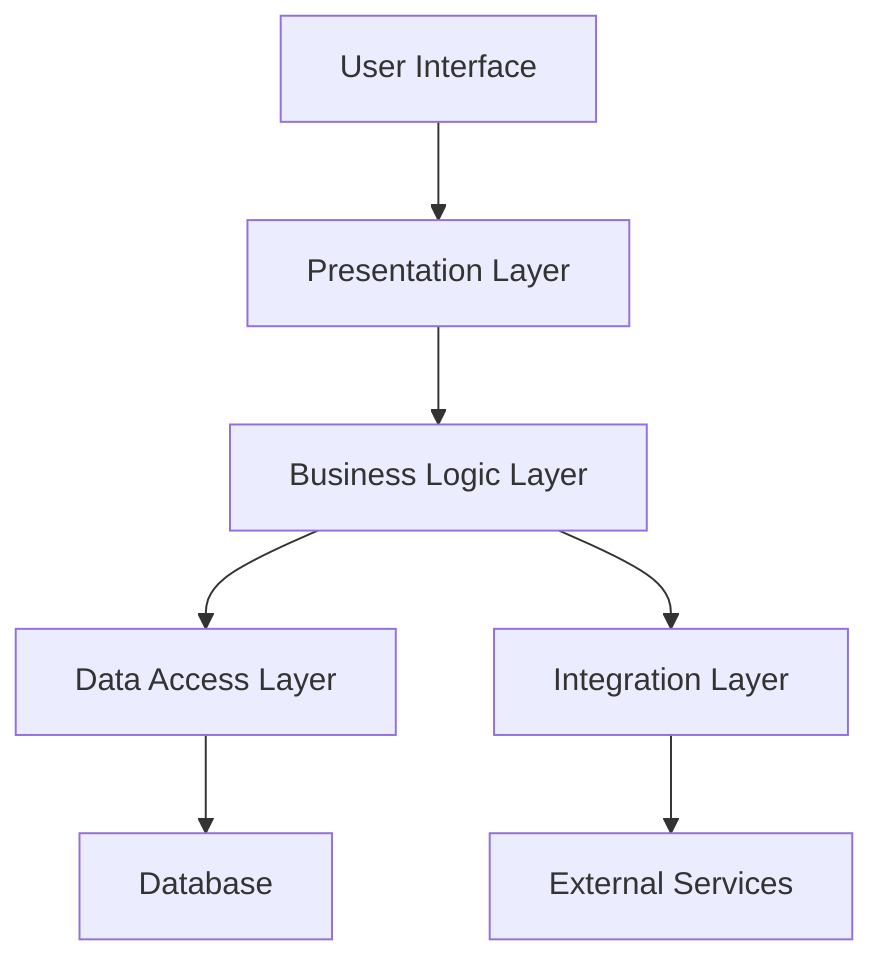
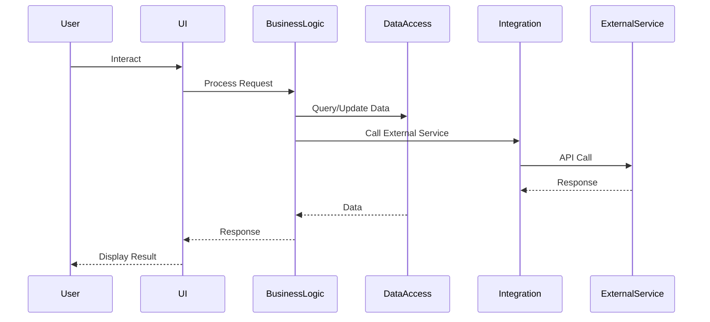

## 18.3 Case Study: Complex Application Architecture

In this section, we will delve into a comprehensive case study that explores the application of multiple design patterns in Kotlin to build a complex, scalable application architecture. This case study is aimed at expert software engineers and architects who are looking to deepen their understanding of how to effectively combine design patterns to solve real-world engineering challenges.

### Introduction to Complex Application Architecture

As software systems grow in complexity, the need for a robust architecture becomes paramount. A well-designed architecture not only supports current requirements but also anticipates future needs, ensuring scalability, maintainability, and flexibility. In this case study, we will explore how to design such an architecture using Kotlin, leveraging its unique features and a combination of design patterns.

### The Problem Statement

Imagine we are tasked with designing a scalable e-commerce platform. This platform must handle a large number of concurrent users, support various payment gateways, manage inventory in real-time, and provide a seamless user experience across web and mobile platforms. Additionally, it must be easy to extend with new features and integrate with third-party services.

### Architectural Goals

1. **Scalability**: The architecture should handle increasing loads without significant changes.
2. **Maintainability**: The codebase should be easy to understand, modify, and extend.
3. **Flexibility**: The system should accommodate new features and integrations with minimal disruption.
4. **Performance**: The application should be responsive and efficient in resource usage.
5. **Security**: Sensitive data should be protected, and the system should be resilient against attacks.

### Design Patterns Overview

To achieve these goals, we will employ a combination of design patterns, each addressing specific aspects of the architecture:

- **Creational Patterns**: Singleton, Factory, and Builder patterns for managing object creation.
- **Structural Patterns**: Adapter, Facade, and Composite patterns for organizing system components.
- **Behavioral Patterns**: Observer, Strategy, and Command patterns for managing interactions and behaviors.
- **Concurrency Patterns**: Coroutines and Reactive programming for handling asynchronous operations.

### System Architecture

The architecture of our e-commerce platform will be divided into several layers, each responsible for specific tasks:

1. **Presentation Layer**: Handles user interactions and displays information.
2. **Business Logic Layer**: Contains the core functionality and business rules.
3. **Data Access Layer**: Manages data retrieval and storage.
4. **Integration Layer**: Facilitates communication with external services.

#### Diagram: High-Level Architecture



### Applying Design Patterns

#### Creational Patterns

**Singleton Pattern**

The Singleton pattern ensures that a class has only one instance and provides a global point of access to it. In our architecture, we use Singletons for managing configurations and shared resources like logging.

```kotlin
object ConfigManager {
    val config: Config = loadConfig()

    private fun loadConfig(): Config {
        // Load configuration from file or environment
    }
}
```

**Factory Pattern**

The Factory pattern is used to create objects without specifying the exact class of object that will be created. We use it to instantiate different types of payment gateways based on user selection.

```kotlin
interface PaymentGateway {
    fun processPayment(amount: Double)
}

class PayPalGateway : PaymentGateway {
    override fun processPayment(amount: Double) {
        // PayPal payment processing logic
    }
}

class StripeGateway : PaymentGateway {
    override fun processPayment(amount: Double) {
        // Stripe payment processing logic
    }
}

object PaymentGatewayFactory {
    fun createGateway(type: String): PaymentGateway {
        return when (type) {
            "PayPal" -> PayPalGateway()
            "Stripe" -> StripeGateway()
            else -> throw IllegalArgumentException("Unknown payment type")
        }
    }
}
```

**Builder Pattern**

The Builder pattern is used to construct complex objects step by step. We apply it to create order objects with various optional attributes.

```kotlin
data class Order(val id: String, val items: List<Item>, val discount: Double?, val notes: String?)

class OrderBuilder {
    private var id: String = ""
    private var items: List<Item> = listOf()
    private var discount: Double? = null
    private var notes: String? = null

    fun setId(id: String) = apply { this.id = id }
    fun setItems(items: List<Item>) = apply { this.items = items }
    fun setDiscount(discount: Double?) = apply { this.discount = discount }
    fun setNotes(notes: String?) = apply { this.notes = notes }

    fun build(): Order {
        return Order(id, items, discount, notes)
    }
}
```

#### Structural Patterns

**Adapter Pattern**

The Adapter pattern allows incompatible interfaces to work together. We use it to integrate third-party services with our system.

```kotlin
interface InventoryService {
    fun updateStock(itemId: String, quantity: Int)
}

class ThirdPartyInventoryService {
    fun updateInventory(itemCode: String, qty: Int) {
        // Third-party inventory update logic
    }
}

class InventoryAdapter(private val thirdPartyService: ThirdPartyInventoryService) : InventoryService {
    override fun updateStock(itemId: String, quantity: Int) {
        thirdPartyService.updateInventory(itemId, quantity)
    }
}
```

**Facade Pattern**

The Facade pattern provides a simplified interface to a complex subsystem. We use it to simplify interactions with the payment processing subsystem.

```kotlin
class PaymentFacade(private val gatewayFactory: PaymentGatewayFactory) {
    fun processPayment(type: String, amount: Double) {
        val gateway = gatewayFactory.createGateway(type)
        gateway.processPayment(amount)
    }
}
```

**Composite Pattern**

The Composite pattern allows you to compose objects into tree structures to represent part-whole hierarchies. We apply it to manage product categories and items.

```kotlin
interface ProductComponent {
    fun display()
}

class ProductItem(private val name: String) : ProductComponent {
    override fun display() {
        println("Product: $name")
    }
}

class ProductCategory(private val name: String) : ProductComponent {
    private val components = mutableListOf<ProductComponent>()

    fun add(component: ProductComponent) = components.add(component)
    fun remove(component: ProductComponent) = components.remove(component)

    override fun display() {
        println("Category: $name")
        components.forEach { it.display() }
    }
}
```

#### Behavioral Patterns

**Observer Pattern**

The Observer pattern defines a one-to-many dependency between objects so that when one object changes state, all its dependents are notified. We use it for real-time inventory updates.

```kotlin
interface Observer {
    fun update()
}

class InventoryObserver : Observer {
    override fun update() {
        println("Inventory updated")
    }
}

class InventorySubject {
    private val observers = mutableListOf<Observer>()

    fun addObserver(observer: Observer) = observers.add(observer)
    fun removeObserver(observer: Observer) = observers.remove(observer)
    fun notifyObservers() = observers.forEach { it.update() }
}
```

**Strategy Pattern**

The Strategy pattern defines a family of algorithms, encapsulates each one, and makes them interchangeable. We use it for different discount strategies.

```kotlin
interface DiscountStrategy {
    fun applyDiscount(amount: Double): Double
}

class NoDiscount : DiscountStrategy {
    override fun applyDiscount(amount: Double) = amount
}

class PercentageDiscount(private val percentage: Double) : DiscountStrategy {
    override fun applyDiscount(amount: Double) = amount * (1 - percentage / 100)
}

class DiscountContext(private var strategy: DiscountStrategy) {
    fun setStrategy(strategy: DiscountStrategy) {
        this.strategy = strategy
    }

    fun applyDiscount(amount: Double): Double {
        return strategy.applyDiscount(amount)
    }
}
```

**Command Pattern**

The Command pattern encapsulates a request as an object, thereby allowing for parameterization of clients with queues, requests, and operations. We use it for order processing commands.

```kotlin
interface Command {
    fun execute()
}

class ProcessOrderCommand(private val order: Order) : Command {
    override fun execute() {
        println("Processing order: ${order.id}")
    }
}

class CommandInvoker {
    private val commandQueue = mutableListOf<Command>()

    fun addCommand(command: Command) = commandQueue.add(command)
    fun executeCommands() = commandQueue.forEach { it.execute() }
}
```

#### Concurrency Patterns

**Coroutines**

Kotlin's coroutines provide a simple and efficient way to handle asynchronous programming. We use coroutines for non-blocking I/O operations and concurrency.

```kotlin
import kotlinx.coroutines.*

fun main() = runBlocking {
    launch {
        delay(1000L)
        println("World!")
    }
    println("Hello,")
}
```

**Reactive Programming**

Reactive programming is a paradigm that deals with asynchronous data streams and the propagation of change. We use Kotlin Flows for reactive data handling.

```kotlin
import kotlinx.coroutines.flow.*

fun main() = runBlocking {
    val flow = flowOf(1, 2, 3, 4, 5)
    flow.collect { value ->
        println("Received: $value")
    }
}
```

### Integration and Testing

To ensure the robustness of our architecture, we integrate comprehensive testing strategies, including unit tests, integration tests, and end-to-end tests. We use KotlinTest and MockK for mocking dependencies and verifying interactions.

```kotlin
import io.mockk.*
import kotlin.test.Test
import kotlin.test.assertEquals

class PaymentFacadeTest {

    @Test
    fun `test payment processing`() {
        val mockGatewayFactory = mockk<PaymentGatewayFactory>()
        val mockGateway = mockk<PaymentGateway>()
        every { mockGatewayFactory.createGateway(any()) } returns mockGateway
        every { mockGateway.processPayment(any()) } just Runs

        val facade = PaymentFacade(mockGatewayFactory)
        facade.processPayment("PayPal", 100.0)

        verify { mockGateway.processPayment(100.0) }
    }
}
```

### Visualizing the Architecture

To better understand the interactions and data flow within our architecture, let's visualize the system components and their relationships.

#### Diagram: System Component Interaction



### Try It Yourself

To deepen your understanding, try modifying the code examples provided:

1. **Extend the PaymentGatewayFactory** to support a new payment method.
2. **Implement a new DiscountStrategy** that applies a fixed discount amount.
3. **Add a new Observer** to the InventorySubject that logs updates to a file.

### Conclusion

In this case study, we explored how to design a complex application architecture using Kotlin and multiple design patterns. By combining creational, structural, behavioral, and concurrency patterns, we created a scalable, maintainable, and flexible system. Remember, this is just the beginning. As you continue your journey, you'll encounter new challenges and opportunities to apply these patterns in innovative ways. Keep experimenting, stay curious, and enjoy the journey!

## Quiz Time!



### Which pattern ensures a class has only one instance and provides a global point of access to it?

- [x] Singleton Pattern
- [ ] Factory Pattern
- [ ] Adapter Pattern
- [ ] Observer Pattern

> **Explanation:** The Singleton Pattern ensures a class has only one instance and provides a global point of access to it.

### What pattern is used to create objects without specifying the exact class of object that will be created?

- [ ] Singleton Pattern
- [x] Factory Pattern
- [ ] Builder Pattern
- [ ] Composite Pattern

> **Explanation:** The Factory Pattern is used to create objects without specifying the exact class of object that will be created.

### Which pattern provides a simplified interface to a complex subsystem?

- [ ] Adapter Pattern
- [x] Facade Pattern
- [ ] Composite Pattern
- [ ] Strategy Pattern

> **Explanation:** The Facade Pattern provides a simplified interface to a complex subsystem.

### What pattern defines a one-to-many dependency between objects so that when one object changes state, all its dependents are notified?

- [ ] Strategy Pattern
- [ ] Command Pattern
- [x] Observer Pattern
- [ ] Builder Pattern

> **Explanation:** The Observer Pattern defines a one-to-many dependency between objects so that when one object changes state, all its dependents are notified.

### Which pattern allows incompatible interfaces to work together?

- [x] Adapter Pattern
- [ ] Singleton Pattern
- [ ] Factory Pattern
- [ ] Observer Pattern

> **Explanation:** The Adapter Pattern allows incompatible interfaces to work together.

### What pattern encapsulates a request as an object, allowing for parameterization of clients with queues, requests, and operations?

- [ ] Observer Pattern
- [ ] Strategy Pattern
- [x] Command Pattern
- [ ] Composite Pattern

> **Explanation:** The Command Pattern encapsulates a request as an object, allowing for parameterization of clients with queues, requests, and operations.

### Which pattern defines a family of algorithms, encapsulates each one, and makes them interchangeable?

- [ ] Command Pattern
- [x] Strategy Pattern
- [ ] Observer Pattern
- [ ] Builder Pattern

> **Explanation:** The Strategy Pattern defines a family of algorithms, encapsulates each one, and makes them interchangeable.

### What is the primary benefit of using Kotlin's coroutines for asynchronous programming?

- [x] Non-blocking I/O operations
- [ ] Simplified syntax
- [ ] Enhanced security
- [ ] Improved readability

> **Explanation:** Kotlin's coroutines provide a simple and efficient way to handle asynchronous programming, particularly for non-blocking I/O operations.

### Which pattern allows you to compose objects into tree structures to represent part-whole hierarchies?

- [ ] Facade Pattern
- [ ] Adapter Pattern
- [x] Composite Pattern
- [ ] Command Pattern

> **Explanation:** The Composite Pattern allows you to compose objects into tree structures to represent part-whole hierarchies.

### True or False: The Builder Pattern is used to construct complex objects step by step.

- [x] True
- [ ] False

> **Explanation:** True. The Builder Pattern is used to construct complex objects step by step.


