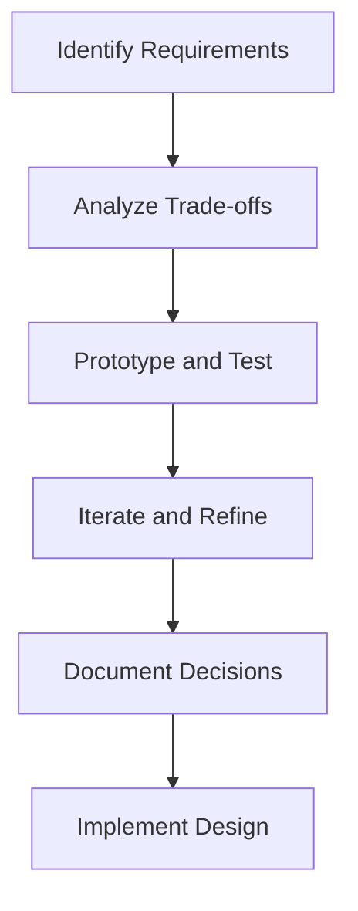

## 18.4 Trade-offs and Considerations

In the realm of software engineering, particularly when working with Kotlin, design patterns serve as invaluable tools for crafting robust and scalable applications. However, the application of these patterns is not without its trade-offs. As expert software engineers and architects, it is crucial to evaluate design decisions carefully, balancing performance against maintainability. This section delves into the intricate considerations involved in applying multiple design patterns in Kotlin, providing insights into how to navigate these trade-offs effectively.

### Introduction to Trade-offs in Design Patterns

Design patterns provide a structured approach to solving common software design problems. However, they come with inherent trade-offs that must be considered during implementation. Understanding these trade-offs is essential for making informed decisions that align with the specific needs and constraints of your project.

#### Key Considerations

1. **Performance**: Design patterns can introduce additional layers of abstraction, which may impact performance. It is important to assess whether the benefits of using a pattern outweigh the potential performance costs.
   
2. **Maintainability**: Patterns can enhance code readability and maintainability by providing a clear structure. However, overuse or inappropriate application of patterns can lead to complexity and reduced maintainability.

3. **Scalability**: Some patterns are better suited for scalable systems. Evaluating the scalability implications of a pattern is crucial, especially in distributed or high-load environments.

4. **Flexibility**: Patterns can increase the flexibility of your codebase, allowing for easier modifications and extensions. However, this flexibility can sometimes lead to over-engineering.

5. **Complexity**: Introducing patterns can add complexity to the codebase. It is important to strike a balance between simplicity and the benefits provided by the pattern.

### Performance vs. Maintainability

One of the most common trade-offs in software design is between performance and maintainability. Let's explore this trade-off in detail, examining how it manifests in various design patterns and providing strategies for balancing these competing concerns.

#### Performance Considerations

Performance is a critical factor in many applications, particularly those with high throughput or real-time requirements. Design patterns can impact performance in several ways:

- **Overhead**: Patterns such as the Decorator or Proxy can introduce additional method calls, which may affect performance. Consider whether the added functionality justifies the overhead.

- **Memory Usage**: Patterns like the Flyweight can help reduce memory usage by sharing objects. However, improper implementation can lead to memory leaks or excessive memory consumption.

- **Concurrency**: Patterns that involve concurrency, such as the Observer or Command patterns, can introduce synchronization overhead. Evaluate the impact on performance, especially in multi-threaded environments.

#### Maintainability Considerations

Maintainability is crucial for long-term project success, enabling easier updates, bug fixes, and feature additions. Design patterns can enhance maintainability by:

- **Code Clarity**: Patterns provide a clear structure, making the codebase easier to understand and navigate. This is particularly beneficial in large teams or projects with high turnover.

- **Modularity**: Patterns like the Strategy or Factory promote modularity, allowing components to be developed and tested independently.

- **Reusability**: Patterns encourage code reuse, reducing duplication and the potential for errors.

### Evaluating Design Decisions

When applying design patterns, it is essential to evaluate the design decisions carefully. Consider the following steps to make informed choices:

1. **Identify Requirements**: Clearly define the requirements and constraints of your project. Understanding the specific needs will guide your pattern selection.

2. **Analyze Trade-offs**: For each pattern, analyze the trade-offs between performance, maintainability, scalability, flexibility, and complexity. Consider how these factors align with your project goals.

3. **Prototype and Test**: Develop prototypes to test the impact of different patterns on performance and maintainability. Use these prototypes to gather data and make informed decisions.

4. **Iterate and Refine**: Design is an iterative process. Continuously refine your design based on feedback and changing requirements.

5. **Document Decisions**: Document the rationale behind your design decisions. This documentation will be invaluable for future maintenance and onboarding new team members.

### Case Studies: Applying Multiple Patterns

To illustrate the trade-offs and considerations in applying multiple design patterns, let's explore a few case studies. These examples demonstrate how different patterns can be combined to address complex design challenges.

#### Case Study 1: Building a Scalable Web Application

In this case study, we explore the design of a scalable web application using multiple design patterns. The application requires high performance and scalability to handle a large number of concurrent users.

**Patterns Used**:

- **Singleton Pattern**: Ensures a single instance of the database connection pool, reducing resource consumption.
  
- **Factory Pattern**: Manages the creation of different types of user sessions, promoting scalability and flexibility.

- **Observer Pattern**: Implements real-time notifications to users, enhancing user engagement.

**Trade-offs**:

- **Performance**: The Singleton pattern reduces resource consumption, but the Observer pattern introduces additional overhead for managing notifications.

- **Maintainability**: The Factory pattern enhances maintainability by encapsulating session creation logic, but the complexity of managing multiple patterns can increase the learning curve for new developers.

**Code Example**:

```kotlin
// Singleton Pattern for Database Connection Pool
object DatabaseConnectionPool {
    private val connections = mutableListOf<Connection>()

    fun getConnection(): Connection {
        // Logic to provide a connection
    }
}

// Factory Pattern for User Sessions
interface UserSession {
    fun start()
}

class BasicUserSession : UserSession {
    override fun start() {
        // Start basic session
    }
}

class PremiumUserSession : UserSession {
    override fun start() {
        // Start premium session
    }
}

object UserSessionFactory {
    fun createSession(type: String): UserSession {
        return when (type) {
            "basic" -> BasicUserSession()
            "premium" -> PremiumUserSession()
            else -> throw IllegalArgumentException("Unknown session type")
        }
    }
}

// Observer Pattern for Real-time Notifications
interface Observer {
    fun update(message: String)
}

class User : Observer {
    override fun update(message: String) {
        println("Received notification: $message")
    }
}

class NotificationService {
    private val observers = mutableListOf<Observer>()

    fun addObserver(observer: Observer) {
        observers.add(observer)
    }

    fun notifyObservers(message: String) {
        observers.forEach { it.update(message) }
    }
}
```

**Try It Yourself**: Experiment with adding new session types or observers to see how the design scales.

#### Case Study 2: Designing a Maintainable E-commerce Platform

In this case study, we focus on designing a maintainable e-commerce platform. The platform requires flexibility to accommodate frequent updates and new features.

**Patterns Used**:

- **Strategy Pattern**: Implements different pricing strategies for products, allowing easy updates to pricing logic.

- **Decorator Pattern**: Adds additional features to products, such as gift wrapping or express shipping, without modifying existing code.

- **Facade Pattern**: Provides a simplified interface for managing orders, enhancing code clarity.

**Trade-offs**:

- **Performance**: The Decorator pattern introduces additional method calls, which may impact performance. However, the flexibility it provides is crucial for accommodating new features.

- **Maintainability**: The Strategy and Facade patterns enhance maintainability by promoting modularity and encapsulating complex logic.

**Code Example**:

```kotlin
// Strategy Pattern for Pricing
interface PricingStrategy {
    fun calculatePrice(basePrice: Double): Double
}

class RegularPricing : PricingStrategy {
    override fun calculatePrice(basePrice: Double): Double {
        return basePrice
    }
}

class DiscountPricing(private val discount: Double) : PricingStrategy {
    override fun calculatePrice(basePrice: Double): Double {
        return basePrice * (1 - discount)
    }
}

// Decorator Pattern for Product Features
open class Product(val name: String, val price: Double) {
    open fun getDescription(): String {
        return name
    }
}

class GiftWrappedProduct(product: Product) : Product(product.name, product.price) {
    override fun getDescription(): String {
        return super.getDescription() + " with gift wrapping"
    }
}

// Facade Pattern for Order Management
class OrderFacade {
    fun placeOrder(product: Product, pricingStrategy: PricingStrategy) {
        val finalPrice = pricingStrategy.calculatePrice(product.price)
        println("Order placed for ${product.getDescription()} at $$finalPrice")
    }
}
```

**Try It Yourself**: Add new pricing strategies or product features to see how the design accommodates changes.

### Visualizing Trade-offs

To better understand the trade-offs involved in applying multiple design patterns, let's visualize the decision-making process using a flowchart.



**Description**: This flowchart illustrates the iterative process of evaluating design decisions, from identifying requirements to implementing the final design.

### Differences and Similarities in Patterns

When applying multiple design patterns, it is important to understand the differences and similarities between them. This knowledge helps avoid common pitfalls and ensures the patterns are used effectively.

#### Differences

- **Singleton vs. Multiton**: The Singleton pattern ensures a single instance, while the Multiton pattern manages a set of named instances. Choose based on the specific needs of your application.

- **Strategy vs. State**: Both patterns involve encapsulating behavior, but the Strategy pattern focuses on interchangeable algorithms, while the State pattern manages state transitions.

- **Decorator vs. Proxy**: The Decorator pattern adds functionality, while the Proxy pattern controls access. Consider the primary goal when selecting between these patterns.

#### Similarities

- **Factory and Builder**: Both patterns involve object creation, but the Factory pattern focuses on creating objects with a common interface, while the Builder pattern constructs complex objects step by step.

- **Observer and Mediator**: Both patterns facilitate communication between objects, but the Observer pattern involves a one-to-many relationship, while the Mediator pattern centralizes communication.

### Conclusion

Balancing performance and maintainability is a critical aspect of applying design patterns in Kotlin. By carefully evaluating design decisions and understanding the trade-offs involved, you can create robust and scalable applications that meet the specific needs of your project. Remember, this is just the beginning. As you progress, continue to experiment, iterate, and refine your designs. Stay curious, and enjoy the journey of mastering Kotlin design patterns.

## Quiz Time!



### What is a common trade-off when applying design patterns in software engineering?

- [x] Performance vs. Maintainability
- [ ] Security vs. Usability
- [ ] Cost vs. Time
- [ ] Complexity vs. Simplicity

> **Explanation:** Design patterns often involve a trade-off between performance and maintainability, as they can introduce additional layers of abstraction that impact both.

### Which pattern is used to ensure a single instance of a class?

- [x] Singleton Pattern
- [ ] Factory Pattern
- [ ] Observer Pattern
- [ ] Strategy Pattern

> **Explanation:** The Singleton pattern ensures that a class has only one instance, providing a global point of access to it.

### What is a key benefit of using the Strategy pattern?

- [x] It allows interchangeable algorithms.
- [ ] It controls access to objects.
- [ ] It manages a set of named instances.
- [ ] It adds functionality to objects.

> **Explanation:** The Strategy pattern allows for the definition of a family of interchangeable algorithms, enabling the selection of an algorithm at runtime.

### Which pattern is best suited for adding additional features to an object without modifying its structure?

- [x] Decorator Pattern
- [ ] Proxy Pattern
- [ ] Singleton Pattern
- [ ] Factory Pattern

> **Explanation:** The Decorator pattern is used to add additional features to an object dynamically without altering its structure.

### What is the primary goal of the Proxy pattern?

- [x] To control access to objects
- [ ] To encapsulate object creation
- [ ] To manage state transitions
- [ ] To provide a simplified interface

> **Explanation:** The Proxy pattern is used to control access to objects, often providing a surrogate or placeholder for another object.

### Which pattern is used to encapsulate object creation logic?

- [x] Factory Pattern
- [ ] Observer Pattern
- [ ] State Pattern
- [ ] Command Pattern

> **Explanation:** The Factory pattern is used to encapsulate object creation logic, allowing for the creation of objects without specifying their concrete classes.

### What is a key consideration when using the Observer pattern?

- [x] Synchronization overhead in multi-threaded environments
- [ ] Ensuring a single instance of a class
- [ ] Managing a set of named instances
- [ ] Adding functionality to objects

> **Explanation:** The Observer pattern can introduce synchronization overhead in multi-threaded environments, as it involves notifying multiple observers of changes.

### Which pattern is used to manage state transitions in an object?

- [x] State Pattern
- [ ] Strategy Pattern
- [ ] Singleton Pattern
- [ ] Factory Pattern

> **Explanation:** The State pattern is used to manage state transitions in an object, allowing the object to alter its behavior when its internal state changes.

### What is a benefit of using the Facade pattern?

- [x] It provides a simplified interface to a complex subsystem.
- [ ] It ensures a single instance of a class.
- [ ] It allows interchangeable algorithms.
- [ ] It controls access to objects.

> **Explanation:** The Facade pattern provides a simplified interface to a complex subsystem, making it easier to use and understand.

### True or False: The Decorator pattern and Proxy pattern have the same primary goal.

- [ ] True
- [x] False

> **Explanation:** The Decorator pattern and Proxy pattern have different primary goals. The Decorator pattern adds functionality to objects, while the Proxy pattern controls access to objects.


