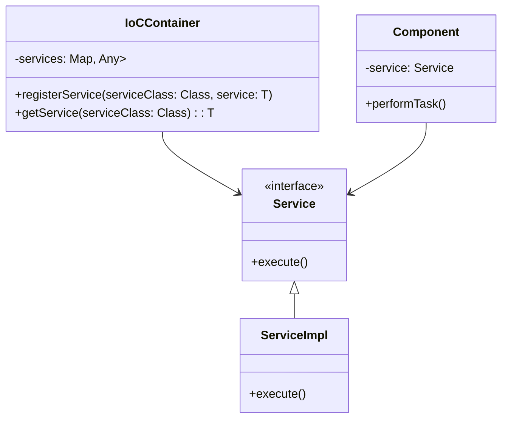
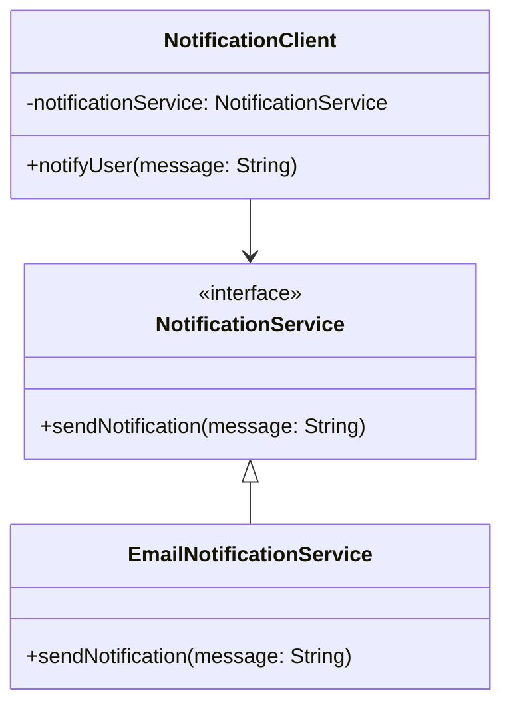

## 18.5 Inversion of Control and Dependency Injection

In the realm of software engineering, achieving flexible and maintainable designs is paramount. Two powerful concepts that facilitate this are **Inversion of Control (IoC)** and **Dependency Injection (DI)**. These concepts are crucial for managing dependencies in a way that promotes loose coupling, enhances testability, and simplifies code maintenance. In this section, we will delve into these concepts, explore their implementation in Kotlin, and compare them with the Service Locator pattern.

### Understanding Inversion of Control (IoC)

**Inversion of Control (IoC)** is a design principle in which the control of object creation and management is transferred from the application code to a framework or container. This principle allows developers to focus on defining the behavior of their components without worrying about their lifecycle management.

#### Key Participants

- **Component**: The class or module whose dependencies are managed by the IoC container.
- **IoC Container**: The framework or tool responsible for managing the lifecycle and dependencies of components.

#### Applicability

- Use IoC when you want to decouple the execution of a task from its implementation.
- Ideal for applications that require high flexibility and configurability.

### Implementing IoC in Kotlin

Kotlin, with its expressive syntax and modern features, provides excellent support for implementing IoC. Let's explore how we can achieve this using Kotlin's language features.

#### Code Example: Simple IoC with Kotlin

```kotlin
// Define a service interface
interface Service {
    fun execute()
}

// Implement the service interface
class ServiceImpl : Service {
    override fun execute() {
        println("Executing service...")
    }
}

// Define a component that depends on the service
class Component(private val service: Service) {
    fun performTask() {
        service.execute()
    }
}

// IoC Container that manages the dependencies
class IoCContainer {
    private val services = mutableMapOf<Class<*>, Any>()

    fun <T> registerService(serviceClass: Class<T>, service: T) {
        services[serviceClass] = service
    }

    fun <T> getService(serviceClass: Class<T>): T {
        return serviceClass.cast(services[serviceClass])
    }
}

// Usage
fun main() {
    val container = IoCContainer()
    container.registerService(Service::class.java, ServiceImpl())

    val component = Component(container.getService(Service::class.java))
    component.performTask()
}
```

In this example, we define a simple IoC container that registers and retrieves services. The `Component` class depends on the `Service` interface, and the IoC container manages the lifecycle of the `ServiceImpl` instance.

### Visualizing IoC

To better understand the flow of control in an IoC setup, let's visualize the relationship between components and the IoC container.



### Exploring Dependency Injection (DI)

**Dependency Injection (DI)** is a specific form of IoC where dependencies are provided to a class rather than being created by the class itself. DI promotes loose coupling by allowing components to be easily swapped or mocked for testing.

#### Key Participants

- **Client**: The class that depends on external services.
- **Service**: The external service or dependency.
- **Injector**: The mechanism that provides the dependencies to the client.

#### Applicability

- Use DI when you want to decouple the creation of dependencies from their usage.
- Ideal for applications that require high testability and configurability.

### Implementing DI in Kotlin

Kotlin's concise syntax and powerful features make it an ideal language for implementing DI. Let's explore how to achieve DI using Kotlin.

#### Code Example: Constructor Injection

```kotlin
// Define a service interface
interface NotificationService {
    fun sendNotification(message: String)
}

// Implement the service interface
class EmailNotificationService : NotificationService {
    override fun sendNotification(message: String) {
        println("Sending email notification: $message")
    }
}

// Define a client that depends on the service
class NotificationClient(private val notificationService: NotificationService) {
    fun notifyUser(message: String) {
        notificationService.sendNotification(message)
    }
}

// Usage
fun main() {
    val emailService = EmailNotificationService()
    val client = NotificationClient(emailService)
    client.notifyUser("Welcome to Kotlin!")
}
```

In this example, we use constructor injection to provide the `EmailNotificationService` to the `NotificationClient`. This approach allows us to easily swap the `NotificationService` implementation without modifying the client code.

### Visualizing DI

To better understand the flow of dependencies in a DI setup, let's visualize the relationship between the client, service, and injector.



### Service Locator vs. Dependency Injection

Both the Service Locator pattern and Dependency Injection are techniques for managing dependencies, but they have distinct differences.

#### Service Locator Pattern

The **Service Locator** pattern provides a centralized registry where services can be looked up. It allows clients to request services by name or type.

##### Code Example: Service Locator

```kotlin
// Define a service interface
interface DatabaseService {
    fun queryDatabase(query: String)
}

// Implement the service interface
class MySQLDatabaseService : DatabaseService {
    override fun queryDatabase(query: String) {
        println("Querying MySQL database: $query")
    }
}

// Service Locator that provides access to services
object ServiceLocator {
    private val services = mutableMapOf<Class<*>, Any>()

    fun <T> registerService(serviceClass: Class<T>, service: T) {
        services[serviceClass] = service
    }

    fun <T> getService(serviceClass: Class<T>): T {
        return serviceClass.cast(services[serviceClass])
    }
}

// Usage
fun main() {
    ServiceLocator.registerService(DatabaseService::class.java, MySQLDatabaseService())

    val databaseService = ServiceLocator.getService(DatabaseService::class.java)
    databaseService.queryDatabase("SELECT * FROM users")
}
```

##### Design Considerations

- **Pros**: Centralized service management, easy to add new services.
- **Cons**: Can lead to hidden dependencies, less explicit than DI.

#### Dependency Injection

In contrast, **Dependency Injection** provides dependencies directly to the client, making dependencies explicit and promoting loose coupling.

##### Design Considerations

- **Pros**: Promotes loose coupling, enhances testability, dependencies are explicit.
- **Cons**: Requires more setup, can be complex in large applications.

### Differences and Similarities

- **Explicitness**: DI makes dependencies explicit, while Service Locator hides them.
- **Coupling**: DI promotes loose coupling, whereas Service Locator can lead to tighter coupling.
- **Testability**: DI enhances testability by allowing easy mocking, while Service Locator can complicate testing.

### Try It Yourself

Experiment with the code examples provided. Try modifying the service implementations or adding new services to see how easily the client code can adapt. Consider implementing a new service using both DI and the Service Locator pattern to compare their flexibility and maintainability.

### Knowledge Check

- Explain the differences between IoC and DI.
- Describe a scenario where DI would be more beneficial than the Service Locator pattern.
- Implement a simple DI container in Kotlin.

### Embrace the Journey

Remember, mastering IoC and DI is just the beginning. As you progress, you'll build more flexible and maintainable applications. Keep experimenting, stay curious, and enjoy the journey!

## Quiz Time!



### What is the main purpose of Inversion of Control (IoC)?

- [x] To transfer control of object creation and management to a framework or container.
- [ ] To increase the complexity of the codebase.
- [ ] To ensure all dependencies are hardcoded within the application.
- [ ] To make the code less testable.

> **Explanation:** IoC is a design principle that transfers the control of object creation and management to a framework or container, promoting loose coupling and enhancing testability.

### Which of the following is a key benefit of Dependency Injection (DI)?

- [x] Promotes loose coupling between components.
- [ ] Increases the number of dependencies in the code.
- [ ] Makes dependencies harder to manage.
- [ ] Reduces the flexibility of the code.

> **Explanation:** DI promotes loose coupling by providing dependencies directly to the client, making them explicit and easy to manage.

### How does the Service Locator pattern differ from Dependency Injection?

- [x] Service Locator hides dependencies, while DI makes them explicit.
- [ ] Service Locator promotes loose coupling, while DI leads to tight coupling.
- [ ] Service Locator enhances testability, while DI complicates testing.
- [ ] Service Locator requires more setup than DI.

> **Explanation:** The Service Locator pattern hides dependencies by providing a centralized registry for service lookup, whereas DI makes dependencies explicit by providing them directly to the client.

### In Kotlin, which feature is commonly used for implementing Dependency Injection?

- [x] Constructor injection.
- [ ] Extension functions.
- [ ] Data classes.
- [ ] Sealed classes.

> **Explanation:** Constructor injection is a common technique for implementing Dependency Injection in Kotlin, allowing dependencies to be provided directly to the client.

### What is a potential drawback of using the Service Locator pattern?

- [x] It can lead to hidden dependencies.
- [ ] It makes dependencies explicit.
- [ ] It enhances testability.
- [ ] It promotes loose coupling.

> **Explanation:** The Service Locator pattern can lead to hidden dependencies, making it harder to understand and manage the dependencies in the code.

### Which of the following is NOT a benefit of using Dependency Injection?

- [ ] Enhances testability.
- [x] Increases code complexity.
- [ ] Promotes loose coupling.
- [ ] Makes dependencies explicit.

> **Explanation:** While DI enhances testability, promotes loose coupling, and makes dependencies explicit, it does not inherently increase code complexity.

### What is the role of the IoC container in Inversion of Control?

- [x] To manage the lifecycle and dependencies of components.
- [ ] To increase the number of dependencies in the code.
- [ ] To hardcode dependencies within the application.
- [ ] To make the code less testable.

> **Explanation:** The IoC container is responsible for managing the lifecycle and dependencies of components, promoting loose coupling and enhancing testability.

### Which pattern is more suitable for applications that require high testability?

- [x] Dependency Injection.
- [ ] Service Locator.
- [ ] Singleton.
- [ ] Factory Method.

> **Explanation:** Dependency Injection is more suitable for applications that require high testability, as it makes dependencies explicit and easy to mock.

### In the context of Dependency Injection, what is an "injector"?

- [x] The mechanism that provides dependencies to the client.
- [ ] The class that depends on external services.
- [ ] The external service or dependency.
- [ ] The framework that manages object creation.

> **Explanation:** In Dependency Injection, the injector is the mechanism that provides dependencies to the client, ensuring loose coupling and enhanced testability.

### True or False: The Service Locator pattern is always better than Dependency Injection.

- [ ] True
- [x] False

> **Explanation:** False. The Service Locator pattern is not always better than Dependency Injection. Each pattern has its own advantages and disadvantages, and the choice depends on the specific requirements of the application.


