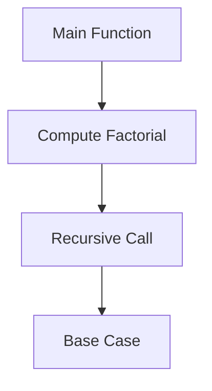

## 19.1 Profiling Techniques

In the world of software development, performance optimization is a critical aspect that can significantly impact the user experience and resource efficiency of applications. Profiling is an essential technique for identifying performance bottlenecks and optimizing applications. In this section, we will delve into various profiling techniques specifically tailored for Kotlin applications, focusing on CPU and memory analysis.

### Introduction to Profiling

Profiling is the process of measuring the space (memory) and time (CPU) complexity of a program, identifying parts of the code that consume the most resources. Profiling helps in understanding the behavior of applications under different conditions and is crucial for performance tuning.

#### Why Profiling Matters

- **Resource Efficiency:** Profiling helps in identifying inefficient code paths that consume excessive CPU or memory resources.
- **Improved User Experience:** By optimizing performance, applications become more responsive and faster, enhancing user satisfaction.
- **Cost Reduction:** Efficient applications can reduce operational costs, especially in cloud environments where resources are billed based on usage.
- **Scalability:** Profiling ensures that applications can handle increased loads without degradation in performance.

### Profiling Tools for Kotlin

Kotlin, being a JVM language, benefits from a rich ecosystem of profiling tools available for Java. These tools can be used to profile Kotlin applications effectively.

#### Popular Profiling Tools

1. **VisualVM:** A versatile tool for monitoring and profiling Java applications. It provides insights into CPU usage, memory consumption, thread activity, and more.
2. **YourKit:** A commercial profiler offering advanced features for CPU and memory profiling, including support for Kotlin.
3. **JProfiler:** Another commercial tool that provides detailed insights into CPU, memory, and thread profiling.
4. **Android Profiler:** Integrated into Android Studio, this tool is specifically designed for profiling Android applications written in Kotlin.

### CPU Profiling

CPU profiling involves analyzing the CPU usage of an application to identify methods or code paths that consume excessive CPU time. This helps in pinpointing performance bottlenecks and optimizing them.

#### Techniques for CPU Profiling

1. **Sampling:** This technique periodically samples the call stack of running threads to estimate where the CPU time is being spent. It is less intrusive and has minimal impact on application performance.
2. **Instrumentation:** This involves inserting additional code into the application to measure the execution time of methods. It provides precise measurements but can significantly slow down the application.

#### Using VisualVM for CPU Profiling

VisualVM is a powerful tool for CPU profiling. Let's explore how to use it for profiling a Kotlin application.

```kotlin
fun computeFactorial(n: Int): Long {
    return if (n <= 1) 1 else n * computeFactorial(n - 1)
}

fun main() {
    for (i in 1..10) {
        println("Factorial of $i is ${computeFactorial(i)}")
    }
}
```

To profile this code using VisualVM:

1. **Start VisualVM** and attach it to the running Kotlin application.
2. Navigate to the **CPU Profiler** tab and start profiling.
3. Execute the application and observe the CPU usage.
4. Analyze the profiling data to identify methods consuming the most CPU time.

#### Key Considerations

- **Sampling vs. Instrumentation:** Choose between sampling and instrumentation based on the level of detail required and the performance impact acceptable.
- **Warm-up Runs:** Perform warm-up runs to ensure the application is in a steady state before profiling.

### Memory Profiling

Memory profiling involves analyzing the memory usage of an application to identify memory leaks, excessive memory consumption, and optimize memory usage.

#### Techniques for Memory Profiling

1. **Heap Dumps:** Capture the state of the heap memory to analyze object allocations and identify memory leaks.
2. **Live Memory Analysis:** Monitor memory usage in real-time to observe how memory is allocated and deallocated.

#### Using YourKit for Memory Profiling

YourKit provides advanced features for memory profiling. Here's how to use it for a Kotlin application.

```kotlin
data class User(val id: Int, val name: String)

fun createUsers(): List<User> {
    return List(10000) { User(it, "User$it") }
}

fun main() {
    val users = createUsers()
    println("Created ${users.size} users")
}
```

To profile this code using YourKit:

1. **Start YourKit** and attach it to the running Kotlin application.
2. Navigate to the **Memory Profiler** tab and start profiling.
3. Execute the application and observe memory usage.
4. Analyze heap dumps to identify objects consuming the most memory.

#### Key Considerations

- **Garbage Collection:** Understand the impact of garbage collection on memory usage and performance.
- **Memory Leaks:** Use memory profiling to identify and fix memory leaks, which can degrade performance over time.

### Visualizing Profiling Data

Visualizing profiling data helps in understanding performance bottlenecks and making informed optimization decisions.

#### Using Mermaid.js for Visualization

Let's use Mermaid.js to visualize the call stack of a Kotlin application during profiling.



This diagram represents the call stack of the `computeFactorial` function, highlighting the recursive nature of the computation.

### Best Practices for Profiling

- **Profile in Production-like Environments:** Ensure that profiling is done in environments that closely resemble production to get accurate insights.
- **Iterative Profiling:** Profile iteratively during development to catch performance issues early.
- **Focus on Hotspots:** Concentrate on optimizing code paths identified as hotspots during profiling.

### Advanced Profiling Techniques

For expert developers, advanced profiling techniques can provide deeper insights into application performance.

#### Thread Profiling

Analyze thread activity to identify contention, deadlocks, and optimize concurrency.

#### Network Profiling

Profile network activity to identify bottlenecks in data transfer and optimize network usage.

#### I/O Profiling

Analyze disk and file I/O to identify slow operations and optimize data access patterns.

### References and Further Reading

- [VisualVM Documentation](https://visualvm.github.io/)
- [YourKit Java Profiler](https://www.yourkit.com/)
- [JProfiler](https://www.ej-technologies.com/products/jprofiler/overview.html)
- [Android Profiler](https://developer.android.com/studio/profile/android-profiler)

### Knowledge Check

- What is the difference between sampling and instrumentation in CPU profiling?
- How can heap dumps help in memory profiling?
- Why is it important to profile in production-like environments?

### Embrace the Journey

Remember, profiling is an ongoing process. As you optimize your Kotlin applications, continue to profile and identify new opportunities for improvement. Keep experimenting, stay curious, and enjoy the journey of performance optimization!

## Quiz Time!



### What is the primary goal of profiling in software development?

- [x] To identify performance bottlenecks and optimize resource usage.
- [ ] To add new features to the application.
- [ ] To increase the size of the application.
- [ ] To change the programming language.

> **Explanation:** Profiling aims to identify performance bottlenecks and optimize resource usage, improving the application's efficiency and user experience.

### Which tool is specifically designed for profiling Android applications written in Kotlin?

- [ ] VisualVM
- [ ] YourKit
- [ ] JProfiler
- [x] Android Profiler

> **Explanation:** Android Profiler is integrated into Android Studio and is specifically designed for profiling Android applications written in Kotlin.

### What is the main difference between sampling and instrumentation in CPU profiling?

- [x] Sampling periodically samples the call stack, while instrumentation inserts additional code to measure execution time.
- [ ] Sampling measures execution time, while instrumentation samples the call stack.
- [ ] Both techniques are identical in their approach.
- [ ] Sampling is more intrusive than instrumentation.

> **Explanation:** Sampling periodically samples the call stack to estimate CPU usage, while instrumentation inserts additional code to measure execution time precisely.

### How can heap dumps be useful in memory profiling?

- [x] They capture the state of heap memory to analyze object allocations and identify memory leaks.
- [ ] They provide real-time memory usage monitoring.
- [ ] They measure CPU usage.
- [ ] They optimize network performance.

> **Explanation:** Heap dumps capture the state of heap memory, allowing developers to analyze object allocations and identify memory leaks.

### Why is it important to perform warm-up runs before profiling?

- [x] To ensure the application is in a steady state before profiling.
- [ ] To increase the application's memory usage.
- [ ] To decrease the application's CPU usage.
- [ ] To change the application's programming language.

> **Explanation:** Performing warm-up runs ensures that the application is in a steady state, providing more accurate profiling results.

### What does thread profiling help identify?

- [x] Contention and deadlocks.
- [ ] Memory leaks.
- [ ] Network bottlenecks.
- [ ] Disk I/O issues.

> **Explanation:** Thread profiling helps identify contention, deadlocks, and optimize concurrency in applications.

### Which of the following is NOT a technique for memory profiling?

- [ ] Heap Dumps
- [ ] Live Memory Analysis
- [x] Network Profiling
- [ ] Garbage Collection Analysis

> **Explanation:** Network profiling is not a technique for memory profiling; it focuses on analyzing network activity.

### What is the benefit of visualizing profiling data?

- [x] It helps in understanding performance bottlenecks and making informed optimization decisions.
- [ ] It increases the application's size.
- [ ] It changes the programming language.
- [ ] It decreases the application's performance.

> **Explanation:** Visualizing profiling data helps developers understand performance bottlenecks and make informed optimization decisions.

### What is the advantage of using Mermaid.js for visualization?

- [x] It provides a clear and accurate representation of concepts and workflows.
- [ ] It increases the application's memory usage.
- [ ] It decreases the application's CPU usage.
- [ ] It changes the application's programming language.

> **Explanation:** Mermaid.js provides a clear and accurate representation of concepts and workflows, aiding in understanding complex ideas.

### Profiling should be done in environments that closely resemble production to ensure accurate insights.

- [x] True
- [ ] False

> **Explanation:** Profiling in environments that closely resemble production ensures accurate insights into the application's performance under realistic conditions.


