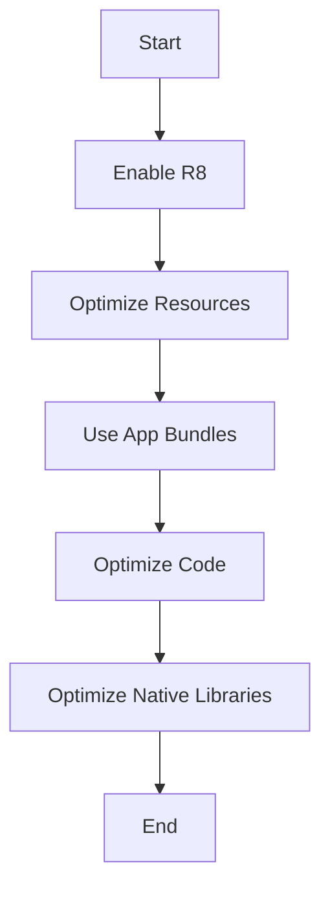

## 19.10 Reducing APK and App Size for Optimal Performance

As mobile applications grow in complexity, managing their size becomes crucial for ensuring optimal performance, faster downloads, and better user experience. In this section, we will explore various strategies to reduce APK and app size in Kotlin-based Android applications. We will delve into resource optimization, code shrinking using ProGuard and R8, and other advanced techniques that can significantly impact your app's footprint.

### Understanding APK Size

An APK (Android Package) is the file format used by Android to distribute and install applications. It contains all the necessary components, including code, resources, and assets. A larger APK can lead to slower downloads, increased data usage, and potential installation failures on devices with limited storage. Therefore, reducing APK size is essential for reaching a wider audience and improving app performance.

### Key Strategies for Reducing APK Size

#### 1. Code Shrinking with ProGuard and R8

**ProGuard** and **R8** are tools used to shrink, obfuscate, and optimize your code. They remove unused classes and methods, which can significantly reduce the size of your APK.

- **ProGuard**: A tool that analyzes and optimizes Java bytecode. It removes unused code, renames classes and methods to shorter names, and performs other optimizations.

- **R8**: The successor to ProGuard, integrated into the Android build process. R8 offers better performance and more advanced optimizations.

**Steps to Enable R8:**

1. **Enable Code Shrinking**: In your `build.gradle` file, set `minifyEnabled` to `true` in the `release` build type.

   ```kotlin
   android {
       buildTypes {
           release {
               minifyEnabled true
               proguardFiles getDefaultProguardFile('proguard-android-optimize.txt'), 'proguard-rules.pro'
           }
       }
   }
   ```

2. **Configure ProGuard Rules**: Customize the `proguard-rules.pro` file to specify which parts of your code should not be removed or obfuscated.

   ```proguard
   # Keep all public classes and methods
   -keep public class * {
       public *;
   }
   ```

3. **Test Your App**: After enabling R8, thoroughly test your app to ensure that no critical code has been removed.

#### 2. Resource Optimization

Resources such as images, layouts, and strings can contribute significantly to APK size. Optimizing these resources can lead to substantial size reductions.

- **Image Compression**: Use tools like **PNGCrush** or **WebP** format to compress images without losing quality.

- **Remove Unused Resources**: Use Android Studio's **Lint** tool to identify and remove unused resources.

- **Vector Drawables**: Replace raster images with vector drawables where possible. Vector drawables are scalable and often smaller in size.

- **Resource Splitting**: Use resource qualifiers to provide different resources for different device configurations, reducing the need to include all resources in every APK.

#### 3. Dynamic Delivery and App Bundles

**Android App Bundles** allow you to deliver optimized APKs for each device configuration, reducing the overall size of the download.

- **Dynamic Feature Modules**: Split your app into modules that can be downloaded on-demand, reducing the initial download size.

- **Play Feature Delivery**: Use Play Feature Delivery to control how and when feature modules are delivered to users.

#### 4. Code Optimization

- **Remove Unused Code**: Regularly review your codebase to identify and remove unused classes, methods, and libraries.

- **Use Kotlin's Language Features**: Leverage Kotlin's concise syntax and features like `data classes` and `extension functions` to reduce boilerplate code.

- **Optimize Libraries**: Use lightweight libraries and avoid including entire libraries if only a small part is needed.

#### 5. Native Libraries and NDK

If your app uses native libraries, ensure they are optimized for size.

- **ABI Splitting**: Use ABI splits to generate separate APKs for different CPU architectures, reducing the size of each APK.

- **Strip Debug Symbols**: Remove debug symbols from native libraries to reduce their size.

### Visualizing APK Size Reduction

To better understand the impact of these strategies, let's visualize the process of APK size reduction using a flowchart.



**Figure 1**: Flowchart illustrating the steps to reduce APK size.

### Code Example: Enabling R8 and ProGuard

Let's look at a practical example of enabling R8 and configuring ProGuard rules in a Kotlin project.

```kotlin
// build.gradle (Module: app)
android {
    compileSdkVersion 33
    defaultConfig {
        applicationId "com.example.myapp"
        minSdkVersion 21
        targetSdkVersion 33
        versionCode 1
        versionName "1.0"
    }
    buildTypes {
        release {
            minifyEnabled true
            proguardFiles getDefaultProguardFile('proguard-android-optimize.txt'), 'proguard-rules.pro'
        }
    }
}
```

```proguard
# Keep all public classes and methods
-keep public class * {
    public *;
}

-keep class com.example.myapp.MyClass {
    *;
}

-keepclasseswithmembers class * {
    native <methods>;
}
```

### Try It Yourself

To experiment with APK size reduction, try the following:

1. **Modify ProGuard Rules**: Add or remove rules in the `proguard-rules.pro` file and observe the impact on APK size.

2. **Enable Resource Shrinking**: Set `shrinkResources` to `true` in your `build.gradle` file and see how it affects the APK size.

3. **Test with Different Image Formats**: Convert some images to WebP format and compare the APK size before and after.

### Advanced Techniques

#### 1. Analyzing APK Content

Use tools like **APK Analyzer** in Android Studio to inspect the contents of your APK and identify large files or resources that can be optimized.

#### 2. Multi-APK Support

For apps targeting a wide range of devices, consider using **Multi-APK** to generate different APKs for different device configurations, such as screen density and CPU architecture.

#### 3. Obfuscation and Security

While reducing APK size, also consider the security benefits of obfuscation. ProGuard and R8 can help protect your code from reverse engineering.

### Knowledge Check

- **What is the primary purpose of R8 in Android development?**
- **How can vector drawables help reduce APK size?**
- **What is the benefit of using Android App Bundles?**

### Summary

Reducing APK and app size is a multifaceted process that involves optimizing code, resources, and delivery methods. By leveraging tools like ProGuard and R8, optimizing resources, and using modern delivery methods like Android App Bundles, you can significantly reduce your app's footprint, leading to faster downloads, better performance, and a wider reach.

Remember, this is just the beginning. As you continue to refine your app, keep experimenting with different strategies and tools to achieve the best results. Stay curious, and enjoy the journey of optimizing your Kotlin applications!

## Quiz Time!



### What is the primary purpose of R8 in Android development?

- [x] To shrink, obfuscate, and optimize code
- [ ] To increase APK size
- [ ] To manage app resources
- [ ] To enhance user interface design

> **Explanation:** R8 is used to shrink, obfuscate, and optimize code, which helps in reducing APK size.

### How can vector drawables help reduce APK size?

- [x] By replacing raster images with scalable vector graphics
- [ ] By increasing the number of images
- [ ] By adding more color depth
- [ ] By using larger file sizes

> **Explanation:** Vector drawables are scalable and often smaller in size compared to raster images, helping reduce APK size.

### What is the benefit of using Android App Bundles?

- [x] Delivering optimized APKs for each device configuration
- [ ] Increasing the initial download size
- [ ] Reducing app performance
- [ ] Adding more features to the app

> **Explanation:** Android App Bundles allow for delivering optimized APKs for each device configuration, reducing the overall size of the download.

### Which tool can you use to inspect the contents of your APK?

- [x] APK Analyzer
- [ ] R8
- [ ] ProGuard
- [ ] Android Studio

> **Explanation:** APK Analyzer is a tool in Android Studio used to inspect the contents of your APK.

### What does ABI splitting help achieve?

- [x] Generating separate APKs for different CPU architectures
- [ ] Increasing APK size
- [ ] Combining all resources into one APK
- [ ] Enhancing app security

> **Explanation:** ABI splitting generates separate APKs for different CPU architectures, reducing the size of each APK.

### Which file format is recommended for compressing images without losing quality?

- [x] WebP
- [ ] JPEG
- [ ] BMP
- [ ] TIFF

> **Explanation:** WebP is a file format that allows for compressing images without losing quality, helping reduce APK size.

### What is the role of ProGuard in APK size reduction?

- [x] Removing unused code and renaming classes and methods
- [ ] Adding more code to the APK
- [ ] Enhancing app security
- [ ] Improving user interface design

> **Explanation:** ProGuard removes unused code and renames classes and methods, which helps in reducing APK size.

### How can you enable resource shrinking in your `build.gradle` file?

- [x] Set `shrinkResources` to `true`
- [ ] Set `minifyEnabled` to `false`
- [ ] Set `debuggable` to `true`
- [ ] Set `proguardFiles` to `null`

> **Explanation:** Setting `shrinkResources` to `true` in your `build.gradle` file enables resource shrinking, which helps reduce APK size.

### What is the advantage of using dynamic feature modules?

- [x] Reducing the initial download size by downloading features on-demand
- [ ] Increasing the initial download size
- [ ] Enhancing app security
- [ ] Improving user interface design

> **Explanation:** Dynamic feature modules reduce the initial download size by allowing features to be downloaded on-demand.

### True or False: ProGuard and R8 can help protect your code from reverse engineering.

- [x] True
- [ ] False

> **Explanation:** ProGuard and R8 can obfuscate code, making it harder to reverse engineer, thus providing some level of protection.


