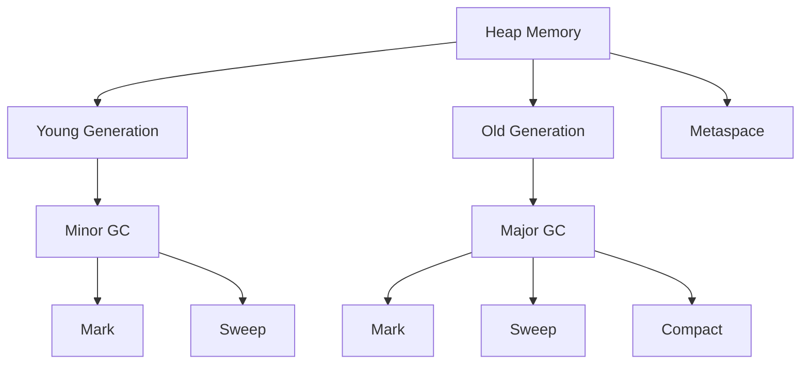

## 19.2 Memory Management

Memory management is a crucial aspect of software development, especially when dealing with languages like Kotlin that run on the Java Virtual Machine (JVM). Understanding how memory is allocated, managed, and reclaimed can significantly impact the performance and stability of your applications. In this section, we will delve into the intricacies of memory management in Kotlin, focusing on the JVM garbage collector, strategies to reduce memory leaks, and best practices for optimizing memory usage.

### Understanding the JVM Garbage Collector

The JVM garbage collector (GC) is responsible for automatically reclaiming memory by identifying and disposing of objects that are no longer in use. This process is vital for preventing memory leaks and ensuring efficient memory utilization. Let's explore how the garbage collector works and how you can leverage its features to optimize your Kotlin applications.

#### How Garbage Collection Works

Garbage collection in the JVM involves several key steps:

1. **Marking**: The GC identifies which objects are still reachable from the root set (e.g., static variables, active threads). This step involves traversing object references and marking those that are still in use.

2. **Sweeping**: Once the marking phase is complete, the GC sweeps through the heap to reclaim memory occupied by unmarked objects.

3. **Compacting**: Some garbage collectors also include a compacting phase, where the heap is reorganized to reduce fragmentation and improve allocation efficiency.

#### Types of Garbage Collectors

The JVM offers several garbage collectors, each with its own strengths and trade-offs. Here are some of the most commonly used collectors:

- **Serial GC**: A simple, single-threaded collector suitable for small applications with low throughput requirements.

- **Parallel GC**: A multi-threaded collector designed for applications that require high throughput. It can efficiently handle large heaps by utilizing multiple threads for garbage collection.

- **G1 GC (Garbage-First Garbage Collector)**: A low-pause collector that divides the heap into regions and prioritizes collecting regions with the most garbage. It is suitable for applications with large heaps and low-latency requirements.

- **ZGC (Z Garbage Collector)**: An experimental collector designed for ultra-low pause times. It can handle large heaps with minimal impact on application performance.

#### Configuring the Garbage Collector

You can configure the JVM garbage collector by using command-line options. For example, to use the G1 GC, you can start your application with the following option:

```bash
java -XX:+UseG1GC -jar your-application.jar
```

It's important to choose a garbage collector that aligns with your application's performance goals and workload characteristics.

### Reducing Memory Leaks

Memory leaks occur when objects that are no longer needed are not reclaimed by the garbage collector, leading to increased memory usage and potential application crashes. Here are some strategies to identify and reduce memory leaks in your Kotlin applications:

#### Identifying Memory Leaks

1. **Profiling Tools**: Use profiling tools like VisualVM, YourKit, or JProfiler to monitor memory usage and identify potential leaks. These tools provide insights into object allocation, heap usage, and garbage collection activity.

2. **Heap Dumps**: Analyze heap dumps to identify objects that are consuming excessive memory. Tools like Eclipse MAT (Memory Analyzer Tool) can help you visualize object retention paths and pinpoint memory leaks.

3. **Monitoring GC Logs**: Enable GC logging to track garbage collection activity and identify patterns that may indicate memory leaks. Use the following JVM option to enable GC logging:

   ```bash
   java -Xlog:gc* -jar your-application.jar
   ```

#### Common Causes of Memory Leaks

- **Unintentional Object References**: Holding references to objects that are no longer needed can prevent them from being garbage collected. Ensure that you nullify references or use weak references where appropriate.

- **Static Collections**: Storing objects in static collections can lead to memory leaks if the collection is not properly managed. Consider using weak references or explicitly clearing the collection when it's no longer needed.

- **Listeners and Callbacks**: Registering listeners or callbacks without properly unregistering them can cause memory leaks. Always ensure that listeners are removed when they are no longer needed.

#### Best Practices for Avoiding Memory Leaks

1. **Use Weak References**: When holding references to objects that may be garbage collected, consider using `WeakReference` or `SoftReference` to allow the GC to reclaim memory if needed.

2. **Avoid Static References**: Be cautious when using static variables to store references to objects. Static references can prevent objects from being garbage collected.

3. **Implement `AutoCloseable`**: For resources that need explicit cleanup (e.g., file handles, database connections), implement the `AutoCloseable` interface and use try-with-resources to ensure proper resource management.

4. **Use Kotlin's `use` Function**: Kotlin provides a `use` function that simplifies resource management by automatically closing resources when they are no longer needed. Here's an example:

   ```kotlin
   FileInputStream("file.txt").use { inputStream ->
       // Read from the input stream
   }
   ```

### Memory Management Best Practices

To optimize memory usage and improve application performance, consider the following best practices:

#### Optimize Object Allocation

- **Reuse Objects**: Reuse objects instead of creating new instances whenever possible. This reduces the overhead of object creation and garbage collection.

- **Use Primitive Types**: Prefer primitive types over boxed types (e.g., `Int` vs. `Integer`) to reduce memory overhead.

- **Avoid Unnecessary Object Creation**: Avoid creating unnecessary objects, such as temporary collections or intermediate data structures, especially in performance-critical code paths.

#### Manage Collections Efficiently

- **Choose the Right Collection Type**: Select the appropriate collection type based on your use case. For example, use `ArrayList` for dynamic arrays and `HashMap` for key-value pairs.

- **Specify Initial Capacity**: When creating collections, specify an initial capacity to reduce the need for resizing and reallocation.

- **Use Immutable Collections**: Use immutable collections to prevent accidental modifications and reduce memory usage.

#### Leverage Kotlin Features

- **Data Classes**: Use data classes for simple data structures. They provide concise syntax and automatically generate useful methods like `equals`, `hashCode`, and `toString`.

- **Lazy Initialization**: Use Kotlin's `lazy` delegation for properties that are expensive to initialize. This ensures that the property is only initialized when it's first accessed.

  ```kotlin
  val expensiveResource by lazy {
      // Initialize the resource
  }
  ```

- **Sealed Classes**: Use sealed classes to represent restricted class hierarchies. They provide better type safety and can help reduce memory usage by limiting the number of subclasses.

### Advanced Memory Management Techniques

For expert developers looking to further optimize memory usage, consider the following advanced techniques:

#### Escape Analysis

Escape analysis is a technique used by the JVM to determine if an object can be safely allocated on the stack instead of the heap. This can reduce garbage collection overhead and improve performance. While escape analysis is performed automatically by the JVM, writing code that minimizes object escape can help the JVM optimize memory allocation.

#### Object Pooling

Object pooling involves reusing objects from a pool instead of creating new instances. This can reduce the overhead of object creation and garbage collection, especially for frequently used objects. Here's an example of a simple object pool in Kotlin:

```kotlin
class ObjectPool<T>(private val factory: () -> T) {
    private val pool = mutableListOf<T>()

    fun acquire(): T {
        return if (pool.isNotEmpty()) {
            pool.removeAt(pool.size - 1)
        } else {
            factory()
        }
    }

    fun release(obj: T) {
        pool.add(obj)
    }
}

// Usage
val stringPool = ObjectPool { StringBuilder() }
val sb = stringPool.acquire()
sb.append("Hello, World!")
stringPool.release(sb)
```

#### Memory Profiling and Optimization

Regularly profile your application to identify memory usage patterns and potential bottlenecks. Use tools like VisualVM, YourKit, or JProfiler to analyze memory allocation and garbage collection activity. Optimize your code based on profiling results to reduce memory usage and improve performance.

### Visualizing Memory Management

To better understand the memory management process, let's visualize the JVM's heap structure and garbage collection phases using a Mermaid.js diagram:



**Diagram Description:** This diagram illustrates the JVM's heap memory structure, divided into the Young Generation, Old Generation, and Metaspace. Garbage collection phases include Minor GC for the Young Generation and Major GC for the Old Generation, with steps for marking, sweeping, and compacting.

### Try It Yourself

Experiment with the concepts discussed in this section by modifying the provided code examples. For instance, try implementing a custom object pool for a different type of object or use profiling tools to analyze the memory usage of your own Kotlin applications.

### References and Further Reading

- [Java Memory Management](https://docs.oracle.com/javase/specs/jvms/se8/html/jvms-2.html) - Oracle Documentation
- [Kotlin Language Documentation](https://kotlinlang.org/docs/reference/) - Kotlin Official Documentation
- [VisualVM](https://visualvm.github.io/) - A tool for monitoring and profiling Java applications

### Knowledge Check

To reinforce your understanding of memory management in Kotlin, consider the following questions and challenges:

- What are the key phases of garbage collection in the JVM?
- How can you identify and reduce memory leaks in a Kotlin application?
- What are some best practices for optimizing memory usage in Kotlin?
- How does escape analysis help improve memory allocation efficiency?
- Implement a simple object pool for a frequently used object in your application.

### Embrace the Journey

Remember, mastering memory management is an ongoing journey. As you continue to develop and optimize your Kotlin applications, keep experimenting with different techniques and tools to achieve the best performance. Stay curious, and enjoy the process of becoming an expert in memory management!

## Quiz Time!



### What is the primary purpose of the JVM garbage collector?

- [x] To automatically reclaim memory by disposing of objects that are no longer in use.
- [ ] To manually manage memory allocation and deallocation.
- [ ] To increase the speed of the JVM by optimizing bytecode execution.
- [ ] To provide a graphical interface for monitoring memory usage.

> **Explanation:** The JVM garbage collector automatically reclaims memory by identifying and disposing of objects that are no longer in use, preventing memory leaks and optimizing memory utilization.

### Which garbage collector is designed for ultra-low pause times?

- [ ] Serial GC
- [ ] Parallel GC
- [ ] G1 GC
- [x] ZGC

> **Explanation:** The Z Garbage Collector (ZGC) is designed for ultra-low pause times, making it suitable for applications that require minimal impact on performance.

### What is a common cause of memory leaks in Kotlin applications?

- [ ] Using primitive types instead of boxed types.
- [x] Holding references to objects that are no longer needed.
- [ ] Using immutable collections.
- [ ] Implementing the `AutoCloseable` interface.

> **Explanation:** Memory leaks often occur when objects that are no longer needed are still referenced, preventing them from being garbage collected.

### How can you enable GC logging in a JVM application?

- [ ] By using the `-Xms` option.
- [x] By using the `-Xlog:gc*` option.
- [ ] By setting the `-XX:+UseParallelGC` option.
- [ ] By configuring the `-XX:MaxMetaspaceSize` option.

> **Explanation:** The `-Xlog:gc*` option enables GC logging, allowing you to track garbage collection activity and identify potential memory leaks.

### What is the benefit of using Kotlin's `use` function?

- [ ] It automatically optimizes memory allocation.
- [x] It ensures proper resource management by closing resources when they are no longer needed.
- [ ] It increases the performance of the JVM garbage collector.
- [ ] It simplifies the syntax for creating collections.

> **Explanation:** Kotlin's `use` function simplifies resource management by automatically closing resources when they are no longer needed, preventing resource leaks.

### What is escape analysis used for in the JVM?

- [ ] To identify memory leaks in applications.
- [x] To determine if an object can be safely allocated on the stack.
- [ ] To optimize the performance of garbage collection.
- [ ] To increase the size of the heap memory.

> **Explanation:** Escape analysis is used by the JVM to determine if an object can be safely allocated on the stack instead of the heap, reducing garbage collection overhead.

### Which of the following is a best practice for managing collections efficiently?

- [ ] Always use `HashMap` for all key-value pairs.
- [x] Specify an initial capacity when creating collections.
- [ ] Use mutable collections to allow for flexibility.
- [ ] Avoid using collections in performance-critical code paths.

> **Explanation:** Specifying an initial capacity when creating collections can reduce the need for resizing and reallocation, improving memory efficiency.

### What is the purpose of object pooling?

- [ ] To increase the number of objects created in an application.
- [ ] To reduce the need for garbage collection.
- [x] To reuse objects from a pool instead of creating new instances.
- [ ] To automatically manage memory allocation and deallocation.

> **Explanation:** Object pooling involves reusing objects from a pool instead of creating new instances, reducing the overhead of object creation and garbage collection.

### How can you analyze heap dumps to identify memory leaks?

- [ ] By using the `-Xms` option.
- [ ] By configuring the `-XX:MaxMetaspaceSize` option.
- [x] By using tools like Eclipse MAT (Memory Analyzer Tool).
- [ ] By enabling the `-XX:+UseParallelGC` option.

> **Explanation:** Tools like Eclipse MAT (Memory Analyzer Tool) can help you analyze heap dumps to identify objects consuming excessive memory and pinpoint memory leaks.

### True or False: Static references can prevent objects from being garbage collected.

- [x] True
- [ ] False

> **Explanation:** Static references can prevent objects from being garbage collected because they remain in memory for the lifetime of the application, potentially leading to memory leaks.




