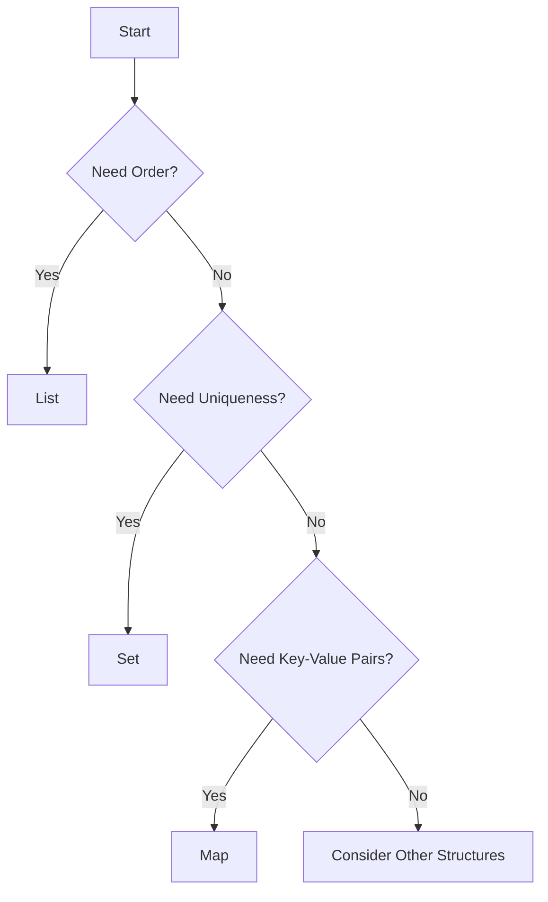

## 19.3 Efficient Use of Collections

In modern software development, efficient data handling is crucial for performance optimization. Kotlin, with its rich set of collection types and features, offers developers the tools to manage data effectively. In this section, we will delve into the efficient use of collections in Kotlin, focusing on choosing the right collection types and avoiding unnecessary allocations. Let's embark on this journey to enhance our understanding and mastery of Kotlin collections.

### Understanding Kotlin Collections

Kotlin collections are a powerful feature that allows developers to store, retrieve, and manipulate data efficiently. They are divided into two main categories: mutable and immutable collections. Immutable collections cannot be modified after their creation, whereas mutable collections can be changed.

#### Immutable Collections

Immutable collections are preferred when you want to ensure that the data remains unchanged throughout the program. They are thread-safe and can be shared across multiple threads without synchronization issues. Common immutable collections in Kotlin include:

- **List**: An ordered collection of elements.
- **Set**: A collection of unique elements.
- **Map**: A collection of key-value pairs.

#### Mutable Collections

Mutable collections allow modifications such as adding, removing, or updating elements. They are useful when the data needs to be dynamic. Common mutable collections in Kotlin include:

- **MutableList**: A list that supports modification.
- **MutableSet**: A set that allows adding and removing elements.
- **MutableMap**: A map that supports updating key-value pairs.

### Choosing the Right Collection Type

Choosing the right collection type is crucial for performance optimization. Each collection type has its own characteristics and use cases. Let's explore how to choose the appropriate collection for your needs.

#### Lists vs. Sets

- **Lists** are ideal when the order of elements matters or when you need to access elements by index. They allow duplicate elements.
- **Sets** are suitable when you need to ensure uniqueness of elements. They do not maintain any specific order.

#### Maps

Maps are perfect for scenarios where you need to associate keys with values. They provide efficient retrieval of values based on keys. Use maps when you need fast lookups.

### Avoiding Unnecessary Allocations

Unnecessary allocations can lead to increased memory usage and reduced performance. Here are some strategies to avoid them:

#### Use Lazy Initialization

Lazy initialization defers the creation of an object until it is needed. This can save memory and improve performance. In Kotlin, you can use the `lazy` keyword for lazy initialization.

```kotlin
val expensiveObject: ExpensiveClass by lazy {
    ExpensiveClass()
}
```

#### Prefer Immutable Collections

Immutable collections can help avoid unnecessary allocations by preventing modifications. Use immutable collections whenever possible to ensure data integrity and reduce memory usage.

#### Use Efficient Data Structures

Choose data structures that are optimized for your specific use case. For example, use `ArrayList` for fast random access and `LinkedList` for frequent insertions and deletions.

### Code Examples

Let's explore some code examples to illustrate the efficient use of collections in Kotlin.

#### Example 1: Choosing Between List and Set

```kotlin
fun main() {
    // Using a List to maintain order
    val fruitsList = listOf("Apple", "Banana", "Apple")
    println("List: $fruitsList") // Output: List: [Apple, Banana, Apple]

    // Using a Set to ensure uniqueness
    val fruitsSet = setOf("Apple", "Banana", "Apple")
    println("Set: $fruitsSet") // Output: Set: [Apple, Banana]
}
```

#### Example 2: Using Lazy Initialization

```kotlin
class ExpensiveClass {
    init {
        println("ExpensiveClass initialized")
    }
}

fun main() {
    val expensiveObject: ExpensiveClass by lazy {
        ExpensiveClass()
    }

    println("Before accessing expensiveObject")
    println(expensiveObject) // ExpensiveClass initialized
    println("After accessing expensiveObject")
}
```

### Visualizing Collection Choices

To better understand the decision-making process for choosing collections, let's visualize it using a flowchart.



**Figure 1:** Flowchart for Choosing Collection Types

### Design Considerations

When working with collections, consider the following design aspects:

- **Thread Safety**: Use immutable collections in multi-threaded environments to avoid synchronization issues.
- **Performance**: Choose collections that offer the best performance for your operations (e.g., `ArrayList` for random access).
- **Memory Usage**: Avoid unnecessary allocations by using lazy initialization and efficient data structures.

### Differences and Similarities

While lists and sets may seem similar, they serve different purposes. Lists maintain order and allow duplicates, whereas sets ensure uniqueness. Maps, on the other hand, provide a key-value association, which is distinct from both lists and sets.

### Try It Yourself

Experiment with the code examples provided. Try modifying the collections to see how changes affect the output. For instance, add more elements to the list and set, or change the initialization of the `ExpensiveClass`.

### Knowledge Check

- What is the difference between mutable and immutable collections?
- When should you use a set instead of a list?
- How does lazy initialization help in performance optimization?

### Summary

In this section, we've explored the efficient use of collections in Kotlin. By choosing the right collection types and avoiding unnecessary allocations, we can optimize performance and memory usage. Remember, this is just the beginning. As you progress, you'll discover more advanced techniques for managing collections efficiently. Keep experimenting, stay curious, and enjoy the journey!

## Quiz Time!



### What is the main advantage of using immutable collections?

- [x] They are thread-safe and prevent data modification.
- [ ] They allow for dynamic data changes.
- [ ] They are always faster than mutable collections.
- [ ] They use more memory than mutable collections.

> **Explanation:** Immutable collections are thread-safe and prevent data modification, making them ideal for concurrent environments.

### When should you prefer a Set over a List?

- [x] When you need to ensure elements are unique.
- [ ] When you need to maintain the order of elements.
- [ ] When you need to access elements by index.
- [ ] When you need to allow duplicate elements.

> **Explanation:** Sets ensure uniqueness of elements, making them suitable when duplicates are not allowed.

### What is lazy initialization used for?

- [x] Deferring object creation until it is needed.
- [ ] Creating objects immediately.
- [ ] Increasing memory usage.
- [ ] Making objects immutable.

> **Explanation:** Lazy initialization defers object creation until it is needed, saving memory and improving performance.

### Which collection type is best for key-value pair storage?

- [ ] List
- [ ] Set
- [x] Map
- [ ] Array

> **Explanation:** Maps are designed for storing key-value pairs, providing efficient retrieval based on keys.

### What is a key benefit of using immutable collections in multi-threaded environments?

- [x] They avoid synchronization issues.
- [ ] They allow for frequent data changes.
- [ ] They are always faster than mutable collections.
- [ ] They require more memory.

> **Explanation:** Immutable collections avoid synchronization issues, making them safe for use in multi-threaded environments.

### How can you avoid unnecessary allocations in Kotlin?

- [x] Use lazy initialization.
- [ ] Use only mutable collections.
- [ ] Avoid using collections altogether.
- [ ] Use global variables.

> **Explanation:** Lazy initialization helps avoid unnecessary allocations by deferring object creation until needed.

### What is the difference between a List and a Set?

- [x] Lists allow duplicates; Sets ensure uniqueness.
- [ ] Sets maintain order; Lists do not.
- [ ] Lists are always faster than Sets.
- [ ] Sets allow duplicates; Lists ensure uniqueness.

> **Explanation:** Lists allow duplicates and maintain order, while Sets ensure uniqueness and do not maintain order.

### Which Kotlin keyword is used for lazy initialization?

- [x] lazy
- [ ] lateinit
- [ ] val
- [ ] var

> **Explanation:** The `lazy` keyword is used for lazy initialization in Kotlin.

### What is the purpose of a Map in Kotlin?

- [x] To store key-value pairs.
- [ ] To maintain a list of elements.
- [ ] To ensure uniqueness of elements.
- [ ] To provide random access to elements.

> **Explanation:** Maps are used to store key-value pairs, allowing efficient retrieval based on keys.

### True or False: Immutable collections can be modified after creation.

- [ ] True
- [x] False

> **Explanation:** Immutable collections cannot be modified after creation, ensuring data integrity.


