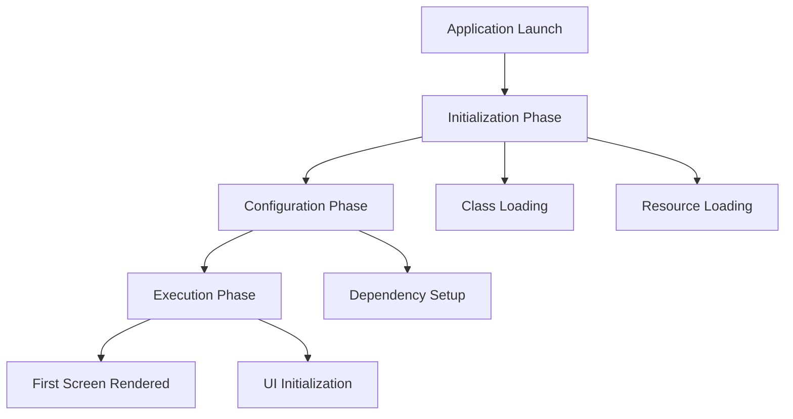

## 19.4 Improving Startup Time

In the fast-paced world of software development, application startup time is a critical factor that can significantly impact user experience. A slow startup can lead to user frustration, decreased engagement, and ultimately, a loss of users. As expert software engineers and architects, it is essential to understand and implement strategies to optimize startup time, particularly in Kotlin applications. This section will delve into various techniques to achieve faster launching, with a focus on application modularization and other performance-enhancing strategies.

### Understanding Startup Time

Before diving into optimization techniques, it's crucial to understand what contributes to startup time. Startup time is the duration it takes for an application to become responsive after being launched. It can be divided into several phases:

1. **Initialization Phase**: This involves loading and initializing classes and resources.
2. **Configuration Phase**: Setting up configurations and dependencies.
3. **Execution Phase**: Running the initial code to render the first screen or perform initial tasks.

Each phase presents opportunities for optimization, and understanding these can help in identifying bottlenecks.

### Techniques for Faster Launching

#### 1. Application Modularization

**Application modularization** is a technique that involves breaking down an application into smaller, independent modules. This approach offers several benefits, including improved startup time, as it allows for lazy loading of modules only when needed.

##### Benefits of Modularization

- **Improved Maintainability**: Smaller modules are easier to manage and maintain.
- **Faster Build Times**: Changes in one module don't require recompiling the entire application.
- **Lazy Loading**: Load only necessary modules at startup, deferring others until needed.

##### Implementing Modularization in Kotlin

To implement modularization in a Kotlin application, follow these steps:

1. **Identify Modules**: Determine which parts of your application can be separated into modules. Common candidates include features, libraries, and services.

2. **Define Module Boundaries**: Clearly define the responsibilities and interfaces of each module. This ensures that modules can function independently.

3. **Use Gradle for Module Management**: Gradle is a powerful build tool that supports modularization. Define each module as a separate Gradle project and manage dependencies between them.

4. **Implement Lazy Loading**: Use techniques such as dependency injection and service locators to load modules only when needed.

```kotlin
// Example of defining a module in Gradle
// settings.gradle.kts
include(":app", ":featureA", ":featureB")

// build.gradle.kts for featureA
plugins {
    kotlin("android")
}

dependencies {
    implementation(project(":app"))
    // Other dependencies
}
```

5. **Refactor Code**: Refactor your codebase to align with the new module structure. This may involve moving classes and resources to their respective modules.

##### Challenges and Considerations

- **Increased Complexity**: Modularization can introduce complexity in managing dependencies and interfaces between modules.
- **Overhead in Initial Setup**: Setting up modularization requires an initial investment of time and effort.
- **Testing**: Ensure that each module is independently testable and that integration tests cover interactions between modules.

#### 2. Optimize Resource Loading

Resource loading is a significant contributor to startup time. Optimizing how resources are loaded can lead to substantial improvements.

- **Use Asynchronous Loading**: Load resources asynchronously to avoid blocking the main thread.
- **Optimize Image Resources**: Use efficient image formats and compress images to reduce loading time.
- **Minimize Resource Usage**: Only load resources that are necessary for the initial screen.

```kotlin
// Example of asynchronous resource loading
fun loadImageAsync(url: String, callback: (Bitmap) -> Unit) {
    GlobalScope.launch(Dispatchers.IO) {
        val bitmap = loadImageFromNetwork(url)
        withContext(Dispatchers.Main) {
            callback(bitmap)
        }
    }
}
```

#### 3. Reduce Class Loading

Class loading can be a time-consuming process, especially in large applications. Reducing the number of classes loaded at startup can improve performance.

- **Minimize Static Initializers**: Static initializers are executed when a class is loaded. Minimize their use to reduce class loading time.
- **Use ProGuard/R8**: These tools can shrink and optimize your code, reducing the number of classes and methods.

#### 4. Optimize Dependency Management

Dependencies can significantly impact startup time. Optimizing how dependencies are managed can lead to faster launches.

- **Use Dependency Injection**: Tools like Dagger or Koin can help manage dependencies efficiently, allowing for lazy initialization.
- **Avoid Unnecessary Dependencies**: Regularly review and remove unused dependencies.

```kotlin
// Example of using Koin for dependency injection
val appModule = module {
    single { NetworkService() }
    factory { UserRepository(get()) }
}

startKoin {
    modules(appModule)
}
```

#### 5. Profile and Analyze Startup Performance

Profiling tools can help identify bottlenecks in your startup process. Use these tools to analyze and optimize performance.

- **Android Profiler**: Use Android Studio's profiler to monitor CPU, memory, and network usage during startup.
- **Custom Logging**: Implement custom logging to track the time taken by different startup phases.

```kotlin
// Example of custom logging for startup phases
val startTime = System.currentTimeMillis()

fun logStartupPhase(phase: String) {
    val currentTime = System.currentTimeMillis()
    Log.d("StartupTime", "$phase took ${currentTime - startTime} ms")
}
```

#### 6. Minimize Application Size

A smaller application size can lead to faster loading times. Techniques to reduce application size include:

- **Code Shrinking**: Use ProGuard/R8 to remove unused code and resources.
- **Resource Optimization**: Compress and optimize resources such as images and XML files.

#### 7. Use Kotlin-Specific Features

Kotlin offers several features that can help improve startup time:

- **Coroutines**: Use coroutines for asynchronous operations, reducing the load on the main thread.
- **Inline Functions**: Use inline functions to reduce overhead and improve performance.

```kotlin
// Example of using coroutines for asynchronous operations
fun fetchData() {
    GlobalScope.launch(Dispatchers.IO) {
        val data = networkService.getData()
        withContext(Dispatchers.Main) {
            updateUI(data)
        }
    }
}
```

### Visualizing the Startup Process

To better understand the startup process and identify optimization opportunities, let's visualize it using a flowchart.



**Figure 1: Visualizing the Startup Process**

This flowchart illustrates the typical startup process of an application, highlighting key phases and tasks. By optimizing each phase, we can achieve faster startup times.

### Knowledge Check

- **What is application modularization, and how does it improve startup time?**
- **List three techniques to optimize resource loading.**
- **How can dependency injection help in reducing startup time?**

### Try It Yourself

Experiment with the following tasks to apply what you've learned:

1. **Modularize a Sample Application**: Take a simple Kotlin application and break it into modules. Implement lazy loading for non-essential modules.

2. **Profile Startup Performance**: Use Android Studio's profiler to analyze the startup performance of an application. Identify and optimize bottlenecks.

3. **Optimize Resource Loading**: Implement asynchronous resource loading in a sample application. Measure the impact on startup time.

### Conclusion

Improving startup time is a crucial aspect of performance optimization in Kotlin applications. By implementing techniques such as application modularization, optimizing resource loading, and managing dependencies efficiently, we can achieve faster launches and enhance user experience. Remember, this is just the beginning. As you continue to explore and experiment with these techniques, you'll discover new ways to optimize and improve your applications.

## Quiz Time!



### What is the primary benefit of application modularization?

- [x] Improved maintainability and faster startup time
- [ ] Increased application size
- [ ] Slower build times
- [ ] Reduced code readability

> **Explanation:** Application modularization improves maintainability and allows for lazy loading, which can lead to faster startup times.

### Which tool can be used to shrink and optimize Kotlin code?

- [x] ProGuard/R8
- [ ] Kotlin Compiler
- [ ] Android Profiler
- [ ] Gradle

> **Explanation:** ProGuard/R8 are tools used to shrink and optimize code by removing unused classes and methods.

### How can coroutines help improve startup time?

- [x] By allowing asynchronous operations, reducing the load on the main thread
- [ ] By increasing the number of threads
- [ ] By blocking the main thread
- [ ] By simplifying code syntax

> **Explanation:** Coroutines enable asynchronous operations, which can reduce the load on the main thread and improve startup time.

### What is a common technique to optimize resource loading?

- [x] Asynchronous loading
- [ ] Synchronous loading
- [ ] Increasing resource size
- [ ] Using static initializers

> **Explanation:** Asynchronous loading allows resources to be loaded without blocking the main thread, optimizing startup time.

### Which phase involves setting up configurations and dependencies?

- [x] Configuration Phase
- [ ] Initialization Phase
- [ ] Execution Phase
- [ ] Rendering Phase

> **Explanation:** The Configuration Phase involves setting up configurations and dependencies necessary for the application.

### What is the impact of minimizing static initializers?

- [x] Reduced class loading time
- [ ] Increased application size
- [ ] Slower execution
- [ ] Improved UI rendering

> **Explanation:** Minimizing static initializers reduces class loading time, contributing to faster startup.

### How can dependency injection frameworks like Koin help during startup?

- [x] By managing dependencies efficiently and allowing lazy initialization
- [ ] By increasing the number of dependencies
- [ ] By blocking dependency loading
- [ ] By simplifying code syntax

> **Explanation:** Dependency injection frameworks manage dependencies efficiently, allowing for lazy initialization and reducing startup time.

### What is a benefit of using inline functions in Kotlin?

- [x] Reduced overhead and improved performance
- [ ] Increased code complexity
- [ ] Slower execution
- [ ] Larger application size

> **Explanation:** Inline functions reduce overhead by eliminating the need for function calls, improving performance.

### Which tool can be used to monitor CPU, memory, and network usage during startup?

- [x] Android Profiler
- [ ] Kotlin Compiler
- [ ] ProGuard/R8
- [ ] Gradle

> **Explanation:** Android Profiler is a tool used to monitor CPU, memory, and network usage, helping identify performance bottlenecks.

### True or False: Lazy loading involves loading all modules at startup.

- [ ] True
- [x] False

> **Explanation:** Lazy loading involves loading only necessary modules at startup, deferring others until needed.



Remember, optimizing startup time is an ongoing process. Keep experimenting, stay curious, and enjoy the journey of creating efficient and responsive applications!
