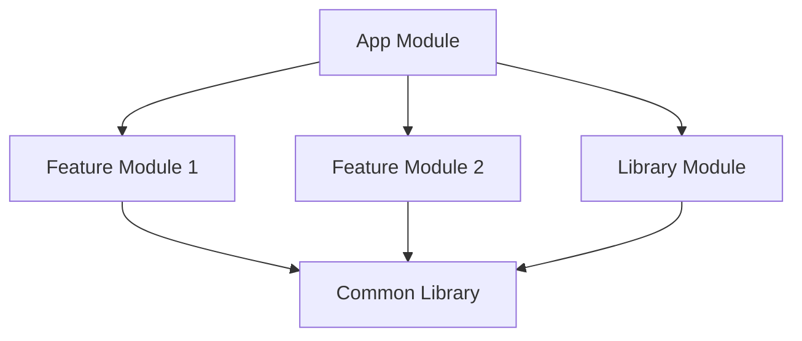

## 19.5 Reducing Method Count

As Android applications grow in complexity, developers often encounter the 64K method limit imposed by the Dalvik Executable (DEX) format. This constraint can lead to build failures and performance issues if not addressed. In this section, we will explore various strategies and techniques to manage and reduce method count in Android applications, ensuring optimal performance and maintainability.

### Understanding the 64K Method Limit

The 64K method limit is a constraint of the DEX file format, which is used by the Android runtime to execute applications. Each DEX file can contain a maximum of 65,536 methods, including those from the application itself and any libraries it depends on. When this limit is exceeded, developers may encounter the dreaded "DexIndexOverflowException."

#### Why Does the 64K Limit Exist?

The 64K method limit originates from the design of the DEX file format, which uses a 16-bit index to reference methods. This design choice was made to optimize for speed and memory usage, but it also imposes a hard limit on the number of methods that can be included in a single DEX file.

### Strategies for Reducing Method Count

To effectively manage method count, developers can employ several strategies. These include optimizing code, leveraging ProGuard or R8 for code shrinking, modularizing the application, and using multidex support.

#### Code Optimization

1. **Remove Unused Code**: Identify and eliminate any unused classes, methods, or libraries. Tools like Lint and IDE inspections can help detect dead code.

2. **Refactor and Simplify**: Refactor complex methods into simpler, more concise versions. Use Kotlin's expressive syntax to reduce boilerplate code.

3. **Use Kotlin Features**: Leverage Kotlin's features such as extension functions, data classes, and higher-order functions to reduce the number of methods.

4. **Avoid Overusing Annotations**: Annotations can generate additional methods at compile time. Use them judiciously.

#### Code Shrinking with ProGuard/R8

ProGuard and R8 are tools that can significantly reduce method count by shrinking, obfuscating, and optimizing the code.

- **ProGuard**: A tool that removes unused code and optimizes the remaining code. It also obfuscates the code to make it harder to reverse-engineer.

- **R8**: The default code shrinker for Android, which performs the same tasks as ProGuard but with improved performance and additional optimizations.

**Configuration Example:**

```proguard
-keep class com.example.myapp.** { *; }
-dontwarn com.example.myapp.**
```

**Try It Yourself**: Experiment with different ProGuard rules to see how they affect the method count. Start with a simple configuration and gradually add more rules as needed.

#### Modularization

Breaking down an application into smaller, reusable modules can help manage method count. Each module can be compiled into a separate DEX file, allowing the application to exceed the 64K limit.

- **Feature Modules**: Separate features into distinct modules, which can be loaded on demand.

- **Library Modules**: Extract common functionality into library modules that can be shared across multiple applications.

**Visualizing Modularization in Android Projects**



**Diagram Description**: This diagram illustrates how an Android application can be modularized into an app module, feature modules, and library modules, with common libraries shared across modules.

#### Multidex Support

When all else fails, enabling multidex support allows an application to use multiple DEX files, effectively bypassing the 64K limit.

- **Enable Multidex**: Add the `multidex` dependency to your `build.gradle` file and configure your application to support multidex.

```groovy
dependencies {
    implementation 'androidx.multidex:multidex:2.0.1'
}

android {
    defaultConfig {
        multiDexEnabled true
    }
}
```

**Design Considerations**: While multidex can solve the method limit issue, it may introduce performance overhead during app startup. Consider using it as a last resort after optimizing and modularizing the application.

### Differences and Similarities with Other Patterns

Reducing method count shares similarities with other performance optimization patterns, such as lazy loading and resource management. However, it specifically targets the method limit constraint in Android applications.

### Key Participants in Method Count Reduction

- **Developers**: Responsible for optimizing code and configuring build tools.
- **Build Tools**: ProGuard, R8, and Gradle play crucial roles in managing method count.
- **Android Runtime**: Executes the application and enforces the method limit.

### Applicability

Reducing method count is applicable to any Android application approaching the 64K method limit. It is especially relevant for large applications with numerous dependencies.

### Sample Code Snippet

Here's a simple example demonstrating how to use Kotlin's features to reduce method count:

```kotlin
// Using extension functions to reduce boilerplate
fun String.isValidEmail(): Boolean {
    return this.contains("@") && this.contains(".")
}

// Using data classes to simplify data representation
data class User(val name: String, val email: String)

// Using higher-order functions to reduce method count
fun List<User>.filterValidEmails(): List<User> {
    return this.filter { it.email.isValidEmail() }
}
```

### Design Considerations

- **When to Use**: Apply method count reduction techniques when approaching the 64K limit or when optimizing for performance.
- **Important Considerations**: Balance code readability and maintainability with method count reduction. Avoid excessive obfuscation that could hinder debugging.

### Knowledge Check

- **Question**: What is the primary cause of the 64K method limit in Android applications?
- **Question**: How can ProGuard help in reducing method count?
- **Question**: What are the potential downsides of enabling multidex support?

### Embrace the Journey

Reducing method count is a critical aspect of Android development, especially as applications grow in complexity. By employing the strategies outlined in this guide, developers can overcome the 64K method limit and ensure their applications remain performant and maintainable. Remember, this is just the beginning. As you progress, you'll discover new techniques and tools to further optimize your applications. Keep experimenting, stay curious, and enjoy the journey!

## Quiz Time!



### What is the primary cause of the 64K method limit in Android applications?

- [x] The 16-bit index used by the DEX file format
- [ ] The size of the APK file
- [ ] The number of classes in the application
- [ ] The number of resources in the application

> **Explanation:** The 64K method limit is due to the 16-bit index used by the DEX file format to reference methods.

### How can ProGuard help in reducing method count?

- [x] By removing unused code and optimizing the remaining code
- [ ] By increasing the number of DEX files
- [ ] By adding more annotations
- [ ] By converting Java code to Kotlin

> **Explanation:** ProGuard helps reduce method count by removing unused code and optimizing the remaining code.

### What is a potential downside of enabling multidex support?

- [x] Increased app startup time
- [ ] Reduced code readability
- [ ] Increased method count
- [ ] Decreased app size

> **Explanation:** Enabling multidex support can increase app startup time due to the overhead of loading multiple DEX files.

### Which Kotlin feature can help reduce method count by simplifying data representation?

- [x] Data classes
- [ ] Sealed classes
- [ ] Companion objects
- [ ] Inline classes

> **Explanation:** Data classes in Kotlin simplify data representation, which can help reduce method count.

### What is a benefit of modularizing an Android application?

- [x] It allows for separate DEX files for each module
- [ ] It increases the number of methods
- [ ] It decreases code readability
- [ ] It reduces the number of classes

> **Explanation:** Modularizing an Android application allows for separate DEX files for each module, helping manage method count.

### Which tool is the default code shrinker for Android?

- [x] R8
- [ ] ProGuard
- [ ] Gradle
- [ ] Lint

> **Explanation:** R8 is the default code shrinker for Android, performing tasks similar to ProGuard with additional optimizations.

### What is a common technique to identify unused code in an Android project?

- [x] Using Lint and IDE inspections
- [ ] Adding more annotations
- [ ] Enabling multidex support
- [ ] Increasing the number of DEX files

> **Explanation:** Lint and IDE inspections can help identify unused code in an Android project.

### What is the role of the Android runtime in method count management?

- [x] It executes the application and enforces the method limit
- [ ] It compiles the application code
- [ ] It increases the number of methods
- [ ] It manages application resources

> **Explanation:** The Android runtime executes the application and enforces the 64K method limit.

### Which Kotlin feature can reduce method count by adding functionality to existing classes?

- [x] Extension functions
- [ ] Companion objects
- [ ] Inline classes
- [ ] Sealed classes

> **Explanation:** Extension functions in Kotlin add functionality to existing classes, which can help reduce method count.

### True or False: Modularization can help manage method count by allowing separate DEX files for each module.

- [x] True
- [ ] False

> **Explanation:** True. Modularization allows for separate DEX files for each module, helping manage method count.


