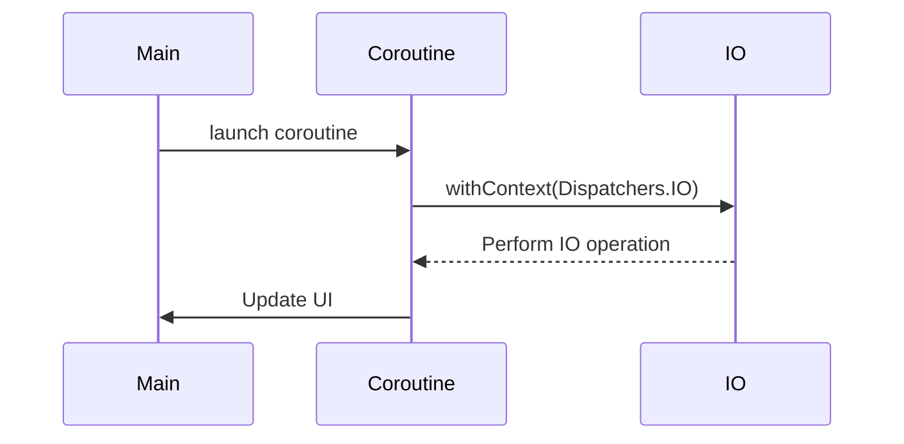

## 19.6 Optimizing Coroutines

In the ever-evolving landscape of software development, optimizing coroutines in Kotlin stands as a cornerstone for building high-performance, responsive applications. Coroutines offer a powerful abstraction for asynchronous programming, enabling developers to write non-blocking code that is both concise and expressive. However, leveraging coroutines to their full potential requires a deep understanding of their mechanics and best practices. In this section, we will explore strategies for optimizing coroutine usage, focusing on efficient use of suspending functions and avoiding blocking calls.

### Understanding Kotlin Coroutines

Before diving into optimization techniques, let's briefly revisit what coroutines are and how they function in Kotlin. Coroutines are a design pattern for asynchronous programming that allows you to write code that appears synchronous while being non-blocking. They are lightweight, meaning you can run thousands of coroutines without exhausting system resources.

#### Key Concepts

- **Suspending Functions**: Functions that can be paused and resumed later. They are marked with the `suspend` keyword and can only be called from other suspending functions or coroutine builders.
- **Coroutine Builders**: Functions like `launch`, `async`, and `runBlocking` that start coroutines.
- **Coroutine Context**: A set of elements that define the behavior of a coroutine, including its dispatcher, job, and more.
- **Dispatchers**: Control the thread on which a coroutine runs. Common dispatchers include `Dispatchers.Main`, `Dispatchers.IO`, and `Dispatchers.Default`.

### Efficient Use of Suspending Functions

Suspending functions are at the heart of coroutine-based programming. They allow you to perform long-running tasks without blocking the main thread. To optimize their use, consider the following strategies:

#### 1. Minimize Suspension Points

Each suspension point in a coroutine introduces overhead. While suspension points are necessary for non-blocking operations, excessive use can degrade performance. Aim to minimize the number of suspension points by combining operations where possible.

```kotlin
suspend fun fetchData(): Data {
    val part1 = fetchPart1() // Suspension point
    val part2 = fetchPart2() // Suspension point
    return combine(part1, part2)
}
```

**Optimization Tip**: If `fetchPart1` and `fetchPart2` can be executed independently, consider using `async` to run them concurrently and reduce suspension overhead.

```kotlin
suspend fun fetchData(): Data = coroutineScope {
    val part1 = async { fetchPart1() }
    val part2 = async { fetchPart2() }
    combine(part1.await(), part2.await())
}
```

#### 2. Use `withContext` Wisely

The `withContext` function is used to switch the context of a coroutine, such as changing the dispatcher. While it's a powerful tool, overusing it can lead to unnecessary context switching, which impacts performance.

```kotlin
suspend fun processData() {
    withContext(Dispatchers.IO) {
        // Perform IO-bound operations
    }
    withContext(Dispatchers.Default) {
        // Perform CPU-bound operations
    }
}
```

**Optimization Tip**: Limit context switching to only when necessary. Group operations that require the same context to minimize switches.

#### 3. Avoid Overhead of `runBlocking`

`runBlocking` is often used in testing or when integrating coroutines into non-coroutine code. However, it blocks the current thread until its coroutine completes, which can negate the benefits of coroutines.

```kotlin
fun main() = runBlocking {
    // Blocking call
    launch {
        // Coroutine work
    }
}
```

**Optimization Tip**: Use `runBlocking` sparingly and prefer coroutine builders like `launch` or `async` in coroutine contexts.

### Avoiding Blocking Calls

Blocking calls are the antithesis of coroutine efficiency. They prevent other coroutines from executing and can lead to performance bottlenecks. Here are strategies to avoid blocking calls:

#### 1. Use Non-blocking Libraries

Ensure that libraries and APIs used within coroutines are non-blocking. For example, prefer libraries that provide suspending functions over those that require blocking calls.

```kotlin
// Blocking I/O operation
val data = blockingApi.fetchData()

// Non-blocking alternative
val data = nonBlockingApi.fetchData()
```

#### 2. Leverage Asynchronous I/O

For I/O operations, use asynchronous APIs that integrate with coroutines. Kotlin's standard library and many third-party libraries offer suspending functions for common I/O tasks.

```kotlin
suspend fun readFile(path: String): String {
    return withContext(Dispatchers.IO) {
        File(path).readText() // Non-blocking I/O
    }
}
```

#### 3. Avoid Blocking the Main Thread

In Android development, blocking the main thread can lead to unresponsive UIs. Use `Dispatchers.Main` for UI updates and offload heavy computations to `Dispatchers.Default` or `Dispatchers.IO`.

```kotlin
fun updateUI() {
    GlobalScope.launch(Dispatchers.Main) {
        // Update UI
    }
}
```

### Advanced Coroutine Optimization Techniques

Beyond the basics, there are advanced techniques to further optimize coroutine performance:

#### 1. Structured Concurrency

Structured concurrency ensures that coroutines are started, executed, and completed in a predictable manner. It helps manage coroutine lifecycles and prevents resource leaks.

```kotlin
suspend fun processTasks() = coroutineScope {
    val task1 = async { performTask1() }
    val task2 = async { performTask2() }
    task1.await()
    task2.await()
}
```

#### 2. Fine-tuning Dispatchers

Understanding and configuring dispatchers can significantly impact performance. Use `Dispatchers.Default` for CPU-intensive tasks and `Dispatchers.IO` for I/O operations. Consider creating custom dispatchers for specific needs.

```kotlin
val customDispatcher = Executors.newFixedThreadPool(4).asCoroutineDispatcher()

suspend fun customTask() {
    withContext(customDispatcher) {
        // Perform task
    }
}
```

#### 3. Handling Exceptions

Proper exception handling in coroutines prevents crashes and ensures graceful degradation. Use `CoroutineExceptionHandler` to manage exceptions.

```kotlin
val exceptionHandler = CoroutineExceptionHandler { _, exception ->
    println("Caught $exception")
}

GlobalScope.launch(exceptionHandler) {
    // Coroutine work
}
```

### Visualizing Coroutine Execution

To better understand coroutine execution and context switching, let's visualize the flow using a sequence diagram.



**Diagram Explanation**: This sequence diagram illustrates a coroutine launched from the main thread, switching to an IO dispatcher for a non-blocking operation, and then returning to the main thread to update the UI.

### Try It Yourself

Experiment with the provided code examples by:

- Modifying the number of concurrent tasks in the `fetchData` example.
- Creating custom dispatchers with different thread pool sizes.
- Implementing exception handling in a coroutine scope.

### Knowledge Check

- What are the benefits of using `async` for concurrent tasks?
- How does `withContext` help in optimizing coroutine execution?
- Why is it important to avoid blocking calls in coroutines?

### Conclusion

Optimizing coroutines in Kotlin is essential for building efficient, responsive applications. By understanding the nuances of suspending functions, avoiding blocking calls, and employing advanced techniques like structured concurrency, you can harness the full power of coroutines. Remember, this is just the beginning. As you continue to explore and experiment, you'll discover even more ways to optimize and enhance your Kotlin applications. Keep experimenting, stay curious, and enjoy the journey!

## Quiz Time!



### What is a key benefit of using suspending functions in Kotlin coroutines?

- [x] They allow non-blocking operations.
- [ ] They increase the number of threads used.
- [ ] They make code execution faster by default.
- [ ] They eliminate the need for error handling.

> **Explanation:** Suspending functions enable non-blocking operations, allowing other coroutines to execute while waiting for a task to complete.

### Which coroutine builder should be used sparingly to avoid blocking the main thread?

- [ ] launch
- [ ] async
- [x] runBlocking
- [ ] withContext

> **Explanation:** `runBlocking` blocks the current thread until its coroutine completes, which can lead to performance issues if overused.

### How can you minimize suspension points in a coroutine?

- [x] Combine operations where possible.
- [ ] Use more `withContext` calls.
- [ ] Increase the number of threads.
- [ ] Use `runBlocking` more frequently.

> **Explanation:** Combining operations can reduce the number of suspension points, minimizing overhead.

### What is the purpose of `withContext` in coroutines?

- [ ] To block the main thread.
- [x] To switch the coroutine context.
- [ ] To create new threads.
- [ ] To handle exceptions.

> **Explanation:** `withContext` is used to switch the context of a coroutine, such as changing the dispatcher.

### Why should blocking calls be avoided in coroutines?

- [x] They prevent other coroutines from executing.
- [ ] They increase the number of suspension points.
- [ ] They make code execution faster.
- [ ] They simplify error handling.

> **Explanation:** Blocking calls prevent other coroutines from executing, leading to performance bottlenecks.

### Which dispatcher is recommended for CPU-intensive tasks?

- [ ] Dispatchers.Main
- [x] Dispatchers.Default
- [ ] Dispatchers.IO
- [ ] Dispatchers.Unconfined

> **Explanation:** `Dispatchers.Default` is optimized for CPU-intensive tasks, providing a shared pool of threads.

### What is structured concurrency?

- [x] A design pattern ensuring predictable coroutine lifecycles.
- [ ] A method for creating new threads.
- [ ] A way to block the main thread.
- [ ] A technique for handling exceptions.

> **Explanation:** Structured concurrency ensures that coroutines are started, executed, and completed in a predictable manner.

### How can you handle exceptions in coroutines?

- [ ] Use `runBlocking`.
- [x] Use `CoroutineExceptionHandler`.
- [ ] Use `withContext`.
- [ ] Use `async`.

> **Explanation:** `CoroutineExceptionHandler` is used to manage exceptions in coroutines.

### What is the effect of excessive context switching in coroutines?

- [x] It impacts performance negatively.
- [ ] It increases the number of threads.
- [ ] It simplifies code execution.
- [ ] It improves error handling.

> **Explanation:** Excessive context switching introduces overhead, impacting performance negatively.

### True or False: Coroutines are a design pattern for synchronous programming.

- [ ] True
- [x] False

> **Explanation:** Coroutines are a design pattern for asynchronous programming, allowing non-blocking code execution.


