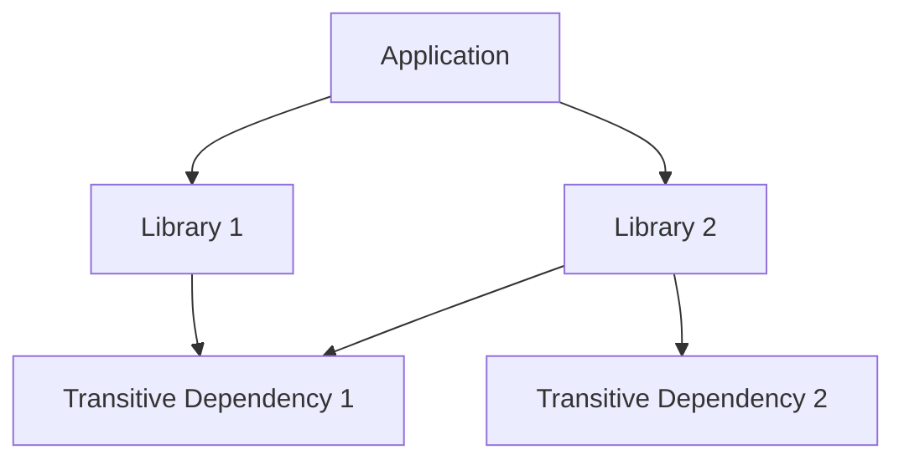

## 19.7 Minimizing Dependencies

In the world of software development, dependencies are both a boon and a bane. They allow developers to leverage existing libraries and frameworks to accelerate development and add functionality without reinventing the wheel. However, an over-reliance on external dependencies can lead to bloated applications, increased maintenance overhead, and potential security vulnerabilities. In this section, we'll delve into strategies for minimizing dependencies in Kotlin applications, ensuring they remain lightweight and efficient.

### Understanding Dependency Bloat

**Dependency bloat** refers to the excessive inclusion of libraries and frameworks in a project, leading to increased application size, longer build times, and potential conflicts. This can occur when developers add libraries without fully considering their necessity or the impact on the project.

#### Consequences of Dependency Bloat

1. **Increased Application Size**: More dependencies mean more code, which can significantly increase the size of your application, affecting download and load times.
2. **Longer Build Times**: Each dependency adds to the build process, potentially slowing down development cycles.
3. **Security Risks**: More dependencies mean more potential vulnerabilities. Each library can introduce security risks if not properly maintained.
4. **Maintenance Overhead**: Keeping dependencies up-to-date and resolving conflicts can be time-consuming and error-prone.
5. **Performance Issues**: Unnecessary dependencies can lead to performance bottlenecks, especially if they include heavy or inefficient code.

### Strategies for Minimizing Dependencies

To keep your Kotlin applications lightweight and efficient, consider the following strategies:

#### 1. Evaluate Necessity

Before adding a dependency, ask yourself:
- **Is this library essential?** Consider if the functionality it provides is critical to your application.
- **Can this be implemented in-house?** Sometimes, writing a small piece of custom code can be more efficient than adding a large library.
- **Are there lighter alternatives?** Look for libraries that offer similar functionality with a smaller footprint.

#### 2. Use Standard Libraries

Kotlin and the JVM ecosystem provide a rich set of standard libraries that can often replace the need for external dependencies. For example, Kotlin's standard library includes many utilities for collections, I/O, and concurrency.

```kotlin
// Using Kotlin's standard library for collections
val numbers = listOf(1, 2, 3, 4, 5)
val doubled = numbers.map { it * 2 }
println(doubled) // Output: [2, 4, 6, 8, 10]
```

#### 3. Prefer Modular Libraries

When a dependency is necessary, prefer modular libraries that allow you to include only the parts you need. This can significantly reduce the size of your application.

```kotlin
// Example: Using only specific modules from a library
dependencies {
    implementation("com.example.library:core:1.0.0")
    implementation("com.example.library:network:1.0.0")
}
```

#### 4. Regularly Audit Dependencies

Conduct regular audits of your project's dependencies to identify and remove unused or outdated libraries. Tools like Gradle's dependency insight can help track dependencies and their transitive dependencies.

```shell
./gradlew dependencies
```

#### 5. Use Dependency Management Tools

Leverage tools like Gradle's dependency management features to control and optimize your dependencies. This includes setting version constraints, excluding unnecessary transitive dependencies, and using dependency locking.

```kotlin
// Example: Excluding a transitive dependency in Gradle
dependencies {
    implementation("com.example.library:feature:1.0.0") {
        exclude(group = "com.unwanted.library", module = "unwanted-module")
    }
}
```

#### 6. Opt for Lightweight Alternatives

When possible, choose lightweight alternatives to heavy libraries. For instance, if you only need a small part of a large library, consider finding or creating a smaller library that meets your needs.

#### 7. Avoid Redundant Libraries

Ensure that you are not including multiple libraries that provide the same functionality. Consolidate functionality into a single library where possible.

### Code Example: Reducing Dependency Bloat

Let's consider a simple Kotlin project that initially uses several libraries for JSON parsing, HTTP requests, and logging. We'll demonstrate how to minimize dependencies by using Kotlin's standard library and modular alternatives.

#### Initial Implementation with Heavy Dependencies

```kotlin
// build.gradle.kts
dependencies {
    implementation("com.squareup.retrofit2:retrofit:2.9.0")
    implementation("com.squareup.retrofit2:converter-gson:2.9.0")
    implementation("com.google.code.gson:gson:2.8.6")
    implementation("org.slf4j:slf4j-api:1.7.30")
    implementation("org.slf4j:slf4j-simple:1.7.30")
}
```

#### Optimized Implementation with Reduced Dependencies

```kotlin
// build.gradle.kts
dependencies {
    implementation("io.ktor:ktor-client-core:1.5.0")
    implementation("io.ktor:ktor-client-json:1.5.0")
    implementation("io.ktor:ktor-client-logging:1.5.0")
}
```

In this optimized implementation, we've replaced Retrofit and Gson with Ktor, which provides a more lightweight and modular approach to HTTP requests and JSON parsing. Additionally, Ktor's logging feature replaces SLF4J, reducing the overall dependency footprint.

### Visualizing Dependency Management

To better understand the impact of dependencies on your project, visualize the dependency graph. This can help identify redundant or unnecessary dependencies.



In this diagram, we see that both Library 1 and Library 2 depend on Transitive Dependency 1. By consolidating these dependencies, we can reduce redundancy.

### Best Practices for Dependency Management

- **Keep Dependencies Updated**: Regularly update your dependencies to benefit from bug fixes and performance improvements.
- **Use Dependency Locking**: Lock dependency versions to ensure consistent builds across environments.
- **Monitor for Vulnerabilities**: Use tools to scan for known vulnerabilities in your dependencies.
- **Document Dependencies**: Maintain clear documentation of why each dependency is included in your project.

### Try It Yourself

Experiment with minimizing dependencies in your own projects. Start by auditing your current dependencies and identifying any that can be removed or replaced with lighter alternatives. Consider implementing some of the strategies discussed above and observe the impact on your application's size and performance.

### References and Further Reading

- [Kotlin Standard Library](https://kotlinlang.org/api/latest/jvm/stdlib/)
- [Gradle Dependency Management](https://docs.gradle.org/current/userguide/dependency_management.html)
- [Ktor Documentation](https://ktor.io/docs/)
- [OWASP Dependency-Check](https://owasp.org/www-project-dependency-check/)

### Knowledge Check

- What are the potential risks of dependency bloat?
- How can you use Kotlin's standard library to reduce dependencies?
- What tools can help you manage and audit dependencies in your project?

### Embrace the Journey

Remember, minimizing dependencies is an ongoing process that requires regular attention and care. By keeping your applications lightweight and efficient, you'll not only improve performance but also reduce maintenance overhead and security risks. Keep experimenting, stay curious, and enjoy the journey of optimizing your Kotlin applications!

## Quiz Time!



### What is dependency bloat?

- [x] Excessive inclusion of libraries and frameworks in a project
- [ ] The process of updating dependencies regularly
- [ ] Using only standard libraries in a project
- [ ] Reducing the number of lines of code in a project

> **Explanation:** Dependency bloat refers to the excessive inclusion of libraries and frameworks, leading to increased application size and potential issues.

### Why is it important to minimize dependencies in Kotlin applications?

- [x] To keep applications lightweight and efficient
- [x] To reduce security vulnerabilities
- [ ] To increase the number of features
- [ ] To ensure all libraries are used

> **Explanation:** Minimizing dependencies helps keep applications lightweight, reduces security vulnerabilities, and decreases maintenance overhead.

### Which Kotlin feature can help reduce the need for external libraries?

- [x] Standard library
- [ ] Extension functions
- [ ] Coroutines
- [ ] Annotations

> **Explanation:** Kotlin's standard library provides many utilities that can replace the need for external libraries.

### What is a modular library?

- [x] A library that allows you to include only the parts you need
- [ ] A library that is used across multiple projects
- [ ] A library that is updated frequently
- [ ] A library that is written in multiple languages

> **Explanation:** Modular libraries allow developers to include only the necessary parts, reducing application size and dependency bloat.

### How can you exclude a transitive dependency in Gradle?

- [x] By using the `exclude` keyword in the dependency declaration
- [ ] By removing the library from the `build.gradle` file
- [ ] By using a different build tool
- [ ] By updating the library version

> **Explanation:** In Gradle, you can exclude a transitive dependency by using the `exclude` keyword within the dependency declaration.

### Which tool can help visualize a project's dependency graph?

- [x] Gradle
- [ ] Kotlin
- [ ] IntelliJ IDEA
- [ ] Android Studio

> **Explanation:** Gradle can be used to visualize a project's dependency graph, helping identify redundant or unnecessary dependencies.

### What is the benefit of using dependency locking?

- [x] Ensures consistent builds across environments
- [ ] Increases the number of available libraries
- [ ] Speeds up the build process
- [ ] Reduces the need for documentation

> **Explanation:** Dependency locking ensures consistent builds by locking dependency versions, preventing unexpected changes.

### What is a potential consequence of not updating dependencies?

- [x] Increased security vulnerabilities
- [ ] Reduced application size
- [ ] Faster build times
- [ ] More features

> **Explanation:** Not updating dependencies can lead to increased security vulnerabilities due to outdated libraries.

### Which of the following is a lightweight alternative to Retrofit for HTTP requests in Kotlin?

- [x] Ktor
- [ ] Gson
- [ ] SLF4J
- [ ] Logback

> **Explanation:** Ktor is a lightweight alternative to Retrofit for making HTTP requests in Kotlin applications.

### True or False: Dependency management is a one-time task that does not require regular attention.

- [ ] True
- [x] False

> **Explanation:** Dependency management is an ongoing process that requires regular attention to ensure applications remain lightweight and secure.


