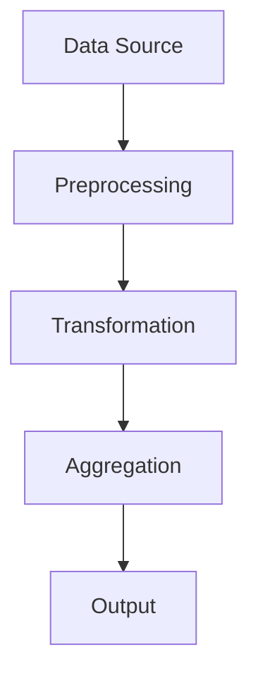

## 19.8 Efficient Data Handling

In today's data-driven world, efficiently handling large datasets is crucial for building responsive and scalable applications. Kotlin, with its expressive syntax and powerful features, offers various strategies to manage data effectively. In this section, we will delve into efficient data handling techniques in Kotlin, focusing on streaming and batch processing. We'll explore how to optimize performance and manage resources effectively, ensuring your applications can handle large volumes of data with ease.

### Introduction to Data Handling in Kotlin

Efficient data handling involves processing data in a way that maximizes performance while minimizing resource consumption. This is particularly important when dealing with large datasets, where traditional methods may lead to performance bottlenecks or excessive memory usage. Kotlin provides several tools and techniques to address these challenges, including sequences for lazy evaluation, coroutines for asynchronous processing, and libraries for batch processing.

### Streaming vs. Batch Processing

Before diving into the specifics, it's essential to understand the difference between streaming and batch processing:

- **Streaming Processing**: This involves processing data in real-time as it arrives. It is suitable for applications that require immediate insights or actions based on incoming data, such as monitoring systems or real-time analytics.

- **Batch Processing**: This involves processing data in large chunks or batches at scheduled intervals. It is ideal for tasks that do not require immediate results, such as data aggregation, reporting, or ETL (Extract, Transform, Load) operations.

Both approaches have their use cases and can be combined to create robust data processing pipelines.

### Streaming Data with Kotlin Sequences

Kotlin sequences provide a powerful way to handle data lazily, processing elements one at a time as needed. This approach is particularly useful for streaming data, as it allows you to work with potentially infinite data sources without loading everything into memory.

#### Using Sequences for Lazy Evaluation

Kotlin sequences are similar to Java streams but offer additional flexibility and integration with Kotlin's language features. Here's how you can use sequences for lazy evaluation:

```kotlin
fun main() {
    val numbers = generateSequence(1) { it + 1 }
    val evenNumbers = numbers.filter { it % 2 == 0 }.take(10)

    evenNumbers.forEach { println(it) }
}
```

In this example, we generate an infinite sequence of numbers starting from 1 and filter out the even numbers. The `take(10)` function limits the sequence to the first 10 elements, ensuring we don't process more data than necessary.

#### Key Benefits of Sequences

- **Memory Efficiency**: Sequences process elements one at a time, reducing memory usage compared to collections that load all elements into memory.
- **Performance**: Lazy evaluation allows you to avoid unnecessary computations, improving performance for large datasets.
- **Composability**: Sequences can be easily combined and transformed using functional operations like `map`, `filter`, and `reduce`.

### Asynchronous Data Processing with Coroutines

Kotlin coroutines provide a powerful framework for asynchronous programming, enabling you to handle data processing tasks without blocking threads. This is particularly useful for streaming data, where you may need to perform I/O operations or interact with external systems.

#### Implementing Asynchronous Streams with Coroutines

Let's explore how to implement asynchronous data streams using Kotlin coroutines:

```kotlin
import kotlinx.coroutines.*
import kotlinx.coroutines.flow.*

fun main() = runBlocking {
    val flow = flow {
        for (i in 1..10) {
            delay(100) // Simulate asynchronous work
            emit(i)
        }
    }

    flow.collect { value ->
        println("Received $value")
    }
}
```

In this example, we use a `Flow` to emit a sequence of numbers asynchronously. The `delay` function simulates a time-consuming operation, and the `collect` function processes each emitted value.

#### Advantages of Using Coroutines

- **Non-blocking I/O**: Coroutines allow you to perform I/O operations without blocking threads, improving scalability and responsiveness.
- **Structured Concurrency**: Coroutines provide a structured way to manage concurrency, making it easier to reason about asynchronous code.
- **Integration with Flows**: Kotlin Flows offer a declarative API for working with asynchronous data streams, integrating seamlessly with coroutines.

### Batch Processing with Kotlin

Batch processing is essential for handling large volumes of data that do not require immediate processing. Kotlin offers several tools and libraries to facilitate batch processing, allowing you to perform complex data transformations and aggregations efficiently.

#### Using Kotlin Collections for Batch Processing

Kotlin's collection API provides a rich set of operations for processing data in batches. Here's an example of how to perform batch processing using collections:

```kotlin
fun processBatch(data: List<Int>): List<Int> {
    return data.map { it * 2 }.filter { it > 10 }
}

fun main() {
    val data = (1..100).toList()
    val processedData = processBatch(data)

    println(processedData)
}
```

In this example, we define a `processBatch` function that doubles each element and filters out those less than or equal to 10. The `map` and `filter` operations are applied to the entire collection, making it suitable for batch processing.

#### Leveraging Libraries for Batch Processing

Several libraries can enhance batch processing capabilities in Kotlin, such as Apache Spark and Kotlin's Arrow library. These libraries provide advanced features like distributed processing and functional programming constructs.

### Optimizing Data Handling Performance

Efficient data handling requires careful consideration of performance optimizations to ensure your applications can handle large datasets effectively. Here are some strategies to optimize data handling performance in Kotlin:

#### Minimizing Memory Usage

- **Use Sequences for Lazy Evaluation**: As mentioned earlier, sequences process elements lazily, reducing memory usage compared to collections.
- **Avoid Unnecessary Copies**: Use in-place operations and avoid creating unnecessary copies of data structures.

#### Leveraging Parallelism

- **Use Coroutines for Concurrency**: Coroutines enable you to perform concurrent operations without blocking threads, improving scalability.
- **Parallel Processing with Collections**: Kotlin's `parallelStream` can be used to process collections in parallel, leveraging multiple CPU cores.

#### Profiling and Monitoring

- **Profile Your Application**: Use profiling tools to identify performance bottlenecks and optimize critical sections of your code.
- **Monitor Resource Usage**: Keep an eye on memory and CPU usage to ensure your application remains responsive under load.

### Visualizing Data Processing Pipelines

Visualizing data processing pipelines can help you understand the flow of data through your application and identify potential bottlenecks. Here's an example of a data processing pipeline using Mermaid.js:



This diagram represents a typical data processing pipeline, where data flows from a source through preprocessing, transformation, and aggregation stages before being outputted.

### Try It Yourself

To reinforce your understanding of efficient data handling in Kotlin, try modifying the code examples provided. Experiment with different sequence operations, coroutine flows, and batch processing techniques. Consider integrating external libraries like Apache Spark for distributed processing or Arrow for functional programming constructs.

### Knowledge Check

- **What are the key differences between streaming and batch processing?**
- **How can Kotlin sequences improve memory efficiency?**
- **What are the benefits of using coroutines for asynchronous data processing?**
- **How can you optimize data handling performance in Kotlin?**

### Conclusion

Efficient data handling is a critical aspect of building scalable and responsive applications. By leveraging Kotlin's powerful features, such as sequences for lazy evaluation and coroutines for asynchronous processing, you can manage large datasets effectively. Remember to profile your application, monitor resource usage, and continuously optimize your data processing pipelines to ensure optimal performance.

## Quiz Time!



### What is the primary advantage of using Kotlin sequences for data processing?

- [x] Lazy evaluation reduces memory usage.
- [ ] They are faster than collections.
- [ ] They automatically handle concurrency.
- [ ] They are easier to debug.

> **Explanation:** Kotlin sequences process elements lazily, which reduces memory usage compared to collections that load all elements into memory.

### How do coroutines improve asynchronous data processing in Kotlin?

- [x] By allowing non-blocking I/O operations.
- [ ] By automatically parallelizing tasks.
- [ ] By simplifying error handling.
- [ ] By reducing code complexity.

> **Explanation:** Coroutines enable non-blocking I/O operations, improving scalability and responsiveness in asynchronous data processing.

### Which Kotlin feature is most suitable for processing potentially infinite data sources?

- [x] Sequences
- [ ] Collections
- [ ] Arrays
- [ ] Maps

> **Explanation:** Kotlin sequences are ideal for processing potentially infinite data sources due to their lazy evaluation.

### What is a key benefit of using batch processing for data handling?

- [x] It allows processing large volumes of data at scheduled intervals.
- [ ] It provides real-time insights.
- [ ] It reduces the need for data storage.
- [ ] It simplifies data transformation.

> **Explanation:** Batch processing is suitable for handling large volumes of data at scheduled intervals, making it ideal for tasks like data aggregation and reporting.

### Which library can be used for distributed batch processing in Kotlin?

- [x] Apache Spark
- [ ] kotlinx.coroutines
- [ ] Arrow
- [ ] Retrofit

> **Explanation:** Apache Spark is a library that provides distributed processing capabilities, making it suitable for batch processing in Kotlin.

### What is the purpose of the `delay` function in coroutine flows?

- [x] To simulate asynchronous work.
- [ ] To pause execution indefinitely.
- [ ] To synchronize threads.
- [ ] To handle exceptions.

> **Explanation:** The `delay` function is used to simulate asynchronous work in coroutine flows, allowing you to test non-blocking behavior.

### How can you visualize data processing pipelines in Kotlin?

- [x] Using Mermaid.js diagrams.
- [ ] Using Kotlin's built-in visualization tools.
- [ ] Using JavaFX.
- [ ] Using Android Studio.

> **Explanation:** Mermaid.js diagrams can be used to visualize data processing pipelines, helping you understand the flow of data through your application.

### What is a common strategy for minimizing memory usage in data processing?

- [x] Using sequences for lazy evaluation.
- [ ] Using arrays instead of collections.
- [ ] Using global variables.
- [ ] Using reflection.

> **Explanation:** Using sequences for lazy evaluation minimizes memory usage by processing elements one at a time.

### Which of the following is a benefit of structured concurrency in coroutines?

- [x] It makes it easier to reason about asynchronous code.
- [ ] It automatically parallelizes tasks.
- [ ] It simplifies error handling.
- [ ] It reduces code complexity.

> **Explanation:** Structured concurrency in coroutines provides a structured way to manage concurrency, making it easier to reason about asynchronous code.

### True or False: Batch processing is suitable for real-time data insights.

- [ ] True
- [x] False

> **Explanation:** Batch processing is not suitable for real-time data insights, as it processes data in large chunks at scheduled intervals.


