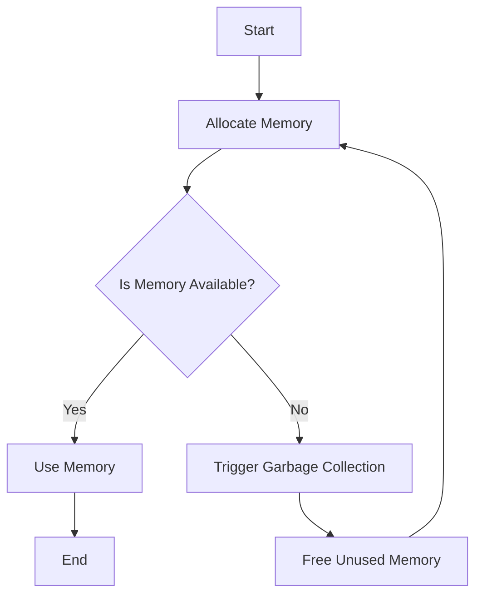

## 19.9 Kotlin Native Performance Considerations

Kotlin Native is a powerful tool that allows developers to compile Kotlin code into native binaries, enabling it to run on platforms without a Java Virtual Machine (JVM). This capability opens up a world of possibilities, from developing applications for embedded systems to creating high-performance desktop applications. However, achieving optimal performance in Kotlin Native requires a deep understanding of both Kotlin and the native platforms it targets. In this section, we will explore various strategies and considerations for optimizing Kotlin Native performance, with a particular focus on interoperability with C libraries.

### Introduction to Kotlin Native

Kotlin Native is part of the Kotlin Multiplatform project, which aims to enable code sharing across different platforms. By compiling Kotlin code to native binaries, Kotlin Native allows developers to target platforms like iOS, Linux, Windows, and macOS. This capability is particularly useful for performance-critical applications where the overhead of a virtual machine is undesirable.

### Key Performance Considerations

When working with Kotlin Native, several performance considerations come into play. These include memory management, interoperability with C libraries, and the use of Kotlin-specific features. Let's explore each of these in detail.

#### Memory Management

Memory management is a critical aspect of performance optimization in any native application. Kotlin Native uses a garbage collector (GC) to manage memory, which can introduce latency if not handled correctly. Here are some strategies to optimize memory management in Kotlin Native:

1. **Minimize Object Allocation**: Frequent object allocation can lead to increased GC activity. Use data structures like arrays or native buffers where possible to reduce the need for object allocation.

2. **Use Immutable Data Structures**: Immutable data structures can help reduce the overhead associated with memory management. Kotlin's `val` keyword can be used to declare immutable variables, which can lead to more efficient memory usage.

3. **Optimize GC Settings**: Kotlin Native allows you to configure the garbage collector to suit your application's needs. Experiment with different GC settings to find the optimal configuration for your application.

4. **Manual Memory Management**: In some cases, manual memory management may be necessary. Kotlin Native provides APIs for allocating and deallocating memory manually, which can be useful for performance-critical sections of code.

#### Interoperability with C Libraries

One of the strengths of Kotlin Native is its ability to interoperate with C libraries. This capability allows developers to leverage existing C libraries for performance-critical tasks. Here are some tips for optimizing interoperability with C libraries:

1. **Use C Interop**: Kotlin Native provides a tool called `cinterop` that generates Kotlin bindings for C libraries. Use this tool to create efficient bindings that minimize overhead.

2. **Minimize JNI Calls**: Java Native Interface (JNI) calls can introduce significant overhead. Minimize the number of JNI calls by batching operations or using native libraries directly.

3. **Optimize Data Transfer**: Data transfer between Kotlin and C can be a bottleneck. Use native data types and structures to minimize the overhead associated with data conversion.

4. **Profile and Optimize**: Use profiling tools to identify bottlenecks in your code. Optimize the critical sections by rewriting them in C or using more efficient algorithms.

#### Leveraging Kotlin-Specific Features

Kotlin provides several features that can be leveraged to optimize performance in Kotlin Native applications. These include inline functions, coroutines, and type-safe builders.

1. **Inline Functions**: Use inline functions to reduce the overhead associated with function calls. Inline functions can be particularly useful in performance-critical sections of code.

2. **Coroutines**: Kotlin's coroutines provide a powerful mechanism for asynchronous programming. Use coroutines to manage concurrency and improve the responsiveness of your application.

3. **Type-Safe Builders**: Use type-safe builders to construct complex data structures efficiently. Type-safe builders can help reduce the overhead associated with object creation and initialization.

### Code Examples

Let's explore some code examples that demonstrate these performance optimization techniques in Kotlin Native.

#### Example 1: Minimizing Object Allocation

```kotlin
// Use arrays instead of lists to minimize object allocation
val numbers = IntArray(1000) { it }
```

In this example, we use an `IntArray` instead of a `List<Int>` to minimize object allocation. Arrays are more memory-efficient than lists because they do not require additional object wrappers.

#### Example 2: Interoperating with C Libraries

```kotlin
// Define a C function using cinterop
@CName("sum")
external fun sum(a: Int, b: Int): Int

fun main() {
    val result = sum(5, 10)
    println("Sum: $result")
}
```

In this example, we define a C function `sum` using `cinterop` and call it from Kotlin. This approach minimizes the overhead associated with JNI calls.

#### Example 3: Using Inline Functions

```kotlin
// Define an inline function to reduce function call overhead
inline fun square(x: Int): Int = x * x

fun main() {
    val result = square(5)
    println("Square: $result")
}
```

In this example, we define an inline function `square` to reduce the overhead associated with function calls. Inline functions are expanded at compile time, eliminating the need for a function call.

### Visualizing Memory Management in Kotlin Native

To better understand memory management in Kotlin Native, let's visualize the process using a flowchart.



**Figure 1: Memory Management Flow in Kotlin Native**

This flowchart illustrates the memory management process in Kotlin Native. When memory is allocated, the system checks if memory is available. If not, garbage collection is triggered to free unused memory.

### References and Links

For further reading on Kotlin Native performance optimization, consider the following resources:

- [Kotlin Native Documentation](https://kotlinlang.org/docs/native-overview.html)
- [Kotlin Coroutines Guide](https://kotlinlang.org/docs/coroutines-guide.html)
- [Kotlin C Interop](https://kotlinlang.org/docs/native-c-interop.html)

### Knowledge Check

To reinforce your understanding of Kotlin Native performance considerations, try answering the following questions:

1. What is the primary benefit of using Kotlin Native for performance-critical applications?
2. How can you minimize object allocation in Kotlin Native?
3. What tool does Kotlin Native provide for generating Kotlin bindings for C libraries?
4. Why should you minimize JNI calls in Kotlin Native applications?
5. How can inline functions improve performance in Kotlin Native?

### Embrace the Journey

Optimizing Kotlin Native performance is a journey that requires experimentation and continuous learning. As you explore different optimization techniques, remember to profile your application regularly and focus on the areas that provide the most significant performance gains. Keep experimenting, stay curious, and enjoy the journey!

### Conclusion

In this section, we explored various strategies for optimizing Kotlin Native performance, focusing on memory management, interoperability with C libraries, and leveraging Kotlin-specific features. By applying these techniques, you can create high-performance applications that take full advantage of Kotlin Native's capabilities.

## Quiz Time!



### What is the primary benefit of using Kotlin Native for performance-critical applications?

- [x] It allows running Kotlin code on platforms without a JVM.
- [ ] It provides better syntax than Java.
- [ ] It supports more libraries than the JVM.
- [ ] It has better IDE support.

> **Explanation:** Kotlin Native allows running Kotlin code on platforms without a JVM, making it suitable for performance-critical applications.

### How can you minimize object allocation in Kotlin Native?

- [x] Use arrays instead of lists.
- [ ] Use more classes.
- [ ] Increase the heap size.
- [ ] Use more interfaces.

> **Explanation:** Using arrays instead of lists minimizes object allocation because arrays are more memory-efficient.

### What tool does Kotlin Native provide for generating Kotlin bindings for C libraries?

- [x] `cinterop`
- [ ] `kotlinc`
- [ ] `gradle`
- [ ] `maven`

> **Explanation:** `cinterop` is the tool provided by Kotlin Native to generate Kotlin bindings for C libraries.

### Why should you minimize JNI calls in Kotlin Native applications?

- [x] They introduce significant overhead.
- [ ] They are not supported in Kotlin Native.
- [ ] They are faster than native calls.
- [ ] They are deprecated.

> **Explanation:** JNI calls introduce significant overhead, so minimizing them can improve performance.

### How can inline functions improve performance in Kotlin Native?

- [x] They reduce the overhead of function calls.
- [ ] They increase code readability.
- [ ] They make code more secure.
- [ ] They allow for dynamic typing.

> **Explanation:** Inline functions reduce the overhead of function calls by expanding them at compile time.

### What is one way to optimize data transfer between Kotlin and C?

- [x] Use native data types and structures.
- [ ] Use more complex data structures.
- [ ] Increase the buffer size.
- [ ] Use more threads.

> **Explanation:** Using native data types and structures minimizes the overhead associated with data conversion.

### What is a benefit of using immutable data structures in Kotlin Native?

- [x] They reduce the overhead of memory management.
- [ ] They increase the complexity of code.
- [ ] They make code less readable.
- [ ] They require more memory.

> **Explanation:** Immutable data structures reduce the overhead of memory management by preventing changes to data.

### What is the role of the garbage collector in Kotlin Native?

- [x] It manages memory allocation and deallocation.
- [ ] It compiles Kotlin code to native binaries.
- [ ] It optimizes the code for performance.
- [ ] It provides interoperability with C libraries.

> **Explanation:** The garbage collector manages memory allocation and deallocation, which is crucial for performance optimization.

### What is a key consideration when using coroutines in Kotlin Native?

- [x] Managing concurrency and responsiveness.
- [ ] Increasing the number of threads.
- [ ] Reducing code readability.
- [ ] Avoiding asynchronous programming.

> **Explanation:** Coroutines help manage concurrency and improve the responsiveness of applications.

### True or False: Kotlin Native can only be used for mobile applications.

- [ ] True
- [x] False

> **Explanation:** Kotlin Native can be used for a variety of applications, including desktop, embedded systems, and more, not just mobile applications.


