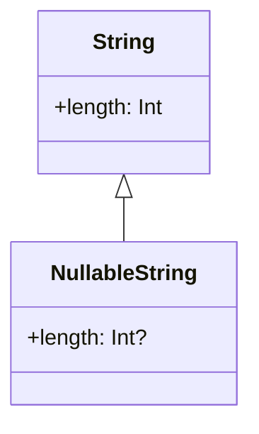

## 2.1 Null Safety and Type System

Kotlin was designed with a primary goal: to eliminate the dreaded null pointer exceptions (NPEs) that have plagued developers for decades. By introducing a robust type system and null safety features, Kotlin ensures that developers can write safer, more reliable code. In this section, we will delve into Kotlin's approach to null safety and how its type system can be leveraged to create robust applications.

### Understanding Kotlin's Approach to Null Safety

Null pointer exceptions are a common source of runtime errors in many programming languages. Kotlin addresses this issue by incorporating null safety directly into its type system. Let's explore how Kotlin achieves this.

#### Nullable and Non-Nullable Types

In Kotlin, types are divided into two categories: nullable and non-nullable. By default, all types in Kotlin are non-nullable, meaning they cannot hold a `null` value. If you want a variable to hold a `null`, you must explicitly declare it as nullable by appending a `?` to the type.

```kotlin
val nonNullableString: String = "Hello, Kotlin!" // Non-nullable
val nullableString: String? = null // Nullable
```

In the above example, `nonNullableString` cannot be assigned a `null` value, while `nullableString` can.

#### Safe Calls and the Elvis Operator

Kotlin provides several operators to handle nullable types safely. The safe call operator `?.` allows you to access properties and methods of a nullable type without risking a null pointer exception.

```kotlin
val length: Int? = nullableString?.length
```

In this example, `nullableString?.length` returns `null` if `nullableString` is `null`, avoiding an NPE.

The Elvis operator `?:` is used to provide a default value when a nullable expression evaluates to `null`.

```kotlin
val length: Int = nullableString?.length ?: 0
```

Here, if `nullableString` is `null`, `length` will be assigned the value `0`.

#### The `!!` Operator

While Kotlin encourages safe handling of nulls, there are situations where you are certain a nullable variable is not null. In such cases, you can use the `!!` operator to assert non-nullability. However, use this operator with caution, as it will throw an NPE if the variable is `null`.

```kotlin
val length: Int = nullableString!!.length // Throws NPE if nullableString is null
```

### Leveraging the Type System for Safe Code

Kotlin's type system is designed to catch errors at compile time, reducing the likelihood of runtime exceptions. Let's explore some key features of Kotlin's type system that contribute to writing safe code.

#### Type Inference

Kotlin supports type inference, allowing you to omit explicit type declarations when the compiler can infer the type from the context.

```kotlin
val message = "Hello, Kotlin!" // Type inferred as String
```

Type inference makes code more concise and readable while maintaining type safety.

#### Smart Casts

Kotlin's smart cast feature automatically casts a variable to a specific type when it is safe to do so. This eliminates the need for explicit casting in many situations.

```kotlin
fun printLength(obj: Any) {
    if (obj is String) {
        println(obj.length) // Smart cast to String
    }
}
```

In the above example, `obj` is automatically cast to `String` within the `if` block.

#### Sealed Classes

Sealed classes allow you to define restricted class hierarchies, making it easier to handle exhaustive `when` expressions. This ensures that all possible cases are covered, reducing the risk of runtime errors.

```kotlin
sealed class Result
class Success(val data: String) : Result()
class Error(val exception: Exception) : Result()

fun handleResult(result: Result) {
    when (result) {
        is Success -> println("Data: ${result.data}")
        is Error -> println("Error: ${result.exception.message}")
    }
}
```

#### Data Classes

Data classes in Kotlin provide a concise way to create classes that primarily hold data. They automatically generate useful methods like `equals()`, `hashCode()`, and `toString()`, reducing boilerplate code.

```kotlin
data class User(val name: String, val age: Int)
```

Data classes enhance code readability and maintainability by focusing on the data they hold.

### Code Examples

Let's explore some practical code examples to illustrate the concepts discussed.

#### Example 1: Safe Calls and Elvis Operator

```kotlin
fun printGreeting(name: String?) {
    val greeting = "Hello, ${name ?: "Guest"}!"
    println(greeting)
}

fun main() {
    printGreeting("Alice")
    printGreeting(null)
}
```

In this example, the `printGreeting` function uses the Elvis operator to provide a default value of "Guest" when `name` is `null`.

#### Example 2: Smart Casts and Sealed Classes

```kotlin
sealed class Shape
class Circle(val radius: Double) : Shape()
class Rectangle(val width: Double, val height: Double) : Shape()

fun calculateArea(shape: Shape): Double {
    return when (shape) {
        is Circle -> Math.PI * shape.radius * shape.radius
        is Rectangle -> shape.width * shape.height
    }
}

fun main() {
    val circle = Circle(5.0)
    val rectangle = Rectangle(4.0, 6.0)

    println("Circle area: ${calculateArea(circle)}")
    println("Rectangle area: ${calculateArea(rectangle)}")
}
```

This example demonstrates the use of sealed classes and smart casts to calculate the area of different shapes.

### Visualizing Kotlin's Type System

To better understand Kotlin's type system, let's visualize the relationship between nullable and non-nullable types using a class diagram.



In this diagram, `String` is a non-nullable type, while `NullableString` is a nullable type that can hold a `null` value.

### References and Links

For further reading on Kotlin's null safety and type system, consider exploring the following resources:

- [Kotlin Official Documentation: Null Safety](https://kotlinlang.org/docs/null-safety.html)
- [Kotlin Official Documentation: Type System](https://kotlinlang.org/docs/type-system.html)

### Knowledge Check

To reinforce your understanding of Kotlin's null safety and type system, consider the following questions:

1. What is the primary goal of Kotlin's null safety feature?
2. How do you declare a nullable type in Kotlin?
3. What is the purpose of the safe call operator `?.`?
4. When should you use the `!!` operator?
5. How does Kotlin's smart cast feature work?

### Embrace the Journey

Remember, mastering Kotlin's null safety and type system is just the beginning. As you continue your journey, you'll discover more advanced features and techniques that will enhance your programming skills. Keep experimenting, stay curious, and enjoy the process of becoming a proficient Kotlin developer!

### Quiz Time!



### What is the primary purpose of Kotlin's null safety feature?

- [x] To eliminate null pointer exceptions
- [ ] To simplify syntax
- [ ] To improve performance
- [ ] To enhance UI design

> **Explanation:** Kotlin's null safety feature is designed to eliminate null pointer exceptions, a common source of runtime errors.

### How do you declare a nullable type in Kotlin?

- [x] By appending a `?` to the type
- [ ] By using the `nullable` keyword
- [ ] By using the `optional` keyword
- [ ] By using the `null` keyword

> **Explanation:** In Kotlin, you declare a nullable type by appending a `?` to the type, indicating that the variable can hold a `null` value.

### What does the safe call operator `?.` do?

- [x] It safely accesses properties and methods of a nullable type
- [ ] It throws an exception if the variable is null
- [ ] It converts a nullable type to a non-nullable type
- [ ] It assigns a default value to a variable

> **Explanation:** The safe call operator `?.` allows you to safely access properties and methods of a nullable type without risking a null pointer exception.

### When should you use the `!!` operator in Kotlin?

- [x] When you are certain a nullable variable is not null
- [ ] When you want to convert a non-nullable type to a nullable type
- [ ] When you want to handle null values gracefully
- [ ] When you want to provide a default value

> **Explanation:** The `!!` operator is used when you are certain a nullable variable is not null, but it should be used with caution as it throws an NPE if the variable is null.

### How does Kotlin's smart cast feature work?

- [x] It automatically casts a variable to a specific type when it is safe to do so
- [ ] It requires explicit casting by the developer
- [ ] It converts all types to strings
- [ ] It only works with primitive types

> **Explanation:** Kotlin's smart cast feature automatically casts a variable to a specific type when it is safe to do so, eliminating the need for explicit casting in many situations.

### What is the purpose of sealed classes in Kotlin?

- [x] To define restricted class hierarchies
- [ ] To create immutable data structures
- [ ] To enhance performance
- [ ] To simplify syntax

> **Explanation:** Sealed classes in Kotlin are used to define restricted class hierarchies, making it easier to handle exhaustive `when` expressions.

### How do data classes enhance code readability in Kotlin?

- [x] By automatically generating useful methods like `equals()`, `hashCode()`, and `toString()`
- [ ] By requiring explicit type declarations
- [ ] By simplifying syntax
- [ ] By improving performance

> **Explanation:** Data classes in Kotlin automatically generate useful methods like `equals()`, `hashCode()`, and `toString()`, reducing boilerplate code and enhancing code readability.

### What is type inference in Kotlin?

- [x] The ability of the compiler to infer the type of a variable from the context
- [ ] The requirement to explicitly declare all types
- [ ] The conversion of all types to strings
- [ ] The automatic casting of variables

> **Explanation:** Type inference in Kotlin allows the compiler to infer the type of a variable from the context, making code more concise and readable.

### What is the Elvis operator `?:` used for in Kotlin?

- [x] To provide a default value when a nullable expression evaluates to null
- [ ] To convert a nullable type to a non-nullable type
- [ ] To throw an exception if a variable is null
- [ ] To simplify syntax

> **Explanation:** The Elvis operator `?:` is used to provide a default value when a nullable expression evaluates to null, ensuring safe handling of null values.

### True or False: In Kotlin, all types are nullable by default.

- [ ] True
- [x] False

> **Explanation:** In Kotlin, all types are non-nullable by default. You must explicitly declare a type as nullable by appending a `?` to the type.


