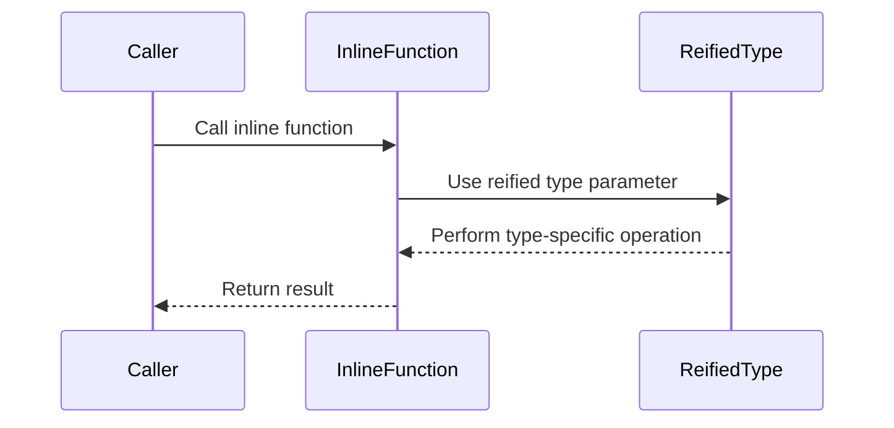

## 2.10 Inline Functions and Reified Types

In the realm of Kotlin programming, inline functions and reified types stand out as powerful features that can significantly enhance performance and type safety. This section delves into these concepts, providing expert insights into their usage, benefits, and best practices.

### Understanding Inline Functions

#### What Are Inline Functions?

Inline functions in Kotlin are a mechanism to optimize higher-order functions by reducing the overhead of function calls. When a function is marked as `inline`, the compiler replaces the function call with the actual code of the function. This can lead to performance improvements, especially in scenarios involving lambda expressions.

#### Benefits of Inline Functions

- **Performance Optimization**: By eliminating the overhead of function calls, inline functions can improve execution speed, particularly in performance-critical code.
- **Lambda Expression Efficiency**: Inline functions allow lambda expressions to be inlined, reducing the need for object creation and garbage collection.
- **Increased Flexibility**: Inline functions can access non-local returns, enabling more expressive control flow.

#### How to Use Inline Functions

To declare an inline function, simply use the `inline` keyword before the function definition. Here's a basic example:

```kotlin
inline fun <T> measureTime(block: () -> T): T {
    val start = System.nanoTime()
    val result = block()
    val end = System.nanoTime()
    println("Execution time: ${end - start} ns")
    return result
}

fun main() {
    val result = measureTime {
        // Some computation
        (1..1000).sum()
    }
    println("Result: $result")
}
```

In this example, the `measureTime` function is inlined, allowing the lambda passed to it to be executed without the overhead of a function call.

#### Key Considerations

- **Code Size**: Excessive use of inline functions can lead to increased code size, as the function body is duplicated at each call site.
- **Non-Local Returns**: Inline functions can use non-local returns, which allows returning from the calling function. This can be both powerful and potentially confusing, so use with caution.

### Reified Types in Kotlin

#### What Are Reified Types?

Reified types in Kotlin are a feature that allows you to access the type information of a generic parameter at runtime. Normally, type information is erased during compilation (type erasure), but reified types enable you to retain this information.

#### Benefits of Reified Types

- **Type-Safe Generics**: Reified types allow you to perform type checks and casts on generic types, enhancing type safety.
- **Simplified Reflection**: With reified types, you can avoid the boilerplate code typically associated with reflection.

#### How to Use Reified Types

To use reified types, you must declare the generic type parameter as `reified` within an inline function. Here's an example:

```kotlin
inline fun <reified T> isInstance(value: Any): Boolean {
    return value is T
}

fun main() {
    println(isInstance<String>("Hello")) // true
    println(isInstance<Int>("Hello"))    // false
}
```

In this example, the `isInstance` function uses a reified type parameter to check if a value is an instance of a specific type.

#### Key Considerations

- **Inline Requirement**: Reified types can only be used in inline functions because they rely on the inlining process to retain type information.
- **Limited Use Cases**: While powerful, reified types are primarily useful for scenarios involving type checks and casts.

### Combining Inline Functions and Reified Types

Inline functions and reified types can be combined to create powerful, type-safe utilities. For instance, consider a function that filters a list based on the type of its elements:

```kotlin
inline fun <reified T> List<*>.filterIsInstance(): List<T> {
    return this.filter { it is T }.map { it as T }
}

fun main() {
    val mixedList: List<Any> = listOf("Kotlin", 42, "Java", 3.14)
    val stringList: List<String> = mixedList.filterIsInstance<String>()
    println(stringList) // [Kotlin, Java]
}
```

In this example, the `filterIsInstance` function uses both inline functions and reified types to filter a list by type, demonstrating the synergy between these features.

### Advanced Use Cases

#### Performance Considerations

When using inline functions and reified types, it's important to consider the trade-offs between performance and code size. While inlining can reduce execution time, it can also increase the size of the compiled code. Profiling and benchmarking are essential to ensure that the benefits outweigh the costs.

#### Designing Type-Safe APIs

Reified types can be used to design type-safe APIs that leverage Kotlin's powerful type system. For example, you can create a type-safe builder pattern that uses reified types to enforce compile-time checks.

```kotlin
inline fun <reified T> createInstance(): T {
    return T::class.java.newInstance()
}

fun main() {
    val stringInstance: String = createInstance()
    println(stringInstance) // Prints an empty string
}
```

This example demonstrates how reified types can be used to instantiate objects in a type-safe manner.

### Visualizing Inline Functions and Reified Types

To better understand the flow and interaction of inline functions and reified types, let's visualize the process using a sequence diagram.



**Caption**: This sequence diagram illustrates the interaction between a caller, an inline function, and a reified type parameter. The caller invokes the inline function, which uses the reified type to perform a type-specific operation and returns the result to the caller.

### Try It Yourself

Experiment with inline functions and reified types by modifying the examples provided. Try creating your own utility functions that leverage these features for performance optimization and type safety.

### Knowledge Check

- What are the main benefits of using inline functions in Kotlin?
- How do reified types enhance type safety in generic programming?
- What are the trade-offs between performance and code size when using inline functions?
- How can inline functions and reified types be combined to create type-safe utilities?

### Conclusion

Inline functions and reified types are powerful tools in the Kotlin programmer's toolkit, offering performance optimizations and enhanced type safety. By understanding and leveraging these features, you can write more efficient and robust Kotlin code. Remember, this is just the beginning. As you progress, you'll discover even more ways to harness the power of Kotlin's advanced features. Keep experimenting, stay curious, and enjoy the journey!

## Quiz Time!



### What is a primary benefit of using inline functions in Kotlin?

- [x] Reducing the overhead of function calls
- [ ] Increasing the size of the compiled code
- [ ] Making code harder to read
- [ ] Limiting the use of lambda expressions

> **Explanation:** Inline functions reduce the overhead of function calls by replacing the call with the function's body, which can improve performance.

### How do reified types in Kotlin help with generic programming?

- [x] They allow type information to be retained at runtime
- [ ] They make code less type-safe
- [ ] They increase the complexity of code
- [ ] They are only useful for non-generic functions

> **Explanation:** Reified types allow type information to be retained at runtime, enabling type checks and casts on generic types, enhancing type safety.

### What is a potential downside of using inline functions excessively?

- [x] Increased code size
- [ ] Decreased performance
- [ ] Reduced readability
- [ ] Limited use of lambda expressions

> **Explanation:** Excessive use of inline functions can lead to increased code size because the function body is duplicated at each call site.

### Which keyword is used to declare a reified type in Kotlin?

- [x] reified
- [ ] inline
- [ ] generic
- [ ] type

> **Explanation:** The `reified` keyword is used to declare a reified type in Kotlin, allowing type information to be retained at runtime.

### Can reified types be used outside of inline functions?

- [ ] Yes, they can be used anywhere
- [x] No, they can only be used in inline functions
- [ ] Yes, but only in extension functions
- [ ] No, they are not supported in Kotlin

> **Explanation:** Reified types can only be used in inline functions because they rely on the inlining process to retain type information.

### What is a common use case for combining inline functions and reified types?

- [x] Creating type-safe utilities
- [ ] Increasing code complexity
- [ ] Reducing code readability
- [ ] Limiting the use of generics

> **Explanation:** Combining inline functions and reified types is commonly used to create type-safe utilities that leverage Kotlin's powerful type system.

### How can inline functions improve lambda expression efficiency?

- [x] By reducing the need for object creation and garbage collection
- [ ] By increasing the number of function calls
- [ ] By making lambda expressions less flexible
- [ ] By limiting the use of higher-order functions

> **Explanation:** Inline functions improve lambda expression efficiency by reducing the need for object creation and garbage collection, as the lambda is inlined.

### What is a key consideration when using non-local returns in inline functions?

- [x] They can be both powerful and potentially confusing
- [ ] They always improve code readability
- [ ] They are only available in Java
- [ ] They limit the use of lambda expressions

> **Explanation:** Non-local returns in inline functions can be powerful but potentially confusing, as they allow returning from the calling function.

### What is the effect of using the `inline` keyword before a function definition?

- [x] The function call is replaced with the actual code of the function
- [ ] The function becomes a higher-order function
- [ ] The function is executed asynchronously
- [ ] The function is limited to local scope

> **Explanation:** Using the `inline` keyword before a function definition causes the function call to be replaced with the actual code of the function, reducing call overhead.

### True or False: Reified types can be used to perform type checks and casts on generic types.

- [x] True
- [ ] False

> **Explanation:** True. Reified types allow you to perform type checks and casts on generic types, enhancing type safety.


