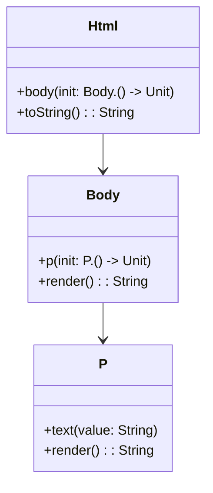

## 2.11 Type-safe Builders and DSL Construction

In the world of software engineering, creating expressive and intuitive APIs is a key aspect of designing robust systems. Kotlin, with its powerful language features, offers a unique capability to build type-safe builders and domain-specific languages (DSLs). These constructs allow developers to create APIs that are not only easy to use but also safe and expressive. In this section, we'll delve into the concepts of type-safe builders and DSL construction in Kotlin, exploring how to leverage lambdas with receivers to design domain-specific languages effectively.

### Designing Domain-Specific Languages

A domain-specific language (DSL) is a specialized language tailored to a specific application domain. Unlike general-purpose programming languages, DSLs are designed to express solutions in a particular domain more succinctly and clearly. In Kotlin, DSLs can be constructed using language features that enable concise and readable code.

#### Intent of DSLs

The primary intent of DSLs is to provide an abstraction that simplifies complex operations within a specific domain. By using a DSL, developers can write code that closely resembles natural language, making it easier to understand and maintain. DSLs are particularly useful in scenarios where domain experts, who may not be programmers, need to interact with the system.

#### Key Participants in DSL Construction

1. **Domain Model**: Represents the entities and operations within the domain.
2. **DSL Syntax**: Defines the language constructs and syntax used to express domain operations.
3. **Interpreter/Compiler**: Translates the DSL syntax into executable code.

#### Applicability of DSLs

DSLs are applicable in various domains, including:

- **Configuration**: Simplifying configuration files and scripts.
- **Testing**: Creating expressive test cases and scenarios.
- **UI Layouts**: Designing user interfaces with declarative syntax.
- **Data Processing**: Streamlining data transformation and analysis tasks.

### Using Lambdas with Receivers

One of Kotlin's standout features is its support for lambdas with receivers, which plays a crucial role in building DSLs. A lambda with a receiver allows you to call methods on an implicit receiver object within the lambda body, enabling a more natural and concise syntax.

#### Understanding Lambdas with Receivers

In Kotlin, a lambda with a receiver is essentially a function literal with an implicit receiver. This means you can access the receiver's members directly within the lambda, without needing to qualify them with the receiver object.

```kotlin
class Html {
    fun body() { /*...*/ }
}

fun html(init: Html.() -> Unit): Html {
    val html = Html()
    html.init()
    return html
}

fun main() {
    html {
        body() // 'body' is called on the implicit receiver 'Html'
    }
}
```

In the example above, the `html` function takes a lambda with a receiver of type `Html`. Inside the lambda, you can call `body()` directly, thanks to the implicit receiver.

#### Benefits of Lambdas with Receivers

- **Conciseness**: Reduces boilerplate code by eliminating the need to repeatedly reference the receiver object.
- **Readability**: Creates a more natural and readable syntax, resembling natural language.
- **Type Safety**: Ensures that only valid operations on the receiver are allowed, reducing runtime errors.

### Building Type-safe Builders in Kotlin

Type-safe builders are a pattern in Kotlin that leverages lambdas with receivers to construct complex objects in a safe and readable manner. This pattern is particularly useful for building hierarchical structures, such as XML or HTML documents, UI layouts, or configuration files.

#### Key Concepts of Type-safe Builders

1. **Builder Pattern**: A design pattern that provides a way to construct complex objects step by step.
2. **Type Safety**: Ensures that the builder only allows valid configurations, preventing errors at compile time.
3. **Fluent API**: Enables chaining of method calls to configure the object being built.

#### Implementing a Type-safe Builder

Let's implement a simple type-safe builder for constructing an HTML document. We'll define a DSL that allows us to build an HTML structure using a natural and readable syntax.

```kotlin
class Html {
    private val elements = mutableListOf<Element>()

    fun body(init: Body.() -> Unit) {
        val body = Body()
        body.init()
        elements.add(body)
    }

    override fun toString() = elements.joinToString("\n")

    abstract class Element {
        abstract fun render(): String
    }

    class Body : Element() {
        private val children = mutableListOf<Element>()

        fun p(init: P.() -> Unit) {
            val paragraph = P()
            paragraph.init()
            children.add(paragraph)
        }

        override fun render() = "<body>\n${children.joinToString("\n") { it.render() }}\n</body>"
    }

    class P : Element() {
        private var text: String = ""

        fun text(value: String) {
            text = value
        }

        override fun render() = "<p>$text</p>"
    }
}

fun html(init: Html.() -> Unit): Html {
    val html = Html()
    html.init()
    return html
}

fun main() {
    val document = html {
        body {
            p {
                text("Hello, World!")
            }
        }
    }
    println(document)
}
```

In this example, we define an `Html` class with a `body` function that takes a lambda with a receiver of type `Body`. Inside the `Body` class, we define a `p` function for adding paragraphs. The `text` function sets the paragraph's content. The entire structure is built using a fluent API, ensuring type safety and readability.

#### Design Considerations

- **Hierarchy**: Ensure that the builder reflects the hierarchical structure of the domain model.
- **Validation**: Implement validation logic to enforce constraints and ensure valid configurations.
- **Extensibility**: Design the builder to be easily extensible, allowing new elements to be added without breaking existing code.

### Differences and Similarities with Other Patterns

Type-safe builders share similarities with the traditional builder pattern but differ in their use of lambdas with receivers to achieve type safety and conciseness. Unlike the traditional builder pattern, which often relies on method chaining, type-safe builders leverage Kotlin's language features to create a more expressive and readable syntax.

### Visualizing Type-safe Builders and DSL Construction

To better understand the flow of type-safe builders and DSL construction, let's visualize the process using a class diagram.



**Diagram Description**: This class diagram illustrates the relationship between the `Html`, `Body`, and `P` classes in our type-safe builder example. The `Html` class contains a `body` method, which in turn contains a `p` method. Each class is responsible for rendering its respective HTML element.

### Try It Yourself

To deepen your understanding of type-safe builders and DSL construction, try modifying the code example above:

1. **Add New Elements**: Extend the DSL to support additional HTML elements, such as `h1`, `div`, or `ul`.
2. **Implement Attributes**: Add support for setting attributes on HTML elements, such as `id` or `class`.
3. **Enhance Validation**: Implement validation logic to ensure that certain elements can only contain specific child elements.

### References and Links

- [Kotlin DSL Guide](https://kotlinlang.org/docs/type-safe-builders.html)
- [Kotlin Lambdas with Receivers](https://kotlinlang.org/docs/lambdas.html#function-literals-with-receiver)
- [Effective Kotlin: Designing DSLs](https://www.manning.com/books/effective-kotlin)

### Knowledge Check

- **What is a DSL, and why is it useful?**
- **How do lambdas with receivers enhance the expressiveness of a DSL?**
- **What are the key differences between traditional builders and type-safe builders in Kotlin?**

### Embrace the Journey

Remember, mastering type-safe builders and DSL construction in Kotlin is just the beginning. As you progress, you'll discover more advanced techniques and patterns that will enable you to build even more powerful and expressive APIs. Keep experimenting, stay curious, and enjoy the journey!

## Quiz Time!



### What is the primary intent of a domain-specific language (DSL)?

- [x] To provide an abstraction that simplifies complex operations within a specific domain.
- [ ] To replace general-purpose programming languages.
- [ ] To increase the complexity of code.
- [ ] To make code harder to read.

> **Explanation:** The primary intent of a DSL is to provide an abstraction that simplifies complex operations within a specific domain, making the code more readable and maintainable.

### How do lambdas with receivers enhance the expressiveness of a DSL?

- [x] By allowing methods to be called on an implicit receiver object within the lambda body.
- [ ] By requiring explicit receiver references in the lambda body.
- [ ] By increasing the verbosity of the code.
- [ ] By making the code less readable.

> **Explanation:** Lambdas with receivers enhance expressiveness by allowing methods to be called on an implicit receiver object within the lambda body, reducing verbosity and improving readability.

### What is a key benefit of using type-safe builders in Kotlin?

- [x] They ensure that only valid configurations are allowed, preventing errors at compile time.
- [ ] They increase the complexity of object construction.
- [ ] They require more boilerplate code.
- [ ] They make the code harder to read.

> **Explanation:** Type-safe builders ensure that only valid configurations are allowed, preventing errors at compile time and improving code safety.

### Which Kotlin feature is crucial for building type-safe builders?

- [x] Lambdas with receivers
- [ ] Extension functions
- [ ] Data classes
- [ ] Sealed classes

> **Explanation:** Lambdas with receivers are crucial for building type-safe builders, as they enable a more natural and concise syntax.

### What is the role of the `init` function in a type-safe builder?

- [x] It defines the configuration logic for the builder.
- [ ] It initializes the builder's internal state.
- [ ] It cleans up resources used by the builder.
- [ ] It validates the builder's configuration.

> **Explanation:** The `init` function defines the configuration logic for the builder, allowing the user to specify how the object should be constructed.

### What is a common use case for DSLs in software development?

- [x] Simplifying configuration files and scripts
- [ ] Increasing the complexity of code
- [ ] Replacing general-purpose programming languages
- [ ] Making code harder to read

> **Explanation:** A common use case for DSLs is simplifying configuration files and scripts, making them more readable and maintainable.

### How can you extend a type-safe builder to support additional elements?

- [x] By adding new functions to the builder class for each new element.
- [ ] By modifying the existing functions in the builder class.
- [ ] By increasing the verbosity of the code.
- [ ] By making the code less readable.

> **Explanation:** You can extend a type-safe builder by adding new functions to the builder class for each new element, allowing for more flexibility and customization.

### What is a key difference between traditional builders and type-safe builders in Kotlin?

- [x] Type-safe builders leverage lambdas with receivers for type safety and conciseness.
- [ ] Traditional builders are more concise than type-safe builders.
- [ ] Type-safe builders require more boilerplate code.
- [ ] Traditional builders ensure type safety at compile time.

> **Explanation:** Type-safe builders leverage lambdas with receivers for type safety and conciseness, providing a more expressive and readable syntax compared to traditional builders.

### True or False: Type-safe builders in Kotlin can only be used for building HTML documents.

- [x] False
- [ ] True

> **Explanation:** False. Type-safe builders in Kotlin can be used for various purposes, such as building UI layouts, configuration files, and more, not just HTML documents.

### What is the benefit of using a fluent API in a type-safe builder?

- [x] It enables chaining of method calls to configure the object being built.
- [ ] It increases the complexity of the code.
- [ ] It requires more boilerplate code.
- [ ] It makes the code harder to read.

> **Explanation:** A fluent API enables chaining of method calls to configure the object being built, improving readability and reducing boilerplate code.


