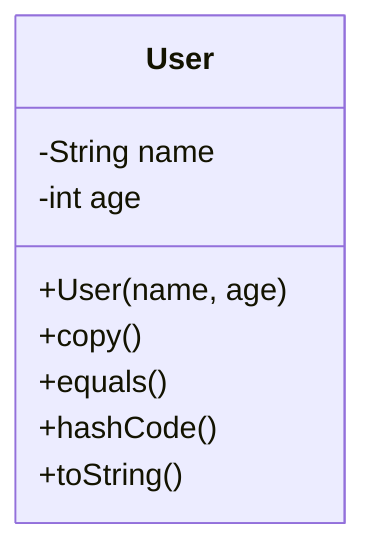

## 2.2 Immutability and Data Classes

In Kotlin, immutability and data classes are two foundational concepts that contribute significantly to writing clean, efficient, and maintainable code. Understanding and applying these principles can lead to more robust software design, reduce bugs, and enhance performance. This section will delve into the best practices for immutability and the effective use of data classes in Kotlin, providing expert insights and practical examples to guide you.

### Understanding Immutability

**Immutability** refers to the state of an object that cannot be modified after it is created. In functional programming, immutability is a core principle that helps prevent side effects and makes concurrent programming safer and more predictable.

#### Benefits of Immutability

1. **Thread Safety**: Immutable objects can be shared across threads without synchronization, reducing the risk of concurrency issues.
2. **Predictability**: Functions that operate on immutable data are easier to reason about, as they do not alter the state of their inputs.
3. **Simplified Debugging**: With immutable objects, you can be confident that once an object is created, its state will not change, making it easier to track down bugs.
4. **Enhanced Performance**: While immutability might seem to introduce overhead, modern JVM optimizations often mitigate these concerns, and the benefits in terms of reduced bugs and simpler code often outweigh any performance costs.

#### Implementing Immutability in Kotlin

Kotlin encourages immutability through several language features:

- **`val` Keyword**: Declares a read-only variable, ensuring that the reference cannot be reassigned.
- **Data Classes**: Provide a concise syntax for creating immutable objects with automatic `equals()`, `hashCode()`, and `toString()` methods.

```kotlin
data class User(val name: String, val age: Int)
```

In the above example, `User` is a data class with immutable properties `name` and `age`. Once an instance of `User` is created, its properties cannot be changed.

### Data Classes in Kotlin

**Data classes** in Kotlin are a powerful feature designed to hold data. They automatically provide implementations for common methods like `equals()`, `hashCode()`, and `toString()`, which are essential for data manipulation and comparison.

#### Key Features of Data Classes

1. **Automatic Method Generation**: Data classes automatically generate `equals()`, `hashCode()`, `toString()`, `copy()`, and `componentN()` methods.
2. **Conciseness**: Data classes reduce boilerplate code, making your codebase cleaner and easier to maintain.
3. **Destructuring Declarations**: Data classes support destructuring, allowing you to unpack values from an object into separate variables.

```kotlin
val user = User("Alice", 30)
val (name, age) = user
println("Name: $name, Age: $age")
```

#### When to Use Data Classes

Data classes are ideal when you need to represent simple data structures without complex logic. They are perfect for:

- **Modeling Data**: Use data classes to model entities in your application, such as users, products, or orders.
- **Transfer Objects**: Data classes are excellent for data transfer between layers or components in your application.
- **Immutable Collections**: Combine data classes with immutable collections for safe and predictable data handling.

### Best Practices for Immutability and Data Classes

#### Favor `val` Over `var`

Always prefer `val` over `var` unless you have a specific need for mutability. This practice promotes immutability and reduces the risk of unintended side effects.

```kotlin
val immutableList = listOf(1, 2, 3) // Immutable list
var mutableList = mutableListOf(1, 2, 3) // Mutable list
```

#### Use Data Classes for Simple Data Structures

Data classes are not suitable for every situation. Avoid using them for classes that require complex behavior or mutable state. Reserve data classes for simple data structures where immutability is desired.

#### Leverage the `copy()` Method

The `copy()` method in data classes allows you to create modified copies of an object without altering the original. This is particularly useful for working with immutable objects.

```kotlin
val originalUser = User("Alice", 30)
val updatedUser = originalUser.copy(age = 31)
```

#### Avoid Mutable Properties in Data Classes

While Kotlin allows mutable properties in data classes, it is generally best to avoid them to maintain immutability.

```kotlin
data class MutableUser(var name: String, var age: Int) // Not recommended
```

### Advanced Concepts and Use Cases

#### Combining Immutability with Functional Programming

Immutability aligns well with functional programming paradigms. By using immutable data structures and pure functions, you can create more predictable and testable code.

```kotlin
fun incrementAge(user: User): User {
    return user.copy(age = user.age + 1)
}
```

#### Immutability in Concurrent Programming

Immutability is particularly beneficial in concurrent programming, where shared mutable state can lead to complex synchronization issues. By using immutable objects, you can safely share data between threads.

#### Using Data Classes in Collections

Data classes work seamlessly with Kotlin's collection library, allowing you to create powerful and expressive data transformations.

```kotlin
val users = listOf(User("Alice", 30), User("Bob", 25))
val names = users.map { it.name }
println(names) // Output: [Alice, Bob]
```

### Visualizing Immutability and Data Classes

To better understand the relationship between immutability and data classes, consider the following class diagram that illustrates how data classes encapsulate immutable data:



### Try It Yourself

Experiment with the following code snippet to deepen your understanding of immutability and data classes:

```kotlin
data class Book(val title: String, val author: String, val year: Int)

fun main() {
    val book1 = Book("1984", "George Orwell", 1949)
    val book2 = book1.copy(year = 2024)

    println(book1) // Original book
    println(book2) // Updated book with a new year

    // Try modifying the properties directly and observe the compiler errors
    // book1.title = "Animal Farm" // Uncomment to see the error
}
```

### References and Further Reading

- [Kotlin Official Documentation: Data Classes](https://kotlinlang.org/docs/data-classes.html)
- [Kotlin Official Documentation: Immutability](https://kotlinlang.org/docs/reference/idioms.html#immutability)
- [Effective Java by Joshua Bloch](https://www.oreilly.com/library/view/effective-java-3rd/9780134686097/)

### Knowledge Check

- What are the benefits of using immutable objects in concurrent programming?
- How do data classes reduce boilerplate code in Kotlin?
- Why should you prefer `val` over `var` in Kotlin?

### Embrace the Journey

Remember, immutability and data classes are just the beginning of writing idiomatic Kotlin code. As you continue to explore Kotlin's features, you'll discover more ways to enhance your code's robustness and maintainability. Keep experimenting, stay curious, and enjoy the journey!

## Quiz Time!



### What is a primary benefit of immutability in concurrent programming?

- [x] Thread safety
- [ ] Increased complexity
- [ ] Reduced performance
- [ ] More boilerplate code

> **Explanation:** Immutability ensures that objects cannot be modified, which makes them inherently thread-safe and reduces the need for synchronization in concurrent programming.


### Which keyword is used in Kotlin to declare a read-only variable?

- [x] val
- [ ] var
- [ ] const
- [ ] let

> **Explanation:** The `val` keyword is used to declare a read-only variable in Kotlin, ensuring that the reference cannot be reassigned.


### What method does a data class automatically generate for copying an object?

- [x] copy()
- [ ] clone()
- [ ] replicate()
- [ ] duplicate()

> **Explanation:** Data classes in Kotlin automatically generate a `copy()` method that allows you to create modified copies of an object.


### What is a key feature of data classes in Kotlin?

- [x] Automatic generation of `equals()`, `hashCode()`, and `toString()`
- [ ] Support for mutable properties by default
- [ ] Requirement for manual method implementation
- [ ] Inability to use in collections

> **Explanation:** Data classes automatically generate `equals()`, `hashCode()`, and `toString()` methods, reducing boilerplate code.


### How can you create a modified copy of a data class instance?

- [x] Using the `copy()` method
- [ ] Reassigning properties directly
- [ ] Using a constructor
- [ ] Using the `clone()` method

> **Explanation:** The `copy()` method allows you to create a modified copy of a data class instance without altering the original.


### Why should you avoid mutable properties in data classes?

- [x] To maintain immutability
- [ ] To increase complexity
- [ ] To reduce performance
- [ ] To allow direct property modification

> **Explanation:** Avoiding mutable properties in data classes helps maintain immutability, which is a key principle in functional programming.


### What is the result of destructuring a data class in Kotlin?

- [x] Unpacking values into separate variables
- [ ] Combining multiple instances into one
- [ ] Creating a new instance with default values
- [ ] Modifying the original instance

> **Explanation:** Destructuring a data class allows you to unpack its values into separate variables for easier access and manipulation.


### Which of the following is a common use case for data classes?

- [x] Modeling simple data structures
- [ ] Implementing complex logic
- [ ] Managing mutable state
- [ ] Creating singleton objects

> **Explanation:** Data classes are ideal for modeling simple data structures where immutability is desired.


### What is a benefit of using `val` over `var` in Kotlin?

- [x] Promotes immutability
- [ ] Allows reassignment
- [ ] Increases complexity
- [ ] Reduces readability

> **Explanation:** Using `val` promotes immutability by ensuring that the reference cannot be reassigned, reducing the risk of unintended side effects.


### True or False: Data classes in Kotlin are suitable for classes with complex behavior.

- [ ] True
- [x] False

> **Explanation:** Data classes are not suitable for classes with complex behavior or mutable state. They are best used for simple data structures.


