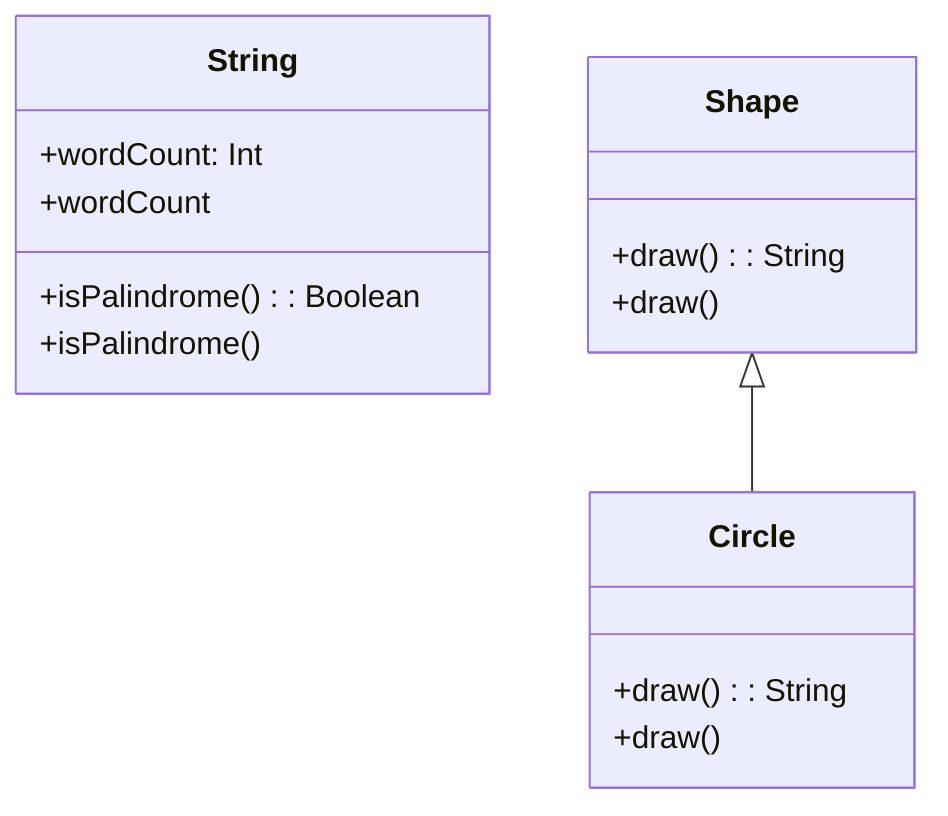

## 2.3 Extension Functions and Properties

In the realm of Kotlin programming, extension functions and properties stand out as powerful tools that allow developers to enhance existing classes without modifying their source code. This capability not only promotes cleaner and more expressive code but also aligns with the principles of open/closed design, where software entities should be open for extension but closed for modification.

### Introduction to Extension Functions

**Extension Functions** enable you to add new functions to existing classes. This feature is particularly useful when you want to extend the functionality of third-party libraries or classes you do not own. The syntax is straightforward, and the benefits are substantial in terms of code readability and maintainability.

#### How Extension Functions Work

An extension function is defined by prefixing the function name with the type you want to extend. Here's a basic example:

```kotlin
// Define an extension function on the String class
fun String.isPalindrome(): Boolean {
    val cleaned = this.replace("\\s".toRegex(), "").lowercase()
    return cleaned == cleaned.reversed()
}

fun main() {
    val phrase = "A man a plan a canal Panama"
    println(phrase.isPalindrome()) // Output: true
}
```

**Explanation:**

- **`String`**: The type being extended.
- **`isPalindrome`**: The name of the extension function.
- **`this`**: Refers to the instance of the type being extended, in this case, `String`.

#### Benefits of Extension Functions

1. **Readability**: Extension functions allow you to write code that reads naturally, as if the function is a native part of the class.
2. **Maintainability**: By keeping extensions separate from the class definition, you can maintain and update them independently.
3. **Encapsulation**: You can add functionality without exposing internal details of the class.

### Advanced Concepts in Extension Functions

#### Extension Function Scope

Extension functions are resolved statically, meaning the function to be called is determined by the type of the expression on which the function is invoked, not the runtime type. This can lead to some unexpected behavior if not understood correctly.

```kotlin
open class Shape
class Circle : Shape()

fun Shape.draw() = "Drawing a shape"
fun Circle.draw() = "Drawing a circle"

fun printDrawing(shape: Shape) {
    println(shape.draw())
}

fun main() {
    val shape: Shape = Circle()
    printDrawing(shape) // Output: Drawing a shape
}
```

**Explanation:**

- The `draw` function for `Shape` is called because extension functions are resolved based on the static type (`Shape`), not the runtime type (`Circle`).

#### Extension Functions vs. Member Functions

When an extension function and a member function have the same signature, the member function takes precedence. This is because extension functions do not actually modify the class; they are just syntactic sugar.

```kotlin
class Printer {
    fun print() = "Member function"
}

fun Printer.print() = "Extension function"

fun main() {
    val printer = Printer()
    println(printer.print()) // Output: Member function
}
```

**Explanation:**

- The member function `print` is called, demonstrating that member functions have higher precedence over extension functions.

### Introduction to Extension Properties

**Extension Properties** allow you to add properties to existing classes. While they cannot have backing fields, they can provide a way to calculate or retrieve values dynamically.

#### Defining Extension Properties

Here's how you can define an extension property:

```kotlin
val String.wordCount: Int
    get() = this.split("\\s+".toRegex()).size

fun main() {
    val text = "Kotlin is concise and expressive"
    println(text.wordCount) // Output: 5
}
```

**Explanation:**

- **`wordCount`**: An extension property for `String` that calculates the number of words.
- **`get()`**: The getter function that computes the property value.

#### Use Cases for Extension Properties

1. **Computed Properties**: When you need a property that is derived from other data.
2. **Readability**: They can make the code more expressive and easier to understand.
3. **Encapsulation**: Provide a way to expose data without modifying the class.

### Best Practices for Using Extensions

1. **Naming Conventions**: Use clear and descriptive names for extension functions and properties to avoid confusion.
2. **Avoid Overuse**: While extensions are powerful, overusing them can lead to code that is difficult to understand and maintain.
3. **Scope Control**: Limit the visibility of extensions to the necessary scope to prevent namespace pollution.

### Practical Examples and Use Cases

#### Enhancing Collections

Kotlin's standard library heavily utilizes extension functions to provide a rich set of operations on collections. You can create your own extensions to further enhance collections.

```kotlin
fun <T> List<T>.secondOrNull(): T? = if (this.size > 1) this[1] else null

fun main() {
    val numbers = listOf(1, 2, 3)
    println(numbers.secondOrNull()) // Output: 2
}
```

**Explanation:**

- **`secondOrNull`**: An extension function that returns the second element of a list or null if the list has fewer than two elements.

#### Adding Utility Functions

You can use extension functions to add utility methods to classes, making your code more modular and reusable.

```kotlin
fun Int.isEven() = this % 2 == 0

fun main() {
    val number = 4
    println(number.isEven()) // Output: true
}
```

**Explanation:**

- **`isEven`**: An extension function for `Int` that checks if a number is even.

### Visualizing Extension Functions and Properties

To better understand how extension functions and properties integrate into Kotlin's type system, let's visualize their interaction with classes.



**Diagram Explanation:**

- **`String`**: Extended with `isPalindrome` and `wordCount`.
- **`Shape` and `Circle`**: Demonstrates extension function precedence over member functions.

### Try It Yourself

Experiment with the following code examples to deepen your understanding of extension functions and properties:

1. **Modify the `isPalindrome` function** to ignore punctuation.
2. **Create an extension property** for `List` that returns the sum of its elements.
3. **Experiment with scope** by defining an extension function in a local scope and observing its visibility.

### References and Further Reading

- [Kotlin Documentation: Extension Functions](https://kotlinlang.org/docs/extensions.html)
- [Kotlin Documentation: Extension Properties](https://kotlinlang.org/docs/extensions.html#extension-properties)
- [Effective Kotlin: Best Practices](https://effectivekotlin.com/)

### Key Takeaways

- **Extension functions and properties** allow you to add functionality to existing classes without modifying their source code.
- They enhance **readability** and **maintainability** of your code by promoting a more expressive and modular design.
- **Static resolution** of extension functions can lead to unexpected behavior if not properly understood.
- **Member functions take precedence** over extension functions when they share the same signature.
- Use **extension properties** to expose computed values or enhance class interfaces without altering the class itself.

### Embrace the Journey

Remember, mastering extension functions and properties is just one step in your Kotlin journey. As you continue to explore and experiment, you'll discover even more ways to write clean, efficient, and expressive code. Keep pushing the boundaries of what's possible with Kotlin, and enjoy the process of learning and growing as a developer!

## Quiz Time!



### What is the primary benefit of using extension functions in Kotlin?

- [x] They allow adding functionality to existing classes without modifying their source code.
- [ ] They enable dynamic typing in Kotlin.
- [ ] They provide a way to create anonymous classes.
- [ ] They allow for runtime polymorphism.

> **Explanation:** Extension functions enable developers to add new functionality to existing classes without altering their source code, promoting code reuse and maintainability.

### How are extension functions resolved in Kotlin?

- [x] Statically, based on the type of the expression.
- [ ] Dynamically, based on the runtime type.
- [ ] At compile-time, but with runtime polymorphism.
- [ ] Using reflection at runtime.

> **Explanation:** Extension functions are resolved statically, meaning the function to be called is determined by the type of the expression on which the function is invoked.

### What happens when an extension function and a member function have the same signature?

- [x] The member function takes precedence.
- [ ] The extension function takes precedence.
- [ ] Both functions are called in sequence.
- [ ] A compile-time error occurs.

> **Explanation:** When an extension function and a member function have the same signature, the member function takes precedence.

### Can extension properties have backing fields?

- [ ] Yes, they can have backing fields.
- [x] No, they cannot have backing fields.
- [ ] Only if they are declared inside a class.
- [ ] Only if they are declared as `var`.

> **Explanation:** Extension properties cannot have backing fields because they do not actually modify the class they extend.

### What is a common use case for extension properties?

- [x] To provide computed properties.
- [ ] To store additional data in a class.
- [ ] To override existing properties.
- [ ] To enable dynamic typing.

> **Explanation:** Extension properties are commonly used to provide computed properties, enhancing class interfaces without altering the class itself.

### How can you limit the visibility of an extension function?

- [x] By defining it within a specific scope or file.
- [ ] By using the `private` keyword.
- [ ] By declaring it as `internal`.
- [ ] By using access modifiers like `protected`.

> **Explanation:** You can limit the visibility of an extension function by defining it within a specific scope or file.

### What is a potential downside of overusing extension functions?

- [x] It can lead to code that is difficult to understand and maintain.
- [ ] It can cause runtime errors.
- [ ] It can reduce the performance of the application.
- [ ] It can lead to memory leaks.

> **Explanation:** Overusing extension functions can lead to code that is difficult to understand and maintain due to namespace pollution.

### What is the output of the following code snippet?

```kotlin
open class Animal
class Dog : Animal()

fun Animal.speak() = "Animal sound"
fun Dog.speak() = "Bark"

fun main() {
    val animal: Animal = Dog()
    println(animal.speak())
}
```

- [x] Animal sound
- [ ] Bark
- [ ] Compile-time error
- [ ] Runtime error

> **Explanation:** The output is "Animal sound" because extension functions are resolved statically based on the type of the expression (`Animal`).

### Which of the following best describes the `this` keyword in an extension function?

- [x] It refers to the instance of the type being extended.
- [ ] It refers to the enclosing class of the extension function.
- [ ] It refers to the parent class of the type being extended.
- [ ] It refers to the global context.

> **Explanation:** In an extension function, `this` refers to the instance of the type being extended.

### True or False: Extension functions can modify the internal state of the class they extend.

- [ ] True
- [x] False

> **Explanation:** Extension functions cannot modify the internal state of the class they extend because they do not have access to private members.


