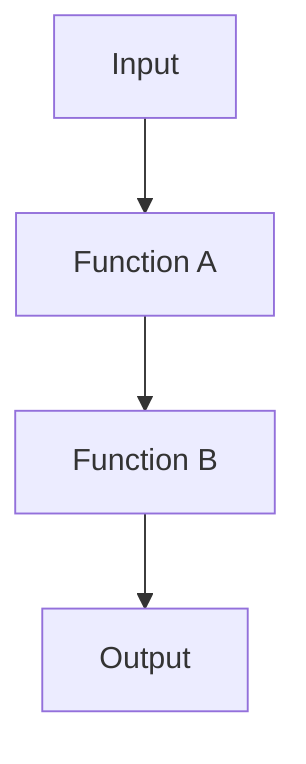

## 2.4 Functional Programming in Kotlin

Functional programming (FP) is a programming paradigm that treats computation as the evaluation of mathematical functions and avoids changing state and mutable data. Kotlin, being a modern programming language, embraces functional programming principles alongside object-oriented programming (OOP), providing a versatile toolkit for developers. In this section, we will delve into the functional programming concepts in Kotlin, focusing on higher-order functions, lambdas, function composition, and currying.

### Introduction to Functional Concepts in Kotlin

Functional programming emphasizes immutability, first-class functions, and declarative code. Kotlin supports these principles through its robust type system, concise syntax, and powerful standard library. Let's explore how Kotlin facilitates functional programming:

1. **Immutability**: Prefer immutable data structures to avoid side effects and enhance code predictability.
2. **First-Class Functions**: Functions are treated as first-class citizens, meaning they can be assigned to variables, passed as arguments, and returned from other functions.
3. **Declarative Code**: Focus on what to do rather than how to do it, making code more readable and maintainable.

### Using Higher-Order Functions and Lambdas

#### Higher-Order Functions

A higher-order function is a function that takes functions as parameters or returns a function. Kotlin's support for higher-order functions allows developers to write more abstract and reusable code.

**Example: Higher-Order Function**

```kotlin
fun <T> List<T>.customFilter(predicate: (T) -> Boolean): List<T> {
    val result = mutableListOf<T>()
    for (item in this) {
        if (predicate(item)) {
            result.add(item)
        }
    }
    return result
}

fun main() {
    val numbers = listOf(1, 2, 3, 4, 5)
    val evenNumbers = numbers.customFilter { it % 2 == 0 }
    println(evenNumbers) // Output: [2, 4]
}
```

In this example, `customFilter` is a higher-order function that takes a predicate function as a parameter and applies it to filter a list.

#### Lambdas

Lambdas are anonymous functions that can be used as expressions. They are concise and often used in higher-order functions.

**Example: Lambda Expression**

```kotlin
val sum: (Int, Int) -> Int = { a, b -> a + b }

fun main() {
    println(sum(3, 4)) // Output: 7
}
```

Here, `sum` is a lambda expression that takes two integers and returns their sum.

**Try It Yourself**

Experiment by modifying the `customFilter` function to filter out odd numbers or numbers greater than a certain value. This will help you understand how higher-order functions and lambdas work together.

### Function Composition and Currying

#### Function Composition

Function composition is the process of combining two or more functions to produce a new function. In Kotlin, you can achieve function composition using extension functions.

**Example: Function Composition**

```kotlin
fun <A, B, C> ((B) -> C).compose(other: (A) -> B): (A) -> C {
    return { a: A -> this(other(a)) }
}

fun main() {
    val multiplyBy2: (Int) -> Int = { it * 2 }
    val add3: (Int) -> Int = { it + 3 }
    val multiplyAndAdd = multiplyBy2.compose(add3)

    println(multiplyAndAdd(4)) // Output: 14
}
```

In this example, `compose` is an extension function that allows us to combine `multiplyBy2` and `add3` into a single function.

#### Currying

Currying is the technique of transforming a function that takes multiple arguments into a sequence of functions, each taking a single argument.

**Example: Currying**

```kotlin
fun add(a: Int) = { b: Int -> a + b }

fun main() {
    val add5 = add(5)
    println(add5(3)) // Output: 8
}
```

Here, `add` is a curried function that returns a new function when partially applied with an argument.

**Try It Yourself**

Modify the `compose` function to handle more complex compositions, or try currying a function with more than two arguments to see how it simplifies function calls.

### Visualizing Function Composition

To better understand function composition, let's visualize it using a flowchart.



In this flowchart, the input is processed by Function A, then the result is passed to Function B, producing the final output.

### References and Links

- [Kotlin Official Documentation](https://kotlinlang.org/docs/home.html)
- [Functional Programming in Kotlin](https://www.manning.com/books/functional-programming-in-kotlin)
- [Higher-Order Functions and Lambdas](https://kotlinlang.org/docs/lambdas.html)

### Knowledge Check

- What is a higher-order function?
- How do lambdas differ from regular functions?
- What are the benefits of using function composition?
- How does currying simplify function calls?

### Embrace the Journey

Remember, mastering functional programming in Kotlin is a journey. As you explore these concepts, you'll discover new ways to write more expressive and efficient code. Keep experimenting, stay curious, and enjoy the journey!

### Quiz Time!



### What is a higher-order function?

- [x] A function that takes functions as parameters or returns a function
- [ ] A function that only returns a boolean value
- [ ] A function that is always recursive
- [ ] A function that cannot be overridden

> **Explanation:** A higher-order function is one that takes other functions as parameters or returns a function as a result.

### How are lambdas different from regular functions in Kotlin?

- [x] Lambdas are anonymous functions that can be used as expressions
- [ ] Lambdas must always return a Unit
- [ ] Lambdas cannot take parameters
- [ ] Lambdas are always inline functions

> **Explanation:** Lambdas are anonymous functions that can be used as expressions, making them concise and flexible for use in higher-order functions.

### What is function composition?

- [x] The process of combining two or more functions to produce a new function
- [ ] The process of creating a function that calls itself
- [ ] The process of defining a function inside another function
- [ ] The process of converting a function into a lambda

> **Explanation:** Function composition involves combining two or more functions to create a new function that represents the composition of the original functions.

### What is currying in functional programming?

- [x] Transforming a function that takes multiple arguments into a sequence of functions, each taking a single argument
- [ ] Creating a function that can only be called once
- [ ] Defining a function that returns a constant value
- [ ] Writing a function that cannot be modified

> **Explanation:** Currying is the technique of transforming a function that takes multiple arguments into a sequence of functions, each taking a single argument.

### Which of the following is a benefit of using higher-order functions?

- [x] They allow for more abstract and reusable code
- [ ] They make code run faster
- [ ] They eliminate the need for variables
- [ ] They prevent runtime errors

> **Explanation:** Higher-order functions allow for more abstract and reusable code by enabling functions to be passed as parameters and returned as results.

### What does the `compose` function do in Kotlin?

- [x] Combines two functions into a single function
- [ ] Creates a new function that always returns null
- [ ] Converts a function into a lambda
- [ ] Reverses the order of function execution

> **Explanation:** The `compose` function in Kotlin combines two functions into a single function, allowing for function composition.

### How can you create a lambda expression in Kotlin?

- [x] Using the `{}` syntax with parameters and a function body
- [ ] By defining a class that implements a function interface
- [ ] By using the `fun` keyword followed by a function name
- [ ] By writing a function inside another function

> **Explanation:** Lambda expressions in Kotlin are created using the `{}` syntax, where parameters and the function body are defined within the braces.

### What is the purpose of currying a function?

- [x] To simplify function calls by breaking down a function into a sequence of functions
- [ ] To make a function execute faster
- [ ] To ensure a function can only be called once
- [ ] To convert a function into a lambda

> **Explanation:** Currying simplifies function calls by breaking down a function into a sequence of functions, each taking a single argument.

### Which of the following is an example of a higher-order function?

- [x] A function that takes another function as a parameter
- [ ] A function that always returns a constant value
- [ ] A function that is defined inside a class
- [ ] A function that cannot be overridden

> **Explanation:** A higher-order function is one that takes another function as a parameter or returns a function as a result.

### True or False: In Kotlin, functions are first-class citizens.

- [x] True
- [ ] False

> **Explanation:** In Kotlin, functions are first-class citizens, meaning they can be assigned to variables, passed as arguments, and returned from other functions.


