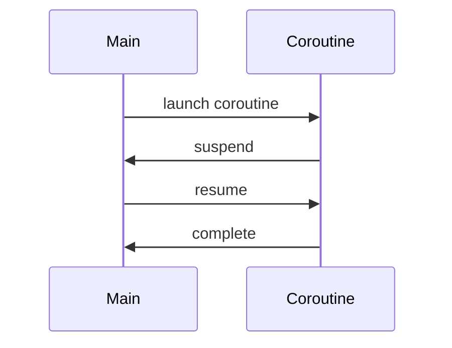

## 2.5 Coroutines and Asynchronous Programming

As expert software engineers and architects, understanding and mastering asynchronous programming is crucial for building responsive and efficient applications. Kotlin's coroutines provide a powerful and flexible way to handle asynchronous operations, making it easier to write non-blocking code that is both readable and maintainable. In this section, we will delve into the world of coroutines, exploring their concepts, patterns, and practical applications in Kotlin.

### Understanding Coroutines

Coroutines are a design pattern for asynchronous programming that allow you to write code in a sequential style while still being non-blocking. They are lightweight threads that can be suspended and resumed, enabling efficient management of asynchronous tasks without the complexity of traditional threading.

#### Key Concepts

- **Suspending Functions**: These are functions that can be paused and resumed at a later time. They are marked with the `suspend` keyword and can only be called from other suspending functions or coroutine builders.
  
- **Coroutine Builders**: These are functions that help you create and start coroutines. Common builders include `launch`, `async`, and `runBlocking`.

- **Coroutine Context and Dispatcher**: The context contains information about the coroutine, such as its job and dispatcher. The dispatcher determines the thread or threads the coroutine runs on.

- **Structured Concurrency**: This is a design principle that ensures coroutines are launched in a structured way, making it easier to manage their lifecycle and handle exceptions.

### Coroutine Builders

Kotlin provides several coroutine builders to create and manage coroutines. Let's explore some of the most commonly used builders.

#### `launch`

The `launch` builder is used to start a new coroutine that does not return a result. It is typically used for fire-and-forget tasks.

```kotlin
import kotlinx.coroutines.*

fun main() = runBlocking {
    launch {
        // This is a new coroutine
        println("Hello from coroutine!")
    }
    println("Hello from main!")
}
```

In this example, the `launch` builder starts a new coroutine that prints a message. The `runBlocking` function is used to block the main thread until the coroutine completes.

#### `async`

The `async` builder is used to start a new coroutine that returns a result. It is often used for concurrent computations.

```kotlin
import kotlinx.coroutines.*

fun main() = runBlocking {
    val deferred = async {
        // Perform some computation
        delay(1000L)
        42
    }
    println("The answer is ${deferred.await()}")
}
```

Here, the `async` builder starts a coroutine that performs a computation and returns a result. The `await` function is used to retrieve the result once the computation is complete.

#### `runBlocking`

The `runBlocking` builder is used to bridge the gap between regular blocking code and coroutines. It blocks the current thread until all coroutines inside it complete.

```kotlin
import kotlinx.coroutines.*

fun main() = runBlocking {
    println("Start")
    delay(1000L)
    println("End")
}
```

This example demonstrates how `runBlocking` can be used to execute suspending functions in a blocking manner, making it useful for testing and simple scripts.

### Suspending Functions

Suspending functions are at the heart of coroutines. They allow you to perform long-running operations without blocking the thread. Let's explore how to create and use suspending functions.

```kotlin
import kotlinx.coroutines.*

suspend fun fetchData(): String {
    delay(1000L) // Simulate a long-running operation
    return "Data"
}

fun main() = runBlocking {
    val data = fetchData()
    println("Fetched data: $data")
}
```

In this example, `fetchData` is a suspending function that simulates a long-running operation using `delay`. The `runBlocking` builder is used to call the suspending function from a blocking context.

### Coroutine Context and Dispatchers

The coroutine context is a set of elements that define the behavior of a coroutine. It includes the job, dispatcher, and other context elements. Dispatchers determine the thread or threads a coroutine runs on.

#### Common Dispatchers

- **`Dispatchers.Default`**: Used for CPU-intensive tasks.
- **`Dispatchers.IO`**: Used for I/O operations.
- **`Dispatchers.Main`**: Used for UI updates on the main thread (Android).
- **`Dispatchers.Unconfined`**: Runs the coroutine in the current thread but is not confined to any specific thread.

```kotlin
import kotlinx.coroutines.*

fun main() = runBlocking {
    launch(Dispatchers.Default) {
        println("Running on Default dispatcher")
    }
    launch(Dispatchers.IO) {
        println("Running on IO dispatcher")
    }
}
```

This example demonstrates how to specify dispatchers for coroutines, allowing you to optimize their execution based on the task.

### Structured Concurrency

Structured concurrency is a principle that ensures coroutines are launched in a structured way, making it easier to manage their lifecycle and handle exceptions. It involves using coroutine scopes to control the lifetime of coroutines.

```kotlin
import kotlinx.coroutines.*

fun main() = runBlocking {
    coroutineScope {
        launch {
            delay(1000L)
            println("Task from nested launch")
        }
        println("Task from coroutine scope")
    }
    println("Coroutine scope is over")
}
```

In this example, `coroutineScope` is used to create a new scope for the coroutines. The coroutines inside the scope are structured, meaning they must complete before the scope itself completes.

### Exception Handling in Coroutines

Exception handling in coroutines is crucial for building robust applications. Kotlin provides several mechanisms to handle exceptions in coroutines.

#### `try-catch` Blocks

You can use `try-catch` blocks to handle exceptions in suspending functions.

```kotlin
import kotlinx.coroutines.*

suspend fun riskyOperation() {
    throw Exception("Something went wrong")
}

fun main() = runBlocking {
    try {
        riskyOperation()
    } catch (e: Exception) {
        println("Caught exception: ${e.message}")
    }
}
```

In this example, a `try-catch` block is used to handle an exception thrown by a suspending function.

#### Coroutine Exception Handler

The `CoroutineExceptionHandler` is a context element that handles uncaught exceptions in coroutines.

```kotlin
import kotlinx.coroutines.*

fun main() = runBlocking {
    val handler = CoroutineExceptionHandler { _, exception ->
        println("Caught exception: ${exception.message}")
    }
    val job = launch(handler) {
        throw Exception("Something went wrong")
    }
    job.join()
}
```

Here, a `CoroutineExceptionHandler` is used to handle uncaught exceptions in a coroutine.

### Patterns for Concurrency and Parallelism

Kotlin coroutines provide several patterns for managing concurrency and parallelism, enabling you to build efficient and responsive applications.

#### Concurrent Execution

You can use the `async` builder to perform concurrent computations.

```kotlin
import kotlinx.coroutines.*

fun main() = runBlocking {
    val result1 = async { computeValue1() }
    val result2 = async { computeValue2() }
    println("Result: ${result1.await() + result2.await()}")
}

suspend fun computeValue1(): Int {
    delay(1000L)
    return 10
}

suspend fun computeValue2(): Int {
    delay(1000L)
    return 20
}
```

In this example, two computations are performed concurrently using `async`, improving the overall performance.

#### Parallel Decomposition

Parallel decomposition involves breaking a task into smaller subtasks that can be executed in parallel.

```kotlin
import kotlinx.coroutines.*

fun main() = runBlocking {
    val numbers = (1..10).toList()
    val sum = numbers.map { number ->
        async { number * number }
    }.sumOf { it.await() }
    println("Sum of squares: $sum")
}
```

This example demonstrates how to use `async` to perform parallel decomposition, calculating the sum of squares of a list of numbers.

### Visualizing Coroutine Execution

To better understand how coroutines work, let's visualize the execution flow of a simple coroutine program.



This sequence diagram illustrates the lifecycle of a coroutine, showing how it is launched, suspended, resumed, and completed.

### Try It Yourself

Experiment with the code examples provided in this section. Try modifying the delay times, adding more coroutines, or changing the dispatchers to see how it affects the execution. This hands-on approach will help solidify your understanding of coroutines and asynchronous programming in Kotlin.

### Knowledge Check

- What is the purpose of the `suspend` keyword in Kotlin?
- How do you handle exceptions in coroutines?
- What is the difference between `launch` and `async` builders?
- How does structured concurrency help manage coroutine lifecycles?

### Embrace the Journey

Remember, mastering coroutines and asynchronous programming is a journey. As you progress, you'll build more complex and efficient applications. Keep experimenting, stay curious, and enjoy the journey!

## Quiz Time!



### What is the primary purpose of coroutines in Kotlin?

- [x] To handle asynchronous programming in a sequential style
- [ ] To replace threads entirely
- [ ] To improve UI design
- [ ] To manage memory allocation

> **Explanation:** Coroutines are designed to handle asynchronous programming while allowing developers to write code in a sequential style, making it more readable and maintainable.

### Which coroutine builder is used for fire-and-forget tasks?

- [x] launch
- [ ] async
- [ ] runBlocking
- [ ] withContext

> **Explanation:** The `launch` builder is used for fire-and-forget tasks that do not return a result.

### How do you specify the thread a coroutine runs on?

- [x] By using a dispatcher in the coroutine context
- [ ] By using the `suspend` keyword
- [ ] By using `async` builder
- [ ] By using `runBlocking`

> **Explanation:** Dispatchers in the coroutine context determine the thread or threads a coroutine runs on.

### What is structured concurrency?

- [x] A design principle that ensures coroutines are launched in a structured way
- [ ] A method to improve UI performance
- [ ] A pattern for database access
- [ ] A way to manage memory

> **Explanation:** Structured concurrency ensures coroutines are launched in a structured way, making it easier to manage their lifecycle and handle exceptions.

### Which dispatcher is used for CPU-intensive tasks?

- [x] Dispatchers.Default
- [ ] Dispatchers.IO
- [ ] Dispatchers.Main
- [ ] Dispatchers.Unconfined

> **Explanation:** `Dispatchers.Default` is optimized for CPU-intensive tasks.

### How can you handle exceptions in a coroutine?

- [x] Using try-catch blocks or CoroutineExceptionHandler
- [ ] By using `suspend` keyword
- [ ] By using `launch` builder
- [ ] By using `async` builder

> **Explanation:** Exceptions in coroutines can be handled using `try-catch` blocks or a `CoroutineExceptionHandler`.

### What is the difference between `launch` and `async`?

- [x] `launch` is for fire-and-forget tasks, `async` returns a result
- [ ] `launch` returns a result, `async` is for fire-and-forget tasks
- [ ] Both are the same
- [ ] `launch` is for UI tasks, `async` is for background tasks

> **Explanation:** `launch` is used for tasks that do not return a result, while `async` is used for tasks that return a result.

### What is the role of the `suspend` keyword?

- [x] To mark a function as suspending, allowing it to be paused and resumed
- [ ] To indicate a function is asynchronous
- [ ] To improve performance
- [ ] To manage memory

> **Explanation:** The `suspend` keyword marks a function as suspending, allowing it to be paused and resumed.

### How do you perform concurrent computations in coroutines?

- [x] By using the `async` builder
- [ ] By using the `launch` builder
- [ ] By using `runBlocking`
- [ ] By using `withContext`

> **Explanation:** The `async` builder is used to perform concurrent computations.

### True or False: Coroutines can only run on a single thread.

- [ ] True
- [x] False

> **Explanation:** Coroutines can run on multiple threads, determined by the dispatcher used in the coroutine context.


