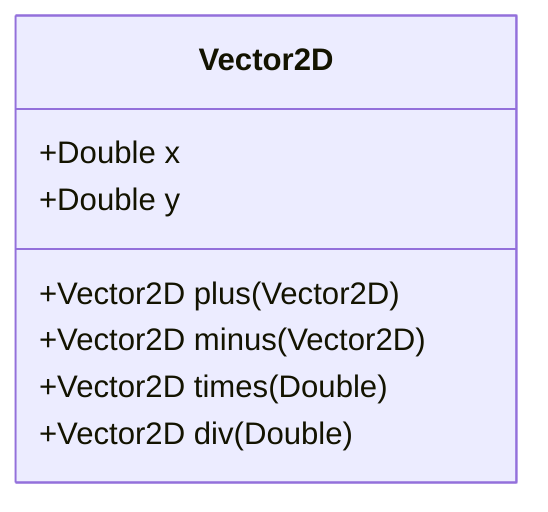

## 2.6 Operator Overloading

Operator overloading is a powerful feature in Kotlin that allows developers to define custom behavior for operators. This capability can significantly enhance code readability and functionality, making it easier to express complex operations succinctly and intuitively. In this section, we will delve into the intricacies of operator overloading in Kotlin, exploring its syntax, use cases, and best practices.

### Understanding Operator Overloading

Operator overloading allows you to provide a custom implementation for the behavior of operators when they are applied to instances of a class. This means you can define how operators like `+`, `-`, `*`, `/`, and others behave when used with your custom types. This feature can be particularly useful when working with mathematical operations, collections, or any domain-specific logic where operators can provide a more natural and expressive syntax.

#### Why Use Operator Overloading?

- **Enhanced Readability**: By overloading operators, you can make your code more intuitive. For example, using `+` to concatenate two custom objects can be more readable than calling a method like `concatenate`.
- **Expressiveness**: Operators can convey the intent of the code more clearly, especially in domains like mathematics or graphics where operators are a natural fit.
- **Consistency**: Overloading operators can help maintain consistency with built-in types, providing a familiar interface to users of your classes.

### Syntax and Rules for Operator Overloading

In Kotlin, operator overloading is achieved by defining functions with specific names prefixed with the `operator` keyword. These functions correspond to the operators you wish to overload. Here are some key points to remember:

- **Function Naming**: Each operator has a corresponding function name. For example, the `+` operator corresponds to the `plus` function, `-` to `minus`, `*` to `times`, and so on.
- **Operator Keyword**: The function must be marked with the `operator` keyword to indicate that it is intended to overload an operator.
- **Return Type**: The return type of the operator function should be the result type of the operation.
- **Parameter Type**: The parameter type should match the type of the operand you are working with.

#### Example: Overloading the `+` Operator

Let's start with a simple example of overloading the `+` operator for a custom class `Vector2D` representing a 2D vector.

```kotlin
data class Vector2D(val x: Double, val y: Double) {
    // Overloading the + operator
    operator fun plus(other: Vector2D): Vector2D {
        return Vector2D(this.x + other.x, this.y + other.y)
    }
}

fun main() {
    val vector1 = Vector2D(3.0, 4.0)
    val vector2 = Vector2D(1.0, 2.0)
    val result = vector1 + vector2
    println(result) // Output: Vector2D(x=4.0, y=6.0)
}
```

In this example, we define a `plus` function to overload the `+` operator for the `Vector2D` class. The function takes another `Vector2D` as a parameter and returns a new `Vector2D` representing the sum of the two vectors.

### Commonly Overloaded Operators

Kotlin supports overloading for a wide range of operators. Here are some of the most commonly overloaded operators and their corresponding function names:

| Operator | Function Name | Description |
|----------|---------------|-------------|
| `+`      | `plus`        | Addition or concatenation |
| `-`      | `minus`       | Subtraction |
| `*`      | `times`       | Multiplication |
| `/`      | `div`         | Division |
| `%`      | `rem`         | Remainder |
| `++`     | `inc`         | Increment |
| `--`     | `dec`         | Decrement |
| `==`     | `equals`      | Equality check |
| `[]`     | `get`         | Index access |
| `[]=`    | `set`         | Index assignment |
| `in`     | `contains`    | Membership check |
| `..`     | `rangeTo`     | Range creation |

### Advanced Operator Overloading

#### Overloading Comparison Operators

Comparison operators like `<`, `>`, `<=`, and `>=` can be overloaded by implementing the `Comparable` interface and providing an implementation for the `compareTo` function. Here's an example:

```kotlin
data class Box(val volume: Double) : Comparable<Box> {
    override fun compareTo(other: Box): Int {
        return this.volume.compareTo(other.volume)
    }
}

fun main() {
    val box1 = Box(100.0)
    val box2 = Box(150.0)
    println(box1 < box2) // Output: true
}
```

In this example, the `Box` class implements the `Comparable` interface, allowing us to use comparison operators to compare the volumes of two boxes.

#### Overloading the `invoke` Operator

The `invoke` operator can be overloaded to allow instances of a class to be called like functions. This can be useful for creating objects that behave like function objects or functors.

```kotlin
class Multiplier(val factor: Int) {
    operator fun invoke(value: Int): Int {
        return value * factor
    }
}

fun main() {
    val double = Multiplier(2)
    println(double(5)) // Output: 10
}
```

Here, the `Multiplier` class overloads the `invoke` operator, allowing instances to be called with an integer argument, returning the product of the argument and the factor.

### Design Considerations

When overloading operators, it's important to consider the following:

- **Intuitiveness**: Ensure that the overloaded operators behave in a way that is intuitive and expected. Misleading operator behavior can lead to confusion and errors.
- **Consistency**: Maintain consistency with the behavior of similar operators on built-in types. Users will expect similar behavior for similar operations.
- **Performance**: Be mindful of the performance implications of your operator overloads, especially if they involve complex calculations or object allocations.

### Differences and Similarities with Other Languages

Kotlin's approach to operator overloading is similar to other languages like C++ and Python, but with some differences:

- **Simplicity**: Kotlin simplifies operator overloading by using specific function names and the `operator` keyword, making it clear and concise.
- **Safety**: Kotlin's type system and null safety features help prevent common errors associated with operator overloading.
- **Interoperability**: Kotlin's operator overloading integrates seamlessly with Java, allowing for smooth interoperability between the two languages.

### Try It Yourself

To get a hands-on understanding of operator overloading, try modifying the code examples provided:

1. **Extend the `Vector2D` class** to support other operators like `-`, `*`, and `/`.
2. **Create a custom class** that overloads the `[]` operator for index access.
3. **Experiment with the `invoke` operator** to create a class that behaves like a function.

### Visualizing Operator Overloading

To better understand how operator overloading works, let's visualize the process using a UML class diagram. This diagram illustrates the relationship between a class and its overloaded operators.



In this diagram, the `Vector2D` class is shown with its properties `x` and `y`, and the overloaded operator functions `plus`, `minus`, `times`, and `div`.

### Conclusion

Operator overloading in Kotlin is a powerful tool that can enhance code readability and functionality. By allowing developers to define custom behavior for operators, Kotlin provides a flexible and expressive way to work with custom types. As you explore operator overloading, remember to keep your implementations intuitive and consistent with the behavior of built-in types. With practice and experimentation, you'll be able to leverage operator overloading to create more readable and maintainable code.

## Quiz Time!



### What is the primary benefit of operator overloading in Kotlin?

- [x] Enhancing code readability and expressiveness
- [ ] Increasing code execution speed
- [ ] Reducing memory usage
- [ ] Simplifying the Kotlin syntax

> **Explanation:** Operator overloading enhances code readability and expressiveness by allowing custom behavior for operators, making code more intuitive and natural.

### Which keyword is used to define an operator function in Kotlin?

- [ ] override
- [x] operator
- [ ] fun
- [ ] overload

> **Explanation:** The `operator` keyword is used to define an operator function in Kotlin, indicating that the function is intended to overload an operator.

### What function name corresponds to the `+` operator in Kotlin?

- [ ] add
- [x] plus
- [ ] sum
- [ ] append

> **Explanation:** The `plus` function name corresponds to the `+` operator in Kotlin, allowing for the overloading of addition operations.

### How can you overload comparison operators like `<` and `>` in Kotlin?

- [ ] By using the `compare` function
- [x] By implementing the `Comparable` interface
- [ ] By defining a `compareTo` function
- [ ] By using the `operator` keyword

> **Explanation:** Comparison operators can be overloaded by implementing the `Comparable` interface and providing an implementation for the `compareTo` function.

### What is the purpose of overloading the `invoke` operator in Kotlin?

- [x] To allow instances of a class to be called like functions
- [ ] To perform arithmetic operations
- [ ] To compare two objects
- [ ] To access elements by index

> **Explanation:** Overloading the `invoke` operator allows instances of a class to be called like functions, useful for creating functors or function objects.

### Which of the following is NOT a commonly overloaded operator in Kotlin?

- [ ] +
- [ ] *
- [ ] []
- [x] @

> **Explanation:** The `@` symbol is not an operator that can be overloaded in Kotlin. Commonly overloaded operators include `+`, `*`, and `[]`.

### What should be considered when overloading operators in Kotlin?

- [x] Intuitiveness and consistency with built-in types
- [ ] Minimizing the number of overloaded operators
- [ ] Maximizing the complexity of operations
- [ ] Ensuring all operators are overloaded

> **Explanation:** When overloading operators, it's important to ensure that the behavior is intuitive and consistent with built-in types to avoid confusion.

### Which operator function is used to overload the `[]` operator for index access?

- [ ] access
- [ ] index
- [x] get
- [ ] retrieve

> **Explanation:** The `get` function is used to overload the `[]` operator for index access in Kotlin.

### True or False: Operator overloading can be used to improve performance in Kotlin.

- [ ] True
- [x] False

> **Explanation:** Operator overloading is primarily used for enhancing readability and expressiveness, not for improving performance. In fact, it can sometimes introduce performance overhead if not used carefully.

### What is a key difference between operator overloading in Kotlin and C++?

- [x] Kotlin uses specific function names and the `operator` keyword
- [ ] Kotlin allows overloading of more operators
- [ ] C++ requires the `operator` keyword
- [ ] C++ uses specific function names for operators

> **Explanation:** Kotlin uses specific function names and the `operator` keyword to simplify operator overloading, whereas C++ uses the `operator` keyword with the operator symbol.



Remember, this is just the beginning. As you progress, you'll build more complex and interactive applications using Kotlin's powerful features. Keep experimenting, stay curious, and enjoy the journey!
