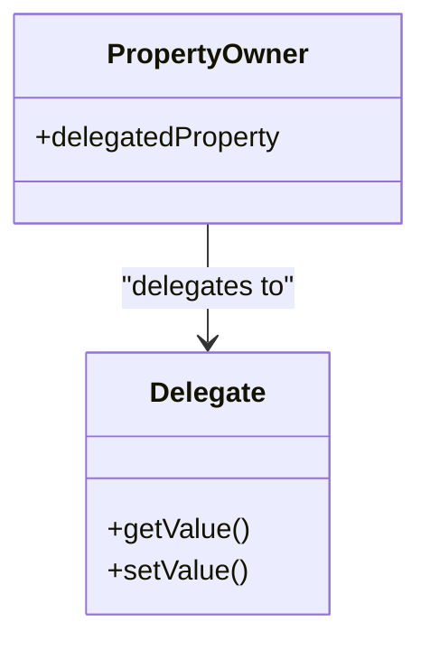

## 2.7 Delegated Properties

Delegated properties in Kotlin offer a powerful mechanism for property management, allowing developers to encapsulate common property logic in reusable components. This feature leverages the concept of delegation, where a property delegates its getter and setter logic to another object. In this section, we will delve into both built-in delegates provided by Kotlin and how to create custom delegation behaviors, enhancing your code's efficiency and maintainability.

### Introduction to Delegated Properties

Delegated properties are a unique feature of Kotlin that allows you to define a property and delegate its access and modification logic to a separate object. This delegation can be used to implement lazy properties, observable properties, and more, without cluttering your class with repetitive code.

#### Key Concepts

- **Delegation**: The act of handing over the responsibility for a particular task to another object.
- **Property Delegate**: An object that handles the logic for a property’s getter and setter.
- **Delegated Property Syntax**: Using the `by` keyword to delegate a property.

#### Why Use Delegated Properties?

1. **Code Reusability**: Encapsulate common property logic in reusable delegates.
2. **Separation of Concerns**: Keep your classes focused on their primary responsibilities.
3. **Simplified Code**: Reduce boilerplate code by using built-in delegates or creating custom ones.

### Built-in Delegates in Kotlin

Kotlin provides several built-in delegates that cover common use cases, such as lazy initialization, observable properties, and more.

#### Lazy Initialization

The `lazy` delegate is used for properties that should be initialized only when they are accessed for the first time. This is particularly useful for properties that are expensive to create or compute.

```kotlin
val lazyValue: String by lazy {
    println("Computed!")
    "Hello, Kotlin!"
}

fun main() {
    println(lazyValue) // Prints "Computed!" followed by "Hello, Kotlin!"
    println(lazyValue) // Prints "Hello, Kotlin!" without recomputing
}
```

**Key Points:**

- **Thread Safety**: By default, `lazy` is thread-safe and synchronized. You can change this behavior by specifying a different `LazyThreadSafetyMode`.
- **Initialization**: The lambda passed to `lazy` is executed only once.

#### Observable Properties

The `Delegates.observable` function allows you to define a property with a callback that gets triggered whenever the property value changes.

```kotlin
import kotlin.properties.Delegates

var observableValue: String by Delegates.observable("Initial Value") { property, oldValue, newValue ->
    println("${property.name} changed from $oldValue to $newValue")
}

fun main() {
    observableValue = "New Value" // Triggers the callback
}
```

**Key Points:**

- **Callback Parameters**: The callback receives the property metadata, the old value, and the new value.
- **Use Cases**: Ideal for properties where you need to perform actions on value changes, such as updating a UI.

#### Vetoable Properties

The `Delegates.vetoable` function is similar to `observable`, but it allows you to veto changes to the property value.

```kotlin
var vetoableValue: Int by Delegates.vetoable(0) { property, oldValue, newValue ->
    newValue >= 0 // Only allow non-negative values
}

fun main() {
    vetoableValue = 10 // Accepted
    println(vetoableValue) // Prints 10

    vetoableValue = -5 // Rejected
    println(vetoableValue) // Still prints 10
}
```

**Key Points:**

- **Veto Logic**: The lambda returns a Boolean indicating whether the new value should be accepted.
- **Use Cases**: Useful for properties with constraints or validation rules.

### Creating Custom Delegation Behaviors

While built-in delegates cover many scenarios, there are times when you need custom behavior. Kotlin allows you to create your own property delegates by implementing the `ReadOnlyProperty` or `ReadWriteProperty` interfaces.

#### Custom Read-Only Delegate

A read-only delegate only requires a `getValue` method.

```kotlin
class UpperCaseDelegate : ReadOnlyProperty<Any?, String> {
    private var value: String = "default"

    override fun getValue(thisRef: Any?, property: KProperty<*>): String {
        return value.toUpperCase()
    }
}

val customValue: String by UpperCaseDelegate()

fun main() {
    println(customValue) // Prints "DEFAULT"
}
```

**Key Points:**

- **ReadOnlyProperty Interface**: Implement the `getValue` method to define how the property value is retrieved.

#### Custom Read-Write Delegate

A read-write delegate requires both `getValue` and `setValue` methods.

```kotlin
class TrimDelegate : ReadWriteProperty<Any?, String> {
    private var value: String = ""

    override fun getValue(thisRef: Any?, property: KProperty<*>): String {
        return value
    }

    override fun setValue(thisRef: Any?, property: KProperty<*>, value: String) {
        this.value = value.trim()
    }
}

var trimmedValue: String by TrimDelegate()

fun main() {
    trimmedValue = "  Hello, Kotlin!  "
    println(trimmedValue) // Prints "Hello, Kotlin!"
}
```

**Key Points:**

- **ReadWriteProperty Interface**: Implement both `getValue` and `setValue` methods to manage property access and modification.

### Advanced Use Cases

Delegated properties can be used in various advanced scenarios, such as caching, logging, and more.

#### Caching with Delegated Properties

You can use delegated properties to implement caching mechanisms, where expensive computations are stored and reused.

```kotlin
class CacheDelegate<T>(private val computation: () -> T) : ReadOnlyProperty<Any?, T> {
    private var cachedValue: T? = null

    override fun getValue(thisRef: Any?, property: KProperty<*>): T {
        if (cachedValue == null) {
            cachedValue = computation()
        }
        return cachedValue!!
    }
}

val expensiveValue: Int by CacheDelegate {
    println("Computing...")
    42
}

fun main() {
    println(expensiveValue) // Prints "Computing..." followed by "42"
    println(expensiveValue) // Prints "42" without recomputing
}
```

**Key Points:**

- **Lazy Evaluation**: Similar to `lazy`, but with custom caching logic.
- **Use Cases**: Ideal for properties where the computation is costly and the result can be reused.

#### Logging Property Access

You can create delegates that log property access or modifications, useful for debugging or monitoring.

```kotlin
class LoggingDelegate<T>(private var value: T) : ReadWriteProperty<Any?, T> {
    override fun getValue(thisRef: Any?, property: KProperty<*>): T {
        println("Accessing ${property.name}")
        return value
    }

    override fun setValue(thisRef: Any?, property: KProperty<*>, value: T) {
        println("Modifying ${property.name} from $this.value to $value")
        this.value = value
    }
}

var loggedValue: String by LoggingDelegate("Initial")

fun main() {
    println(loggedValue) // Logs access
    loggedValue = "Updated" // Logs modification
}
```

**Key Points:**

- **Monitoring**: Useful for tracking property usage in complex systems.
- **Debugging**: Helps identify unexpected property access patterns.

### Visualizing Delegated Properties

To better understand how delegated properties work, let's visualize the delegation process using a class diagram.



**Diagram Description:** The `PropertyOwner` class has a `delegatedProperty` that delegates its getter and setter logic to the `Delegate` class. This delegation is facilitated by the `by` keyword in Kotlin.

### Design Considerations

When using delegated properties, consider the following:

- **Performance**: Delegation can introduce overhead, so use it judiciously for performance-critical properties.
- **Complexity**: While delegation can simplify property management, it can also add complexity if overused or misused.
- **Thread Safety**: Ensure that your delegates are thread-safe if they are accessed from multiple threads.

### Differences and Similarities

Delegated properties can sometimes be confused with other design patterns, such as the Proxy pattern. While both involve delegation, delegated properties are specifically for property management, whereas the Proxy pattern is a structural design pattern for controlling access to objects.

### Try It Yourself

To deepen your understanding of delegated properties, try modifying the examples provided:

- **Experiment with Lazy Initialization**: Change the thread safety mode of the `lazy` delegate and observe the behavior.
- **Create a Custom Delegate**: Implement a delegate that logs both access and modification times for a property.
- **Combine Delegates**: Use multiple delegates in a single class to manage different properties with distinct behaviors.

### Knowledge Check

Before moving on, consider these questions:

- How does the `lazy` delegate differ from a custom caching delegate?
- What are the advantages of using `Delegates.observable` over manually implementing change listeners?
- When would you choose to use a vetoable property?

### Embrace the Journey

Remember, mastering delegated properties is just one step in becoming proficient with Kotlin. As you continue to explore and experiment, you'll discover new ways to leverage Kotlin's powerful features to write clean, efficient, and maintainable code. Keep pushing the boundaries, stay curious, and enjoy the journey!

## Quiz Time!



### What is a key benefit of using delegated properties in Kotlin?

- [x] Code reusability and separation of concerns
- [ ] Improved performance in all cases
- [ ] Simplified syntax for all property types
- [ ] Automatic thread safety for all properties

> **Explanation:** Delegated properties help in code reusability and separation of concerns by encapsulating common property logic in reusable components.

### Which built-in delegate is used for properties that should be initialized only when accessed for the first time?

- [x] lazy
- [ ] observable
- [ ] vetoable
- [ ] lateinit

> **Explanation:** The `lazy` delegate initializes the property only when it is accessed for the first time.

### What does the `Delegates.observable` function provide?

- [x] A callback that gets triggered whenever the property value changes
- [ ] A mechanism to veto property changes
- [ ] Automatic synchronization for property access
- [ ] Lazy initialization of properties

> **Explanation:** `Delegates.observable` provides a callback that is triggered on property value changes.

### How can you implement a custom read-only delegate in Kotlin?

- [x] By implementing the `ReadOnlyProperty` interface
- [ ] By using the `lazy` delegate
- [ ] By implementing the `ReadWriteProperty` interface
- [ ] By using the `vetoable` delegate

> **Explanation:** A custom read-only delegate is implemented by the `ReadOnlyProperty` interface.

### What is the purpose of the `Delegates.vetoable` function?

- [x] To allow vetoing changes to a property value
- [ ] To provide lazy initialization
- [ ] To log property access
- [ ] To automatically synchronize property access

> **Explanation:** `Delegates.vetoable` allows you to veto changes to a property value based on a condition.

### Which of the following is a key consideration when using delegated properties?

- [x] Performance overhead
- [ ] Automatic thread safety
- [ ] Simplified syntax for all properties
- [ ] Guaranteed immutability

> **Explanation:** Delegation can introduce performance overhead, so it should be used judiciously.

### How can you log property access using delegated properties?

- [x] By creating a custom delegate that logs access in the `getValue` method
- [ ] By using the `lazy` delegate
- [ ] By using the `observable` delegate
- [ ] By implementing the `ReadOnlyProperty` interface

> **Explanation:** You can log property access by creating a custom delegate that logs in the `getValue` method.

### What is the main difference between a custom caching delegate and the `lazy` delegate?

- [x] Custom caching delegates can implement custom caching logic
- [ ] `lazy` delegates are always thread-safe
- [ ] Custom caching delegates are built-in
- [ ] `lazy` delegates cannot be used for read-write properties

> **Explanation:** Custom caching delegates allow for custom caching logic, whereas `lazy` delegates follow a specific initialization pattern.

### In which scenario would you use a vetoable property?

- [x] When you need to enforce constraints on property values
- [ ] When you need lazy initialization
- [ ] When you need to log property access
- [ ] When you need automatic synchronization

> **Explanation:** Vetoable properties are used when you need to enforce constraints on property values.

### True or False: Delegated properties can only be used for read-only properties.

- [ ] True
- [x] False

> **Explanation:** Delegated properties can be used for both read-only and read-write properties.


