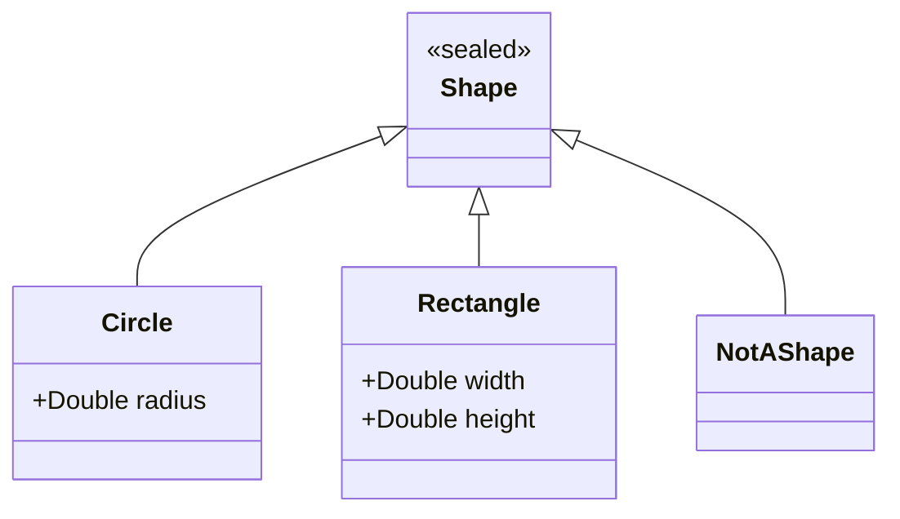
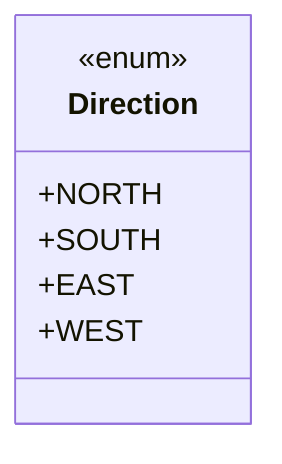

## 2.8 Sealed Classes and Enum Classes

In Kotlin, both sealed classes and enum classes provide powerful mechanisms for defining restricted class hierarchies. They are particularly useful when you want to represent a fixed set of types or states, allowing for more controlled and predictable code. In this section, we will explore the concepts, use cases, and implementation details of sealed classes and enum classes in Kotlin, and how they can be leveraged for exhaustive `when` expressions.

### Understanding Sealed Classes

Sealed classes in Kotlin are a special kind of class that allow you to define a restricted class hierarchy. They are used when you have a known set of subclasses, and you want to restrict the inheritance to only those subclasses. This is particularly useful for representing a limited set of types or states.

#### Key Characteristics of Sealed Classes

- **Restricted Inheritance**: Sealed classes restrict the inheritance to a predefined set of subclasses. This means that all subclasses of a sealed class must be defined within the same file.
- **Exhaustive `when` Expressions**: When using a `when` expression with sealed classes, the compiler can ensure that all possible subclasses are covered, making the code more robust and less error-prone.
- **Abstract by Nature**: Sealed classes cannot be instantiated directly. They are abstract by default, and you must define subclasses to create instances.

#### Defining a Sealed Class

To define a sealed class in Kotlin, use the `sealed` keyword before the `class` keyword. Here is a simple example:

```kotlin
sealed class Shape {
    data class Circle(val radius: Double) : Shape()
    data class Rectangle(val width: Double, val height: Double) : Shape()
    object NotAShape : Shape()
}
```

In this example, `Shape` is a sealed class with three possible subclasses: `Circle`, `Rectangle`, and `NotAShape`. Each subclass represents a different type of shape.

#### Using Sealed Classes with `when` Expressions

One of the main advantages of using sealed classes is the ability to leverage exhaustive `when` expressions. This means that the compiler will ensure that all possible subclasses are handled in a `when` expression, providing compile-time safety.

```kotlin
fun describeShape(shape: Shape): String = when (shape) {
    is Shape.Circle -> "A circle with radius ${shape.radius}"
    is Shape.Rectangle -> "A rectangle with width ${shape.width} and height ${shape.height}"
    Shape.NotAShape -> "Not a shape"
}
```

In this example, the `when` expression is exhaustive because it covers all possible subclasses of the `Shape` sealed class. If a new subclass is added to `Shape`, the compiler will produce an error if the `when` expression is not updated to handle the new subclass.

#### Visualizing Sealed Class Hierarchy

To better understand the hierarchy of sealed classes, let's visualize it using a class diagram:



This diagram shows the `Shape` sealed class and its subclasses, illustrating the restricted hierarchy.

### Enum Classes in Kotlin

Enum classes in Kotlin are used to represent a fixed set of constants. They are similar to sealed classes in that they define a restricted set of values, but they are specifically designed for enumerating constants.

#### Key Characteristics of Enum Classes

- **Fixed Set of Constants**: Enum classes define a fixed set of constants, which are instances of the enum class itself.
- **Singleton Instances**: Each constant in an enum class is a singleton instance, meaning there is only one instance of each constant.
- **Methods and Properties**: Enum classes can have methods and properties, allowing for more complex behavior.

#### Defining an Enum Class

To define an enum class in Kotlin, use the `enum` keyword before the `class` keyword. Here is a simple example:

```kotlin
enum class Direction {
    NORTH, SOUTH, EAST, WEST
}
```

In this example, `Direction` is an enum class with four constants: `NORTH`, `SOUTH`, `EAST`, and `WEST`.

#### Adding Methods and Properties to Enum Classes

Enum classes can have methods and properties, allowing for more complex behavior. Here is an example:

```kotlin
enum class Planet(val mass: Double, val radius: Double) {
    EARTH(5.972E24, 6.371E6),
    MARS(6.39E23, 3.389E6);

    fun surfaceGravity(): Double {
        val G = 6.67430E-11
        return G * mass / (radius * radius)
    }
}
```

In this example, the `Planet` enum class has two constants, `EARTH` and `MARS`, each with properties `mass` and `radius`. The `surfaceGravity` method calculates the surface gravity for each planet.

#### Using Enum Classes with `when` Expressions

Enum classes can also be used with `when` expressions, providing a concise way to handle different constants:

```kotlin
fun describeDirection(direction: Direction): String = when (direction) {
    Direction.NORTH -> "Heading north"
    Direction.SOUTH -> "Heading south"
    Direction.EAST -> "Heading east"
    Direction.WEST -> "Heading west"
}
```

In this example, the `when` expression handles all possible constants of the `Direction` enum class.

#### Visualizing Enum Class Constants

To better understand the constants of an enum class, let's visualize them using a class diagram:



This diagram shows the `Direction` enum class and its constants.

### Differences and Similarities Between Sealed and Enum Classes

While both sealed classes and enum classes provide mechanisms for defining restricted sets of types or values, they have distinct differences and use cases:

- **Purpose**: Sealed classes are used for defining a restricted class hierarchy, while enum classes are used for defining a fixed set of constants.
- **Inheritance**: Sealed classes allow for inheritance and can have multiple subclasses, while enum classes do not support inheritance beyond the predefined constants.
- **Complexity**: Sealed classes can represent more complex hierarchies with different properties and methods for each subclass, while enum classes are typically simpler, representing a fixed set of values.

### Applicability of Sealed and Enum Classes

Sealed and enum classes are applicable in various scenarios where you need to define a restricted set of types or values:

- **State Machines**: Use sealed classes to represent different states in a state machine, ensuring that all possible states are handled.
- **Configuration Options**: Use enum classes to represent a fixed set of configuration options, such as log levels or user roles.
- **Command Patterns**: Use sealed classes to represent different commands in a command pattern, ensuring that all possible commands are handled.

### Sample Code Snippets

Let's explore some sample code snippets to illustrate the use of sealed and enum classes in real-world scenarios.

#### Sealed Class Example: State Machine

```kotlin
sealed class TrafficLight {
    object Red : TrafficLight()
    object Yellow : TrafficLight()
    object Green : TrafficLight()
}

fun nextLight(current: TrafficLight): TrafficLight = when (current) {
    is TrafficLight.Red -> TrafficLight.Green
    is TrafficLight.Yellow -> TrafficLight.Red
    is TrafficLight.Green -> TrafficLight.Yellow
}
```

In this example, a sealed class `TrafficLight` is used to represent the states of a traffic light. The `nextLight` function uses an exhaustive `when` expression to determine the next state.

#### Enum Class Example: Log Levels

```kotlin
enum class LogLevel {
    DEBUG, INFO, WARN, ERROR
}

fun logMessage(level: LogLevel, message: String) {
    when (level) {
        LogLevel.DEBUG -> println("DEBUG: $message")
        LogLevel.INFO -> println("INFO: $message")
        LogLevel.WARN -> println("WARN: $message")
        LogLevel.ERROR -> println("ERROR: $message")
    }
}
```

In this example, an enum class `LogLevel` is used to represent different log levels. The `logMessage` function uses a `when` expression to handle each log level.

### Design Considerations

When using sealed and enum classes, consider the following design considerations:

- **Exhaustiveness**: Ensure that all possible subclasses or constants are handled in `when` expressions to avoid runtime errors.
- **Complexity**: Use sealed classes for more complex hierarchies with different properties and methods, and enum classes for simpler, fixed sets of values.
- **Performance**: Consider the performance implications of using sealed and enum classes, particularly in performance-critical applications.

### Differences and Similarities with Other Patterns

Sealed and enum classes are commonly confused with other patterns, such as:

- **Polymorphism**: Sealed classes provide a form of polymorphism by allowing different subclasses, but they are more restricted than traditional polymorphism.
- **Singleton Pattern**: Enum classes provide singleton instances for each constant, similar to the singleton pattern, but they are specifically designed for enumerating constants.

### Try It Yourself

To better understand sealed and enum classes, try modifying the code examples provided in this section. For example, add a new state to the `TrafficLight` sealed class or a new log level to the `LogLevel` enum class. Observe how the compiler enforces exhaustiveness in `when` expressions and how the code behaves with the new additions.

### Knowledge Check

- What are the main differences between sealed and enum classes?
- How do sealed classes ensure exhaustive `when` expressions?
- In what scenarios would you use sealed classes over enum classes, and vice versa?

### Embrace the Journey

Remember, mastering sealed and enum classes is just one step in your journey to becoming an expert Kotlin developer. As you progress, you'll encounter more complex design patterns and architectural challenges. Keep experimenting, stay curious, and enjoy the journey!

## Quiz Time!



### What is a key characteristic of sealed classes in Kotlin?

- [x] They restrict inheritance to a predefined set of subclasses.
- [ ] They allow unlimited inheritance.
- [ ] They are mutable by default.
- [ ] They cannot be used with `when` expressions.

> **Explanation:** Sealed classes restrict inheritance to a predefined set of subclasses, which must be defined in the same file.

### How do sealed classes ensure exhaustive `when` expressions?

- [x] The compiler checks that all possible subclasses are covered.
- [ ] They automatically handle all subclasses.
- [ ] They throw runtime exceptions if not exhaustive.
- [ ] They do not ensure exhaustiveness.

> **Explanation:** The Kotlin compiler ensures that all possible subclasses of a sealed class are covered in a `when` expression, providing compile-time safety.

### What is a key characteristic of enum classes in Kotlin?

- [x] They define a fixed set of constants.
- [ ] They allow dynamic addition of constants.
- [ ] They support inheritance beyond predefined constants.
- [ ] They cannot have methods or properties.

> **Explanation:** Enum classes define a fixed set of constants, which are singleton instances of the enum class.

### When would you use sealed classes over enum classes?

- [x] When you need a restricted class hierarchy with different properties for each subclass.
- [ ] When you need a fixed set of constants.
- [ ] When you want to define singleton instances.
- [ ] When you need dynamic addition of values.

> **Explanation:** Sealed classes are used for restricted class hierarchies with different properties and methods for each subclass.

### What is a similarity between sealed and enum classes?

- [x] Both provide mechanisms for defining restricted sets of types or values.
- [ ] Both allow unlimited inheritance.
- [ ] Both are mutable by default.
- [ ] Both cannot be used with `when` expressions.

> **Explanation:** Both sealed and enum classes provide mechanisms for defining restricted sets of types or values, but they have different use cases and characteristics.

### Can enum classes have methods and properties in Kotlin?

- [x] Yes, they can have methods and properties.
- [ ] No, they cannot have methods or properties.
- [ ] Only methods are allowed.
- [ ] Only properties are allowed.

> **Explanation:** Enum classes in Kotlin can have methods and properties, allowing for more complex behavior.

### What is the purpose of the `sealed` keyword in Kotlin?

- [x] To define a restricted class hierarchy.
- [ ] To define a mutable class.
- [ ] To allow unlimited inheritance.
- [ ] To define a fixed set of constants.

> **Explanation:** The `sealed` keyword is used to define a restricted class hierarchy, where all subclasses must be defined in the same file.

### How does the compiler handle `when` expressions with enum classes?

- [x] It ensures all possible constants are covered.
- [ ] It allows runtime exceptions for uncovered constants.
- [ ] It automatically handles all constants.
- [ ] It does not check for exhaustiveness.

> **Explanation:** The compiler ensures that all possible constants of an enum class are covered in a `when` expression, providing compile-time safety.

### What is a common use case for enum classes?

- [x] Representing a fixed set of configuration options.
- [ ] Defining a restricted class hierarchy.
- [ ] Allowing unlimited inheritance.
- [ ] Defining mutable objects.

> **Explanation:** Enum classes are commonly used to represent a fixed set of configuration options, such as log levels or user roles.

### True or False: Sealed classes can be instantiated directly.

- [ ] True
- [x] False

> **Explanation:** Sealed classes cannot be instantiated directly. They are abstract by default, and you must define subclasses to create instances.


