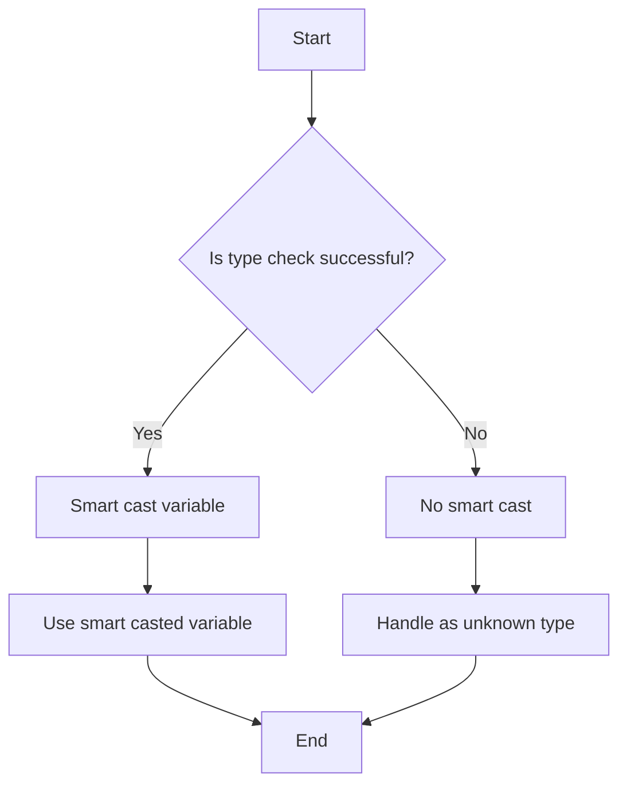

## 2.9 Smart Casts and Type Checking

In Kotlin, smart casts and type checking are powerful features that enhance the language's type safety and expressiveness. These features allow developers to write more concise and safer code by reducing the need for explicit type casting and enabling more intuitive control flow. In this section, we will delve into the concepts of smart casts and type checking, explore their applications, and provide practical examples to illustrate their use.

### Understanding Type Checking in Kotlin

Type checking is a fundamental aspect of programming languages that ensures variables are used in a manner consistent with their declared types. In Kotlin, type checking is performed at compile time, which helps catch errors early in the development process. Kotlin's type system is designed to be both expressive and safe, allowing developers to leverage its features to write robust code.

#### Type Checking in Control Flow

Kotlin's type checking capabilities are particularly useful in control flow constructs such as `if`, `when`, and loops. By using type checking in these constructs, you can ensure that the code behaves as expected based on the types of the variables involved.

Consider the following example:

```kotlin
fun describe(obj: Any): String {
    return when (obj) {
        is Int -> "Integer: $obj"
        is String -> "String of length ${obj.length}"
        is Boolean -> "Boolean: $obj"
        else -> "Unknown type"
    }
}
```

In this example, the `when` expression checks the type of the `obj` parameter and executes different code blocks based on the type. This is achieved using the `is` operator, which performs a type check and allows for smart casting within the corresponding block.

### Smart Casts: Simplifying Type Casting

Smart casts are a feature in Kotlin that automatically cast a variable to a specific type after a successful type check. This eliminates the need for explicit casting and reduces the risk of runtime errors. Smart casts are particularly useful in scenarios where the type of a variable is not known at compile time but can be determined through runtime checks.

#### How Smart Casts Work

Smart casts work by leveraging the results of type checks performed using the `is` operator. When the compiler can guarantee that a variable is of a specific type, it automatically casts the variable to that type within the scope of the check.

Let's look at an example:

```kotlin
fun printLength(obj: Any) {
    if (obj is String) {
        // Smart cast to String
        println("The length of the string is ${obj.length}")
    } else {
        println("Not a string")
    }
}
```

In this example, the `if` statement checks if `obj` is of type `String`. If the check is successful, the compiler smart casts `obj` to `String`, allowing access to the `length` property without explicit casting.

#### Conditions for Smart Casts

Smart casts are only possible under certain conditions. The compiler must be able to guarantee that the variable's type does not change between the type check and its usage. This means that smart casts are not possible if:

- The variable is mutable (`var`) and can be modified between the check and usage.
- The variable is a property with a custom getter.
- The variable is a function parameter.

For example, consider the following code:

```kotlin
fun process(obj: Any) {
    if (obj is String) {
        println(obj.length) // Smart cast to String
    }
    // obj is not smart cast here if it can be changed
}
```

In this case, smart casting is possible because `obj` is a local variable and cannot be modified between the check and usage.

### Advanced Smart Cast Techniques

Kotlin's smart casts can be used in more advanced scenarios to simplify complex type handling logic. Let's explore some techniques for leveraging smart casts effectively.

#### Using Smart Casts in `when` Expressions

The `when` expression is a powerful control flow construct that can be combined with smart casts to handle multiple types in a concise manner. Here's an example:

```kotlin
fun evaluate(obj: Any): String {
    return when (obj) {
        is Int -> "Square: ${obj * obj}"
        is String -> "Reversed: ${obj.reversed()}"
        is List<*> -> "List size: ${obj.size}"
        else -> "Unsupported type"
    }
}
```

In this example, the `when` expression checks the type of `obj` and smart casts it to the appropriate type within each branch. This allows for type-specific operations without explicit casting.

#### Smart Casts with Nullable Types

Kotlin's type system includes nullable types, which can hold either a value or `null`. Smart casts can be used with nullable types to safely access properties and methods.

Consider the following example:

```kotlin
fun printUpperCase(str: String?) {
    if (str != null) {
        // Smart cast to non-nullable String
        println(str.toUpperCase())
    } else {
        println("String is null")
    }
}
```

In this example, the `if` statement checks if `str` is not `null`. If the check is successful, the compiler smart casts `str` to a non-nullable `String`, allowing access to the `toUpperCase` method without a null check.

#### Combining Smart Casts with Safe Calls

Kotlin provides the safe call operator (`?.`) to safely access properties and methods of nullable types. Smart casts can be combined with safe calls to simplify code and reduce the risk of null pointer exceptions.

Here's an example:

```kotlin
fun printFirstCharacter(str: String?) {
    str?.let {
        // Smart cast to non-nullable String within let block
        println("First character: ${it[0]}")
    } ?: println("String is null")
}
```

In this example, the `let` function is used to execute a block of code if `str` is not `null`. Within the `let` block, `str` is smart cast to a non-nullable `String`, allowing access to the first character without a null check.

### Visualizing Smart Casts and Type Checking

To better understand how smart casts and type checking work in Kotlin, let's visualize the process using a flowchart.



**Figure 1: Smart Casts and Type Checking Flowchart**

This flowchart illustrates the decision-making process involved in smart casting and type checking. If a type check is successful, the variable is smart cast to the appropriate type, allowing for type-specific operations. If the type check fails, the variable is handled as an unknown type.

### Practical Applications of Smart Casts and Type Checking

Smart casts and type checking are essential tools for writing safe and efficient Kotlin code. Let's explore some practical applications of these features in real-world scenarios.

#### Handling User Input Safely

When dealing with user input, it's important to validate and process the input safely. Smart casts and type checking can be used to ensure that the input is of the expected type before performing operations.

Consider the following example:

```kotlin
fun processInput(input: Any) {
    when (input) {
        is String -> println("User entered a string: $input")
        is Int -> println("User entered an integer: $input")
        else -> println("Unsupported input type")
    }
}
```

In this example, the `when` expression checks the type of `input` and smart casts it to the appropriate type for processing. This ensures that the input is handled safely and efficiently.

#### Implementing Polymorphic Behavior

Smart casts can be used to implement polymorphic behavior in Kotlin, allowing objects to exhibit different behavior based on their runtime type.

Here's an example:

```kotlin
open class Animal
class Dog : Animal() {
    fun bark() = println("Woof!")
}
class Cat : Animal() {
    fun meow() = println("Meow!")
}

fun interactWithAnimal(animal: Animal) {
    when (animal) {
        is Dog -> animal.bark() // Smart cast to Dog
        is Cat -> animal.meow() // Smart cast to Cat
        else -> println("Unknown animal")
    }
}
```

In this example, the `when` expression checks the runtime type of `animal` and smart casts it to the appropriate subclass. This allows for type-specific behavior without explicit casting.

### Best Practices for Using Smart Casts and Type Checking

To make the most of smart casts and type checking in Kotlin, it's important to follow best practices and guidelines. Here are some tips for using these features effectively:

- **Leverage Type Inference:** Kotlin's type inference capabilities can often determine the type of a variable without explicit type declarations. Use type inference to reduce boilerplate code and improve readability.

- **Use `is` for Type Checks:** The `is` operator is the preferred way to perform type checks in Kotlin. It provides a concise and readable syntax for checking types and enables smart casting.

- **Avoid Unnecessary Type Checks:** Only perform type checks when necessary. Unnecessary type checks can lead to redundant code and reduce performance.

- **Handle Nullable Types Safely:** When working with nullable types, use smart casts and safe calls to access properties and methods safely. This reduces the risk of null pointer exceptions and improves code safety.

- **Combine Smart Casts with Control Flow Constructs:** Use smart casts in combination with control flow constructs such as `if` and `when` to simplify type handling logic and improve code readability.

### Common Pitfalls and How to Avoid Them

While smart casts and type checking are powerful features, there are some common pitfalls to be aware of. Here are some potential issues and how to avoid them:

- **Mutable Variables:** Smart casts are not possible for mutable variables (`var`) that can be modified between the type check and usage. To avoid this issue, use immutable variables (`val`) whenever possible.

- **Custom Getters:** Smart casts are not possible for properties with custom getters. If you need to perform type-specific operations on such properties, consider using local variables or functions.

- **Function Parameters:** Smart casts are not possible for function parameters, as their type cannot be guaranteed to remain constant. Use local variables to store the result of type checks and perform operations on them.

### Conclusion

Smart casts and type checking are essential features of Kotlin that enhance the language's type safety and expressiveness. By leveraging these features, developers can write more concise and safer code, reducing the risk of runtime errors and improving code readability. Whether you're handling user input, implementing polymorphic behavior, or working with nullable types, smart casts and type checking provide powerful tools for managing types in Kotlin.

Remember, this is just the beginning. As you continue to explore Kotlin's features, you'll discover even more ways to leverage smart casts and type checking in your applications. Keep experimenting, stay curious, and enjoy the journey!

## Quiz Time!



### What is a smart cast in Kotlin?

- [x] An automatic cast performed by the compiler after a successful type check.
- [ ] A manual cast performed by the developer using the `as` keyword.
- [ ] A feature that allows casting between unrelated types.
- [ ] A method for converting primitive types to objects.

> **Explanation:** A smart cast is an automatic cast performed by the Kotlin compiler after a successful type check using the `is` operator.

### When can a smart cast be applied in Kotlin?

- [x] When the variable is immutable and its type does not change.
- [ ] When the variable is mutable and can be modified.
- [ ] When the variable is a function parameter.
- [ ] When the variable has a custom getter.

> **Explanation:** Smart casts can be applied when the variable is immutable (`val`) and its type does not change between the type check and usage.

### Which operator is used for type checking in Kotlin?

- [x] `is`
- [ ] `as`
- [ ] `==`
- [ ] `!=`

> **Explanation:** The `is` operator is used for type checking in Kotlin, allowing the compiler to perform smart casts when the check is successful.

### What is the purpose of the `when` expression in Kotlin?

- [x] To perform type checks and execute code based on the type.
- [ ] To declare a new variable.
- [ ] To iterate over a collection.
- [ ] To define a class.

> **Explanation:** The `when` expression in Kotlin is used to perform type checks and execute different code blocks based on the type of a variable.

### How can you safely access properties of a nullable type in Kotlin?

- [x] Using the safe call operator `?.`
- [ ] Using the `!!` operator
- [ ] Using the `as` keyword
- [ ] Using the `is` operator

> **Explanation:** The safe call operator `?.` is used to safely access properties and methods of a nullable type, preventing null pointer exceptions.

### What is a common pitfall when using smart casts?

- [x] Attempting to smart cast a mutable variable.
- [ ] Using the `is` operator for type checks.
- [ ] Using the `when` expression for control flow.
- [ ] Using the safe call operator `?.`

> **Explanation:** A common pitfall when using smart casts is attempting to smart cast a mutable variable (`var`) that can be modified between the type check and usage.

### How can you handle nullable types safely in Kotlin?

- [x] By using smart casts and safe calls.
- [ ] By using the `!!` operator.
- [ ] By using explicit type casting.
- [ ] By using the `as` keyword.

> **Explanation:** Nullable types can be handled safely in Kotlin by using smart casts and safe calls, reducing the risk of null pointer exceptions.

### What is the result of a successful type check using the `is` operator?

- [x] The variable is smart cast to the checked type.
- [ ] The variable is converted to a different type.
- [ ] The variable is assigned a new value.
- [ ] The variable is declared as a new type.

> **Explanation:** A successful type check using the `is` operator results in the variable being smart cast to the checked type, allowing for type-specific operations.

### True or False: Smart casts can be applied to function parameters.

- [ ] True
- [x] False

> **Explanation:** False. Smart casts cannot be applied to function parameters because their type cannot be guaranteed to remain constant between the type check and usage.

### True or False: Smart casts are possible for properties with custom getters.

- [ ] True
- [x] False

> **Explanation:** False. Smart casts are not possible for properties with custom getters, as the compiler cannot guarantee the type remains constant.


