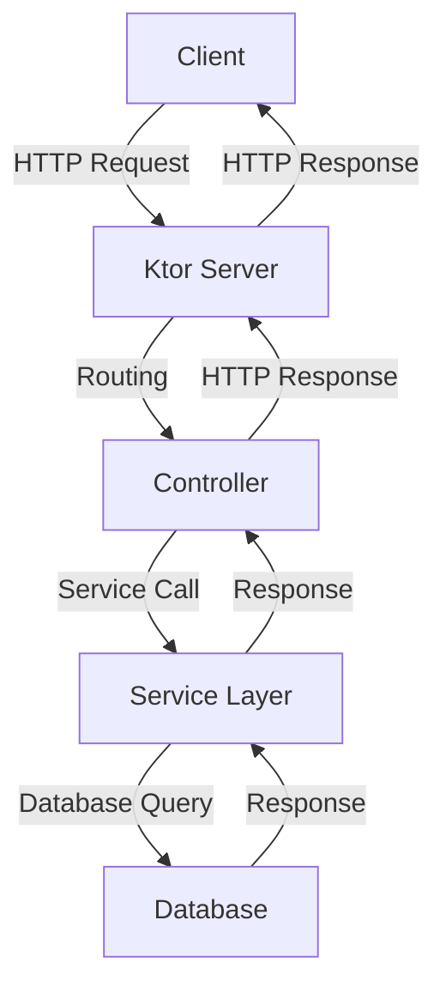

## 20.1 Backend Development with Ktor

Ktor is a powerful and flexible framework for building asynchronous servers and web applications in Kotlin. It is designed to be lightweight and modular, allowing developers to create applications with minimal overhead. In this section, we will delve into the core concepts of Ktor, explore how to build RESTful APIs and WebSockets, and provide practical examples to illustrate its capabilities.

### Introduction to Ktor

Ktor is a Kotlin-based framework that leverages Kotlin's coroutines for asynchronous programming, making it ideal for building high-performance web applications. It is developed by JetBrains, the creators of Kotlin, ensuring seamless integration with Kotlin's language features and ecosystem.

#### Key Features of Ktor

1. **Asynchronous by Design**: Ktor uses Kotlin coroutines to handle asynchronous tasks efficiently, providing non-blocking I/O operations.
2. **Modular Architecture**: Ktor's modularity allows developers to include only the components they need, resulting in lean applications.
3. **Extensibility**: With a rich set of plugins, Ktor can be easily extended to support various functionalities like authentication, sessions, and more.
4. **Kotlin-first Approach**: Ktor is designed with Kotlin in mind, offering a DSL (Domain Specific Language) that makes code expressive and concise.

### Setting Up a Ktor Project

To start building with Ktor, you need to set up a Kotlin project. Let's walk through the process of setting up a basic Ktor project.

#### Step 1: Create a New Project

You can create a new Ktor project using IntelliJ IDEA or through the command line using Gradle.

**Using IntelliJ IDEA:**

1. Open IntelliJ IDEA and select "New Project".
2. Choose "Kotlin" and then "Ktor" from the project templates.
3. Configure the project settings, such as the project name and location.
4. Select the features you want to include, such as "Netty" for the server engine, "Ktor Server Core", and any additional plugins you might need.

**Using Gradle:**

Create a new directory for your project and navigate into it. Then, create a `build.gradle.kts` file with the following content:

```kotlin
plugins {
    kotlin("jvm") version "1.8.0"
    id("io.ktor.plugin") version "2.0.0"
}

repositories {
    mavenCentral()
}

dependencies {
    implementation("io.ktor:ktor-server-core:2.0.0")
    implementation("io.ktor:ktor-server-netty:2.0.0")
    testImplementation("io.ktor:ktor-server-tests:2.0.0")
    testImplementation("org.jetbrains.kotlin:kotlin-test:1.8.0")
}
```

Run `./gradlew build` to download the dependencies and set up the project.

#### Step 2: Configure the Application

Create an `Application.kt` file to define the main entry point of your Ktor application.

```kotlin
import io.ktor.server.engine.*
import io.ktor.server.netty.*
import io.ktor.application.*
import io.ktor.response.*
import io.ktor.request.*
import io.ktor.routing.*

fun main() {
    embeddedServer(Netty, port = 8080) {
        module()
    }.start(wait = true)
}

fun Application.module() {
    routing {
        get("/") {
            call.respondText("Hello, Ktor!")
        }
    }
}
```

This simple application sets up a Ktor server using the Netty engine and responds with "Hello, Ktor!" when accessing the root URL.

### Building RESTful APIs with Ktor

RESTful APIs are a common use case for Ktor, allowing you to build scalable and maintainable web services. Let's explore how to create a RESTful API using Ktor.

#### Defining Routes

Ktor provides a DSL for defining routes, making it easy to map HTTP requests to specific handlers.

```kotlin
fun Application.module() {
    routing {
        route("/api") {
            get("/users") {
                // Handle GET request to retrieve users
                call.respondText("List of users")
            }
            post("/users") {
                // Handle POST request to create a new user
                val user = call.receive<String>()
                call.respondText("User $user created")
            }
        }
    }
}
```

In this example, we define two routes: one for retrieving users and another for creating a new user.

#### Handling Requests and Responses

Ktor provides a flexible way to handle requests and responses. You can access request data using the `call.receive` function and respond using `call.respond`.

```kotlin
post("/users") {
    val user = call.receive<User>() // Deserialize request body to User object
    // Process user data
    call.respond(HttpStatusCode.Created, "User created")
}
```

#### Serialization

To handle JSON data, you can use Ktor's serialization feature. Add the necessary dependencies to your `build.gradle.kts` file:

```kotlin
implementation("io.ktor:ktor-serialization:2.0.0")
```

Then, configure the serialization plugin in your application:

```kotlin
import io.ktor.features.*
import io.ktor.serialization.*

fun Application.module() {
    install(ContentNegotiation) {
        json()
    }
    // Define routes
}
```

Now you can easily serialize and deserialize JSON data in your API.

### WebSockets in Ktor

WebSockets provide a way to establish a persistent connection between the client and server, allowing for real-time communication. Ktor makes it easy to implement WebSockets in your application.

#### Setting Up WebSockets

Add the WebSocket dependency to your `build.gradle.kts` file:

```kotlin
implementation("io.ktor:ktor-websockets:2.0.0")
```

Configure WebSockets in your application:

```kotlin
import io.ktor.websocket.*
import java.time.*

fun Application.module() {
    install(WebSockets) {
        pingPeriod = Duration.ofMinutes(1)
        timeout = Duration.ofSeconds(15)
        maxFrameSize = Long.MAX_VALUE
        masking = false
    }
    routing {
        webSocket("/chat") {
            send("You are connected!")
            for (frame in incoming) {
                frame as? Frame.Text ?: continue
                val receivedText = frame.readText()
                send("You said: $receivedText")
            }
        }
    }
}
```

In this example, we set up a WebSocket endpoint at `/chat` that echoes back any text received from the client.

### Advanced Ktor Features

Ktor offers a range of advanced features that can enhance your backend applications. Let's explore some of these features.

#### Authentication

Ktor supports various authentication mechanisms, including Basic, OAuth, and JWT. Here's an example of setting up Basic authentication:

```kotlin
import io.ktor.auth.*

fun Application.module() {
    install(Authentication) {
        basic("auth-basic") {
            realm = "Ktor Server"
            validate { credentials ->
                if (credentials.name == "user" && credentials.password == "password") {
                    UserIdPrincipal(credentials.name)
                } else {
                    null
                }
            }
        }
    }
    routing {
        authenticate("auth-basic") {
            get("/secure") {
                call.respondText("You are authenticated!")
            }
        }
    }
}
```

#### Sessions

Ktor provides session management to store user data across requests.

```kotlin
import io.ktor.sessions.*

data class MySession(val count: Int = 0)

fun Application.module() {
    install(Sessions) {
        cookie<MySession>("MY_SESSION")
    }
    routing {
        get("/session/increment") {
            val session = call.sessions.get<MySession>() ?: MySession()
            call.sessions.set(session.copy(count = session.count + 1))
            call.respondText("Counter is ${session.count}")
        }
    }
}
```

### Deploying Ktor Applications

Deploying a Ktor application involves packaging it and running it on a server. You can deploy Ktor applications using various methods, such as Docker, cloud services, or traditional server setups.

#### Docker Deployment

Docker provides a convenient way to package and deploy Ktor applications. Create a `Dockerfile` for your application:

```dockerfile
FROM openjdk:11-jre-slim
COPY build/libs/ktor-sample.jar /app/ktor-sample.jar
ENTRYPOINT ["java", "-jar", "/app/ktor-sample.jar"]
```

Build and run the Docker image:

```bash
docker build -t ktor-sample .
docker run -p 8080:8080 ktor-sample
```

#### Cloud Deployment

You can deploy Ktor applications to cloud platforms like AWS, Google Cloud, or Heroku. Each platform provides specific instructions for deploying Java applications, which can be adapted for Ktor.

### Visualizing Ktor Architecture

To better understand how Ktor applications are structured, let's visualize a typical Ktor application architecture using a Mermaid.js diagram.



**Diagram Description**: This diagram illustrates the flow of a request in a Ktor application. The client sends an HTTP request to the Ktor server, which routes the request to the appropriate controller. The controller interacts with the service layer, which performs database queries. The response is then sent back through the layers to the client.

### Best Practices for Ktor Development

1. **Leverage Coroutines**: Utilize Kotlin's coroutines for non-blocking operations to improve performance.
2. **Modularize Your Application**: Break down your application into modules to enhance maintainability and scalability.
3. **Use Dependency Injection**: Consider using Ktor's dependency injection capabilities to manage dependencies effectively.
4. **Implement Security Measures**: Ensure your application is secure by implementing authentication and authorization mechanisms.
5. **Monitor Performance**: Use logging and monitoring tools to track application performance and identify bottlenecks.

### Try It Yourself

Experiment with the provided code examples by modifying routes, adding new endpoints, or implementing additional features like authentication and sessions. This hands-on approach will help solidify your understanding of Ktor and its capabilities.

### References and Further Reading

- [Ktor Documentation](https://ktor.io/docs/)
- [Kotlin Coroutines Guide](https://kotlinlang.org/docs/coroutines-guide.html)
- [JetBrains Ktor GitHub Repository](https://github.com/ktorio/ktor)

## Quiz Time!



### What is Ktor primarily used for?

- [x] Building asynchronous servers and web applications
- [ ] Developing mobile applications
- [ ] Creating desktop applications
- [ ] Designing databases

> **Explanation:** Ktor is a Kotlin framework designed for building asynchronous servers and web applications.

### Which feature of Ktor allows for non-blocking I/O operations?

- [x] Kotlin Coroutines
- [ ] Java Threads
- [ ] Synchronous Functions
- [ ] Blocking I/O

> **Explanation:** Ktor leverages Kotlin's coroutines for non-blocking I/O operations, making it efficient for asynchronous programming.

### How do you define routes in a Ktor application?

- [x] Using a DSL for routing
- [ ] By writing SQL queries
- [ ] Through XML configuration
- [ ] Using JSON files

> **Explanation:** Ktor provides a DSL (Domain Specific Language) for defining routes, making it easy to map HTTP requests to handlers.

### What is the purpose of the `ContentNegotiation` feature in Ktor?

- [x] To handle serialization and deserialization of data
- [ ] To manage user sessions
- [ ] To perform authentication
- [ ] To configure logging

> **Explanation:** The `ContentNegotiation` feature in Ktor is used for handling serialization and deserialization of data, such as JSON.

### What is the main advantage of using WebSockets in Ktor?

- [x] Real-time communication between client and server
- [ ] Storing data in a database
- [ ] Sending emails
- [ ] Performing batch processing

> **Explanation:** WebSockets provide a way to establish a persistent connection for real-time communication between the client and server.

### Which dependency is required for handling JSON data in Ktor?

- [x] `ktor-serialization`
- [ ] `ktor-websockets`
- [ ] `ktor-auth`
- [ ] `ktor-sessions`

> **Explanation:** The `ktor-serialization` dependency is required for handling JSON data in Ktor applications.

### How can you deploy a Ktor application using Docker?

- [x] By creating a Dockerfile and building a Docker image
- [ ] By uploading the JAR file to a web server
- [ ] By using FTP to transfer files
- [ ] By writing a shell script

> **Explanation:** Deploying a Ktor application using Docker involves creating a Dockerfile, building a Docker image, and running the container.

### What is the role of the `routing` block in a Ktor application?

- [x] To define HTTP routes and handlers
- [ ] To configure database connections
- [ ] To manage application settings
- [ ] To perform logging

> **Explanation:** The `routing` block in a Ktor application is used to define HTTP routes and their corresponding handlers.

### Which of the following is a best practice for Ktor development?

- [x] Leveraging coroutines for non-blocking operations
- [ ] Using synchronous functions for all operations
- [ ] Storing passwords in plain text
- [ ] Ignoring security measures

> **Explanation:** Leveraging coroutines for non-blocking operations is a best practice in Ktor development to enhance performance.

### True or False: Ktor is designed to work seamlessly with Kotlin's language features.

- [x] True
- [ ] False

> **Explanation:** True. Ktor is designed with Kotlin in mind, ensuring seamless integration with Kotlin's language features and ecosystem.



Remember, this is just the beginning. As you progress, you'll build more complex and interactive backend applications. Keep experimenting, stay curious, and enjoy the journey!
