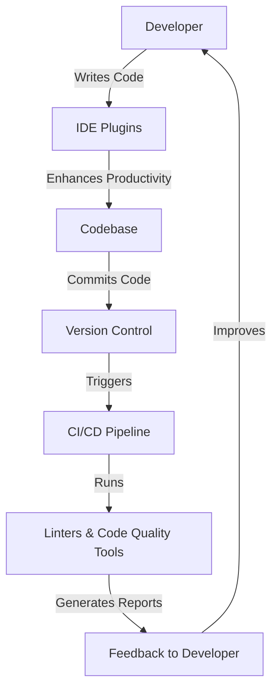

## 20.10 Community Tools and Plugins

The Kotlin ecosystem is vibrant and ever-expanding, thanks to the active contributions from its community. This section delves into the various tools and plugins that have been developed to enhance Kotlin programming, focusing particularly on IDE plugins and linters. These tools not only streamline the development process but also ensure that the code is clean, efficient, and maintainable.

### Introduction to Community Tools and Plugins

Kotlin's rise in popularity is not just due to its language features but also because of the robust ecosystem that supports it. Community tools and plugins play a crucial role in this ecosystem by providing developers with the means to enhance their productivity, enforce coding standards, and integrate seamlessly with other technologies.

#### Why Community Contributions Matter

Community contributions are the backbone of any open-source ecosystem. They bring diverse perspectives, innovative solutions, and a collaborative spirit that drives the language forward. For Kotlin, these contributions have resulted in a plethora of tools that cater to various aspects of development, from code editing to performance monitoring.

### IDE Plugins for Kotlin

Integrated Development Environments (IDEs) are essential for modern software development, providing developers with tools to write, test, and debug code efficiently. Kotlin's community has developed several plugins that enhance the capabilities of popular IDEs like IntelliJ IDEA, Android Studio, and Visual Studio Code.

#### IntelliJ IDEA Plugins

IntelliJ IDEA, developed by JetBrains, is one of the most popular IDEs for Kotlin development. It offers a rich set of features out of the box, but community plugins can further extend its functionality.

- **Kotlin Plugin**: Although bundled with IntelliJ IDEA, the Kotlin plugin is constantly updated by the community to include the latest language features and improvements. It provides syntax highlighting, code completion, and refactoring tools specific to Kotlin.

- **Kotlin Multiplatform Mobile (KMM) Plugin**: This plugin facilitates the development of cross-platform mobile applications using Kotlin. It provides templates and tools to manage shared codebases for Android and iOS.

- **Kotlin DSL Plugin**: For developers using Gradle, the Kotlin DSL plugin offers a more Kotlin-idiomatic way to write build scripts. It enhances code completion and provides better integration with Kotlin codebases.

```kotlin
// Example of a Kotlin DSL build script
plugins {
    kotlin("jvm") version "1.8.0"
}

dependencies {
    implementation(kotlin("stdlib"))
}
```

#### Android Studio Plugins

Android Studio, based on IntelliJ IDEA, is the go-to IDE for Android development. The community has developed several plugins to enhance Kotlin development within Android Studio.

- **Kotlin Android Extensions**: This plugin simplifies the process of binding UI components in Android applications. It reduces boilerplate code by allowing developers to access views directly in Kotlin code.

- **Kotlin Coroutines Debugger**: Debugging asynchronous code can be challenging. This plugin provides tools to visualize and debug coroutines, making it easier to track their execution flow.

```kotlin
// Using Kotlin Android Extensions
import kotlinx.android.synthetic.main.activity_main.*

fun onCreate(savedInstanceState: Bundle?) {
    super.onCreate(savedInstanceState)
    setContentView(R.layout.activity_main)
    myTextView.text = "Hello, Kotlin!"
}
```

#### Visual Studio Code Extensions

Visual Studio Code (VS Code) is a lightweight, versatile code editor that supports Kotlin through various extensions.

- **Kotlin Language Support**: This extension provides basic Kotlin language support, including syntax highlighting and code snippets.

- **Kotlin Test Runner**: For developers who prefer VS Code, this extension allows running and debugging Kotlin tests directly within the editor.

### Linters and Code Quality Tools

Maintaining high code quality is crucial for any software project. Linters and code quality tools help enforce coding standards and identify potential issues in the codebase.

#### Detekt

Detekt is a static code analysis tool specifically designed for Kotlin. It helps identify code smells, style violations, and potential bugs.

- **Configurable Rules**: Detekt comes with a set of predefined rules that can be customized to fit your project's coding standards.

- **Reports and Metrics**: It generates detailed reports that highlight areas of improvement and provides metrics to track code quality over time.

```yaml
detekt {
    config = files("detekt-config.yml")
    reports {
        xml {
            enabled = true
            destination = file("build/reports/detekt.xml")
        }
    }
}
```

#### Ktlint

Ktlint is a straightforward linter for Kotlin that enforces the official Kotlin coding style. It integrates easily with build tools and CI/CD pipelines.

- **Zero Configuration**: Ktlint works out of the box with no configuration needed, making it easy to integrate into existing projects.

- **Auto-formatting**: It can automatically format code to comply with the Kotlin style guide, reducing the manual effort required to maintain code consistency.

```bash
ktlint --format src/**/*.kt
```

### Enhancing Development Workflow

Integrating these tools into your development workflow can significantly enhance productivity and code quality. Here are some best practices for leveraging community tools and plugins:

#### Continuous Integration and Continuous Deployment (CI/CD)

Incorporating linters and code quality tools into your CI/CD pipeline ensures that code quality is consistently maintained across the project lifecycle.

- **Automated Checks**: Set up automated checks to run Detekt and Ktlint on every pull request. This helps catch issues early and enforces coding standards.

- **Feedback Loops**: Provide developers with immediate feedback on code quality, allowing them to address issues before merging changes.

#### Code Reviews

Code reviews are an essential part of the development process. Using tools like Detekt and Ktlint can streamline code reviews by automatically flagging style violations and potential issues.

- **Focus on Logic**: By automating style checks, reviewers can focus on the logic and architecture of the code rather than stylistic concerns.

- **Consistent Standards**: Ensure that all team members adhere to the same coding standards, leading to a more cohesive codebase.

### Visualizing the Ecosystem

To better understand the relationship between these tools and their integration into the development process, consider the following diagram:



**Diagram Description**: This flowchart illustrates the development workflow, highlighting the role of IDE plugins and linters in enhancing productivity and maintaining code quality. The cycle begins with the developer writing code, which is enhanced by IDE plugins. The code is then committed to version control, triggering the CI/CD pipeline that runs linters and code quality tools. Reports generated provide feedback to the developer, closing the loop and fostering continuous improvement.

### Try It Yourself

To truly grasp the power of these tools, try integrating them into a sample Kotlin project. Here's a simple exercise:

1. **Set Up a Kotlin Project**: Create a new Kotlin project using IntelliJ IDEA or Android Studio.

2. **Install Plugins**: Add the Kotlin plugin and any relevant extensions like Kotlin Android Extensions or Kotlin Coroutines Debugger.

3. **Configure Linters**: Set up Detekt and Ktlint in your project. Run them to see how they analyze your code.

4. **Experiment with Code**: Write some Kotlin code and intentionally introduce style violations or potential issues. Observe how the tools flag these problems.

5. **Modify Configurations**: Customize the Detekt rules to fit your coding standards. Re-run the analysis to see the impact of your changes.

### Knowledge Check

Before we conclude, let's reinforce what we've learned with a few questions:

- What are the benefits of using community tools and plugins in Kotlin development?
- How can linters like Detekt and Ktlint improve code quality?
- Why is it important to integrate these tools into your CI/CD pipeline?

### Conclusion

Community tools and plugins are invaluable assets in the Kotlin ecosystem. They not only enhance the development experience but also ensure that codebases remain clean, efficient, and maintainable. By leveraging these tools, developers can focus on writing high-quality code while adhering to best practices and industry standards.

Remember, this is just the beginning. As you progress in your Kotlin journey, continue exploring new tools and plugins that can further enhance your development workflow. Stay curious, keep experimenting, and enjoy the journey!

## Quiz Time!



### What is the primary purpose of community tools and plugins in Kotlin development?

- [x] To enhance productivity and code quality
- [ ] To replace the need for an IDE
- [ ] To make Kotlin compatible with other languages
- [ ] To provide a graphical user interface for Kotlin

> **Explanation:** Community tools and plugins are designed to enhance productivity and code quality by providing additional features and integrations for Kotlin development.

### Which IDE is most commonly associated with Kotlin development?

- [x] IntelliJ IDEA
- [ ] Eclipse
- [ ] NetBeans
- [ ] Visual Studio

> **Explanation:** IntelliJ IDEA, developed by JetBrains, is the most commonly used IDE for Kotlin development due to its rich feature set and native support for Kotlin.

### What is the role of Detekt in Kotlin development?

- [x] It is a static code analysis tool that identifies code smells and style violations.
- [ ] It is a build tool for compiling Kotlin projects.
- [ ] It is a version control system for Kotlin code.
- [ ] It is a testing framework for Kotlin applications.

> **Explanation:** Detekt is a static code analysis tool specifically designed for Kotlin, helping developers identify code smells, style violations, and potential bugs.

### How does Ktlint help maintain code quality?

- [x] By enforcing the official Kotlin coding style and providing auto-formatting.
- [ ] By compiling Kotlin code into Java bytecode.
- [ ] By generating documentation for Kotlin projects.
- [ ] By managing dependencies in Kotlin projects.

> **Explanation:** Ktlint enforces the official Kotlin coding style and can automatically format code to comply with the style guide, ensuring consistent code quality.

### What is a key benefit of integrating linters into a CI/CD pipeline?

- [x] Automated checks ensure consistent code quality across the project lifecycle.
- [ ] Linters can replace the need for manual testing.
- [ ] Linters can deploy applications to production environments.
- [ ] Linters can generate user interfaces for applications.

> **Explanation:** Integrating linters into a CI/CD pipeline allows for automated checks that ensure consistent code quality throughout the development process.

### Which plugin would you use to simplify UI component binding in Android applications?

- [x] Kotlin Android Extensions
- [ ] Kotlin Multiplatform Mobile Plugin
- [ ] Kotlin DSL Plugin
- [ ] Kotlin Test Runner

> **Explanation:** The Kotlin Android Extensions plugin simplifies the process of binding UI components in Android applications, reducing boilerplate code.

### What is the primary function of the Kotlin DSL Plugin?

- [x] To provide a Kotlin-idiomatic way to write Gradle build scripts.
- [ ] To debug Kotlin applications.
- [ ] To manage dependencies in Kotlin projects.
- [ ] To compile Kotlin code into native binaries.

> **Explanation:** The Kotlin DSL Plugin offers a more Kotlin-idiomatic way to write Gradle build scripts, enhancing code completion and integration with Kotlin codebases.

### How does the Kotlin Coroutines Debugger plugin assist developers?

- [x] It provides tools to visualize and debug coroutines, making it easier to track their execution flow.
- [ ] It compiles Kotlin code into Java bytecode.
- [ ] It generates documentation for Kotlin projects.
- [ ] It manages dependencies in Kotlin projects.

> **Explanation:** The Kotlin Coroutines Debugger plugin helps developers visualize and debug coroutines, making it easier to understand their execution flow and identify issues.

### What is the benefit of using Visual Studio Code extensions for Kotlin?

- [x] They provide language support and testing capabilities within a lightweight editor.
- [ ] They replace the need for a version control system.
- [ ] They compile Kotlin code into native binaries.
- [ ] They deploy applications to cloud environments.

> **Explanation:** Visual Studio Code extensions for Kotlin provide language support and testing capabilities, allowing developers to work with Kotlin in a lightweight and versatile editor.

### True or False: Community tools and plugins can replace the need for a dedicated IDE in Kotlin development.

- [ ] True
- [x] False

> **Explanation:** While community tools and plugins enhance the capabilities of IDEs, they do not replace the need for a dedicated IDE, which provides a comprehensive environment for writing, testing, and debugging code.


