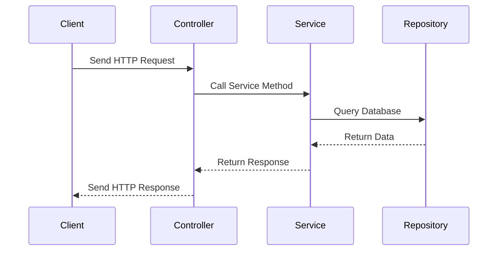

## 20.2 Spring Boot Applications

Spring Boot is a powerful framework designed to simplify the bootstrapping and development of new Spring applications. When combined with Kotlin, it offers a modern, concise, and expressive way to build both reactive and non-reactive applications. In this section, we will delve into the integration of Kotlin with Spring Boot, exploring its benefits, best practices, and design patterns for creating robust applications.

### Introduction to Spring Boot and Kotlin

Spring Boot is an extension of the Spring framework that simplifies the setup and development of Spring applications. It provides a range of features that make it easier to create stand-alone, production-grade Spring-based applications with minimal configuration. Kotlin, on the other hand, is a statically typed programming language that runs on the JVM and is fully interoperable with Java. It offers a more concise syntax, improved type safety, and modern language features that enhance productivity.

#### Why Use Kotlin with Spring Boot?

- **Conciseness**: Kotlin's syntax is more concise than Java, reducing boilerplate code and improving readability.
- **Null Safety**: Kotlin's type system helps eliminate null pointer exceptions, a common issue in Java applications.
- **Coroutines**: Kotlin's coroutines provide a simple way to write asynchronous and non-blocking code, which is particularly useful in reactive applications.
- **Interoperability**: Kotlin is fully interoperable with Java, allowing seamless integration with existing Spring libraries and frameworks.

### Setting Up a Spring Boot Project with Kotlin

To get started with a Spring Boot project using Kotlin, you can use the Spring Initializr, a web-based tool that allows you to generate a Spring Boot project with your desired dependencies and configurations.

#### Step-by-Step Guide

1. **Visit the Spring Initializr**: Go to [start.spring.io](https://start.spring.io/).
2. **Select Project Metadata**: Choose the project type (Maven or Gradle), language (Kotlin), and Spring Boot version.
3. **Configure Project Details**: Enter the group, artifact, and name for your project.
4. **Add Dependencies**: Select the dependencies you need, such as Spring Web, Spring Data JPA, and Spring Reactive Web.
5. **Generate the Project**: Click on "Generate" to download the project as a ZIP file.
6. **Import the Project**: Unzip the file and import the project into your favorite IDE (e.g., IntelliJ IDEA).

#### Example Project Structure

```
my-spring-boot-app/
├── src/
│   ├── main/
│   │   ├── kotlin/
│   │   │   └── com/example/demo/
│   │   │       └── DemoApplication.kt
│   │   ├── resources/
│   │   │   └── application.properties
│   └── test/
│       ├── kotlin/
│       │   └── com/example/demo/
│       │       └── DemoApplicationTests.kt
├── build.gradle.kts
└── settings.gradle.kts
```

### Building Non-Reactive Applications

Non-reactive applications follow the traditional synchronous programming model, where each request is processed in a separate thread. Spring Boot provides excellent support for building non-reactive applications using Kotlin.

#### Creating a Simple REST API

Let's create a simple REST API using Spring Boot and Kotlin. This API will manage a list of books.

##### Define the Book Entity

```kotlin
data class Book(
    val id: Long,
    val title: String,
    val author: String
)
```

##### Create the Book Repository

```kotlin
interface BookRepository {
    fun findAll(): List<Book>
    fun findById(id: Long): Book?
    fun save(book: Book): Book
    fun deleteById(id: Long)
}
```

##### Implement the Book Service

```kotlin
@Service
class BookService(private val bookRepository: BookRepository) {

    fun getAllBooks(): List<Book> = bookRepository.findAll()

    fun getBookById(id: Long): Book? = bookRepository.findById(id)

    fun addBook(book: Book): Book = bookRepository.save(book)

    fun removeBook(id: Long) = bookRepository.deleteById(id)
}
```

##### Develop the Book Controller

```kotlin
@RestController
@RequestMapping("/books")
class BookController(private val bookService: BookService) {

    @GetMapping
    fun getAllBooks(): List<Book> = bookService.getAllBooks()

    @GetMapping("/{id}")
    fun getBookById(@PathVariable id: Long): ResponseEntity<Book> =
        bookService.getBookById(id)?.let { ResponseEntity.ok(it) }
            ?: ResponseEntity.notFound().build()

    @PostMapping
    fun addBook(@RequestBody book: Book): ResponseEntity<Book> =
        ResponseEntity.status(HttpStatus.CREATED).body(bookService.addBook(book))

    @DeleteMapping("/{id}")
    fun removeBook(@PathVariable id: Long): ResponseEntity<Void> {
        bookService.removeBook(id)
        return ResponseEntity.noContent().build()
    }
}
```

#### Running the Application

To run the application, execute the `main` function in `DemoApplication.kt`. Spring Boot will start an embedded server, and you can test the API endpoints using tools like Postman or cURL.

### Building Reactive Applications

Reactive applications are designed to handle a large number of concurrent connections efficiently. They use non-blocking I/O and asynchronous processing to achieve high scalability and responsiveness. Spring Boot, combined with Kotlin's coroutines, provides a powerful platform for building reactive applications.

#### Introduction to Reactive Programming

Reactive programming is a programming paradigm that focuses on asynchronous data streams and the propagation of changes. It is particularly useful for applications that require high concurrency and low latency.

##### Key Concepts

- **Non-blocking I/O**: Operations do not block the executing thread, allowing other tasks to be processed concurrently.
- **Backpressure**: A mechanism to handle the flow of data between producers and consumers, preventing overwhelming the consumer.
- **Event-driven**: Applications respond to events or changes in state, rather than polling for updates.

#### Creating a Reactive REST API

Let's create a reactive version of the book management API using Spring WebFlux and Kotlin coroutines.

##### Update the Book Repository

```kotlin
interface ReactiveBookRepository : ReactiveCrudRepository<Book, Long>
```

##### Implement the Reactive Book Service

```kotlin
@Service
class ReactiveBookService(private val bookRepository: ReactiveBookRepository) {

    fun getAllBooks(): Flux<Book> = bookRepository.findAll()

    fun getBookById(id: Long): Mono<Book> = bookRepository.findById(id)

    fun addBook(book: Book): Mono<Book> = bookRepository.save(book)

    fun removeBook(id: Long): Mono<Void> = bookRepository.deleteById(id)
}
```

##### Develop the Reactive Book Controller

```kotlin
@RestController
@RequestMapping("/books")
class ReactiveBookController(private val bookService: ReactiveBookService) {

    @GetMapping
    fun getAllBooks(): Flux<Book> = bookService.getAllBooks()

    @GetMapping("/{id}")
    fun getBookById(@PathVariable id: Long): Mono<ResponseEntity<Book>> =
        bookService.getBookById(id)
            .map { ResponseEntity.ok(it) }
            .defaultIfEmpty(ResponseEntity.notFound().build())

    @PostMapping
    fun addBook(@RequestBody book: Book): Mono<ResponseEntity<Book>> =
        bookService.addBook(book)
            .map { ResponseEntity.status(HttpStatus.CREATED).body(it) }

    @DeleteMapping("/{id}")
    fun removeBook(@PathVariable id: Long): Mono<ResponseEntity<Void>> =
        bookService.removeBook(id)
            .then(Mono.just(ResponseEntity.noContent().build()))
}
```

#### Running the Reactive Application

Run the application as before. The reactive endpoints can handle a large number of concurrent requests efficiently, making it suitable for high-load scenarios.

### Design Patterns in Spring Boot Applications

Design patterns are essential for creating maintainable and scalable applications. Let's explore some common design patterns used in Spring Boot applications with Kotlin.

#### Singleton Pattern

The Singleton pattern ensures that a class has only one instance and provides a global point of access to it. In Spring Boot, beans are singletons by default, which aligns with this pattern.

##### Example

```kotlin
@Service
class SingletonService {
    // Singleton service logic
}
```

#### Factory Pattern

The Factory pattern provides an interface for creating objects, allowing subclasses to alter the type of objects that will be created.

##### Example

```kotlin
interface BookFactory {
    fun createBook(title: String, author: String): Book
}

class DefaultBookFactory : BookFactory {
    override fun createBook(title: String, author: String): Book = Book(0, title, author)
}
```

#### Observer Pattern

The Observer pattern defines a one-to-many dependency between objects, so that when one object changes state, all its dependents are notified.

##### Example

```kotlin
@Component
class BookEventPublisher(private val applicationEventPublisher: ApplicationEventPublisher) {

    fun publishBookAddedEvent(book: Book) {
        applicationEventPublisher.publishEvent(BookAddedEvent(this, book))
    }
}

data class BookAddedEvent(val source: Any, val book: Book)
```

### Best Practices for Spring Boot Applications with Kotlin

- **Use Kotlin's Null Safety**: Leverage Kotlin's null safety features to avoid null pointer exceptions.
- **Leverage Coroutines**: Use Kotlin coroutines for asynchronous and non-blocking operations.
- **Adopt a Layered Architecture**: Separate concerns into different layers (e.g., controller, service, repository) for better maintainability.
- **Use Dependency Injection**: Rely on Spring's dependency injection to manage bean lifecycles and dependencies.
- **Write Tests**: Ensure your application is well-tested using JUnit and MockK for unit tests.

### Try It Yourself

Experiment with the code examples provided in this section. Try adding new features, such as updating a book's details or searching for books by author. Consider implementing additional design patterns, such as the Decorator or Strategy pattern, to enhance the application's functionality.

### Visualizing Spring Boot with Kotlin

Below is a sequence diagram illustrating the flow of a request in a Spring Boot application using Kotlin.



### References and Further Reading

- [Spring Boot Documentation](https://spring.io/projects/spring-boot)
- [Kotlin Documentation](https://kotlinlang.org/docs/home.html)
- [Reactive Programming with Spring](https://spring.io/reactive)

### Knowledge Check

- What are the benefits of using Kotlin with Spring Boot?
- How do you create a simple REST API using Spring Boot and Kotlin?
- What is reactive programming, and how does it differ from traditional programming models?
- How can you implement the Singleton pattern in a Spring Boot application?
- What are some best practices for building Spring Boot applications with Kotlin?

### Embrace the Journey

Remember, this is just the beginning. As you progress, you'll build more complex and interactive applications. Keep experimenting, stay curious, and enjoy the journey!

## Quiz Time!



### What is a key benefit of using Kotlin with Spring Boot?

- [x] Conciseness and reduced boilerplate code
- [ ] Increased verbosity
- [ ] Lack of interoperability with Java
- [ ] Limited support for coroutines

> **Explanation:** Kotlin's concise syntax reduces boilerplate code, making it a great fit for Spring Boot applications.

### How can you create a simple REST API using Spring Boot and Kotlin?

- [x] By defining entities, repositories, services, and controllers
- [ ] By writing all logic in a single main function
- [ ] By using only Java classes
- [ ] By avoiding the use of annotations

> **Explanation:** A REST API in Spring Boot is typically structured with entities, repositories, services, and controllers.

### What is reactive programming?

- [x] A paradigm focusing on asynchronous data streams and event propagation
- [ ] A synchronous programming model
- [ ] A way to write blocking code
- [ ] A method to increase code verbosity

> **Explanation:** Reactive programming deals with asynchronous data streams and is event-driven.

### How does the Singleton pattern manifest in Spring Boot?

- [x] Beans are singletons by default
- [ ] Each bean is instantiated multiple times
- [ ] Beans cannot be singletons
- [ ] Singleton pattern is not applicable

> **Explanation:** In Spring Boot, beans are singletons by default, aligning with the Singleton pattern.

### What is a best practice for building Spring Boot applications with Kotlin?

- [x] Use Kotlin's null safety features
- [ ] Avoid using coroutines
- [ ] Write all code in a single file
- [ ] Ignore dependency injection

> **Explanation:** Utilizing Kotlin's null safety features helps prevent null pointer exceptions.

### What does the Observer pattern define?

- [x] A one-to-many dependency between objects
- [ ] A one-to-one relationship
- [ ] A many-to-many relationship
- [ ] No dependencies

> **Explanation:** The Observer pattern defines a one-to-many dependency, notifying dependents of state changes.

### How can you implement asynchronous operations in Kotlin?

- [x] Using Kotlin coroutines
- [ ] By blocking threads
- [ ] By avoiding asynchronous code
- [ ] By using only Java threads

> **Explanation:** Kotlin coroutines provide a simple way to implement asynchronous operations.

### What is the purpose of backpressure in reactive programming?

- [x] To manage the flow of data between producers and consumers
- [ ] To increase data flow without control
- [ ] To block data streams
- [ ] To ignore consumer capacity

> **Explanation:** Backpressure helps manage data flow, preventing consumers from being overwhelmed.

### Which tool can you use to generate a Spring Boot project with Kotlin?

- [x] Spring Initializr
- [ ] Maven only
- [ ] Gradle only
- [ ] IntelliJ IDEA without any plugins

> **Explanation:** Spring Initializr is a web-based tool for generating Spring Boot projects with Kotlin.

### True or False: Kotlin is fully interoperable with Java, allowing seamless integration with existing Spring libraries.

- [x] True
- [ ] False

> **Explanation:** Kotlin is designed to be fully interoperable with Java, making it easy to integrate with existing Java libraries and frameworks.


