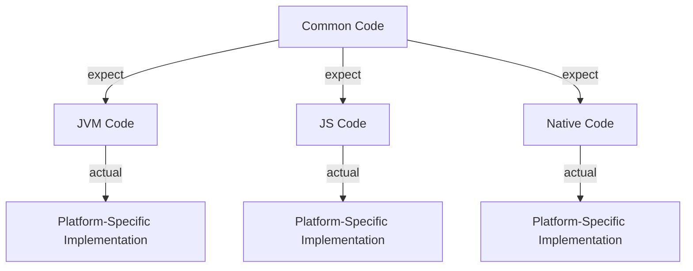

## 20.3 Multiplatform Projects

Kotlin Multiplatform (KMP) is a groundbreaking approach that allows developers to write code that can run on multiple platforms, including JVM, JavaScript, and Native. This capability is particularly beneficial for projects that aim to share business logic across different environments, such as Android, iOS, web, and desktop applications. In this section, we will explore the concepts, architecture, and best practices for developing multiplatform projects using Kotlin.

### Understanding Kotlin Multiplatform

Kotlin Multiplatform is designed to enable code sharing across different platforms while allowing platform-specific code when necessary. It leverages Kotlin's expressive syntax and powerful features to facilitate cross-platform development. The key idea is to write common code once and reuse it across various platforms, reducing duplication and maintenance efforts.

#### Key Concepts

1. **Common Code**: This is the shared code that can be used across all target platforms. It typically includes business logic, data models, and utility functions.

2. **Platform-Specific Code**: This code is written for a specific platform and is used to interact with platform-specific APIs and libraries. It is necessary when the common code needs to perform actions that are unique to a platform.

3. **Expect/Actual Mechanism**: Kotlin Multiplatform uses the `expect` and `actual` keywords to define platform-specific implementations. The `expect` keyword is used in the common code to declare a function or class, and the `actual` keyword is used in platform-specific code to provide the implementation.

4. **Gradle Multiplatform Plugin**: This plugin is essential for setting up and managing multiplatform projects. It allows you to define targets for different platforms and manage dependencies effectively.

### Setting Up a Multiplatform Project

To create a Kotlin Multiplatform project, you need to configure your build system to support multiple targets. Gradle is the recommended build tool for Kotlin projects, and the Kotlin Multiplatform plugin simplifies the setup process.

#### Step-by-Step Guide

1. **Initialize the Project**: Start by creating a new Kotlin project using IntelliJ IDEA or another IDE that supports Kotlin. You can use the Kotlin Multiplatform project template to streamline the setup.

2. **Configure Gradle**: Add the Kotlin Multiplatform plugin to your `build.gradle.kts` file. Define the targets you want to support, such as `jvm`, `js`, and `native`.

   ```kotlin
   plugins {
       kotlin("multiplatform") version "1.8.0"
   }

   kotlin {
       jvm()
       js {
           browser {
               // Configure browser-specific settings
           }
       }
       iosX64() // Add other native targets as needed

       sourceSets {
           val commonMain by getting {
               dependencies {
                   // Add common dependencies here
               }
           }
           val jvmMain by getting
           val jsMain by getting
           val iosMain by getting
       }
   }
   ```

3. **Define Common and Platform-Specific Code**: Organize your code into common and platform-specific source sets. Use the `expect` and `actual` keywords to handle platform-specific implementations.

   ```kotlin
   // Common code
   expect fun getPlatformName(): String

   // JVM-specific implementation
   actual fun getPlatformName(): String = "JVM"

   // JS-specific implementation
   actual fun getPlatformName(): String = "JavaScript"

   // Native-specific implementation
   actual fun getPlatformName(): String = "iOS"
   ```

4. **Manage Dependencies**: Use the `sourceSets` block to define dependencies for each target. This allows you to include libraries that are specific to a platform while sharing common libraries across all targets.

5. **Build and Test**: Use Gradle tasks to build and test your project. The multiplatform plugin provides tasks for each target, allowing you to build and test your code on different platforms.

### Structuring Multiplatform Projects

Proper structuring of a multiplatform project is crucial for maintainability and scalability. Here are some best practices to consider:

#### Organizing Source Sets

- **Common Source Set**: Place all shared code in the `commonMain` source set. This includes business logic, data models, and utility functions that are platform-independent.

- **Platform-Specific Source Sets**: Use platform-specific source sets (e.g., `jvmMain`, `jsMain`, `iosMain`) for code that interacts with platform-specific APIs. This separation ensures that platform-specific code does not leak into the common codebase.

#### Using the Expect/Actual Mechanism

- **Define Expectations in Common Code**: Use the `expect` keyword to declare functions or classes that require platform-specific implementations. This allows you to define a common API that can be implemented differently on each platform.

- **Provide Actual Implementations**: Use the `actual` keyword in platform-specific source sets to provide implementations for the expected declarations. This approach ensures that each platform can leverage its unique capabilities while maintaining a consistent API.

#### Managing Dependencies

- **Common Dependencies**: Add dependencies that are shared across all platforms to the `commonMain` source set. This includes libraries that provide cross-platform functionality, such as serialization or logging.

- **Platform-Specific Dependencies**: Add dependencies that are specific to a platform to the corresponding source set. For example, you might use a different HTTP client library for each platform.

### Code Example: Multiplatform Library

Let's create a simple multiplatform library that provides a greeting message based on the platform.

#### Common Code

```kotlin
// commonMain/src/commonMain/kotlin/Greeting.kt
package com.example.greeting

expect fun getPlatformName(): String

fun createGreeting(): String {
    return "Hello from ${getPlatformName()}"
}
```

#### JVM Implementation

```kotlin
// jvmMain/src/jvmMain/kotlin/GreetingJvm.kt
package com.example.greeting

actual fun getPlatformName(): String = "JVM"
```

#### JavaScript Implementation

```kotlin
// jsMain/src/jsMain/kotlin/GreetingJs.kt
package com.example.greeting

actual fun getPlatformName(): String = "JavaScript"
```

#### Native Implementation

```kotlin
// iosMain/src/iosMain/kotlin/GreetingIos.kt
package com.example.greeting

actual fun getPlatformName(): String = "iOS"
```

### Visualizing Multiplatform Project Structure

Below is a diagram representing the structure of a Kotlin Multiplatform project, illustrating the separation of common and platform-specific code.



### Best Practices for Multiplatform Development

1. **Keep Common Code Truly Common**: Avoid including platform-specific logic in the common codebase. This ensures that the common code remains reusable across all platforms.

2. **Use Interfaces and Abstraction**: Leverage interfaces and abstraction to define common APIs. This approach allows you to provide different implementations for each platform without changing the common code.

3. **Test on All Platforms**: Regularly test your code on all target platforms to ensure compatibility and performance. Use continuous integration (CI) tools to automate testing across different environments.

4. **Leverage Kotlin's Features**: Utilize Kotlin's features, such as extension functions and data classes, to write clean and concise code. These features can help reduce boilerplate and improve code readability.

5. **Stay Updated with Kotlin Releases**: Kotlin Multiplatform is an evolving technology. Stay informed about new releases and updates to take advantage of the latest features and improvements.

### Challenges and Considerations

While Kotlin Multiplatform offers many benefits, there are challenges to consider:

- **Platform-Specific APIs**: Some platform-specific APIs may not be available in the common code. You may need to write wrappers or use the `expect/actual` mechanism to handle these cases.

- **Dependency Management**: Managing dependencies across multiple platforms can be complex. Ensure that you use compatible libraries and versions for each target.

- **Performance**: Performance may vary across platforms. Test and optimize your code to ensure it meets performance requirements on all targets.

### Try It Yourself

Experiment with the provided code examples by modifying the `getPlatformName` function to return different messages for each platform. You can also add new platforms, such as Android or Windows, by configuring additional targets in the Gradle build script.

### Conclusion

Kotlin Multiplatform is a powerful tool for developing cross-platform applications. By sharing code across JVM, JavaScript, and Native platforms, you can reduce duplication, streamline development, and maintain a consistent codebase. With careful planning and adherence to best practices, you can leverage Kotlin Multiplatform to build robust and scalable applications.

## Quiz Time!



### What is the primary purpose of Kotlin Multiplatform?

- [x] To share code across multiple platforms like JVM, JS, and Native.
- [ ] To create platform-specific applications.
- [ ] To replace Java in Android development.
- [ ] To build only web applications.

> **Explanation:** Kotlin Multiplatform is designed to enable code sharing across different platforms, such as JVM, JavaScript, and Native, allowing developers to write common code once and reuse it across various environments.

### Which keyword is used in Kotlin Multiplatform to declare a function that requires platform-specific implementation?

- [x] expect
- [ ] actual
- [ ] override
- [ ] interface

> **Explanation:** The `expect` keyword is used in the common code to declare a function or class that requires platform-specific implementation.

### In a Kotlin Multiplatform project, where should you place platform-independent business logic?

- [x] commonMain source set
- [ ] jvmMain source set
- [ ] jsMain source set
- [ ] iosMain source set

> **Explanation:** Platform-independent business logic should be placed in the `commonMain` source set, which is shared across all platforms.

### What is the role of the `actual` keyword in Kotlin Multiplatform?

- [x] To provide platform-specific implementations for expected declarations.
- [ ] To declare a function that requires platform-specific implementation.
- [ ] To define common code that is shared across platforms.
- [ ] To create a new platform target.

> **Explanation:** The `actual` keyword is used in platform-specific source sets to provide implementations for the expected declarations defined in the common code.

### Which of the following is a best practice for structuring a Kotlin Multiplatform project?

- [x] Keep common code truly common and avoid platform-specific logic in it.
- [ ] Include platform-specific logic in the common codebase.
- [ ] Use only platform-specific source sets for all code.
- [ ] Avoid using interfaces and abstraction.

> **Explanation:** Keeping common code truly common and avoiding platform-specific logic in it is a best practice for structuring a Kotlin Multiplatform project, ensuring reusability across all platforms.

### What is a challenge when using Kotlin Multiplatform?

- [x] Managing dependencies across multiple platforms.
- [ ] Writing platform-specific code.
- [ ] Using Kotlin's syntax.
- [ ] Creating user interfaces.

> **Explanation:** Managing dependencies across multiple platforms can be complex in Kotlin Multiplatform projects, as you need to ensure compatibility and proper versioning for each target.

### How can you test your Kotlin Multiplatform code on all target platforms?

- [x] Use continuous integration (CI) tools to automate testing across different environments.
- [ ] Test only on one platform and assume it works on others.
- [ ] Use manual testing for each platform.
- [ ] Avoid testing altogether.

> **Explanation:** Using continuous integration (CI) tools to automate testing across different environments ensures that your Kotlin Multiplatform code is compatible and performs well on all target platforms.

### What is the `expect/actual` mechanism used for in Kotlin Multiplatform?

- [x] To define and implement platform-specific code.
- [ ] To declare common code that is shared across platforms.
- [ ] To manage dependencies in a multiplatform project.
- [ ] To create user interfaces.

> **Explanation:** The `expect/actual` mechanism is used in Kotlin Multiplatform to define and implement platform-specific code, allowing you to provide different implementations for each platform while maintaining a consistent API.

### Which of the following is a benefit of using Kotlin Multiplatform?

- [x] Reducing code duplication and maintenance efforts.
- [ ] Increasing the complexity of the codebase.
- [ ] Limiting the project to a single platform.
- [ ] Replacing all Java code with Kotlin.

> **Explanation:** Kotlin Multiplatform reduces code duplication and maintenance efforts by allowing developers to write common code once and reuse it across various platforms.

### True or False: Kotlin Multiplatform projects can only target JVM and JavaScript platforms.

- [ ] True
- [x] False

> **Explanation:** False. Kotlin Multiplatform projects can target JVM, JavaScript, and Native platforms, allowing for a wide range of cross-platform development possibilities.


