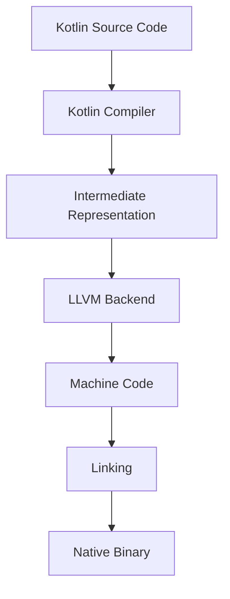

## 20.4 Kotlin/Native

Kotlin/Native is an exciting technology that extends the capabilities of the Kotlin programming language beyond the JVM, enabling developers to compile Kotlin code to native binaries. This allows Kotlin to be used in environments where a virtual machine is not desirable or possible, such as embedded systems, iOS applications, and other platforms where native performance is crucial. In this section, we will explore the core concepts of Kotlin/Native, its compilation process, and its interoperability with C code, providing you with the knowledge to leverage Kotlin for native development.

### Introduction to Kotlin/Native

Kotlin/Native is part of JetBrains' Kotlin Multiplatform project, which aims to provide a seamless experience for sharing code across different platforms. By compiling Kotlin code to native binaries, Kotlin/Native enables developers to write high-performance applications that can run directly on the hardware without the need for a virtual machine. This is particularly beneficial for platforms like iOS, where JVM-based languages cannot be used natively.

#### Key Features of Kotlin/Native

- **Native Performance**: Kotlin/Native compiles to machine code, allowing applications to run with the performance characteristics of native applications.
- **Cross-Platform**: Share code between platforms, such as iOS, Android, macOS, Linux, Windows, and more.
- **Interoperability**: Seamlessly interact with C libraries and system APIs, making it easy to integrate with existing native codebases.
- **Memory Management**: Kotlin/Native uses automatic memory management, providing a balance between performance and ease of use.

### Compiling to Native Binaries

The process of compiling Kotlin code to native binaries involves several steps, transforming high-level Kotlin code into machine code that can be executed directly by the operating system. Let's delve into the compilation process and explore how Kotlin/Native achieves this.

#### The Compilation Process

1. **Kotlin Source Code**: The journey begins with writing Kotlin code, which is similar to writing Kotlin for the JVM or Android.
2. **Kotlin Compiler**: The Kotlin/Native compiler (`kotlinc-native`) takes the source code and translates it into an intermediate representation.
3. **LLVM Backend**: The intermediate representation is then fed into the LLVM backend, which optimizes and generates the final machine code.
4. **Linking**: The generated machine code is linked with necessary libraries and system APIs to produce the final native binary.

```kotlin
// Sample Kotlin/Native code
fun main() {
    println("Hello, Kotlin/Native!")
}
```

#### Target Platforms

Kotlin/Native supports a wide range of target platforms, including:

- **iOS**: Develop native iOS applications using Kotlin.
- **macOS**: Create applications for macOS with native performance.
- **Linux**: Build server-side applications or command-line tools for Linux.
- **Windows**: Compile native applications for Windows environments.
- **Embedded Systems**: Target microcontrollers and other embedded devices.

### Interoperability with C Code

One of the standout features of Kotlin/Native is its ability to interoperate with C code. This is crucial for integrating with existing native libraries and system APIs, allowing developers to leverage the vast ecosystem of C libraries available.

#### C Interoperability Basics

Kotlin/Native provides a seamless way to call C functions and use C libraries within Kotlin code. This is achieved through the use of the `cinterop` tool, which generates Kotlin bindings for C headers.

##### Example: Calling a C Function

Let's consider a simple example where we call a C function from Kotlin/Native.

```c
// C code (example.c)
#include <stdio.h>

void greet(const char* name) {
    printf("Hello, %s!\n", name);
}
```

To call this function from Kotlin/Native, we first need to create a Kotlin binding using `cinterop`.

```kotlin
// Kotlin/Native code
import kotlinx.cinterop.*
import example.*

fun main() {
    val name = "Kotlin/Native"
    greet(name.cstr.ptr)
}
```

In this example, we use the `cinterop` tool to generate bindings for `example.c`, allowing us to call the `greet` function from Kotlin.

#### Memory Management and Interoperability

Kotlin/Native handles memory management automatically, but when interfacing with C code, developers need to be mindful of memory allocation and deallocation. Kotlin/Native provides utilities for managing memory when interacting with C, such as `memScoped` and `alloc`.

```kotlin
// Memory management example
import kotlinx.cinterop.*

fun allocateMemory() {
    memScoped {
        val buffer = allocArray<ByteVar>(1024)
        // Use the buffer
    } // Memory is automatically freed here
}
```

### Advanced Interoperability Techniques

Kotlin/Native's interoperability with C is not limited to simple function calls. It supports more advanced features, such as working with C structs, pointers, and callbacks.

#### Working with C Structs

Kotlin/Native allows you to define and manipulate C structs directly in Kotlin code.

```c
// C struct definition
typedef struct {
    int x;
    int y;
} Point;
```

```kotlin
// Kotlin/Native code
import kotlinx.cinterop.*

fun manipulateStruct() {
    memScoped {
        val point = alloc<Point>()
        point.x = 10
        point.y = 20
        println("Point: (${point.x}, ${point.y})")
    }
}
```

#### Using Callbacks

Kotlin/Native supports the use of C function pointers, enabling you to pass Kotlin functions as callbacks to C code.

```c
// C callback function
typedef void (*Callback)(int);

void executeCallback(Callback callback) {
    callback(42);
}
```

```kotlin
// Kotlin/Native code
import kotlinx.cinterop.*

fun main() {
    val callback: (Int) -> Unit = { value -> println("Callback received: $value") }
    executeCallback(staticCFunction(callback))
}
```

### Building and Running Kotlin/Native Applications

To build and run Kotlin/Native applications, you need to set up your development environment and use the appropriate tools provided by Kotlin/Native.

#### Setting Up the Environment

1. **Install Kotlin/Native**: Download and install the Kotlin/Native compiler from the official [Kotlin website](https://kotlinlang.org/docs/native-overview.html).
2. **Configure Your IDE**: Use IntelliJ IDEA or another supported IDE to set up your Kotlin/Native project.

#### Building a Kotlin/Native Application

To build a Kotlin/Native application, you can use the `kotlinc-native` command-line tool or configure a Gradle build script.

```bash
kotlinc-native hello.kt -o hello
```

```kotlin
// Gradle build script (build.gradle.kts)
plugins {
    kotlin("multiplatform") version "1.9.0"
}

kotlin {
    linuxX64("native") {
        binaries {
            executable {
                entryPoint = "main"
            }
        }
    }
}
```

#### Running the Application

Once built, you can run the native binary directly from the command line.

```bash
./hello
```

### Try It Yourself

Experiment with Kotlin/Native by modifying the provided examples. Try adding new C functions, manipulating structs, or using different target platforms. This hands-on approach will deepen your understanding of Kotlin/Native and its capabilities.

### Visualizing Kotlin/Native Compilation Process

To better understand the Kotlin/Native compilation process, let's visualize it using a flowchart.



**Figure 1: Kotlin/Native Compilation Process**

### Design Considerations and Best Practices

When working with Kotlin/Native, there are several design considerations and best practices to keep in mind:

- **Performance Optimization**: Since Kotlin/Native compiles to machine code, performance optimization techniques such as profiling and efficient memory management are crucial.
- **Platform-Specific Code**: Use expect/actual declarations to handle platform-specific code, ensuring your application remains portable.
- **Error Handling**: Implement robust error handling, especially when interfacing with C code, to prevent crashes and undefined behavior.
- **Testing**: Thoroughly test your Kotlin/Native applications across all target platforms to ensure consistent behavior.

### Differences and Similarities with Other Kotlin Platforms

Kotlin/Native shares many similarities with other Kotlin platforms, such as Kotlin/JVM and Kotlin/JS, but also has distinct differences:

- **Memory Management**: Unlike Kotlin/JVM, which relies on the JVM's garbage collector, Kotlin/Native uses automatic reference counting (ARC) for memory management.
- **Interoperability**: While Kotlin/JVM focuses on Java interoperability, Kotlin/Native emphasizes C interoperability.
- **Compilation Target**: Kotlin/Native compiles to machine code, whereas Kotlin/JVM compiles to bytecode and Kotlin/JS compiles to JavaScript.

### Conclusion

Kotlin/Native is a powerful tool for developers looking to leverage Kotlin's expressive syntax and safety features in native environments. By compiling to native binaries and providing seamless interoperability with C code, Kotlin/Native opens up new possibilities for cross-platform development and high-performance applications. As you continue your journey with Kotlin/Native, remember to experiment, optimize, and explore the vast ecosystem of libraries and tools available to enhance your development experience.

## Quiz Time!



### What is Kotlin/Native primarily used for?

- [x] Compiling Kotlin code to native binaries.
- [ ] Running Kotlin code on the JVM.
- [ ] Compiling Kotlin code to JavaScript.
- [ ] Interpreting Kotlin code at runtime.

> **Explanation:** Kotlin/Native is designed to compile Kotlin code to native binaries, allowing it to run on platforms without a virtual machine.

### Which tool is used to generate Kotlin bindings for C headers in Kotlin/Native?

- [x] cinterop
- [ ] kotlinc
- [ ] gradle
- [ ] cmake

> **Explanation:** The `cinterop` tool is used to generate Kotlin bindings for C headers, enabling interoperability with C code.

### What memory management technique does Kotlin/Native use?

- [x] Automatic Reference Counting (ARC)
- [ ] Garbage Collection (GC)
- [ ] Manual Memory Management
- [ ] Reference Counting with Garbage Collection

> **Explanation:** Kotlin/Native uses Automatic Reference Counting (ARC) for memory management, different from the garbage collection used in Kotlin/JVM.

### Which platforms can Kotlin/Native target?

- [x] iOS, macOS, Linux, Windows, Embedded Systems
- [ ] Only JVM-based platforms
- [ ] Only web browsers
- [ ] Only Android devices

> **Explanation:** Kotlin/Native can target a wide range of platforms, including iOS, macOS, Linux, Windows, and embedded systems.

### How does Kotlin/Native handle C function pointers for callbacks?

- [x] Using `staticCFunction`
- [ ] Using `dynamicCFunction`
- [ ] Using `cFunctionPointer`
- [ ] Using `callbackFunction`

> **Explanation:** Kotlin/Native uses `staticCFunction` to handle C function pointers, allowing Kotlin functions to be used as callbacks in C code.

### What is the role of the LLVM backend in Kotlin/Native?

- [x] Optimizing and generating machine code
- [ ] Compiling Kotlin source code to bytecode
- [ ] Linking Kotlin code with Java libraries
- [ ] Interpreting Kotlin code at runtime

> **Explanation:** The LLVM backend in Kotlin/Native is responsible for optimizing and generating the final machine code from the intermediate representation.

### Which of the following is a best practice when working with Kotlin/Native?

- [x] Implement robust error handling
- [ ] Avoid testing across platforms
- [ ] Rely solely on JVM-based libraries
- [ ] Use only manual memory management

> **Explanation:** Implementing robust error handling is crucial in Kotlin/Native, especially when interfacing with C code, to prevent crashes and undefined behavior.

### What is the main advantage of using Kotlin/Native for iOS development?

- [x] Ability to write native iOS applications using Kotlin
- [ ] Running Kotlin code on the JVM
- [ ] Compiling Kotlin code to JavaScript
- [ ] Interpreting Kotlin code at runtime

> **Explanation:** Kotlin/Native allows developers to write native iOS applications using Kotlin, providing an alternative to Swift and Objective-C.

### Which of the following is NOT a feature of Kotlin/Native?

- [ ] Native Performance
- [ ] Cross-Platform Code Sharing
- [x] Java Interoperability
- [ ] C Interoperability

> **Explanation:** Kotlin/Native does not focus on Java interoperability; instead, it emphasizes C interoperability and native performance.

### True or False: Kotlin/Native uses garbage collection for memory management.

- [ ] True
- [x] False

> **Explanation:** False. Kotlin/Native uses Automatic Reference Counting (ARC) for memory management, not garbage collection.


