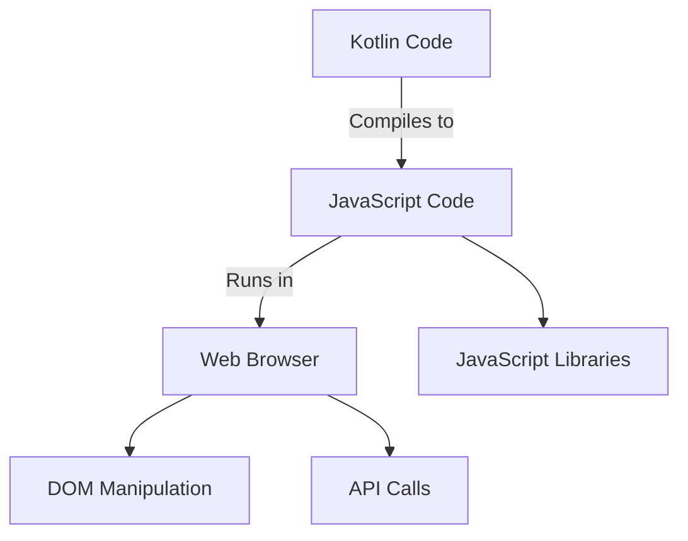

## 20.5 Kotlin/JS

Kotlin/JS is a powerful tool that allows developers to leverage the expressive and concise syntax of Kotlin while targeting JavaScript platforms. This section delves into the intricacies of Kotlin/JS, exploring its integration with JavaScript ecosystems, particularly focusing on frontend development with React wrappers. Let's embark on this journey to understand how Kotlin/JS can transform your web development experience.

### Introduction to Kotlin/JS

Kotlin/JS is a part of Kotlin's multiplatform capabilities, allowing you to compile Kotlin code to JavaScript. This enables developers to use Kotlin for both server-side and client-side development, creating a seamless development experience across platforms.

#### Key Features of Kotlin/JS

- **Type Safety**: Kotlin provides a robust type system that helps catch errors at compile time, reducing runtime issues.
- **Interoperability**: Kotlin/JS can seamlessly interoperate with existing JavaScript code and libraries.
- **Tooling Support**: Kotlin/JS is supported by modern development tools, including IntelliJ IDEA, which provides excellent code completion, refactoring, and debugging capabilities.
- **Coroutines**: Kotlin's coroutines are available in Kotlin/JS, enabling asynchronous programming with ease.

### Setting Up a Kotlin/JS Project

To get started with Kotlin/JS, you need to set up a project. Let's walk through the process of creating a basic Kotlin/JS project using Gradle.

#### Step-by-Step Project Setup

1. **Install Kotlin and Gradle**: Ensure you have Kotlin and Gradle installed on your machine. You can download them from their respective official websites.

2. **Create a New Project**: Use the following command to create a new Kotlin/JS project:

   ```bash
   gradle init --type kotlin-js
   ```

3. **Configure the `build.gradle.kts` File**: Open the `build.gradle.kts` file and configure it for Kotlin/JS:

   ```kotlin
   plugins {
       kotlin("js") version "1.8.0"
   }

   repositories {
       mavenCentral()
   }

   kotlin {
       js {
           browser {
               binaries.executable()
           }
       }
   }
   ```

4. **Add Dependencies**: Add any necessary dependencies to your project. For example, to use React, you can add:

   ```kotlin
   dependencies {
       implementation("org.jetbrains.kotlin-wrappers:kotlin-react:17.0.2-pre.148-kotlin-1.8.0")
       implementation("org.jetbrains.kotlin-wrappers:kotlin-react-dom:17.0.2-pre.148-kotlin-1.8.0")
   }
   ```

5. **Run the Project**: Use the following command to build and run your Kotlin/JS project:

   ```bash
   gradle browserDevelopmentRun
   ```

### Interoperability with JavaScript

Kotlin/JS offers seamless interoperability with JavaScript, allowing you to call JavaScript functions and use JavaScript libraries in your Kotlin code.

#### Calling JavaScript from Kotlin

To call a JavaScript function from Kotlin, you can use the `@JsName` annotation. Here's an example:

```kotlin
@JsName("alert")
external fun showAlert(message: String)

fun main() {
    showAlert("Hello from Kotlin/JS!")
}
```

#### Using JavaScript Libraries

You can use existing JavaScript libraries in your Kotlin/JS project by adding them as dependencies. For instance, to use Lodash, you can add:

```kotlin
dependencies {
    implementation(npm("lodash", "4.17.21"))
}
```

### Frontend Development with Kotlin/JS

Kotlin/JS is particularly powerful for frontend development, allowing you to build rich web applications with frameworks like React.

#### Using React with Kotlin/JS

Kotlin/JS provides wrappers for React, enabling you to build React components using Kotlin. This allows you to take advantage of Kotlin's type safety and concise syntax while working with React.

##### Creating a Simple React Component

Let's create a simple React component using Kotlin/JS:

```kotlin
import react.*
import react.dom.*

external interface AppProps : RProps {
    var name: String
}

val App = functionalComponent<AppProps> { props ->
    h1 {
        +"Hello, ${props.name}!"
    }
}

fun main() {
    render(document.getElementById("root")) {
        child(App) {
            attrs.name = "Kotlin/JS"
        }
    }
}
```

In this example, we define a functional component `App` that takes a `name` prop and renders a greeting message. We then render this component to the DOM.

#### State Management in Kotlin/JS

State management is a crucial aspect of frontend development. Kotlin/JS supports React's state management capabilities, allowing you to manage component state effectively.

##### Using Hooks for State Management

Kotlin/JS supports React hooks, enabling you to manage state in functional components. Here's an example using the `useState` hook:

```kotlin
import react.*
import react.dom.*

val Counter = functionalComponent<RProps> {
    val (count, setCount) = useState(0)

    div {
        h1 {
            +"Count: $count"
        }
        button {
            +"Increment"
            attrs.onClickFunction = {
                setCount(count + 1)
            }
        }
    }
}

fun main() {
    render(document.getElementById("root")) {
        child(Counter)
    }
}
```

In this example, we create a `Counter` component that uses the `useState` hook to manage the count state. Clicking the button increments the count.

### Advanced Concepts in Kotlin/JS

Kotlin/JS offers advanced features that allow you to build complex and efficient web applications.

#### Coroutines in Kotlin/JS

Kotlin's coroutines are available in Kotlin/JS, enabling you to perform asynchronous operations efficiently.

##### Using Coroutines for Asynchronous Operations

Here's an example of using coroutines in Kotlin/JS to fetch data from an API:

```kotlin
import kotlinx.coroutines.*
import kotlinx.browser.window

fun main() {
    GlobalScope.launch {
        val response = window.fetch("https://api.example.com/data").await()
        val data = response.json().await()
        console.log(data)
    }
}
```

In this example, we use the `fetch` API to retrieve data asynchronously and log it to the console.

#### Building a Full-Stack Application with Kotlin/JS

Kotlin/JS can be used to build full-stack applications by sharing code between the frontend and backend.

##### Sharing Code Between Frontend and Backend

You can share common code between the frontend and backend by using Kotlin's multiplatform capabilities. This allows you to define shared data models and business logic in a common module.

```kotlin
// commonMain module
data class User(val id: Int, val name: String)

// frontendMain module
fun displayUser(user: User) {
    console.log("User: ${user.name}")
}

// backendMain module
fun getUserById(id: Int): User {
    // Retrieve user from database
}
```

In this example, we define a `User` data class in the common module and use it in both the frontend and backend modules.

### Visualizing Kotlin/JS Architecture

To better understand the architecture of a Kotlin/JS application, let's visualize the interaction between Kotlin, JavaScript, and the web browser.



**Diagram Description**: This diagram illustrates the flow of a Kotlin/JS application. Kotlin code is compiled to JavaScript, which runs in the web browser. The JavaScript code interacts with the DOM for UI updates and makes API calls for data retrieval. It can also utilize existing JavaScript libraries.

### Best Practices for Kotlin/JS Development

To make the most of Kotlin/JS, consider the following best practices:

- **Leverage Type Safety**: Use Kotlin's type system to catch errors early and ensure code reliability.
- **Optimize Performance**: Minimize the use of heavy libraries and optimize your code for performance.
- **Utilize Coroutines**: Use coroutines for asynchronous operations to improve responsiveness.
- **Integrate with JavaScript Ecosystem**: Seamlessly integrate with existing JavaScript libraries and tools.
- **Write Idiomatic Kotlin**: Follow Kotlin's idioms and conventions to write clean and maintainable code.

### Challenges and Considerations

While Kotlin/JS offers numerous advantages, there are some challenges to consider:

- **Debugging**: Debugging Kotlin/JS code can be challenging due to the compilation to JavaScript. Use source maps to aid debugging.
- **Library Support**: Not all JavaScript libraries have Kotlin wrappers, which may require writing custom wrappers.
- **Performance Overhead**: The additional layer of Kotlin to JavaScript compilation may introduce performance overhead.

### Future of Kotlin/JS

Kotlin/JS is continuously evolving, with improvements in performance, tooling, and library support. The Kotlin community is actively working on enhancing Kotlin/JS to make it a robust choice for web development.

### Conclusion

Kotlin/JS is a powerful tool for targeting JavaScript platforms, offering the benefits of Kotlin's expressive syntax and type safety. By integrating with JavaScript ecosystems and leveraging Kotlin's features, you can build efficient and maintainable web applications. Remember, this is just the beginning. As you progress, you'll build more complex and interactive web pages. Keep experimenting, stay curious, and enjoy the journey!

## Quiz Time!



### What is Kotlin/JS primarily used for?

- [x] Targeting JavaScript platforms
- [ ] Developing Android applications
- [ ] Building native iOS applications
- [ ] Creating desktop applications

> **Explanation:** Kotlin/JS is used to compile Kotlin code to JavaScript, allowing developers to target JavaScript platforms.

### Which of the following is a key feature of Kotlin/JS?

- [x] Type Safety
- [ ] Native Compilation
- [ ] Direct Database Access
- [ ] Built-in Machine Learning Libraries

> **Explanation:** Kotlin/JS provides type safety, which helps catch errors at compile time, reducing runtime issues.

### How can you call a JavaScript function from Kotlin/JS?

- [x] Using the `@JsName` annotation
- [ ] Using the `@JavaScript` annotation
- [ ] Using the `@Interop` annotation
- [ ] Using the `@JsCall` annotation

> **Explanation:** The `@JsName` annotation is used to call JavaScript functions from Kotlin/JS.

### What is the purpose of the `useState` hook in Kotlin/JS React components?

- [x] To manage component state
- [ ] To define component styles
- [ ] To handle component lifecycle events
- [ ] To render components to the DOM

> **Explanation:** The `useState` hook is used to manage state in functional React components.

### Which of the following is a challenge when working with Kotlin/JS?

- [x] Debugging
- [ ] Lack of type safety
- [ ] Inability to use JavaScript libraries
- [ ] Poor tooling support

> **Explanation:** Debugging can be challenging in Kotlin/JS due to the compilation to JavaScript.

### What is the role of coroutines in Kotlin/JS?

- [x] To perform asynchronous operations
- [ ] To manage component styles
- [ ] To define component lifecycle events
- [ ] To render components to the DOM

> **Explanation:** Coroutines in Kotlin/JS are used to perform asynchronous operations efficiently.

### How can you optimize performance in a Kotlin/JS application?

- [x] Minimize the use of heavy libraries
- [ ] Use only JavaScript for logic
- [ ] Avoid using coroutines
- [ ] Compile directly to native code

> **Explanation:** Minimizing the use of heavy libraries helps optimize performance in Kotlin/JS applications.

### What is a benefit of using Kotlin/JS for frontend development?

- [x] Type safety and concise syntax
- [ ] Direct access to native device features
- [ ] Built-in support for SQL databases
- [ ] Automatic UI generation

> **Explanation:** Kotlin/JS provides type safety and a concise syntax, which are beneficial for frontend development.

### Which diagram best represents the interaction of Kotlin/JS with the web browser?

- [x] Kotlin Code -> JavaScript Code -> Web Browser -> DOM Manipulation
- [ ] JavaScript Code -> Kotlin Code -> Web Browser -> API Calls
- [ ] Web Browser -> JavaScript Code -> Kotlin Code -> DOM Manipulation
- [ ] Kotlin Code -> Web Browser -> JavaScript Code -> API Calls

> **Explanation:** The correct flow is Kotlin Code -> JavaScript Code -> Web Browser -> DOM Manipulation.

### True or False: Kotlin/JS can be used to build full-stack applications by sharing code between frontend and backend.

- [x] True
- [ ] False

> **Explanation:** Kotlin/JS can be used to build full-stack applications by sharing common code between frontend and backend modules.


