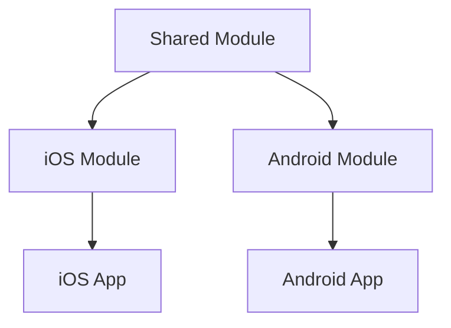
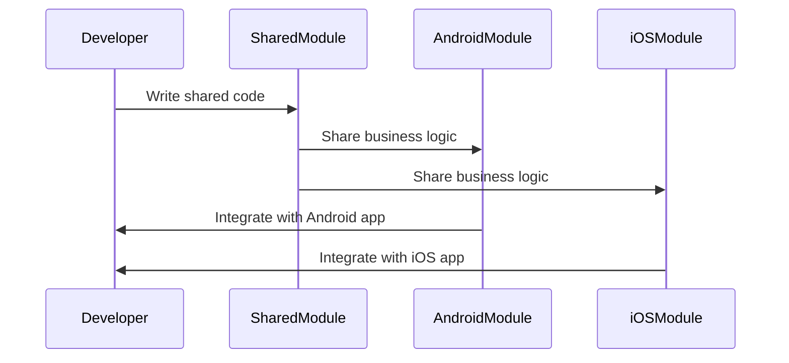

## 20.6 Kotlin Multiplatform Mobile (KMM)

Kotlin Multiplatform Mobile (KMM) is a powerful technology that allows developers to write shared code for both iOS and Android, streamlining the development process and reducing duplication. In this section, we will delve into the intricacies of KMM, exploring its architecture, benefits, and practical implementation. We will also provide code examples, diagrams, and exercises to help you master this innovative approach to mobile development.

### Introduction to Kotlin Multiplatform Mobile

Kotlin Multiplatform Mobile is part of JetBrains' Kotlin Multiplatform project, designed to enable code sharing across different platforms. KMM specifically targets mobile development, allowing developers to write common code for iOS and Android applications. This approach not only reduces the time and effort required to develop mobile apps but also ensures consistency across platforms.

#### Key Concepts

- **Shared Code**: Write business logic once and use it on both iOS and Android.
- **Platform-Specific Code**: Implement platform-specific features using Kotlin's expect/actual mechanism.
- **Interoperability**: Seamlessly integrate with existing iOS and Android codebases.

### Architecture of KMM

KMM projects are structured to separate shared and platform-specific code. The typical architecture includes:

- **Shared Module**: Contains the common code, including business logic, data models, and utilities.
- **iOS and Android Modules**: Contain platform-specific code, including UI components and platform-specific APIs.

#### Diagram: KMM Architecture



**Description**: This diagram illustrates the separation of shared and platform-specific modules in a KMM project. The shared module is used by both the iOS and Android modules, which then integrate with their respective apps.

### Setting Up a KMM Project

To get started with KMM, you need to set up your development environment. Follow these steps:

1. **Install IntelliJ IDEA or Android Studio**: Ensure you have the latest version with Kotlin Multiplatform support.
2. **Create a New Project**: Use the KMM project template to create a new project.
3. **Configure Gradle**: Set up your `build.gradle.kts` files to include the necessary dependencies for KMM.

#### Sample `build.gradle.kts` Configuration

```kotlin
plugins {
    kotlin("multiplatform")
    id("com.android.application")
}

kotlin {
    android()
    iosX64()
    iosArm64()

    sourceSets {
        val commonMain by getting {
            dependencies {
                implementation("org.jetbrains.kotlinx:kotlinx-coroutines-core:1.5.2")
            }
        }
        val androidMain by getting
        val iosMain by getting
    }
}

android {
    compileSdkVersion(30)
    defaultConfig {
        applicationId = "com.example.kmmapp"
        minSdkVersion(21)
        targetSdkVersion(30)
    }
}
```

**Explanation**: This configuration sets up a KMM project with shared, Android, and iOS source sets. It includes dependencies for Kotlin coroutines, which are commonly used in KMM projects.

### Writing Shared Business Logic

The core advantage of KMM is the ability to write shared business logic. This includes data processing, network requests, and other non-UI code.

#### Example: Shared Business Logic

```kotlin
// Shared code in the commonMain source set
class Greeting {
    fun greet(): String {
        return "Hello, Kotlin Multiplatform!"
    }
}
```

**Explanation**: This simple example demonstrates a shared class that can be used on both iOS and Android to provide a greeting message.

### Platform-Specific Code

While KMM allows for shared code, some features require platform-specific implementations. This is where Kotlin's `expect` and `actual` keywords come into play.

#### Example: Platform-Specific Code

```kotlin
// Shared code
expect fun platformName(): String

// Android-specific implementation
actual fun platformName(): String {
    return "Android"
}

// iOS-specific implementation
actual fun platformName(): String {
    return "iOS"
}
```

**Explanation**: The `expect` keyword is used in the shared code to declare a function that will have platform-specific implementations. The `actual` keyword is used in the platform-specific code to provide these implementations.

### Integrating with iOS and Android

KMM allows you to integrate shared code into existing iOS and Android projects. This involves setting up the appropriate build configurations and dependencies.

#### Integrating with Android

1. **Add the Shared Module**: Include the shared module as a dependency in your Android project.
2. **Use Shared Code**: Call shared functions and classes from your Android code.

#### Integrating with iOS

1. **Generate a Framework**: Use the `kotlin.native.cocoapods` plugin to generate an iOS framework from the shared module.
2. **Include the Framework**: Add the generated framework to your Xcode project.
3. **Use Shared Code**: Call shared functions and classes from your Swift or Objective-C code.

### Testing in KMM

Testing is a crucial part of any development process. KMM supports testing shared code using Kotlin's testing libraries.

#### Example: Unit Testing Shared Code

```kotlin
import kotlin.test.Test
import kotlin.test.assertEquals

class GreetingTest {
    @Test
    fun testGreet() {
        val greeting = Greeting()
        assertEquals("Hello, Kotlin Multiplatform!", greeting.greet())
    }
}
```

**Explanation**: This example demonstrates how to write a unit test for shared code using Kotlin's `kotlin.test` library.

### Benefits of Using KMM

- **Code Reusability**: Write once, use everywhere.
- **Consistency**: Ensure consistent behavior across platforms.
- **Reduced Development Time**: Focus on writing business logic instead of duplicating code.

### Challenges and Considerations

- **Platform-Specific Features**: Some features still require platform-specific code.
- **Tooling and Ecosystem**: KMM is still evolving, and tooling may not be as mature as native development.
- **Performance**: Ensure that shared code is optimized for both platforms.

### Try It Yourself

To get hands-on experience with KMM, try modifying the provided code examples. For instance, add a new function to the `Greeting` class that returns a personalized greeting based on a user's name. Implement platform-specific logic to fetch the user's name from the device settings.

### Visualizing KMM Workflow



**Description**: This sequence diagram illustrates the workflow of developing a KMM project, from writing shared code to integrating it with platform-specific modules.

### Knowledge Check

- **What is the primary benefit of using KMM?**
- **How do you handle platform-specific code in KMM?**
- **What are some challenges of using KMM?**

### Conclusion

Kotlin Multiplatform Mobile is a game-changer for mobile development, allowing developers to share code between iOS and Android efficiently. By understanding its architecture, setting up projects, and writing shared business logic, you can leverage KMM to streamline your development process. Keep experimenting, stay curious, and enjoy the journey of cross-platform mobile development with KMM!

## Quiz Time!



### What is the primary benefit of using Kotlin Multiplatform Mobile (KMM)?

- [x] Code reusability across iOS and Android
- [ ] Improved UI design
- [ ] Faster app performance
- [ ] Enhanced security features

> **Explanation:** KMM allows developers to write shared code for iOS and Android, promoting code reusability and reducing duplication.

### How do you handle platform-specific code in KMM?

- [x] Using the `expect` and `actual` keywords
- [ ] Using conditional statements
- [ ] Writing separate code for each platform
- [ ] Using platform-specific libraries

> **Explanation:** The `expect` and `actual` keywords in Kotlin allow developers to declare platform-specific implementations for shared code.

### What is a challenge of using KMM?

- [x] Tooling and ecosystem maturity
- [ ] Lack of community support
- [ ] Limited language features
- [ ] Incompatibility with Android

> **Explanation:** KMM is still evolving, and its tooling and ecosystem may not be as mature as native development environments.

### Which plugin is used to generate an iOS framework from a shared module?

- [x] `kotlin.native.cocoapods`
- [ ] `kotlinx.serialization`
- [ ] `kotlin.android`
- [ ] `kotlin.js`

> **Explanation:** The `kotlin.native.cocoapods` plugin is used to generate an iOS framework from a shared module in KMM projects.

### What is the purpose of the shared module in a KMM project?

- [x] To contain common code for both iOS and Android
- [ ] To store UI components
- [ ] To manage platform-specific APIs
- [ ] To handle network requests

> **Explanation:** The shared module in a KMM project contains common code, such as business logic, that can be used by both iOS and Android platforms.

### How do you integrate shared code into an Android project?

- [x] Add the shared module as a dependency
- [ ] Use a separate library
- [ ] Write a wrapper class
- [ ] Convert the code to Java

> **Explanation:** To integrate shared code into an Android project, you add the shared module as a dependency in your Android build configuration.

### What is the role of the `actual` keyword in KMM?

- [x] To provide platform-specific implementations
- [ ] To declare shared functions
- [ ] To optimize code performance
- [ ] To manage dependencies

> **Explanation:** The `actual` keyword is used in KMM to provide platform-specific implementations for functions declared with the `expect` keyword.

### What is a benefit of writing shared business logic in KMM?

- [x] Consistency across platforms
- [ ] Improved graphics performance
- [ ] Faster build times
- [ ] Enhanced debugging capabilities

> **Explanation:** Writing shared business logic in KMM ensures consistent behavior across iOS and Android platforms.

### True or False: KMM allows you to write UI components in the shared module.

- [ ] True
- [x] False

> **Explanation:** KMM is primarily used for sharing business logic and non-UI code. UI components are typically platform-specific and are implemented in the respective iOS and Android modules.

### What is the first step in setting up a KMM project?

- [x] Install IntelliJ IDEA or Android Studio
- [ ] Write platform-specific code
- [ ] Configure network settings
- [ ] Create UI components

> **Explanation:** The first step in setting up a KMM project is to install IntelliJ IDEA or Android Studio with Kotlin Multiplatform support.


