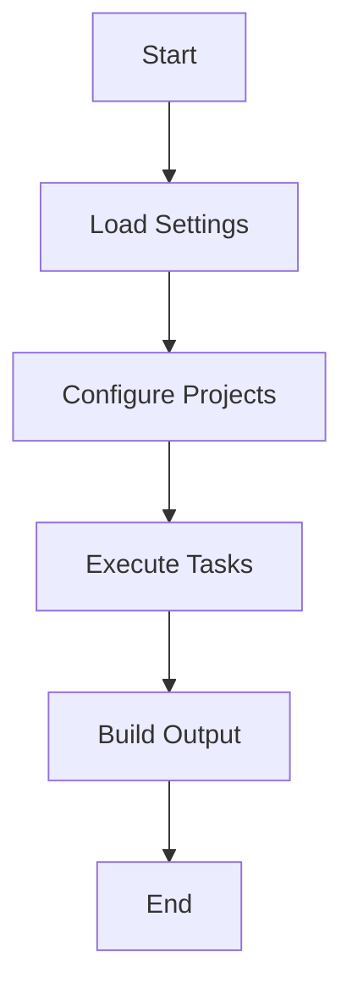

## 20.7 Integration with Build Tools

In the world of Kotlin development, integrating with build tools is a crucial aspect that can significantly impact the efficiency and scalability of your projects. This section delves into the integration of Kotlin with build tools, with a particular focus on the Gradle Kotlin DSL. We will explore best practices, advanced configurations, and optimization techniques to help you master the art of managing Kotlin projects effectively.

### Introduction to Gradle Kotlin DSL

Gradle is a powerful build automation tool that is widely used in the Java ecosystem. With the introduction of Kotlin DSL, Gradle scripts can now be written in Kotlin, offering a more type-safe and expressive way to configure builds. This integration not only enhances code readability but also provides better tooling support, such as code completion and refactoring.

#### Why Use Gradle Kotlin DSL?

- **Type Safety**: Kotlin DSL provides compile-time checking, reducing runtime errors.
- **IDE Support**: Enhanced support for code completion, navigation, and refactoring in IntelliJ IDEA.
- **Readability**: Kotlin's concise syntax makes build scripts more readable and maintainable.
- **Reusability**: Kotlin DSL allows for better modularization and reuse of build logic.

### Setting Up Gradle Kotlin DSL

To start using Kotlin DSL in your Gradle projects, you need to configure your build scripts to use `build.gradle.kts` instead of the traditional `build.gradle`. Let's walk through the setup process.

#### Step 1: Convert Build Script to Kotlin DSL

Rename your `build.gradle` file to `build.gradle.kts`. This change indicates that the script will be written in Kotlin.

```kotlin
// build.gradle.kts

plugins {
    kotlin("jvm") version "1.8.0"
    application
}

group = "com.example"
version = "1.0-SNAPSHOT"

repositories {
    mavenCentral()
}

dependencies {
    implementation(kotlin("stdlib"))
    testImplementation("org.junit.jupiter:junit-jupiter-api:5.7.0")
    testRuntimeOnly("org.junit.jupiter:junit-jupiter-engine:5.7.0")
}

application {
    mainClass.set("com.example.MainKt")
}
```

#### Step 2: Configure Settings Script

Ensure your `settings.gradle.kts` is also using Kotlin DSL. This file is used to define the project structure and include any subprojects.

```kotlin
// settings.gradle.kts

rootProject.name = "my-kotlin-project"
```

### Best Practices for Gradle Kotlin DSL

When working with Gradle Kotlin DSL, adhering to best practices can greatly enhance the maintainability and performance of your build scripts.

#### Modularize Build Logic

Break down complex build logic into reusable scripts or plugins. This modular approach not only simplifies your main build script but also promotes reuse across different projects.

```kotlin
// buildSrc/src/main/kotlin/Dependencies.kt

object Dependencies {
    const val kotlinStdLib = "org.jetbrains.kotlin:kotlin-stdlib:1.8.0"
    const val junit = "org.junit.jupiter:junit-jupiter-api:5.7.0"
}
```

#### Use Extension Functions

Leverage Kotlin's extension functions to encapsulate common configurations or tasks. This technique can make your build scripts cleaner and more expressive.

```kotlin
// build.gradle.kts

fun DependencyHandlerScope.junit() {
    testImplementation(Dependencies.junit)
}

dependencies {
    implementation(Dependencies.kotlinStdLib)
    junit()
}
```

#### Leverage Gradle's Configuration Cache

Enable Gradle's configuration cache to speed up the build process by caching the result of the configuration phase. This feature can significantly reduce build times for large projects.

```kotlin
// gradle.properties

org.gradle.configuration-cache=true
```

### Advanced Configurations

For expert developers, mastering advanced configurations in Gradle Kotlin DSL can unlock powerful capabilities and optimizations.

#### Custom Tasks

Create custom tasks to automate repetitive tasks or integrate additional tools into your build process.

```kotlin
// build.gradle.kts

tasks.register("hello") {
    doLast {
        println("Hello, Kotlin DSL!")
    }
}
```

#### Multi-Project Builds

Gradle supports multi-project builds, allowing you to manage complex projects with multiple modules. Use `settings.gradle.kts` to include subprojects and configure dependencies between them.

```kotlin
// settings.gradle.kts

include("core", "app")

// core/build.gradle.kts

dependencies {
    implementation(project(":app"))
}
```

#### Dependency Management

Manage dependencies effectively by using version catalogs or dependency constraints. This approach helps maintain consistency and avoid conflicts.

```kotlin
// gradle/libs.versions.toml

[versions]
kotlin = "1.8.0"
junit = "5.7.0"

[libraries]
kotlin-stdlib = { module = "org.jetbrains.kotlin:kotlin-stdlib", version.ref = "kotlin" }
junit = { module = "org.junit.jupiter:junit-jupiter-api", version.ref = "junit" }
```

### Optimizing Build Performance

Optimizing build performance is crucial for large projects. Here are some strategies to improve the efficiency of your Gradle builds.

#### Parallel Execution

Enable parallel execution to run independent tasks concurrently, reducing overall build time.

```kotlin
// gradle.properties

org.gradle.parallel=true
```

#### Incremental Builds

Ensure that your tasks are incremental, meaning they only perform work when inputs or outputs have changed. This can drastically reduce build times.

```kotlin
// build.gradle.kts

tasks.register("incrementalTask") {
    inputs.file("src/main/resources/input.txt")
    outputs.file("build/output.txt")

    doLast {
        // Task logic
    }
}
```

#### Profiling Builds

Use Gradle's build scan feature to profile and analyze your builds. This tool provides insights into build performance and helps identify bottlenecks.

```shell
./gradlew build --scan
```

### Try It Yourself

To deepen your understanding of Gradle Kotlin DSL, try modifying the code examples provided. Experiment with creating custom tasks, managing dependencies, and optimizing build performance. Consider integrating additional plugins or tools to extend the capabilities of your build scripts.

### Visualizing Gradle Kotlin DSL Workflow

To better understand the workflow of a Gradle Kotlin DSL build, let's visualize the process using a flowchart.



**Caption:** This flowchart illustrates the typical workflow of a Gradle Kotlin DSL build, from loading settings to executing tasks and producing build output.

### References and Links

For further reading and exploration of Gradle Kotlin DSL, consider the following resources:

- [Gradle Kotlin DSL Documentation](https://docs.gradle.org/current/userguide/kotlin_dsl.html)
- [Kotlin Official Website](https://kotlinlang.org/)
- [JetBrains IntelliJ IDEA](https://www.jetbrains.com/idea/)

### Knowledge Check

To reinforce your learning, consider the following questions:

1. What are the benefits of using Gradle Kotlin DSL over traditional Groovy scripts?
2. How can you modularize build logic in a Kotlin DSL project?
3. What is the purpose of enabling Gradle's configuration cache?
4. Describe how to create a custom task in Gradle Kotlin DSL.
5. How can parallel execution improve build performance?

### Embrace the Journey

Remember, mastering Gradle Kotlin DSL is a journey. As you progress, you'll discover more advanced techniques and optimizations that can enhance your build process. Keep experimenting, stay curious, and enjoy the journey!

### Conclusion

Integrating Kotlin with build tools, particularly through Gradle Kotlin DSL, provides a powerful and flexible approach to managing Kotlin projects. By following best practices, leveraging advanced configurations, and optimizing build performance, you can streamline your development workflow and focus on what truly matters: building great software.

## Quiz Time!



### What is one of the main advantages of using Gradle Kotlin DSL?

- [x] Type safety and better IDE support
- [ ] Faster build times
- [ ] Reduced memory usage
- [ ] Automatic dependency updates

> **Explanation:** Gradle Kotlin DSL provides type safety and better IDE support, making build scripts more readable and maintainable.

### How can you modularize build logic in a Kotlin DSL project?

- [x] By creating reusable scripts or plugins
- [ ] By using a single large build script
- [ ] By avoiding the use of external dependencies
- [ ] By hardcoding all configurations

> **Explanation:** Modularizing build logic through reusable scripts or plugins promotes reuse and simplifies the main build script.

### What is the purpose of enabling Gradle's configuration cache?

- [x] To speed up the build process by caching the configuration phase
- [ ] To automatically update dependencies
- [ ] To reduce the size of the build output
- [ ] To enable parallel execution of tasks

> **Explanation:** Gradle's configuration cache speeds up the build process by caching the result of the configuration phase, reducing build times.

### How do you create a custom task in Gradle Kotlin DSL?

- [x] By using `tasks.register` and defining the task logic
- [ ] By modifying the `settings.gradle.kts` file
- [ ] By adding a new plugin to the build script
- [ ] By using the `apply` function

> **Explanation:** Custom tasks are created using `tasks.register` in Gradle Kotlin DSL, where you define the task logic.

### How can parallel execution improve build performance?

- [x] By running independent tasks concurrently
- [ ] By reducing the number of tasks
- [ ] By increasing memory usage
- [ ] By simplifying the build script

> **Explanation:** Parallel execution allows independent tasks to run concurrently, reducing the overall build time.

### What file extension is used for Kotlin DSL build scripts?

- [x] .kts
- [ ] .kt
- [ ] .gradle
- [ ] .java

> **Explanation:** Kotlin DSL build scripts use the `.kts` file extension.

### Which of the following is a best practice for managing dependencies in Gradle Kotlin DSL?

- [x] Using version catalogs or dependency constraints
- [ ] Hardcoding all dependency versions
- [ ] Avoiding the use of external libraries
- [ ] Using a single large dependency block

> **Explanation:** Using version catalogs or dependency constraints helps maintain consistency and avoid conflicts in dependency management.

### What is a benefit of using extension functions in Gradle Kotlin DSL?

- [x] They encapsulate common configurations or tasks, making scripts cleaner
- [ ] They automatically update dependencies
- [ ] They reduce build times
- [ ] They increase memory usage

> **Explanation:** Extension functions encapsulate common configurations or tasks, making build scripts cleaner and more expressive.

### What tool can be used to profile and analyze Gradle builds?

- [x] Gradle build scan
- [ ] IntelliJ IDEA
- [ ] Kotlin Compiler
- [ ] Java Profiler

> **Explanation:** Gradle build scan is a tool that provides insights into build performance and helps identify bottlenecks.

### True or False: Gradle Kotlin DSL scripts are written in Groovy.

- [ ] True
- [x] False

> **Explanation:** Gradle Kotlin DSL scripts are written in Kotlin, not Groovy.


